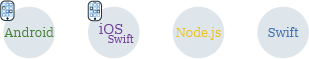

---

copyright:
  years: 2017, 2018
lastupdated: "2018-4-24"

---

{:codeblock: .codeblock}
{:screen: .screen}
{:tip: .tip}
{:pre: .pre}
{:new_window: target="_blank"}
{:shortdesc: .shortdesc}


# Gerenciando a experiência de conexão

O {{site.data.keyword.appid_full}} fornece um widget de login que permite fornecer a seus usuários opções de conexão segura.
{: shortdesc}

Quando seu app é configurado para usar um provedor de identidade, os visitantes em seu app são direcionados para uma tela de conexão pelo widget de login. Como um padrão, quando somente um provedor é configurado como ligado, os visitantes são redirecionados para essa tela de autenticação de provedores de identidade. Com o widget de login, é possível exibir uma tela de conexão padrão ou, com o diretório da nuvem, é possível reutilizar as IUs existentes.

É possível atualizar seu fluxo de conexão em qualquer momento, sem mudar seu código-fonte de qualquer forma!
{: tip}

O serviço usa tipos de concessão do OAuth 2 para mapear o processo de autorização. Quando você configura provedores de identidade social, como o Facebook, o [Fluxo de concessão de autorização Oauth2](https://oauthlib.readthedocs.io/en/stable/oauth2/grants/authcode.html) é usado para chamar o widget de login. Quando você exibe suas próprias telas de IU, o [Fluxo de credenciais de senha do proprietário do recurso](https://oauthlib.readthedocs.io/en/stable/oauth2/grants/password.html) é usado para efetuar login e obter tokens de acesso e de identidade.


## Customizando a tela de conexão padrão
{: #login-widget}

É possível customizar a tela de conexão pré-configurada para exibir o logotipo e as cores de sua escolha.
{: shortdesc}

Para customizar a tela:

1. Abra o painel
de serviço {{site.data.keyword.appid_short_notm}}.
2. Selecione a seção **Customização de login**. É possível modificar a aparência do widget de login para alinhar com a marca da sua empresa.
3. Faça upload do logotipo da sua empresa selecionando um arquivo PNG ou JPG em seu sistema local. O tamanho da imagem recomendado é 320 x 320 pixels. O tamanho máximo do arquivo é 100 Kb.
4. Selecione uma cor de cabeçalho para o widget no selecionador de cor ou insira o código hexadecimal para outra cor.
5. Inspecione a área de janela de visualização e clique em **Salvar mudanças** quando estiver satisfeito com as suas customizações. Uma mensagem de confirmação será exibida.
6. Em seu navegador, atualize sua página de login para verificar suas mudanças.


## Exibindo as telas padrão
{: #default}

O {{site.data.keyword.appid_short_notm}} fornece uma tela de login padrão que poderá ser chamada se você não tiver suas próprias telas de IU para exibir.
{: shortdesc}

Dependendo da configuração do provedor sua identidade, as telas que podem ser exibidas são diferentes. O serviço não fornece funcionalidade avançada para provedores de identidade social porque não temos acesso às informações de contas dos usuários. Os usuários precisam acessar o provedor de identidade para gerenciar suas informações. Por exemplo, se eles desejassem mudar sua senha do Facebook, eles precisariam acessar www.facebook.com.

Verifique a tabela a seguir para ver quais telas podem ser exibidas para cada tipo de provedor de identidade.

<table>
  <thead>
    <tr>
      <th>Tela de exibição</th>
      <th>Provedor de identidade social</th>
      <th>Provedor de identidade corporativa</th>
      <th>Diretório da nuvem</th>
    </tr>
  </thead>
  <tbody>
    <tr>
      <td>Conectar</td>
      <td></td>
      <td></td>
      <td></td>
    </tr>
    <tr>
      <td>Inscrever</td>
      <td> </td>
      <td> </td>
      <td></td>
    </tr>
    <tr>
      <td>Senha esquecida</td>
      <td> </td>
      <td> </td>
      <td></td>
    </tr>
    <tr>
      <td>Mudar senha</td>
      <td> </td>
      <td> </td>
      <td></td>
    </tr>
    <tr>
      <td>Detalhes da conta</td>
      <td> </td>
      <td> </td>
      <td></td>
    </tr>
  </tbody>
</table>

Depois de ter definido suas configurações para [provedores de identidade social](/docs/services/appid/identity-providers.html) e [diretório da nuvem](/docs/services/appid/cloud-directory.html), clique na linguagem de sua escolha na imagem a seguir para começar a implementar o código.


Clique na linguagem de sua escolha na imagem a seguir para começar a implementar o código.


<map name="default-options-map" id="default-options-map">
<area href="login-widget.html#android" alt="Gerenciando a experiência de conexão com o SDK Android" shape="rect" coords="113, 8, 224, 123" />
<area href="login-widget.html#ios-swift" alt="Gerenciando a experiência de conexão com o SDK iOS Swift." shape="rect" coords="251, 12, 362, 127" />
<area href="login-widget.html#nodejs" alt="Gerenciando a experiência de conexão com o SDK Node.js." shape="rect" coords="387, 10, 498, 125" />
<area href="login-widget.html#swift" alt="Gerenciando a experiência de conexão com o SDK Swift." shape="rect" coords="525, 10, 636, 125" />
</map>
</br>

### Exibindo as telas padrão com o SDK Android
{: #android}

É possível chamar as telas pré-configuradas com o SDK Android.
{: shortdesc}

</br>

**Conectar**
1. Coloque o comando a seguir em seu código.
    ```java
    LoginWidget loginWidget = AppID.getInstance().getLoginWidget();
  loginWidget.launch(this, new AuthorizationListener() {
          @Override
        public void onAuthorizationFailure (AuthorizationException exception) {
            //Exception occurred
      }

          @Override
        public void onAuthorizationCanceled () {
            //Authentication canceled by the user
        }

          @Override
          public void onAuthorizationSuccess (AccessToken accessToken, IdentityToken identityToken, refreshToken: RefreshToken) {
            //User authenticated
        }
        });
    ```
  {: pre}

</br>
**Inscrever**

1. Configure **Permitir que os usuários se inscrevam e reconfigurem sua senha** para **Ligado** nas configurações para o diretório da nuvem.
2. Chame o LoginWidget para iniciar o fluxo de inscrição.
  ```java
  LoginWidget loginWidget = AppID.getInstance().getLoginWidget();
 loginWidget.launchSignUp(this, new AuthorizationListener() {
  		 @Override
          public void onAuthorizationFailure (AuthorizationException exception) {
          }

  		 @Override
          public void onAuthorizationCanceled () {
          }

  		 @Override
  		 public void onAuthorizationSuccess (AccessToken accessToken, IdentityToken identityToken, refreshToken: RefreshToken) {
  			 if (accessToken != null && identityToken != null) {
  			 } else {
  			 }

  		 }
  	 });
  ```
  {: pre}

</br>
**Esqueci a senha**

1. Configure **Permitir que os usuários se inscrevam e reconfigurem sua senha** e **E-mail de Esqueci a senha** para **Ligado** nas configurações para o diretório da nuvem.
2. Chame o LoginWidget para iniciar o fluxo Esqueci a senha.
    ```java
    LoginWidget loginWidget = AppID.getInstance().getLoginWidget();
  loginWidget.launchForgotPassword(this, new AuthorizationListener() {
   			 @Override
          public void onAuthorizationFailure (AuthorizationException exception) {
          }

   			 @Override
          public void onAuthorizationCanceled () {
          }

   			 @Override 			 public void onAuthorizationSuccess (AccessToken accessToken, IdentityToken identityToken, refreshToken: RefreshToken) { 			 }
   		 });
    ```
    {: pre}

</br>
**Detalhes da conta**

1. Configure **Permitir que os usuários se inscrevam e reconfigurem sua senha** para **Ligado** nas configurações para o diretório da nuvem.
2. Chame o LoginWidget para iniciar o fluxo de detalhes de mudança.
   ```java
   LoginWidget loginWidget = AppID.getInstance().getLoginWidget();
   loginWidget.launchChangeDetails(this, new AuthorizationListener() {
  			 @Override
          public void onAuthorizationFailure (AuthorizationException exception) {
          }

  			 @Override
          public void onAuthorizationCanceled () {
          }

  			 @Override 			 public void onAuthorizationSuccess (AccessToken accessToken, IdentityToken identityToken, refreshToken: RefreshToken) { 			 }
  		 });
   ```
   {: pre}

</br>
**Mudar senha**

1. Configure **Permitir que os usuários se inscrevam e reconfigurem sua senha** para **LIGADO**, nas configurações para o diretório da nuvem.
2. Chame o LoginWidget para iniciar o fluxo de mudança de senha.
   ```java
    LoginWidget loginWidget = AppID.getInstance().getLoginWidget();
    loginWidget.launchChangePassword(this, new AuthorizationListener() {
   			 @Override
          public void onAuthorizationFailure (AuthorizationException exception) {
          }

   			 @Override
          public void onAuthorizationCanceled () {
          }

   			 @Override 			 public void onAuthorizationSuccess (AccessToken accessToken, IdentityToken identityToken, refreshToken: RefreshToken) { 			 }
   		 });
   ```
   {: pre}
</br>
</br>

### Exibindo as telas padrão com o SDK iOS Swift
{: #ios-swift}

É possível chamar as telas pré-configuradas com o SDK iOS Swift.
{: shortdesc}

</br>
**Conectar**

1. Coloque o comando a seguir em seu código.
  ```swift
  import BluemixAppID
  class delegate : AuthorizationDelegate {
      public func onAuthorizationSuccess(accessToken: AccessToken, identityToken: IdentityToken, refreshToken: RefreshToken?) {
          //User authenticated
      }

      public func onAuthorizationCanceled() {
          //Authentication canceled by the user
      }

      public func onAuthorizationFailure(error: AuthorizationError) {
          //Exception occurred
      }
  }

  AppID.sharedInstance.loginWidget?.launch(delegate: delegate())
  ```
  {: pre}


</br>
**Inscrever**

1. Configure **Permitir que os usuários se inscrevam e reconfigurem sua senha** para **Ligado**, nas configurações para o diretório da nuvem.
2. Chame o LoginWidget para iniciar o fluxo de inscrição.
  ```swift
  class delegate : AuthorizationDelegate {
    public func onAuthorizationSuccess(accessToken: AccessToken?, identityToken: IdentityToken?, refreshToken: RefreshToken?) {
       if accessToken == nil && identityToken == nil {
        //email verification is required
        return
       }
     //User authenticated
      }

      public func onAuthorizationCanceled() {
        //Sign up canceled by the user
    }

    public func onAuthorizationFailure(error: AuthorizationError) {
        //Exception occurred
      }
  }

  AppID.sharedInstance.loginWidget?.launchSignUp(delegate: delegate())
  ```
  {: pre}

</br>
**Esqueci a senha**

1. Configure **Permitir que os usuários se inscrevam e reconfigurem sua senha** e **E-mail de Esqueci a senha** para **Ligado** nas configurações para o diretório da nuvem.
2. Chame o LoginWidget para iniciar o fluxo Esqueci a senha.
  ```swift
  class delegate : AuthorizationDelegate {
     public func onAuthorizationSuccess(accessToken: AccessToken?, identityToken: IdentityToken?, refreshToken: RefreshToken?) {
        //forgot password finished, in this case accessToken and identityToken will be null.
     }

     public func onAuthorizationCanceled() {
         //forgot password canceled by the user
     }

     public func onAuthorizationFailure(error: AuthorizationError) {
         //Exception occurred
      }
  }

  AppID.sharedInstance.loginWidget?.launchForgotPassword(delegate: delegate())
  ```
  {: pre}

</br>
**Detalhes da conta**

1. Configure **Permitir que os usuários se inscrevam e reconfigurem sua senha** para **Ligado** nas configurações para o diretório da nuvem.
2. Chame o LoginWidget para iniciar o fluxo de detalhes de mudança.
  ```swift

   class delegate : AuthorizationDelegate {
       public func onAuthorizationSuccess(accessToken: AccessToken?, identityToken: IdentityToken?, refreshToken: RefreshToken?) {
       }

       public func onAuthorizationCanceled() {
     }

       public func onAuthorizationFailure(error: AuthorizationError) {
     }
   }

   AppID.sharedInstance.loginWidget?.launchChangeDetails(delegate: delegate())
  ```
  {: pre}

</br>
**Mudar senha**

1. Configure **Permitir que os usuários se inscrevam e reconfigurem sua senha** para **Ligado** nas configurações para o diretório da nuvem.
2. Chame o LoginWidget para iniciar o fluxo de mudança de senha.
  ```swift
   class delegate : AuthorizationDelegate {
       public func onAuthorizationSuccess(accessToken: AccessToken?, identityToken: IdentityToken?, refreshToken: RefreshToken?) {
       }

       public func onAuthorizationCanceled() {
     }

       public func onAuthorizationFailure(error: AuthorizationError) {
     }
    }

    AppID.sharedInstance.loginWidget?.launchChangePassword(delegate: delegate())
  ```
  {: pre}
</br>
</br>

### Exibindo as telas padrão com o SDK Node.js
{: #nodejs}

É possível chamar as telas pré-configuradas com o SDK Node.js.
{: shortdesc}

</br>
**Conectar**
1. Configure o diretório da nuvem para **Ligado** em suas configurações de provedor de identidade e especifique um terminal de retorno de chamada.
2. Inclua uma rota de post para seu app que possa ser chamada com os parâmetros de nome do usuário e senha e efetue login usando a senha do proprietário do recurso.
    ```javascript
    app.post("/form/submit", bodyParser.urlencoded({extended: false}), passport.authenticate(WebAppStrategy.STRATEGY_NAME, {
    	successRedirect: LANDING_PAGE_URL,
  	failureRedirect: ROP_LOGIN_PAGE_URL,
  	failureFlash : true // allow flash messages
  }));
    ```
    {: pre}
    `WebAppStrategy` permite que os usuários se conectem aos seus aplicativos da web com um nome de usuário e senha. Após um login bem-sucedido, o token de acesso de um usuário é armazenado na sessão HTTP e fica disponível durante a sessão. Quando a sessão HTTP for destruída ou expirar, o token será invalidado.
    {: tip}

</br>
**Inscrever**

1. Configure **Permitir que os usuários se inscrevam e reconfigurem sua senha** para **Ligado** nas configurações do diretório da nuvem. Se configurado para "não", o processo termina sem recuperar os tokens de acesso e de identidade.
2. Passe a propriedade de WebAppStrategy `show` e configure-a para `WebAppStrategy.SIGN_UP`.
  ```javascript
  app.get("/sign_up", passport.authenticate(WebAppStrategy.STRATEGY_NAME, {
  	successRedirect: LANDING_PAGE_URL,
  	show: WebAppStrategy.SIGN_UP
  }));
  ```
  {: pre}

</br>
**Esqueci a senha**

1. Configure **Permitir que os usuários se inscrevam e reconfigurem sua senha** e **E-mail de Esqueci a senha** para **LIGADO** nas configurações do diretório da nuvem. Se configurado para "não", o processo termina sem recuperar os tokens de acesso e de identidade.
2. Passe a propriedade de WebAppStrategy `show` e configure-a para `WebAppStrategy.FORGOT_PASSWORD`.
  ```javascript
  app.get("/forgot_password", passport.authenticate(WebAppStrategy.STRATEGY_NAME, {
  	successRedirect: LANDING_PAGE_URL,
  	show: WebAppStrategy.FORGOT_PASSWORD
  }));
  ```
  {: pre}

</br>
**Detalhes da conta**
1. Configure **Permitir que os usuários se inscrevam e reconfigurem sua senha** para **Ligado** nas configurações do diretório da nuvem
2. Passe a propriedade de WebAppStrategy `show` e configure-a para `WebAppStrategy.CHANGE_DETAILS`.
  ```javascript
  app.get("/change_details", passport.authenticate(WebAppStrategy.STRATEGY_NAME, {
  	successRedirect: LANDING_PAGE_URL,
  	show: WebAppStrategy.CHANGE_DETAILS
  }));
  ```
  {: pre}

</br>
**Mudar senha**
1. Configure **Permitir que os usuários se inscrevam e reconfigurem sua senha** para **Ligado** nas configurações do diretório da nuvem.
2. Passe a propriedade de WebAppStrategy `show` e configurá-a para `WebAppStrategy.CHANGE_PASSWORD`.
  ```javascript
  app.get("/change_password", passport.authenticate(WebAppStrategy.STRATEGY_NAME, {
  	successRedirect: LANDING_PAGE_URL,
  	show: WebAppStrategy.CHANGE_PASSWORD
  }));
  ```
  {: pre}

</br>
</br>
### Exibindo a IU padrão com o SDK Swift
{: #swift}

Com os provedores de identidade social ativados, é possível chamar a tela de conexão pré-configurada com o SDK Swift.
{: shortdesc}

1. O código a seguir demonstra como usar WebAppKituraCredentialsPlugin em um app Kitura para proteger o terminal `/protected`.

  ```swift
  import Foundation
  import Kitura
  import KituraSession
  import Credentials
  import SwiftyJSON
  import BluemixAppID

  // The following URLs will be used for AppID OAuth flows
  var LOGIN_URL = "/ibm/bluemix/appid/login"
  var CALLBACK_URL = "/ibm/bluemix/appid/callback"
  var LOGOUT_URL = "/ibm/bluemix/appid/logout"
  var LANDING_PAGE_URL = "/index.html"

  // Setup Kitura to use session middleware
  // Must be configured with proper session storage for production
  // environments. See https://github.com/IBM-Swift/Kitura-Session for
  // additional documentation
  let router = Router()
  let session = Session(secret: "Some secret")
  router.all(middleware: session)

  let options = [
  	"clientId": "{client-id}",
  	"secret": "{secret}",
  	"tenantId": "{tenant-id}",
  	"oauthServerUrl": "{oauth-server-url}",
  	"redirectUri": "{app-url}" + CALLBACK_URL
  ]
  let webappKituraCredentialsPlugin = WebAppKituraCredentialsPlugin(options: options)
  let kituraCredentials = Credentials()
  kituraCredentials.register(plugin: webappKituraCredentialsPlugin)

  // Explicit login endpoint
  router.get(LOGIN_URL,
  		   handler: kituraCredentials.authenticate(credentialsType: webappKituraCredentialsPlugin.name,
  												   successRedirect: LANDING_PAGE_URL,
  												   failureRedirect: LANDING_PAGE_URL
  ))

  // Callback to finish the authorization process. Will retrieve access and identity tokens from AppID
  router.get(CALLBACK_URL,
  		   handler: kituraCredentials.authenticate(credentialsType: webappKituraCredentialsPlugin.name,
  												   successRedirect: LANDING_PAGE_URL,
  												   failureRedirect: LANDING_PAGE_URL
  ))

  // Logout endpoint. Clears authentication information from session
  router.get(LOGOUT_URL, handler:  { (request, response, next) in
  	kituraCredentials.logOut(request: request)
  	webappKituraCredentialsPlugin.logout(request: request)
  	_ = try? response.redirect(LANDING_PAGE_URL)
  })

  // Protected area
  router.get("/protected", handler: kituraCredentials.authenticate(credentialsType: webappKituraCredentialsPlugin.name), { (request, response, next) in
      let appIdAuthContext:JSON? = request.session?[WebAppKituraCredentialsPlugin.AuthContext]
      let identityTokenPayload:JSON? = appIdAuthContext?["identityTokenPayload"]

      guard appIdAuthContext?.dictionary != nil, identityTokenPayload?.dictionary != nil else {
          response.status(.unauthorized)
          return next()
      }

      response.send(json: identityTokenPayload!)
      next()
  })
  var port = 3000
  if let portString = ProcessInfo.processInfo.environment["PORT"]{
      port = Int(portString)!
  }
  print("Starting on \(port)")

  // Add an HTTP server and connect it to the router
  Kitura.addHTTPServer(onPort: port, with: router)

  // Start the Kitura runloop (this call never returns)
  Kitura.run()
  ```
  {: codeblock}
</br>
</br>


### Exibindo telas customizadas com o SDK Android
{: #branded-ui-android}

Com o diretório da nuvem ativado, é possível chamar telas customizadas com o SDK Android. É possível escolher a combinação das telas com as quais você gostaria que seus usuários fossem capazes de interagir.<a href="https://www.ibm.com/blogs/bluemix/2018/01/use-branded-ui-user-sign-app-id/" target="blank">Veja este blog</a> para um exemplo detalhado!
{: shortdesc}

</br>
**Conectar**

1. Configure **Diretório da nuvem** para **Ligado** como um provedor de identidade.
2. Coloque o comando a seguir em seu código.
  ```java
  AppID.getInstance().signinWithResourceOwnerPassword(getApplicationContext(), username, password,
         new TokenResponseListener() {
         @Override
        public void onAuthorizationFailure (AuthorizationException exception) {
             //Exception occurred
      }

          @Override
        public void onAuthorizationSuccess (AccessToken accessToken, IdentityToken identityToken) {
            //User authenticated
        }
         });
  ```
  {: pre}

</br>
</br>

### Exibindo telas customizadas com o SDK iOS Swift
{: #branded-ui-ios-swift}

Com o diretório da nuvem ativado, é possível chamar telas customizadas com o SDK iOS Swift.
{: shortdesc}

</br>
**Conectar**

1. Na guia de provedor de identidade na GUI, configure o diretório da nuvem para **Ligado**.
2. Efetue login usando a senha do proprietário do recurso. Tokens de acesso e identidade são obtidos quando um usuário tenta efetuar login usando seu nome de usuário e senha.
  ```swift
  class delegate : TokenResponseDelegate {
      public func onAuthorizationSuccess(accessToken: AccessToken?, identityToken: IdentityToken?, response:Response?) {
      //User authenticated
      }

      public func onAuthorizationFailure(error: AuthorizationError) {
      //Exception occurred
      }
  }

  AppID.sharedInstance.signinWithResourceOwnerPassword(username: username, password: password, delegate: delegate())
  ```
  {: pre}
</br>
</br>

### Exibindo telas customizadas com o SDK Node.js
{: #branded-ui-nodejs}

Com o diretório da nuvem ativado, é possível chamar telas customizadas com o SDK Node.js. É possível escolher a combinação das telas com as quais você gostaria que seus usuários fossem capazes de interagir. Se você escolher um backend do Node.js, será possível usar o nosso módulo self-Service no SDK Node.js do {{site.data.keyword.appid_short_notm}} (link).
{: shortdesc}

**Conectar**
1. Configure o diretório da nuvem para **Ligado** em suas configurações de provedor de identidade e especifique um terminal de retorno de chamada.
2. Inclua uma rota de post para seu app que possa ser chamada com os parâmetros de nome do usuário e senha e efetue login usando a senha do proprietário do recurso.
    ```javascript
    app.post("/form/submit", bodyParser.urlencoded({extended: false}), passport.authenticate(WebAppStrategy.STRATEGY_NAME, {
    	successRedirect: LANDING_PAGE_URL,
  	failureRedirect: ROP_LOGIN_PAGE_URL,
  	failureFlash : true // allow flash messages
  }));
    ```
    {: pre}
    `WebAppStrategy` permite que os usuários se conectem aos seus aplicativos da web com um nome de usuário e senha. Após um login bem-sucedido, o token de acesso de um usuário é armazenado na sessão HTTP e fica disponível durante a sessão. Quando a sessão HTTP for destruída ou expirar, o token será invalidado.
    {: tip}

</br>
</br>

## Exibindo telas customizadas com a API
{: #branding}

É possível exibir suas próprias telas customizadas e aproveitar os recursos de autenticação e autorização do {{site.data.keyword.appid_short_notm}}. Com o diretório da nuvem como seu provedor de identidade, os usuários são capazes de interagir com seu app com menos ajuda de você. Eles são capazes de conectar-se, inscrever-se, reconfigurar suas senhas e muito mais sem pedir ajuda.
{: shortdesc}

Para tornar isso possível, o {{site.data.keyword.appid_short_notm}} expôs as APIs de REST. É possível usar a API de REST para construir um servidor de backend que entrega seu apps da web ou para interagir com um app móvel com suas próprias telas customizadas.

O gerenciamento de API é assegurado pelos tokens gerados pelo IBM Cloud Identity e Access Management. Isso significa que os proprietários de conta podem especificar quem na equipe terá qual nível de acesso para cada instância de serviço. Para mais informações sobre como o IAM e {{site.data.keyword.appid_short_notm}} trabalham juntos, consulte [Serviço de gerenciamento de acesso](/docs/services/appid/iam.html).

Quando um usuário clica em conectar em sua tela customizada, o [Fluxo de credenciais de senha do proprietário do recurso](https://oauthlib.readthedocs.io/en/stable/oauth2/grants/password.html) é usado para obter tokens de acesso e de identidade diretamente de seus apps da web ou móveis.

Depois de ter definido suas [configurações](/docs/services/appid/cloud-directory.html),


**Inscrever-se**
É possível usar o terminal `/sign_up` para permitir que os usuários se inscrevam para seu app.
Forneça os seguintes dados no corpo da solicitação:
  * Seu tenantID.
  * Dados do usuário do diretório da nuvem. Veja [Representação do usuário integral do SCIM](https://tools.ietf.org/html/rfc7643#section-8.2) para obter mais detalhes.
    * Um atributo `password`.
    * Na matriz de e-mail com um atributo `primary` que é configurado para `true`, deve-se ter pelo menos 1 endereço de e-mail.

Dependendo da [configurações de e-mail](/docs/services/appid/cloud-directory.html), um usuário pode receber uma solicitação para verificação ou um e-mail que dá as boas-vindas quando eles se inscrevem para seu app. Ambos os tipos de e-mails são acionados quando um usuário se inscreve para seu app. O e-mail de verificação contém um botão **Verificar**. Depois que eles pressionam o botão e confirmam sua identidade, uma tela é exibida pelo {{site.data.keyword.appid_short_notm}} que os agradece por verificar.  

É possível apresentar sua própria página de verificação de post:

1. Navegue até a aba **Páginas de Entrada Customizadas** do painel {{site.data.keyword.appid_short_notm}}.
2. Insira a URL para a sua página de entrada na **URL para sua página de verificação customizada de endereço de e-mail**

Quando esse valor for fornecido, o {{site.data.keyword.appid_short_notm}} chamará a URL junto com uma consulta de `context`. Quando você chama o terminal `/sign_up/confirmation_result` e passa o parâmetro `context` recebido, o resultado indica se o usuário verificou sua conta. Se sim, será possível exibir sua página customizada.

</br>
**Esqueci a senha**

É possível usar o terminal `/forgot_password` para permitir que os usuários recuperem sua senha se a tiverem esquecido.

Forneça os seguintes dados no corpo da solicitação:
  * Seu tenantID.
  * O e-mail do usuário do diretório da nuvem.

Quando o terminal é chamado, um e-mail de reconfiguração de senha é enviado para o usuário. O e-mail contém um botão **Reconfigurar**. Depois que eles pressionam o botão, uma tela é exibida pelo {{site.data.keyword.appid_short_notm}} que permite que eles reconfigurem suas senhas.

É possível apresentar a sua própria página de reconfiguração de senha de post:

1. Navegue até a aba **Páginas de Entrada Customizadas** do painel {{site.data.keyword.appid_short_notm}}.
2. Insira a URL para a sua página de entrada na **URL para sua página customizada de reconfiguração de senha**  

Quando esse valor for fornecido, o {{site.data.keyword.appid_short_notm}} chamará a URL junto com uma consulta de `context`. O parâmetro `context` é usado para receber o resultado quando `/forgot_password/confirmation_result` é chamado. Se o resultado for bem-sucedido, será possível exibir sua página customizada.

Inclua uma sequência aleatória em sua página customizada de reconfiguração de senha e passe-a ao seu backend quando a solicitação for enviada. Deixe o manipulador validar a sequência e chame o terminal `/change_password` somente se ele for válido. Ao fazer isso, é possível reduzir a vulnerabilidade do terminal de reconfiguração de senha de backend.
{: tip}

</br>
**Mudar senha**

É possível usar o terminal `/change_password` de duas maneiras. Quando um usuário envia uma solicitação de reconfiguração ou quando um usuário está conectado ao seu app e deseja atualizar sua senha.

Para atualizar sua senha após uma solicitação de reconfiguração:

Forneça os seguintes dados no corpo da solicitação:
  * Seu tenantID.
  * A nova senha do usuário.
  * O UUID do usuário do diretório da nuvem.
  * Opcional: o endereço IP por meio do qual a reconfiguração de senha foi executada. Se você escolher passar o endereço IP, o item temporário `%{passwordChangeInfo.ipAddress}` estará disponível para o modelo de e-mail de mudança de senha.

Dependendo da sua configuração, quando uma senha mudar, o {{site.data.keyword.appid_short_notm}} poderá enviar um e-mail para informar isso ao usuário.

</br>
Para permitir que os usuários mudem suas senhas enquanto conectados a seu app:

Forneça os seguintes dados no corpo da solicitação:
  * Seu tenantID.
  * A nova senha do usuário.
  * O UUID do usuário do diretório da nuvem.

Sua página de mudança de senha deve solicitar ao usuário para inserir sua senha atual e sua nova senha.
{: tip}

Seu backend valida a senha atual do usuário com a API do ROP e, se válida, chama o terminal com a nova senha. Dependendo da sua configuração, quando uma senha mudar, o {{site.data.keyword.appid_short_notm}} poderá enviar um e-mail para informar isso ao usuário.

</br>
**Reenviar**

É possível usar o `/resend/{templateName}` para reenviar um e-mail quando um usuário não o recebe por alguma razão.

Forneça os seguintes dados no corpo da solicitação:
  * O tenantID.
  * O nome de modelo
  * O UUID do usuário do diretório da nuvem.


**Detalhes da mudança**

Quando um usuário está conectado ao seu app, ele pode atualizar algumas das suas informações. É possível usar o `/Users/{userId}` para obter e atualizar suas informações.

Quando os detalhes do usuário são atualizados, o terminal obtém os dados do usuário atualizados no corpo da solicitação no [formato SCIM](https://tools.ietf.org/html/rfc7643#section-8.2). Certifique-se de que mudar somente os detalhes relevantes.

Seu endereço de e-mail não pode ser mudado.
{: tip}
