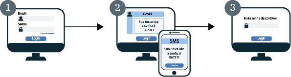

---

copyright:
  years: 2017, 2019
lastupdated: "2019-05-09"

keywords: authentication, authorization, identity, app security, secure, development, two factor, mfa 

subcollection: appid

---

{:new_window: target="_blank"}
{:shortdesc: .shortdesc}
{:screen: .screen}
{:pre: .pre}
{:table: .aria-labeledby="caption"}
{:codeblock: .codeblock}
{:tip: .tip}
{:note: .note}
{:important: .important}
{:deprecated: .deprecated}
{:download: .download}


# Autenticação de múltiplos fatores
{: #cd-mfa}


Ao exigir múltiplos fatores durante a conexão, é possível aumentar a segurança da autenticação do usuário para seus apps. Com o Cloud Directory para {{site.data.keyword.appid_full}}, o primeiro fator é a senha do usuário do Cloud Directory, normalmente usada para a conexão. O segundo fator de autenticação é um código descartável que o {{site.data.keyword.appid_short_notm}} envia para o usuário como um SMS ou um e-mail. O {{site.data.keyword.appid_short_notm}} usa uma combinação de ambos os fatores para verificar a identidade de um usuário.
{: shortdesc}

O{{site.data.keyword.appid_short_notm}}MFA é suportado como parte do fluxo de código de autorização OAuth 2.0 para usuários do Diretório de Nuvem por meio do Widget de Login. Se você estiver usando a conexão corporativa com o SAML 2.0 ou o login social,
será possível ativar a MFA por meio desse provedor de identidade.
{: note}

Quando o MFA é ativado, o widget de login do {{site.data.keyword.appid_short_notm}} requer uma segunda forma de verificação (segundo fator de autenticação) toda vez que um usuário tenta se conectar. Depois que um usuário tiver inserido com êxito as suas credenciais, um código único é enviado para o e-mail ou o número do telefone registrado para a conta dele.

Consulte o diagrama a seguir para ver como o fluxo do MFA funciona.



1. O widget de login do {{site.data.keyword.appid_short_notm}} é mostrado ao usuário para que ele insira suas credenciais de usuário do Cloud Directory. As credenciais podem ser seu e-mail ou nome de usuário e sua senha. As credenciais do usuário do Cloud Directory formam o primeiro fator de autenticação.

2. As credenciais são validadas e a tela MFA para verificação de segundo fator é retornada. Com base na configuração de segundo fator, o usuário recebe um e-mail ou um SMS com um código único e o insere na tela de verificação.

3. Se o código MFA for validado, o usuário será redirecionado de volta para o aplicativo e será conectado.


## Entendendo o MFA
{: #cd-mfa-understanding}


O MFA é um método de confirmação da identidade de um usuário que requer que eles usem múltiplos fatores para provar que são quem dizem ser. Esses fatores podem ser algo que eles têm, além de algo que eles sabem ou são.
{: shortdesc}

Ao ser ativado pela primeira vez, o MFA é configurado para usar o e-mail por padrão. É possível mudar a configuração para usar o SMS, mas não é possível configurar ambos ao mesmo tempo. Para e-mail e SMS, há algumas configurações que são definidas para você e não podem ser mudadas.


<table>
  <tr>
    <th>Configuração</th>
    <th>Descrição</th>
  </tr>
  <tr>
    <td>Caracteres de código</td>
    <td>Seis caracteres numéricos</td>
  </tr>
  <tr>
    <td>Expiração do Código</td>
    <td>Quinze minutos <br> Se um usuário não validar seu código dentro de 15 minutos, eles poderão solicitar que outro código seja enviado, desde que a sessão de autenticação não tenha expirado. Dentro da sessão de autenticação, o código pode ser enviado múltiplas vezes. Depois que a sessão de autenticação expira, o usuário deve repetir o processo de login desde o início.</td>
  </tr>
</table>

<p>Definido no SCIM como um <a href="https://tools.ietf.org/html/rfc7643#section-2.4" target="_blank">atributo com múltiplos valores </a>, um e-mail do usuário do Cloud Directory ou o número do telefone pode conter o seguinte:
<ul>
  <li>Valor: o valor de atributo real, como endereço de e-mail ou número de telefone.</li>
  <li>Primário: um valor booleano que indica o valor preferencial para o atributo. O valor de atributo primário <code>true</code> pode ocorrer uma única vez. Se não especificado, o valor de <code>primary</code> será assumido como <code>false</code>.</li>
</ul>Para obter mais informações, consulte os [docs do Cloud Directory](/docs/services/appid?topic=appid-cloud-directory#cloud-directory).</p>


## Configurando o canal de email MFA
{: #cd-mfa-configure-email}

É possível configurar o {{site.data.keyword.appid_short_notm}} para enviar o código MFA para seus usuários por meio de e-mail.
{: shortdesc} 

Quando você ativa o MFA pela primeira vez, as duas coisas a seguir acontecem:

- Por padrão, o canal de e-mail é selecionado. É possível alternar para o [canal SMS](/docs/services/appid?topic=appid-cd-mfa#cd-mfa-configure-sms).
- O {{site.data.keyword.appid_short_notm}} registra automaticamente o e-mail primário que é anexado ao perfil do usuário do Cloud Directory.

Se o e-mail de um usuário ainda não tiver sido confirmado por meio das [APIs de gerenciamento](https://us-south.appid.cloud.ibm.com/swagger-ui/#/) ou da verificação de e-mail ao se conectar, ele será confirmado quando um código MFA for verificado com êxito.

Antes de iniciar, certifique-se de que sua instância do {{site.data.keyword.appid_short_notm}} esteja no [plano de precificação de camada graduada](/docs/services/appid?topic=appid-faq#faq-pricing).
{: note}

### Com a GUI
{: #cd-mfa-configure-email-gui}

É possível configurar o canal de e-mail do MFA por meio da GUI.

1. Navegue para a guia **Cloud Directory > Autenticação de múltiplos fatores** do painel do {{site.data.keyword.appid_short_notm}}.

2. Na caixa **Ativar autenticação de múltiplos fatores**, na **guia Configurações**, alterne o MFA para **Ativado**. Esteja ciente de que o MFA é cobrado como um [evento de segurança avançado](/docs/services/appid?topic=appid-faq#faq-pricing). Por padrão, **E-mail** é selecionado como o **Método de autenticação**.

3. Na guia **Canal de email**, revise o **Modelo de email**. É possível optar por enviar o modelo com o texto fornecido ou gravar sua própria mensagem. Certifique-se de usar a identificação HTML correta. Na GUI, é possível incluir parâmetros e inserir imagens. Para mudar o [idioma](/docs/services/appid?topic=appid-cd-messages#cd-languages) da mensagem, é possível usar <a href="https://us-south.appid.cloud.ibm.com/swagger-ui/#/Management%20API%20-%20Config/mgmt.updateLocalization" target="_blank">as APIs </a> para configurar o idioma. No entanto, você é responsável pelo conteúdo e pela tradução da mensagem. Consulte a tabela a seguir para ver a lista de tabelas que podem ser usadas nessa mensagem e todas as outras mensagens que podem ser enviadas. Se um usuário não fornecer as informações extraídas pelo parâmetro, elas aparecerão em branco.

  <table>
    <thead>
      <tr>
        <th colspan=2> Parâmetros de mensagem do MFA</th>
      </tr>
    </thead>
    <tbody>
      <tr>
        <td><code>%{display.logo}</code></td>
        <td> Exibe a imagem que você configurou para o widget de login. </td>
      </tr>
      <tr>
        <td><code>%{user.displayName}</code></td>
        <td> Exibe o nome da tela que um usuário escolheu usar ao interagir com o app. </td>
      </tr>
      <tr>
        <td><code>%{user.email}</code></td>
        <td> Exibe o endereço de e-mail do usuário registrado. </td>
      </tr>
      <tr>
        <td><code>%{user.username}</code></td>
        <td> Exibe o nome do usuário especificado quando o método de autenticação é configurado para o nome do usuário e a senha. </td>
      </tr>
      <tr>
        <td><code>%{user.firstName}</code></td>
        <td> Exibe o nome especificado do usuário. </td>
      </tr>
      <tr>
        <td><code>%{user.formattedName}</code></td>
        <td> Exibe o nome completo do usuário. </td>
      </tr>
      <tr>
        <td><code>%{user.lastName}</code></td>
        <td> Exibe o sobrenome especificado do usuário. </td>
      </tr>
      <tr>
        <td><code>%{mfa.code}</code></td>
        <td> Exibe um código de verificação de MFA único. </td>
      </tr>
    </tbody>
  </table>

  Se um usuário não fornecer as informações extraídas pelo parâmetro, elas aparecerão em branco.
  {: tip}


### Com as APIs
{: #cd-mfa-configure-email-apis}

**Antes de iniciar**

Certifique-se de que você tenha os pré-requisitos a seguir:

* O seu ID do locatário da instância do {{site.data.keyword.appid_short_notm}}. Esse ID pode ser localizado na seção **Credenciais de serviço** do painel.
* O seu token de Gerenciamento de identidade e acesso (IAM). Para obter ajuda com a obtenção de um token do IAM, consulte os [docs do IAM](/docs/iam?topic=iam-iamtoken_from_apikey#iamtoken_from_apikey).


1. Ative a MFA fazendo uma solicitação PUT para o terminal `/config/mfa` com a configuração da MFA
para configurar `isActive` como `true`.

  Header:
  ```
  PUT {management-url}/management/v4/{tenantId}/config/mfa
       Host: <management-server-url>
       Authorization: Bearer <IAM_TOKEN>
       Content-Type: application/json
  ```
  {: codeblock}

  Corpo:
  ```
   {
       "isActive": true }
  ```
  {: codeblock}

  Solicitação de exemplo:
  ```
  $ curl -X PUT --header 'Content-Type: application/json' --header 'Accept: application/json' --header 'Authorization: Bearer <IAM_TOKEN>' -d '{
          "isActive": true }'
    }'
    '{management-url}/management/v4/{tenantId}/config/mfa'
  ```
  {: screen}

2. Ative o seu canal MFA fazendo uma solicitação PUT para o terminal `/mfa/channels/{channel}` com a sua configuração de MFA. Quando `isActive` é configurado como `true`, seu canal da MFA está ativado.

  Header:
  ```
  PUT /management/v4/{tenantId}/mfa/channels/{channel}
       Host: <management-server-url>
       Authorization: Bearer <IAM_TOKEN>
       Content-Type: application/json
  ```
  {: codeblock}

  Corpo:
  ```
   {
       "isActive": true }
  ```
  {: codeblock}

  Solicitação de exemplo:

  ```
  $ curl -X PUT --header 'Content-Type: application/json' --header 'Accept: application/json' --header 'Authorization: Bearer <IAM_TOKEN>' -d '{
          "isActive": true }'
    }'
    '{management-url}/management/v4/{tenantId}/mfa/channels/email'
  ```
  {: screen}

Se a sua instância do {{site.data.keyword.appid_short_notm}} Cloud Directory estiver configurada para trabalhar com um dispatcher de e-mail customizado, o MFA usará o mesmo dispatcher para enviar o código descartável. Para obter mais informações sobre a configuração de um dispatcher customizado, consulte os docs do [Cloud Directory](/docs/services/appid?topic=appid-cd-messages#cd-custom-email).
{: note}


## Configurando o MFA para trabalhar com o SMS
{: #cd-mfa-configure-sms}

É possível enviar uma mensagem SMS para seus usuários como uma segunda forma de verificação. Quando o SMS é ativado, o {{site.data.keyword.appid_short_notm}} automaticamente tenta registrar o primeiro número de telefone [válido](https://en.wikipedia.org/wiki/E.164) que seja localizado em um perfil do usuário do Cloud Directory. Se o número for inválido ou nenhum número de telefone for localizado no perfil do usuário, então um widget de registro será exibido para o usuário incluir um número. Então, o número é parte do perfil do usuário e, após a validação, se torna o número padrão usado para o MFA.
{: shortdesc}

**Antes de iniciar**

O {{site.data.keyword.appid_short_notm}} usa o [Nexmo](https://www.nexmo.com/products/sms) para enviar códigos SMS descartáveis do MFA. Antes de iniciar, certifique-se de que você tenha uma instância do {{site.data.keyword.appid_short_notm}} que esteja no [plano de precificação de camada graduada](/docs/services/appid?topic=appid-faq#faq-pricing) e nas informações do Nexmo a seguir.

 - Obtenha sua chave de API e o segredo do Nexmo. É possível localizar a chave de API e o segredo do Nexmo em sua página de configurações da conta no painel do Nexmo. Efetue check-out da [documentação do Nexmo](https://developer.nexmo.com/concepts/guides/authentication#api-key-and-secret)para obter informações adicionais sobre como obter suas credenciais.

 - Registre seu ID de remetente ou o número `from` com o Nexmo. Esse número `from` é o que aparece no telefone do seu usuário para mostrar de quem é o SMS. Em alguns países, o Nexmo suporta IDs de remetente alfanuméricos. O {{site.data.keyword.appid_short_notm}} usa o valor inserido como ID do remetente do Nexmo. Portanto, se forem suportados pelo Nexmo, será possível usar os IDs com o {{site.data.keyword.appid_short_notm}}. Para obter mais informações, consulte a [documentação do Nexmo](https://help.nexmo.com/hc/en-us/articles/217571017-What-is-a-Sender-ID).


### Com a GUI
{: #cd-mfa-configure-sms-gui}

Para configurar o MFA com a GUI, consulte o [Cloud Directory](/docs/services/appid?topic=appid-cloud-directory).
{: note}

1. Navegue para a guia **Cloud Directory > Autenticação de múltiplos fatores** do painel do {{site.data.keyword.appid_short_notm}}.

2. Na caixa **Ativar autenticação de múltiplos fatores**, na **guia Configurações**, alterne o MFA para **Ativado**. Esteja ciente de que o MFA é cobrado como um [evento de segurança avançado](/docs/services/appid?topic=appid-faq#faq-pricing).

3. Selecione **SMS** como seu **Método de autenticação**.

4. Na guia **Canal SMS**, configure as informações da conta do Nexmo.

    1. Se você ainda não tiver uma conta com o Nexmo. Crie uma.

    2. No painel do Nexmo, clique em **SMS**.

    3. Na seção **Codifique você mesmo**, copie a chave de API e cole-a na caixa **chave** no painel do {{site.data.keyword.appid_short_notm}}.

    4. Copie o **segredo da API** no painel do Nexmo e cole-o na caixa **Segredo** no painel do {{site.data.keyword.appid_short_notm}}.

    5. Insira [o ID](https://help.nexmo.com/hc/en-us/articles/217571017-What-is-a-Sender-ID) para o qual você deseja enviar mensagens. Um formato de número válido segue o [formato numérico internacional E.164](https://en.wikipedia.org/wiki/E.164). Por exemplo, um número dos EUA assume o formato `+1 999 888 7777`. Deve-se especificar o código do país, começando com um símbolo `+` e o número do assinante nacional. Em alguns países, o Nexmo suporta IDs de remetente alfanuméricos. O {{site.data.keyword.appid_short_notm}} usa o valor inserido como ID do remetente do Nexmo. Portanto, se forem suportados pelo Nexmo, será possível usar os IDs com o {{site.data.keyword.appid_short_notm}}.


### Com as APIs
{: #cd-mfa-configure-sms-api}

**Antes de iniciar**

Certifique-se de que você tenha os pré-requisitos a seguir:

* O seu ID do locatário da instância do {{site.data.keyword.appid_short_notm}}. Esse ID pode ser localizado na seção **Credenciais de serviço** do painel.
* O seu token de Gerenciamento de identidade e acesso (IAM). Para obter ajuda com a obtenção de um token do IAM, consulte os [docs do IAM](/docs/iam?topic=iam-iamtoken_from_apikey).


1. Ative a MFA fazendo uma solicitação PUT para o terminal `/config/mfa` com a configuração da MFA
para configurar `isActive` como `true`.

Header:

  ```
  PUT {management-url}/management/v4/{tenantId}/config/mfa
       Host: <management-server-url>
       Authorization: Bearer <IAM_TOKEN>
       Content-Type: application/json
  ```
  {: codeblock}

Corpo:

  ```
  {
   "isActive": true }
  ```
  {: codeblock}


Solicitação de exemplo:

  ```
  $ curl -X PUT --header 'Content-Type: application/json' --header 'Accept: application/json' --header 'Authorization: Bearer <IAM_TOKEN>' -d '{
    "isActive": true }'
  '{management-url}/management/v4/{tenantId}/config/mfa'
  ```
  {: screen}

2. Ative o seu canal MFA fazendo uma solicitação PUT para o terminal `/mfa/channels/{channel}` com a sua configuração de MFA. Quando `isActive` é configurado como `true`, seu canal da MFA está ativado.
A `config`assume a chave e o segredo da API Nexmo, bem como o número `de`.

Header:

  ```
  PUT /management/v4/{tenantId}/mfa/channels/{channel}
      Host: <management-server-url>
      Authorization: Bearer <IAM_TOKEN>
      Content-Type: application/json
  ```
  {: codeblock}

Corpo:

  ```
  {
      "isActive": true, "config": {
        "key": "nexmo key",
        "secret": "nexmo secret",
        "from": sender-phoneNumber
      }
  }
  ```
  {: codeblock}

Solicitação de exemplo:

  ```
  $ curl -X PUT --header 'Content-Type: application/json' --header 'Accept: application/json' --header 'Authorization: Bearer <IAM_TOKEN>' -d '{
         "isActive": true, "config": {
          "key": "key",
          "secret": "secret",
          "from": 12345678900
        }
     }'
   '{management-url}/management/v4/{tenantId}/mfa/channels/nexmo'
  ```
  {: screen}


3. Depois que o canal for configurado com êxito, verifique se a configuração do Nexmo e a conexão estão configuradas
corretamente usando o botão de teste na IU ou usando a API de gerenciamento.

Header:

  ```
  POST /management/v4/{tenantId}/config/cloud_directory/sms_dispatcher/test
     Host: <management-server-url>
     Authorization: Bearer <IAM_TOKEN>
     Content-Type: application/json
  ```
  {: codeblock}

Corpo:

  ```
  {
    "phone_number": "phoneNumber-receives-test-message"
  }
  ```
  {: codeblock}

Solicitação de exemplo:

  ```
  $ curl -X POST
  --header 'Content-Type: application/json'
  --header 'Accept: application/json'
  --header 'Authorization: Bearer <IAM_TOKEN>'
  -d '{
        "phone_number": "+ 1 999 999 9999"
      }'
  '{management-url}/management/v4/{tenantId}/config/cloud_directory/sms_dispatcher/test'
  ```
  {: screen}

  </br>
