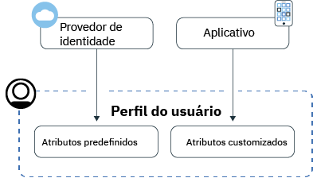
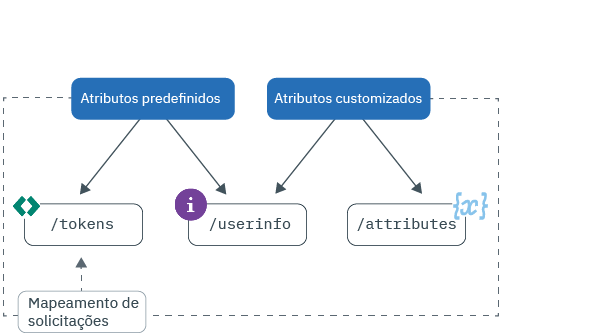

---

copyright:
  years: 2017, 2019
lastupdated: "2019-07-09"

keywords: Authentication, authorization, identity, app security, secure, attributes, user information, storing, accessing

subcollection: appid

---

{:external: target="_blank" .external}
{:shortdesc: .shortdesc}
{:screen: .screen}
{:pre: .pre}
{:table: .aria-labeledby="caption"}
{:codeblock: .codeblock}
{:tip: .tip}
{:note: .note}
{:important: .important}
{:deprecated: .deprecated}
{:download: .download}
{:java: .ph data-hd-programlang='java'}
{:javascript: .ph data-hd-programlang='javascript'}
{:swift: .ph data-hd-programlang='swift'}
{:curl: .ph data-hd-programlang='curl'}


# Armazenando e acessando perfis
{: #profiles}

Um perfil do usuário são todas as informações conhecidas sobre um usuário específico compilado em um objeto e armazenado pelo {{site.data.keyword.appid_full}}. As informações podem ser predefinidas, designadas ou aprendidas sobre os usuários à medida que eles interagem com seu aplicativo. Ao aproveitar o recurso de perfis, é possível construir experiências de app personalizadas para cada usuário.
{: shortdesc}


Procurando informações sobre usuários do Cloud Directory? Verifique [gerenciando usuários](/docs/services/appid?topic=appid-cd-users).
{: tip}

Há dois tipos de informações que podem ser obtidas e armazenadas pelo App ID: atributos predefinidos e atributos customizados. Os atributos predefinidos são específicos para a identidade de seus usuários e são retornados por um provedor de identidade quando o usuário se conecta ao seu app e podem incluir informações como seu nome ou idade. Os atributos customizados são usados para armazenar informações adicionais sobre seus usuários. Elas podem ser configuradas por você ou aprendidas sobre o usuário à medida que ele interage com seu app. Os atributos customizados podem incluir uma função designada, uma preferência alimentar ou um assento de corredor preferencial em um avião.



Figura. Fluxo de informações do perfil do usuário


É possível armazenar 100 KB de informações para cada usuário.
{: note}


## Acessando perfis do usuário
{: #profile-access}

Há diferentes maneiras nas quais é possível acessar os atributos. Após a autenticação bem-sucedida do usuário, seu app recebe tokens de acesso e de identidade do {{site.data.keyword.appid_short_notm}}. As informações sobre o usuário e os terminais de atributo customizado são protegidos por um token de acesso gerado pelo {{site.data.keyword.appid_short_notm}} no final do processo de autenticação. O token de identidade contém um subconjunto normalizado de atributos do usuário (informações) que é retornado por um provedor de identidade. Para obter a lista completa de atributos do usuário,
é possível usar o terminal
[`/userinfo`
do OIDC](https://us-south.appid.cloud.ibm.com/swagger-ui/#/Authorization_Server_V4/userInfo). 
{: shortdesc}


Para obter mais informações sobre tokens de identidade e de acesso, consulte [Compreendendo](/docs/services/appid?topic=appid-tokens#tokens) e [Validando tokens](/docs/services/appid?topic=appid-token-validation).


Revise a imagem a seguir para ver as diferentes maneiras nas quais é possível obter informações do usuário.


Figura. Acessar opções de perfil do usuário


O App ID injeta um subconjunto de atributos em seus tokens de acesso e de identidade automaticamente. É possível aproveitar o mapeamento de solicitações customizadas e mapear outras solicitações predefinidas e customizadas em seus tokens. Para obter mais detalhes sobre a maneira recomendada de acessar informações do usuário, consulte [customizando tokens](/docs/services/appid?topic=appid-customizing-tokens). 
{: note}


### Acessando o terminal /userinfo com um SDK
{: #profile-predefined-access}

Para ver as informações sobre seus usuários que são fornecidos por seus provedores de identidade configurados, é possível acessar seus atributos predefinidos.
{: shortdesc}

**iOS Swift**
{: ph data-hd-programlang='swift'}

Se novos tokens não forem passados explicitamente para o SDK, o {{site.data.keyword.appid_short_notm}} usará os tokens recebidos pela última vez para recuperar e validar a resposta. Por exemplo, é possível executar o código a seguir após uma autenticação bem-sucedida e o SDK recupera informações adicionais sobre o usuário.
{: ph data-hd-programlang='swift'}

```
AppID.sharedInstance.userProfileManager.getUserInfo { (error: Error?, userInfo: [String: Any]?) in 	guard let userInfo = userInfo, err == nil {
		return // um erro ocorreu 		}
	// informações do usuário recuperadas com sucesso }
```
{: codeblock}
{: ph data-hd-programlang='swift'}

Como alternativa, é possível passar explicitamente os tokens de acesso e de identidade. O token de identidade é opcional, mas, quando passado, é usado para validar a resposta.
{: ph data-hd-programlang='swift'}

```
AppID.sharedInstance.userProfileManager.getUserInfo (accessToken: String, identityToken: String?) { in 	guard let userInfo = userInfo, err == nil {
		return // um erro ocorreu 		}
	// informações do usuário recuperadas com sucesso }
```
{: codeblock}
{: ph data-hd-programlang='swift'}

**Java**
{: ph data-hd-programlang='java'}

Se novos tokens não forem passados explicitamente para o SDK, o {{site.data.keyword.appid_short_notm}} usará os tokens recebidos pela última vez para recuperar e validar a resposta. Por exemplo, é possível executar o código a seguir após uma autenticação bem-sucedida e o SDK recupera informações adicionais sobre o usuário.
{: ph data-hd-programlang='java'}

```
AppID appId = AppID.getInstance ();

appId.getUserProfileManager( ).getUserInfo (new UserProfileResponseListener () {
	@Override 	public void onSuccess(JSONObject userInfo) {
		// informações do usuário recuperadas com sucesso }

	@Override 	public void onFailure(UserInfoException e) {
		// exception occurred }
});
```
{: codeblock}
{: ph data-hd-programlang='java'}

Como alternativa, é possível passar explicitamente os tokens de acesso e de identidade. O token de identidade é opcional. Mas quando passado, ele é usado para validar a resposta.
{: ph data-hd-programlang='java'}

```
AppID appId = AppID.getInstance ();

appId.getUserProfileManager( ).getUserInfo (accessToken, identityToken, new UserProfileResponseListener () {
	@Override 	public void onSuccess(JSONObject userInfo) {
		// retrieved attribute "name" successfully
	}

	@Override 	public void onFailure(UserInfoException e) {
		// exception occurred }
});
```
{: codeblock}
{: ph data-hd-programlang='java'}

**Node.js**
{: ph data-hd-programlang='javascript'}

Usando um SDK do lado do servidor, é possível recuperar informações adicionais sobre os seus usuários. É possível chamar o método a seguir usando os tokens de acesso e de identidade armazenados ou é possível passar explicitamente os tokens. O token de identidade é opcional, mas, quando passado, é usado para validar a resposta.
{: ph data-hd-programlang='javascript'}

```javascript
let userProfileManager = UserProfileManager (options: options)

let accessToken = req.session[WebAppStrategy.AUTH_CONTEXT].accessToken;
let identityToken = req.session[WebAppStrategy.AUTH_CONTEXT].identityToken;


// Retrieve user info and validate against the given identity token
userProfileManager.getUserInfo(accessToken, identityToken).then(function (profile) {
	// retrieved user info successfully
});

// Retrieve user info without validation
userProfileManager.getUserInfo(accessToken).then(function (profile) {
	// retrieved user info successfully
});
```
{: codeblock}
{: ph data-hd-programlang='javascript'}


**Swift do lado do servidor**
{: ph data-hd-programlang='swift'}

Usando um SDK do lado do servidor, é possível recuperar informações adicionais sobre os seus usuários. É possível chamar o método a seguir usando os tokens de acesso e de identidade armazenados ou é possível passar explicitamente os tokens. O token de identidade é opcional, mas, quando passado, é usado para validar a resposta.
{: ph data-hd-programlang='swift'}


```swift
let userProfileManager = UserProfileManager (options: options)

let accessToken = "<access token>"
let identityToken = "<identity token>"

// If identity token is provided (recommended approach), response is validated against the identity token
userProfileManager.getUserInfo(accessToken: accessToken, identityToken: identityToken) { (err, userInfo) in
	guard let userInfo = userInfo, err == nil {
		return // um erro ocorreu 		}
	// informações do usuário recuperadas com sucesso }

// Retrieve the UserInfo without any validation
userProfileManager.getUserInfo(accessToken: accessToken) { (err, userInfo) in
	guard let userInfo = userInfo, err == nil {
		return // um erro ocorreu 		}
	// informações do usuário recuperadas com sucesso }
```
{: codeblock}
{: ph data-hd-programlang='swift'}


### Acessando o terminal /userinfo com a API
{: #profile-predefined-api}


É possível visualizar as informações adicionais por meio do terminal `/userinfo`.

1. Certifique-se de que você tenha um token de acesso válido com um escopo `openid`. É possível verificar se
o token é válido usando o terminal `/introspect`.

2. Faça uma solicitação para o terminal [`/userinfo`](https://us-south.appid.cloud.ibm.com/swagger-ui/#/Authorization_Server_V4/userInfo).
  ```
  GET [POST] https://{oauth-server-endpoint}/userinfo
  Authorization: 'Bearer {ACCESS_TOKEN}'
  ```
  {: codeblock}

  Saída de exemplo:
  ```
  "sub": "cad9f1d4-e23b-3683-b81b-d1c4c4fd7d4c",
  "name": "John Doe",
  "email": "john.doe@gmail.com",
  "picture": "https://lh3.googleusercontent.com/-XdUIqdbhg/AAAAAAAAI/AAAAAAA/42rbcbv5M/photo.jpg",
  "gender": "male",
  "locale": "en",
  "identities": [
      {
          "provider": "google",
          "id": "104560903311317789798",
          "profile": {
              "id": "104560903311317789798",
              "email": "john.doe@gmail.com",
              "verified_email": true,
              "name": "John Doe",
              "given_name": "John",
              "family_name": "Doe",
              "link": "https://plus.google.com/104560903311317789798",
              "picture": "https://lh3.googleusercontent.com/-XdUIqdbhg/AAAAAAAAI/AAAAAAA/42rbcbv5M/photo.jpg",
              "gender": "male",
              "locale": "en",
              "idpType": "google"
          }
      }
  ]
  ```
  {: screen}

3. Verifique se a solicitação `sub` corresponde exatamente à solicitação `sub` no token de identidade. Se elas não corresponderem, não use as informações retornadas. Para saber mais sobre a substituição de token, consulte a
<a href="https://openid.net/specs/openid-connect-core-1_0.html#TokenSubstitution" target="__blank">Especificação OIDC
 </a>.

Se as mudanças forem feitas por um provedor de identidade externo, você poderá obter as informações atualizadas quando os
usuários efetuarem login novamente. Os novos tokens recuperam os dados mais atualizados.
{: tip}


### Acessando o terminal `/attributes`
{: #profile-attributes-access}

Dependendo de sua configuração, os atributos são criptografados e salvos como parte de um perfil do usuário quando um usuário interage com seu aplicativo. A
interação pode ser um usuário se conectando ou configurando uma preferência em seu aplicativo. Para acessar os atributos, passe um token de acesso por meio de um método de API.
{: shortdesc}

**iOS Swift**
{: ph data-hd-programlang='swift'}

  ```
  func setAttribute(key: String, value: String, completionHandler: @escaping(Error?, [String:Any]?) -> Void)
  func setAttribute(key: String, value: String, accessTokenString: String, completionHandler: @escaping(Error?, [String:Any]?) -> Void)

  func getAttribute(key: String, completionHandler: @escaping(Error?, [String:Any]?) -> Void)
  func getAttribute(key: String, accessTokenString: String, completionHandler: @escaping(Error?, [String:Any]?) -> Void)

  func getAttributes(completionHandler: @escaping(Error?, [String:Any]?) -> Void)
  func getAttributes(accessTokenString: String, completionHandler: @escaping(Error?, [String:Any]?) -> Void)

  func deleteAttribute(key: String, completionHandler: @escaping(Error?, [String:Any]?) -> Void)
  func deleteAttribute(key: String, accessTokenString: String, completionHandler: @escaping(Error?, [String:Any]?) -> Void)
  ```
  {: codeblock}
  {: ph data-hd-programlang='swift'}

  **Java**
  {: ph data-hd-programlang='java'}

  ```
  void setAttribute(@NonNull String name, @NonNull String value, UserAttributeResponseListener listener);
  void setAttribute(@NonNull String name, @NonNull String value, @NonNull AccessToken accessToken, UserAttributeResponseListener listener);

  void getAttribute(@NonNull String name, UserAttributeResponseListener listener);
  void getAttribute(@NonNull String name, @NonNull AccessToken accessToken, UserAttributeResponseListener listener);

  void deleteAttribute(@NonNull String name, UserAttributeResponseListener listener);
  void deleteAttribute(@NonNull String name, @NonNull AccessToken accessToken, UserAttributeResponseListener listener);

  void getAllAttributes(@NonNull UserAttributeResponseListener listener);
  void getAllAttributes(@NonNull AccessToken accessToken, @NonNull UserAttributeResponseListener listener);
  ```
  {: codeblock}
  {: ph data-hd-programlang='java'}

  **Node.js**
  {: ph data-hd-programlang='javascript'}

  ```
  function getAllAttributes(accessTokenString) {}
	function getAttribute(accessTokenString, key) {}
	function setAttribute(accessTokenString, key, value) {}
	function deleteAttribute(accessTokenString, name) {}
  ```
  {: codeblock}
  {: ph data-hd-programlang='javascript'}

  **Swift do lado do servidor**
  {: ph data-hd-programlang='swift'}

  ```
  func getAllAttributes(accessToken: String, completionHandler: (Swift.Error?, [String: Any]?) -> Void)
  func getAttribute(accessToken: String, attributeName: String, completionHandler: (Swift.Error?, [String: Any]?) -> Void)
  func setAttribute(accessToken: String, attributeName: String, attributeValue : "abc", completionHandler: (Swift.Error?, [String: Any]?) -> Void)
  func deleteAllAttributes(accessToken: String, completionHandler: (Swift.Error?, [String: Any]?) -> Void)
  ```
  {: codeblock}
  {: ph data-hd-programlang='swift'}


## Configurando atributos customizados
{: #profile-set-custom}

É possível incluir informações sobre seus usuários em seu perfil, como uma função ou uma preferência, configurando um atributo customizado.
{: shortdesc}

Por padrão, os atributos customizados são modificáveis e podem ser atualizados usando um token de acesso do App ID de um aplicativo cliente. Isso
significa que, sem tomar precauções apropriadas, o usuário ou o aplicativo pode atualizar os atributos customizados
imediatamente após a primeira conexão do usuário, desde que ele tenha acesso a um token de acesso. Isso pode levar potencialmente a consequências indesejadas. Por exemplo, um usuário pode mudar a sua função de usuário para administrador, o que pode expor privilégios administrativos a usuários maliciosos.
{: important}

1. Navegue para a guia **Perfis** do painel do App ID e alterne os atributos customizados para **Ativado**.
2. [Obtenha um token de acesso](/docs/services/appid?topic=appid-obtain-tokens). Todas as solicitações recebidas para seu app têm um cabeçalho de autorização, com `access_token`.
3. Faça uma solicitação para as [APIs de atributos](https://us-south.appid.cloud.ibm.com/swagger-ui/#/Attributes) ou inclua um dos fragmentos a seguir em seu código para usar um dos SDKs fornecidos.

  **iOS Swift**
  {: ph data-hd-programlang='swift'}

  ```
	AppID.sharedInstance.userProfileManager?.setAttribute("key", "value") { (error, result) in
		guard let result = result, error == nil else {
	  		return // um erro ocorreu 	}
		// attributes recieved as a Dictionary
	})
  ```
  {: codeblock}
  {: ph data-hd-programlang='swift'}

  **Java**
  {: ph data-hd-programlang='java'}

  ```
  appId.getUserProfileManager ().setAttribute (name, value, useThisToken, new UserProfileResponseListener () {
  	@Override
		public void onSuccess(JSONObject attributes) {
  		//attributes received in JSON format on successful response
		}

  	@Override
		public void onFailure(UserAttributesException e) {
  		// exception occurred }
  });
  ```
  {: codeblock}
  {: ph data-hd-programlang='java'}

  **Node.js**
  {: ph data-hd-programlang='javascript'}

  ```
	const userProfileManager = require ("ibmcloud-appid"). UserProfileManager; userProfileManager; userProfileManager.init ();

	var accessToken = req.session [ WebAppStrategy.AUTH_CONTEXT ] .accessToken;

	userProfileManager.setAttribute(accessToken, name, value).then(function (attributes) {
		// attributes returned as dictionary
	});
  ```
  {: codeblock}
  {: ph data-hd-programlang='javascript'}

**Swift do lado do servidor**
{: ph data-hd-programlang='swift'}

  ```
  let userProfileManager = UserProfileManager(options: options)
	let accesstoken = "access token"

  userProfileManager.setAttribute(accessToken: accessToken, attributeName: "name", attributeValue : "abc") { (error, response) in
		guard let response = response, error == error else {
      return // um erro ocorreu 	}
    // atributos recebidos como um Dicionário
  }
  ```
  {: codeblock}
  {: ph data-hd-programlang='swift'}


## Próximas Etapas
{: #next-custom-attributes}

Para obter mais informações sobre como trabalhar com um SDK de linguagem específico, consulte os repositórios GitHub a seguir:

* <a href="https://github.com/ibm-cloud-security/appid-clientsdk-android" target="_blank">Android SDK </a>
* <a href="https://github.com/ibm-cloud-security/appid-clientsdk-swift" target="_blank">iOS Swift SDK </a>
* <a href="https://github.com/ibm-cloud-security/appid-serversdk-nodejs" target="_blank">Node.js SDK </a>
* <a href="https://github.com/ibm-cloud-security/appid-serversdk-swift" target="_blank">Server Swift SDK </a>

