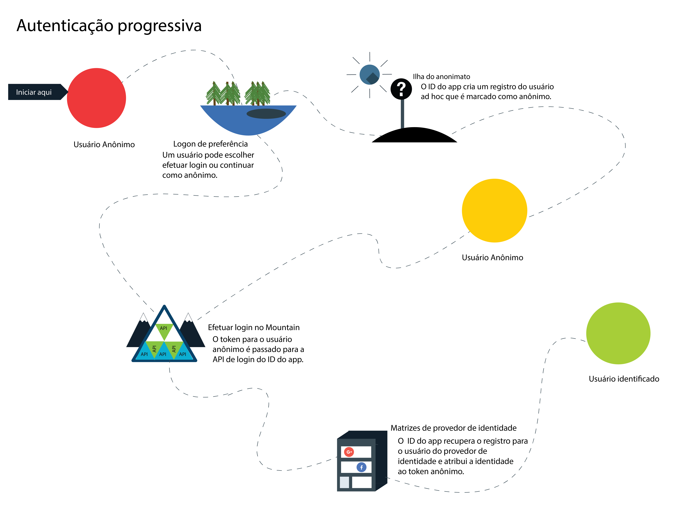
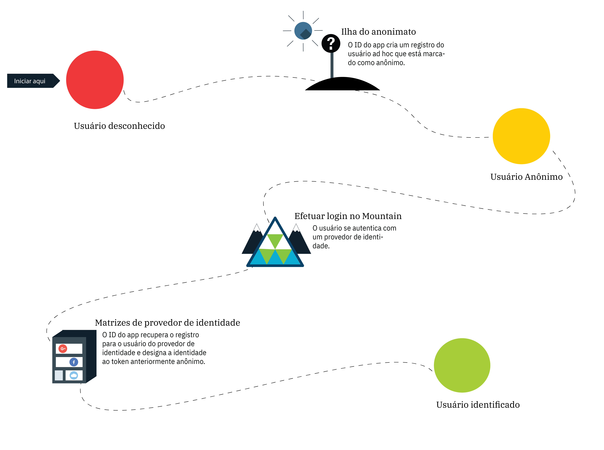

---

copyright:
  years: 2017, 2018
lastupdated: "2018-11-14"

---

{:new_window: target="_blank"}
{:shortdesc: .shortdesc}
{:pre: .pre}
{:tip: .tip}
{:screen: .screen}

# Autenticação anônima
{: #anonymous}

Ao desenvolver aplicativos, uma das maiores preocupações é a segurança. Como é possível assegurar que somente usuários com o acesso correto estão usando seu app? É necessário usar um processo de autorização. Na maioria dos processos, a autorização e a autenticação estão atreladas, o que pode tornar a mudança de suas políticas de segurança e provedores de identidade complicada. Com o {{site.data.keyword.appid_full}}, a autorização e a autenticação são processos separados.
{: shortdesc}

Quando um usuário se conecta com êxito, ele se torna um usuário identificado. O provedor de identidade retorna os tokens
de acesso e de identidade que contêm as informações sobre o usuário para o {{site.data.keyword.appid_short}}. O serviço usa os tokens fornecidos e determina se um usuário tem as credenciais adequadas para acessar um app. Se os tokens forem validados, o serviço autorizará os usuários a acessar o aplicativo. As
informações sobre a autenticação serão associadas ao perfil do usuário após serem autorizadas. O perfil e seus atributos podem ser acessados
novamente por meio de qualquer cliente que seja autenticado com o mesmo provedor de identidade.

## Autenticação progressiva
{: #progressive}

Com o {{site.data.keyword.appid_short_notm}}, um usuário anônimo pode escolher se tornar um usuário identificado.

Quando um usuário escolhe não se conectar imediatamente, ele é considerado um usuário anônimo. Por exemplo, um usuário
pode iniciar imediatamente a inclusão de itens em um carrinho de compras sem se conectar. Para usuários anônimos, o
{{site.data.keyword.appid_short_notm}} cria um perfil de usuário ad hoc e chama a API de login do OAuth que
retorna tokens de acesso e de identidade anônimos. Ao usar esses tokens, o aplicativo pode criar, ler, atualizar e excluir
os atributos que são armazenados no perfil do usuário.

Quando um usuário anônimo se conecta, seu token de acesso é passado para a API de login. O serviço autentica a chamada com um provedor de identidade. O serviço usa o token de acesso para localizar o perfil anônimo e anexa a identidade do usuário a ele. Os novos tokens de acesso e de identidade contêm as informações públicas que são compartilhadas pelo provedor de identidade. Depois que um usuário é identificado, seu token anônimo torna-se inválido. No entanto, um usuário ainda será capaz de acessar seus atributos porque eles são acessíveis com o novo token.

Uma identidade poderá ser designada a um perfil anônimo somente se ela ainda não estiver designada a outro usuário.
{: tip}

Se a identidade já estiver associada a outro usuário do {{site.data.keyword.appid_short_notm}}, os tokens
conterão informações desse perfil do usuário e fornecerão acesso aos seus atributos. Os atributos do usuário anônimo
anterior não são acessíveis por meio do novo token. Até o token expirar, as informações ainda poderão ser acessadas através do token de acesso anônimo. Enquanto
você desenvolve seu aplicativo, é possível escolher como mesclar os atributos anônimos ao usuário conhecido.
