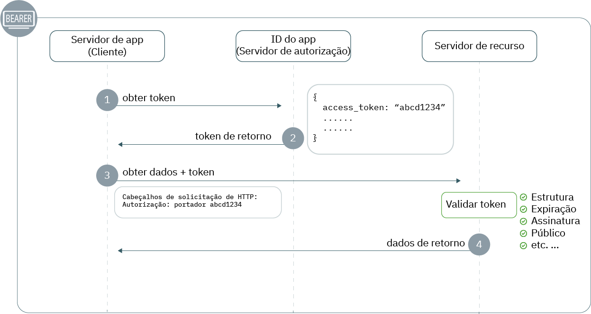

---

copyright:
  years: 2017, 2019
lastupdated: "2019-07-11"

keywords: Authentication, authorization, identity, app security, secure, development, access management, liberty, backend, java, token

subcollection: appid

---

{:external: target="_blank" .external}
{:shortdesc: .shortdesc}
{:screen: .screen}
{:pre: .pre}
{:table: .aria-labeledby="caption"}
{:codeblock: .codeblock}
{:tip: .tip}
{:note: .note}
{:important: .important}
{:deprecated: .deprecated}
{:download: .download}


# Back-end: Liberty for Java
{: #backend-liberty}

Com o {{site.data.keyword.appid_short_notm}}, é possível proteger facilmente seus terminais de API e assegurar a segurança dos seus aplicativos back-end Liberty for Java. Com este guia, é possível fazer rapidamente com que um fluxo de autenticação simples funcione em menos de 20 minutos.
{: shortdesc}




1. Para fazer uma solicitação a um recurso protegido, um cliente deve ter um token de acesso. Na etapa 1, o cliente faz uma solicitação ao {{site.data.keyword.appid_short_notm}} por um token. Para obter mais informações sobre como obter tokens de acesso, consulte [Obtendo tokens](/docs/services/appid?topic=appid-obtain-tokens).
2. O {{site.data.keyword.appid_short_notm}} retorna os tokens.
3. Usando o token de acesso, o cliente faz uma solicitação para acessar o recurso protegido.
4. O recurso valida o token, incluindo a estrutura, a expiração, a assinatura, o público e quaisquer outros campos presentes. Se o token não for válido, o servidor de recurso negará o acesso. Se a validação de token for bem-sucedida, ela retornará os dados.


## Tutorial de vídeo
{: #backend-liberty-video}

Confira o vídeo a seguir para ver como é possível usar o {{site.data.keyword.appid_short_notm}} para proteger um aplicativo Liberty for Java simples. Todas as informações que são cobertas no vídeo também podem ser localizadas por escrito nesta página.

<iframe class="embed-responsive-item" id="appid-liberty-backend-app" title="Sobre o {{site.data.keyword.appid_short_notm}}" type="text/html" width="640" height="390" src="//www.youtube.com/embed/QA6DY2qqLaw?rel=0" frameborder="0" webkitallowfullscreen mozallowfullscreen allowfullscreen></iframe>

Não tem um app com o qual você possa experimentar o fluxo? Sem problemas! O {{site.data.keyword.appid_short_notm}} fornece um [app de amostra Liberty for Java simples](https://github.com/ibm-cloud-security/appid-video-tutorials/tree/master/02d-simple-liberty-backend-app).


## Antes de iniciar
{: #liberty-before}

Antes de iniciar com o {{site.data.keyword.appid_short_notm}} em seu aplicativo back-end Liberty for Java, deve-se ter os pré-requisitos a seguir:

* Uma instância [do serviço {{site.data.keyword.appid_short_notm}}](https://cloud.ibm.com/catalog/services/app-id){: external}
* [A CLI do IBM Cloud](/docs/cli?topic=cloud-cli-getting-started)
* [Apache Maven 3.5+](https://maven.apache.org/download.cgi){: external}
* [Java 8+](https://www.java.com/download/){: external}
* A [Coleta do {{site.data.keyword.appid_short_notm}} Postman](https://github.com/ibm-cloud-security/appid-postman){: external} para teste

## Etapa 1: obtenha suas credenciais
{: #liberty-obtain-credentials}

É possível obter suas credenciais de uma das duas formas.

  * Navegando para a guia **Aplicativos** do painel do {{site.data.keyword.appid_short_notm}}. Se você ainda não tiver um, será possível clicar em **Incluir aplicativo** para criar um novo.

  * Ao fazer uma solicitação de POST para o terminal [`/management/v4/{tenantId}/applications`](https://us-south.appid.cloud.ibm.com/swagger-ui/#!/Applications/registerApplication){: external}.

    Formato da solicitação:
    ```
    curl -X POST \  https://us-south.appid.cloud.ibm.com/management/v4/<tenantID>/applications/ \
    -H 'Content-Type: application/json' \
    -H 'Authorization: Bearer IAM_TOKEN' \
    -d '{"name": "ApplicationName"}'
    ```
    {: codeblock}

    Resposta de exemplo:
    ```
    {
      "clientId": "xxxxx-34a4-4c5e-b34d-d12cc811c86d",
      "tenantId": "xxxxx-9b1f-433e-9d46-0a5521f2b1c4",
      "secret": "ZDk5YWZkYmYt*******",
      "name": "app1",
      "oAuthServerUrl": "https://us-south.appid.cloud.ibm.com/oauth/v4/xxxxx-9b1f-433e-9d46-0a5521f2b1c4",
      "profilesUrl": "https://us-south.appid.cloud.ibm.com",
      "discoveryEndpoint": "https://us-south.appid.cloud.ibm.com/oauth/v4/xxxxxx-9b1f-433e-9d46-0a5521f2b1c4/.well-known/openid-configuration"
    }
    ```
    {: screen}


## Etapa 2: configure seu arquivo `server.xml`
{: #liberty-configure-server}
 
1. Abra seu arquivo `server.xml`.
2. Inclua os recursos a seguir na seção `featureManager`. Alguns recursos podem ser desenvolvidos com o Liberty. Se você receber um erro quando executar seu servidor, será possível instalá-los executando `.installUtility install <name_of_server>` por meio do diretório bin da sua instalação do Liberty.

    ```xml
    <featureManager>
        <feature>appSecurity-2.0</feature>
        <feature>openidConnectClient-1.0</feature>
        <feature>ssl-1.0</feature>
        <feature>servlet-3.1</feature>
    </featureManager>
    ```
    {: codeblock}

3. Configure o SSL incluindo o seguinte em seu arquivo `server.xml`. 

    ```xml
    <keyStore id="defaultKeyStore" password="{password}"/>
    <keyStore id="RootCA" password="{password}" location="${server.config.dir}/resources/security/{myTrustStore}"/>
    <ssl id="{sslID}" keyStoreRef="defaultKeyStore" trustStoreRef="{truststore-ref}"/>
    ```
    {: codeblock}

4. Crie um recurso cliente da conexão OpenID e defina os itens temporários a seguir. Com as credenciais que você obteve, preencha os itens temporários.

    ```xml
    <openidConnectClient 
        id="oidc-client-simple-liberty-backend-app" 		
        inboundPropagation="required"
        jwkEndpointUrl="{region}.appid.cloud.ibm.com/oauth/v4/{tenantID}/publickeys"
        issuerIdentifier="{region).appid.cloud.ibm.com/oauth/v4/{tenantID}"
        signatureAlgorithm="RS256"
        audiences="{client-id}"
        sslRef="oidcClientSSL"
    /> 	
    ```
    {: codeblock}

    <table>
    <caption>Tabela. Variáveis do elemento OIDC para os aplicativos Liberty for Java</caption>
        <tr>
            <th colspan="2"> Entendendo as variáveis de elemento OIDC</th>
        </tr>
        <tr>
            <td><code>id </code></td>
            <td>O nome do aplicativo.</td>
        </tr>
        <tr>
            <td><code>inboundPropagation</code></td>
            <td>Para propagar as informações recebidas no token, o valor deve ser configurado como "required".</td>
        </tr>
        <tr>
            <td><code> jwkEndpointUrl </code></td>
            <td>O terminal que é usado para obter chaves a fim de validar o token. As opções de região incluem: <code>au-syd</code>, <code>eu-de</code>, <code>eu-gb</code>, <code>jp-tok</code> e <code>us-south</code>. É possível localizar seu ID do locatário nas credenciais que você criou anteriormente.</td>
        </tr>
        <tr>
            <td><code> issuerIdentifier </code></td>
            <td>O identificador do emissor define seu servidor de autorizações. As opções de região incluem: <code>au-syd</code>, <code>eu-de</code>, <code>eu-gb</code>, <code>jp-tok</code> e <code>us-south</code>. É possível localizar seu ID do locatário nas credenciais que você criou anteriormente.</td>
        </tr>
        <tr>
            <td><code> signatureAlgorithm </code></td>
            <td>Especificado como "RS256".</td>
        </tr>
        <tr>
            <td><code>audiences</code></td>
            <td>Por padrão, o token é emitido para seu identificador de cliente do {{site.data.keyword.appid_short_notm}} que pode ser localizado nas credenciais do seu aplicativo.</td>
        </tr>
        <tr>
            <td><code>sslRef</code></td>
            <td>O nome da configuração SSL que você deseja usar.</td>
        </tr>
    </table>

5. Defina seu tipo de assunto especial como `ALL_AUTHENTICATED_USERS`.

    ```xml
    <application 
        id="simple-liberty-backend-app" 
        location="location-of-your-war-file" 
        name="simple-liberty-backend-app" 
        type="war">

        <application-bnd>
            <security-role name="myrole">
                <special-subject type="ALL_AUTHENTICATED_USERS"/>
            </security-role>
        </application-bnd>
    </application>
    ```
    {: codeblock}


## Etapa 3: configure seu arquivo `web.xml`
{: #liberty-configure-web}

Em seu arquivo `web.xml`, defina as áreas do seu aplicativo que você deseja proteger.

1. Defina uma função de segurança. Ela deve ser a mesma função que você definiu no arquivo `server.xml`.

    ```
    <security-role>
		<role-name>myrole</role-name>
	</security-role>
    ```
    {: codeblock}

2. Defina uma restrição de segurança.

    ```
	<security-constraint>
		<display-name>Security Constraints</display-name>
		<web-resource-collection>
			<web-resource-name>ProtectedArea</web-resource-name>
			<url-pattern>/api/*</url-pattern>
		</web-resource-collection>
		<auth-constraint>
			<role-name>myrole</role-name>
		</auth-constraint>
		<user-data-constraint>
			<transport-guarantee>NONE</transport-guarantee>
		</user-data-constraint>
	</security-constraint>
    ```
    {: codeblock}


## Etapa 4: teste sua configuração
{: #liberty-test}

Agora que você concluiu a instalação inicial, desenvolva o app e teste sua configuração para assegurar que tudo esteja funcionando conforme esperado.

1. Mude para o diretório do aplicativo.

2. Desenvolva seu aplicativo.

    ```
    server run
    ```
    {: codeblock}

3. Faça uma solicitação para o terminal protegido. Um erro é retornado.

4. [Obtenha um token de acesso](/docs/services/appid?topic=appid-obtain-tokens).

5. Com o token de acesso que você obteve na etapa anterior, faça uma solicitação ao terminal. Agora, é necessário que você possa acessar o terminal protegido. Verifique se a resposta contém o que você espera.


## Próximas Etapas
{: #liberty-next}

Pronto para começar a aperfeiçoar sua experiência de autenticação? Tente passar por [este blog](https://www.ibm.com/cloud/blog/perfecting-the-login-experience-with-liberty-oauth2-and-appid){: external} ou aprender mais sobre a [comunicação app com app](/docs/services/appid?topic=appid-app).


