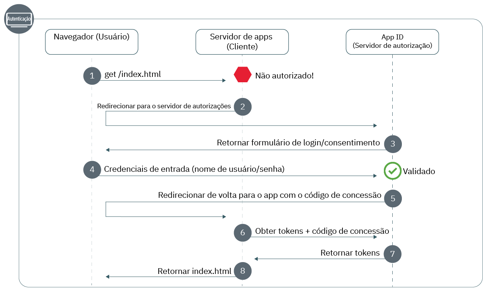

---

copyright:
  years: 2017, 2019
lastupdated: "2019-07-11"

keywords: Authentication, authorization, identity, app security, secure, development, nodejs, frontend, web apps, 

subcollection: appid

---

{:external: target="_blank" .external}
{:shortdesc: .shortdesc}
{:screen: .screen}
{:pre: .pre}
{:table: .aria-labeledby="caption"}
{:codeblock: .codeblock}
{:tip: .tip}
{:note: .note}
{:important: .important}
{:deprecated: .deprecated}
{:download: .download}


# Web: Node.js
{: #web-node}

Com o {{site.data.keyword.appid_short_notm}}, é possível proteger facilmente seus aplicativos da web front-end do Node.js. Com este guia, é possível fazer rapidamente com que um fluxo de autenticação simples funcione em menos de 20 minutos.
{: shortdesc}

Confira o diagrama a seguir para ver o fluxo de trabalho do Código de autorização OAuth 2.0.



1. Um usuário tenta obter acesso ao seu aplicativo da web protegido, mas ele está desautorizado.
2. Seu aplicativo redireciona o usuário para o {{site.data.keyword.appid_short_notm}}.
3. O {{site.data.keyword.appid_short_notm}} mostra uma tela de conexão que o usuário pode usar para se autenticar.
4. Ele insere suas credenciais, como nome de usuário e senha. O App ID valida as credenciais.
5. O {{site.data.keyword.appid_short_notm}} redireciona o usuário de volta para seu aplicativo com um código de concessão.
6. Ao usar o código de concessão, seu aplicativo faz uma solicitação ao {{site.data.keyword.appid_short_notm}} para assegurar que o usuário seja validado. Para obter mais informações sobre como obter tokens de acesso, consulte [Obtendo tokens](/docs/services/appid?topic=appid-obtain-tokens).
7. O {{site.data.keyword.appid_short_notm}} retorna tokens de acesso e identidade para o usuário validado.
8. O usuário recebe o acesso ao seu aplicativo.


## Tutorial de vídeo
{: #web-node-video}

Confira o vídeo a seguir para ver como é possível usar o {{site.data.keyword.appid_short_notm}} para proteger um aplicativo da web Node.js simples. Todas as informações que são cobertas no vídeo também podem ser localizadas por escrito nesta página.

<iframe class="embed-responsive-item" id="appid-web-node" title="Sobre aplicativos Node.js do {{site.data.keyword.appid_short_notm}}" type="text/html" width="640" height="390" src="//www.youtube.com/embed/6roa1ZOvwtw?rel=0" frameborder="0" webkitallowfullscreen mozallowfullscreen allowfullscreen></iframe>

Não tem um app com o qual você possa experimentar o fluxo? Sem problemas! O {{site.data.keyword.appid_short_notm}} fornece um [app de amostra da web Node.js simples](https://github.com/ibm-cloud-security/appid-video-tutorials/tree/master/02a-simple-node-web-app){: external}.

 

## Antes de iniciar
{: #web-node-before}

Antes de iniciar o {{site.data.keyword.appid_short_notm}} em seus aplicativos da web Node.js, deve-se ter os pré-requisitos a seguir.
{: shortdesc}

* Uma instância [do serviço {{site.data.keyword.appid_short_notm}}](https://cloud.ibm.com/catalog/services/app-id){: external}
* [A CLI do IBM Cloud](/docs/cli?topic=cloud-cli-getting-started)
* [NPM versão 4+](https://www.npmjs.com/get-npm){: external}
* [Nó versão 6+](https://nodejs.org/en/download/){: external}


## Etapa 1: registre seu URI de redirecionamento
{: #node-web-redirect-uri}

Um URI de redirecionamento é o terminal de retorno de chamada de seu app. Durante o fluxo no de conexão, o {{site.data.keyword.appid_short_notm}} valida os URIs antes de permitir que os clientes participem do fluxo de trabalho de autorização que ajuda a evitar ataques de phishing e vazamento de código de concessão. Ao registrar seu URI, você está dizendo ao {{site.data.keyword.appid_short_notm}} que o URI é confiável e que está tudo bem redirecionar seus usuários.
{: shortdesc}

1. Clique em **Gerenciar autenticações > Configurações de autenticação**.

2. No campo **Incluir URI de redirecionamento da web**, digite o URI. Cada URI deve iniciar com `http://` ou `https://` e deve incluir o caminho completo, incluindo qualquer parâmetro de consulta para que o redirecionamento seja bem-sucedido.

3. Clique no símbolo **+** na caixa **Incluir URIs de redirecionamento da web**.

4. Repita as etapas uma a três até que todos os URIs possíveis sejam incluídos em sua lista.


## Etapa 2: obtenha suas credenciais
{: #node-web-credentials}

É possível obter suas credenciais de uma das duas formas.
{: shortdesc}

  * Navegando para a guia **Aplicativos** do painel do {{site.data.keyword.appid_short_notm}}. Se você ainda não tiver um, será possível clicar em **Incluir aplicativo** para criar um novo.

  * Ao fazer uma solicitação de POST para o terminal [`/management/v4/{tenantId}/applications`](https://us-south.appid.cloud.ibm.com/swagger-ui/#!/Applications/registerApplication).

    Formato da solicitação:
    ```javascript
    curl -X POST \  https://us-south.appid.cloud.ibm.com/management/v4/39a37f57-a227-4bfe-a044-93b6e6060b61/applications/ \
    -H 'Content-Type: application/json' \
    -H 'Authorization: Bearer IAM_TOKEN' \
    -d '{"name": "ApplicationName"}'
    ```
    {: codeblock}

    Resposta de exemplo:
    ```javascript
    {
      "clientId": "xxxxx-34a4-4c5e-b34d-d12cc811c86d",
      "tenantId": "xxxxx-9b1f-433e-9d46-0a5521f2b1c4",
      "secret": "ZDk5YWZkYmYt*******",
      "name": "app1",
      "oAuthServerUrl": "https://us-south.appid.cloud.ibm.com/oauth/v4/xxxxx-9b1f-433e-9d46-0a5521f2b1c4",
      "profilesUrl": "https://us-south.appid.cloud.ibm.com",
      "discoveryEndpoint": "https://us-south.appid.cloud.ibm.com/oauth/v4/xxxxxx-9b1f-433e-9d46-0a5521f2b1c4/.well-known/openid-configuration"
    }
    ```
    {: screen}


## Etapa 3: inicialize o SDK
{: #web-node-install}

A forma mais fácil de trabalhar com o {{site.data.keyword.appid_short_notm}} é aproveitar o SDK do Node.js.
{: shortdesc}


1. Ao usar a linha de comandos, mude para o diretório que contenha o seu aplicativo Node.js.

2. Instale os requisitos do NPM a seguir.

    ```javascript
    npm install --save express express-session passport
    ```
    {: codeblock}

3. Instale o serviço do  {{site.data.keyword.appid_short_notm}} .

    ```javascript
    npm install -- save ibmcloud-appid
    ```
    {: codeblock}

4. Inclua os requisitos a seguir em seu arquivo `server.js`.

    ```javascript
    const express = require('express'); 								// https://www.npmjs.com/package/express
    const session = require('express-session');							// https://www.npmjs.com/package/express-session
    const passport = require('passport');								// https://www.npmjs.com/package/passport
    const WebAppStrategy = require('ibmcloud-appid').WebAppStrategy;	// https://www.npmjs.com/package/ibmcloud-appid
    ```
    {: shortdesc}

5. Configure seu aplicativo para usar o middleware de sessão expressa usando as credenciais que você obteve na etapa 1. É possível optar por formatar seu URI de redirecionamento de uma das duas formas. Manualmente, usando um novo `WebAppStrategy({redirectUri: "...."})` ou configurando o valor como uma variável de ambiente, conforme mostrado no código de exemplo.

    ```javascript
    const app = express();
    app.use(session({
        secret: '123456',
        resave: true,
        saveUninitialized: true
    }));
    app.use(passport.initialize());
    app.use(passport.session());
    passport.serializeUser((user, cb) => cb(null, user));
    passport.deserializeUser((user, cb) => cb(null, user));
    passport.use(new WebAppStrategy({
        tenantId: "<tenant_ID>",
        clientId: "<client_ID>",
        secret: "<secret>",
        oauthServerUrl: "<OAuth_Server_URL>",
        redirectUri: "<redirect_URI>"
    }));
    ```
    {: codeblock}

    Você deve configurar o middleware com o armazenamento de sessão adequado para ambientes de produção. Para obter mais informações, consulte os <a href="https://github.com/expressjs/session" target="_blank"> docs do express.js</a>.
    {: note}


## Etapa 4: proteja seu aplicativo
{: #node-web-protect}

Agora que você instalou o {{site.data.keyword.appid_short_notm}}, está pronto para proteger seu aplicativo. É possível optar por proteger seu aplicativo inteiro ou somente recursos específicos, definindo uma estratégia de app da web.
{: shortdesc}


1. Configure o terminal de retorno de chamada. O retorno de chamada conclui o processo de autorização recuperando os tokens de acesso e identidade do App ID e redirecionando o usuário para um dos locais a seguir:<ul><li>A URL original da solicitação que acionou a autenticação, conforme persistido na sessão HTTP como `WebAppStrategy.ORIGINAL_URL`.</li><li>Especificando um redirecionamento no caso de uma autenticação bem-sucedida.</li><li>A raiz do aplicativo (`/`) conforme mostrado na próxima etapa.</li></ul>

    ```javascript
    app.get(CALLBACK_URL, passport.authenticate(WebAppStrategy.STRATEGY_NAME));
    ```
    {: codeblock}

2. Configure um terminal de conexão que sempre redirecione um navegador para o Widget de login. Assegure-se de incluir uma opção de redirecionamento de êxito para que você não acabe em um loop de autenticação sem fim.

    ```javascript
    app.get('/appid/login', passport.authenticate(WebAppStrategy.STRATEGY_NAME, {
        successRedirect: '/',
        forceLogin: true
    }));
    ```
    {: codeblock}

3. Configure a saída. Quando um usuário sai do seu aplicativo, todas as suas informações de autenticação são limpas dessa sessão. Para interagir com seu aplicativo, ele precisará se conectar novamente.

    ```javascript
    app.get('/appid/logout', function(req, res){
        webappstrategy.logout(req);
        res.redirect('/');
    });
    ```
    {: shortdesc}

## Etapa 5: personalize seu app
{: #node-web-user-info}

É possível extrair informações fornecidas por seus provedores de identidade para personalizar sua experiência do app.
{: shortdesc}

1. Configure seu aplicativo para obter informações do usuário. `protected` é uma variável de item temporário que é possível mudar para corresponder ao terminal do seu aplicativo.

    ```javascript
    app.get("/protected", passport.authenticate(WebAppStrategy.STRATEGY_NAME), function(req, res){
        res.json(req.user);
    });
    ```
    {: codeblock}

    Por exemplo, no aplicativo de amostra, é possível ver como obter o nome dos usuários para personalizar seu aplicativo.
    ```javascript
    app.get('/api/user', (req, res) => {
        // console.log(req.session[WebAppStrategy.AUTH_CONTEXT]);
        res.json({
            user: {
                name: req.user.name
            }
        });
    });
    ```
    {: codeblock}


## Etapa 6: teste sua configuração
{: #node-web-test}

Para testar sua configuração de autorização, navegue até a URL em que seu servidor está atendendo, conforme definido em seu aplicativo. Tente se conectar, tente sair. Assegure-se de que a configuração esteja funcionando conforme esperado. 

Quando estiver pronto para mover para a próxima etapa, será possível tentar ativar a [autenticação de diversos fatores do Cloud Directory](/docs/services/appid?topic=appid-cd-mfa) ou incluir [atributos customizados](/docs/services/appid?topic=appid-profiles) para personalizar seu app.


