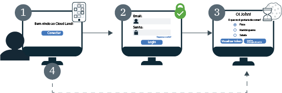

---

copyright:
  years: 2017, 2019
lastupdated: "2019-04-04"

keywords: authentication, authorization, identity, app security, secure, development, sso, directory, users, registry, multiple apps

subcollection: appid

---

{:new_window: target="_blank"}
{:shortdesc: .shortdesc}
{:screen: .screen}
{:pre: .pre}
{:table: .aria-labeledby="caption"}
{:codeblock: .codeblock}
{:tip: .tip}
{:note: .note}
{:important: .important}
{:deprecated: .deprecated}
{:download: .download}


# Conexão única (SSO)
{: #cd-sso}

Com a conexão única (SSO) para o Cloud Directory, é possível fornecer uma experiência de autenticação suave entre múltiplos apps da web. Se a SSO for ativada quando um usuário se conectar inicialmente, ele não precisará reinserir suas credenciais na próxima vez em que se conectar. Em vez disso, ele será conectado automaticamente a qualquer um de seus apps que estejam protegidos pela mesma instância do {{site.data.keyword.appid_short_notm}}.


## Como funciona
{: #cd-sso-how-it-works}

Efetue o registro de saída do diagrama a seguir para ver a SSO em ação.



1. Um usuário do Cloud Directory se conecta ao seu aplicativo pela primeira vez.
2. Ele é solicitado a se autenticar, fornecendo um nome de usuário ou e-mail e senha.
3. Se as credenciais forem válidas, um usuário será conectado ao seu app. Ao mesmo tempo, o {{site.data.keyword.appid_short_notm}} cria uma sessão e configura um cookie no navegador do usuário.
4. Se um usuário tentar efetuar sign in em um de seus outros aplicativos, o {{site.data.keyword.appid_short_notm}}detectará o cookie de sessão e assinará automaticamente o usuário em seu app. Os cookies de sessão do {{site.data.keyword.appid_short_notm}} são específicos da instância e são conectados pela chave privada exclusiva da instância.

Se a sua instância estiver configurada para usar provedores de identidade além do Cloud Directory, como o SAML ou o Facebook, o widget de login ainda será mostrado. Os usuários são solicitados a inserir suas credenciais do Cloud Directory ou escolher um dos outros provedores, mesmo se eles tiverem uma sessão SSO válida.
{: note}


## Configurando a SSO
{: #cd-sso-configure}

É possível configurar a conexão única usando o painel do {{site.data.keyword.appid_short_notm}} ou usando as APIs.
{: shortdesc}


### Com a GUI
{: #cd-sso-configure-gui}


É possível configurar a SSO por meio da GUI.

1. Navegue para a guia **Cloud Directory > Conexão única** do painel do {{site.data.keyword.appid_short_notm}}.

2. Na caixa **Ativar conexão única**, alterne SSO para **Ativado**.

3. Configure a quantidade de tempo que um usuário pode estar inativo antes que a sessão SSO expire. Quando ela expirar, o usuário deverá se conectar novamente. O tempo é especificado em minutos e o tempo máximo permitido para um ativo é de 10.080 minutos (7 dias). O tempo padrão é 1440 minutos que é o equivalente a 1 dia.

4. Inclua suas URIs redirecionando na caixa **URI de redirecionamento de logout**e clique no sinal **+**. Certifique-se de registrar somente os aplicativos nos quais confia. Ao registrar o URI, você autoriza o {{site.data.keyword.appid_short_notm}} a inclui-lo no fluxo de trabalho de autorização.

5. Clique em **Salvar**.


### Com a API
{: #cd-sso-configure-api}

Ao usar a API do administrador de configuração de SSO para definir três configurações, é possível ativar o recurso.

Uma chamada de exemplo:

```json
{
  "isActive": true,
  "inactivityTimeoutSeconds": 86400,
  "logoutRedirectUris": [
    "http://my-first-app.com/after_logout",
    "http://my-second-app.com/after_logout"
  ]
}
```
{: screen}

<table>
  <tr>
    <th>Configuração</th>
    <th>Definição</th>
  </tr>
  <tr>
    <td><code>isActive</code></td>
    <td>Para ativar a SSO, configure esse valor como <code>true</code>. A configuração padrão é <code>false</code>.</td>
  </tr>
  <tr>
    <td><code>inactivityTimeoutSeconds</code></td>
    <td>O maior período que pode decorrer sem qualquer atividade do usuário antes que ele seja solicitado a reinserir suas credenciais. Esse valor é especificado em segundos e pode ser, no máximo, <code>604800 seconds</code> (7 dias). A configuração padrão é <code>86400 seconds</code> (1 dia).</td>
  </tr>
  <tr>
    <td><code>logoutRedirectUris</code></td>
    <td>Uma lista separada por vírgula de URIs permitidos para os quais o {{site.data.keyword.appid_short_notm}} pode redirecionar seus usuários depois que eles se conectam.</td>
  </tr>
</table>


## Configurando o logout
{: #cd-sso-log-out}

Com o {{site.data.keyword.appid_short_notm}}, é possível encerrar a sessão SSO do usuário para seu navegador atual. Se o terminal de API for acessado pelo navegador do usuário, a sessão será finalizada e o usuário será solicitado a inserir suas credenciais na próxima tentativa de conexão nesse navegador, para qualquer um de seus apps.
{: shortdesc}


Quando um dos fluxos de mudança, reconfiguração ou renovação de senha é iniciado, as sessões em todos os clientes são finalizadas automaticamente para o usuário.
{: note}


### Usando a API
{: #cd-sso-log-out-api}

Para desconectar um usuário, redirecione seu navegador usando suas informações para concluir a chamada API a seguir.

```
https://<region>.appid.cloud.ibm.com/oauth/v4/<tenant-id>/cloud_directory/sso/logout?redirect_uri=<redirect_uri>&client_id=<clientId>
```
{: pre}

<table>
  <tr>
    <th>Variável</th>
    <th>Valor</th>
  </tr>
  <tr>
    <td><code>região</code></td>
    <td>A região na qual sua instância do {{site.data.keyword.appid_short_notm}} é fornecida. As opções incluem: <code>au-syd</code>, <code>eu-de</code>, <code>eu-gb</code>, <code>jp-tok</code>, e <code>us-south</code>.</td>
  </tr>
  <tr>
    <td><code>tenant-id</code></td>
    <td>O identificador exclusivo para a sua instância do {{site.data.keyword.appid_short_notm}}. É possível localizar esse valor na guia <em>Credenciais de serviço</em> do painel do {{site.data.keyword.appid_short_notm}}. Se você não tiver um conjunto de credenciais de serviço, será possível criar uma e tirar o valor de lá.</td>
  </tr>
  <tr>
    <td><code>redirect_uri</code></td>
    <td>Um URI que você especificou em sua configuração de SSO por meio do painel do {{site.data.keyword.appid_short_notm}}. Por motivos de segurança, se você não especificar um valor, o redirecionamento não poderá ocorrer e um erro será exibido.</td>
  </tr>
</table>

Mesmo que a sessão SSO seja finalizada, um usuário com um token de acesso válido armazenado em sua sessão pode não precisar inserir suas credenciais novamente até que seu token expire. Por padrão, o token expira após uma hora.
{: note}


### Usando o SDK do servidor Node.JS
{: #cd-sso-log-out-nodejs}

Também é possível usar o SDK do servidor {{site.data.keyword.appid_short_notm}} Node.js para manipular automaticamente o redirecionamento.

Exemplo:

```javascript
app.get('/logoutSSO', (req, res) => {
  res.clearCookie("refreshToken");
  webAppStrategy.logoutSSO(req,res, { "redirect_uri": "https://my-app.com/after_logout" });
  });
```
{: screen}


## Finalizando todas as sessões para um usuário
{: cd-sso-ending-all-sessions}

Como um administrador, é possível finalizar todas as sessões SSO para qualquer usuário fornecido usando as APIs administrativas do {{site.data.keyword.appid_short_notm}}. As APIs são protegidas por um token do Cloud IAM.

Solicitação de API de exemplo:

```
POST https:// < region>.appid.cloud.ibm.com/management/v4/ { tenant-id } /cloud_directory/Users/ { user-id } /sso/logout
Cabeçalhos:
Autorização: < IAM TOKEN>
```
{: pre}

<table>
  <tr>
    <th>Variável</th>
    <th>Valor</th>
  </tr>
  <tr>
    <td><code>região</code></td>
    <td>A região na qual sua instância do {{site.data.keyword.appid_short_notm}} é fornecida. As opções incluem: <code>us-south</code>, <code>eu-gb</code> e <code>eu-de</code>.</td>
  </tr>
  <tr>
    <td><code>tenant-id</code></td>
    <td>O identificador exclusivo para a sua instância do {{site.data.keyword.appid_short_notm}}. É possível localizar esse valor na guia <em>Credenciais de serviço</em> do painel do {{site.data.keyword.appid_short_notm}}. Se você não tiver um conjunto de credenciais de serviço, será possível criar uma e tirar o valor de lá.</td>
  </tr>
  <tr>
    <td><code>user-id</code></td>
    <td>O identificador exclusivo para um usuário do Cloud Directory. É possível obter o ID usando as [APIs de usuários do Cloud Directory](https://us-south.appid.cloud.ibm.com/swagger-ui/#/) ou visualizando o token de identidade do usuário.</td>
  </tr>
</table>

Quando você chama essa API, todas as sessões SSO do usuário especificado são invalidadas. Isso significa que na próxima vez que o usuário tentar se conectar a qualquer um de seus apps, por meio de qualquer dispositivo ou navegador, ele será solicitado a reinserir suas credenciais.

