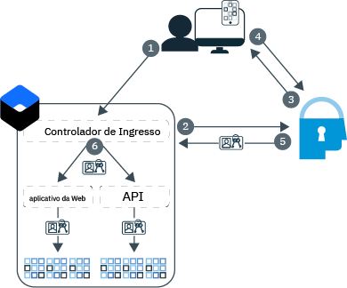

---

copyright:
  years: 2017, 2019
lastupdated: "2019-07-09"

keywords: Authentication, authorization, identity, app security, secure, development, ingress, policy, networking, containers, kubernetes

subcollection: appid

---

{:external: target="_blank" .external}
{:shortdesc: .shortdesc}
{:screen: .screen}
{:pre: .pre}
{:table: .aria-labeledby="caption"}
{:codeblock: .codeblock}
{:tip: .tip}
{:note: .note}
{:important: .important}
{:deprecated: .deprecated}
{:download: .download}


# Tutorial: Configurando Ingress para Utilizar o {{site.data.keyword.appid_short_notm}}
{: #kube-auth}

É possível aplicar consistentemente a segurança acionada por política usando o recurso de rede do Ingress no {{site.data.keyword.containerlong}}. Com essa abordagem, é possível ativar a autorização e a autenticação para todos os aplicativos em seu cluster ao mesmo tempo, sem mudar o código do aplicativo. Com este guia passo a passo, é possível saber como configurar o controlador do Ingress para usar o {{site.data.keyword.appid_short_notm}}.
{: shortdesc}

Consulte o diagrama a seguir para ver o fluxo de autenticação:



1. Um usuário abre seu aplicativo e aciona uma solicitação para o aplicativo da web ou a API.
2. Para o fluxo de API, o controlador do Ingress tenta validar os tokens fornecidos. Se o fluxo da web for usado, ele iniciará um processo de autenticação OIDC de três etapas.
3. O {{site.data.keyword.appid_short_notm}} inicia o processo de autenticação exibindo o widget de login.
4. O usuário fornece um nome de usuário ou e-mail e senha.
5. O controlador do Ingress obtém os tokens de acesso e de identidade do {{site.data.keyword.appid_short_notm}} para autorização.
6. Cada solicitação que é validada e encaminhada pelo controlador do Ingress para seus apps tem um cabeçalho de autorização que contém os tokens.

A integração do Controlador de Ingress com o {{site.data.keyword.appid_short_notm}}atualmente não suporta tokens de atualização. Quando os tokens de acesso e de identidade expiram, os usuários devem ser autenticados novamente.
{: note}


## Antes de iniciar
{: #kube-prereqs}

Antes de poder iniciar, assegure-se de que você tenha os pré-requisitos a seguir.
{: shortdesc}


* Um app ou aplicativo de amostra.

* Um cluster padrão do Kubernetes com pelo menos dois nós do trabalhador por zona. Se você estiver usando o Ingress em clusters com múltiplas zonas, revise os pré-requisitos extras na [documentação de serviço do Kubernetes](/docs/containers?topic=containers-ingress#config_prereqs).

* Uma instância do {{site.data.keyword.appid_short_notm}} na mesma região em que seu cluster é implementado. Assegure-se de que o nome do serviço não contenha nenhum espaço.

* As funções do IAM do [{{site.data.keyword.cloud_notm}}](/docs/containers?topic=containers-access_reference#access_reference) a seguir:
  * Cluster: função da plataforma Administrador
  * Namespaces do Kubernetes: função de serviço do gerenciador

* As CLIs a seguir:

  * [{{site.data.keyword.cloud_notm}}](/docs/cli?topic=cloud-cli-getting-started)
  * [Kubernetes](https://kubernetes.io/docs/tasks/tools/install-kubectl/)
  * [Docker](https://www.docker.com/products/container-runtime#/download)

* Os [plug-ins CLI](/docs/cli?topic=cloud-cli-install-devtools-manually#idt-install-kubernetes-cli-plugin)a seguir:

  * {{site.data.keyword.containershort}}
  * {{site.data.keyword.registryshort_notm}}

Para obter ajuda sobre como obter as CLIs e os plug-ins transferidos por download e o ambiente do seu Kubernetes Service configurado, consulte o tutorial [Criando clusters do Kubernetes](/docs/containers?topic=containers-cs_cluster_tutorial#cs_cluster_tutorial_lesson1).
{: tip}


Vamos começar.

## Etapa 1: Ligando o {{site.data.keyword.appid_short_notm}} ao seu cluster
{: #kube-create-appid}

Ao ligar sua instância do {{site.data.keyword.appid_short_notm}} a seu cluster, todas as instâncias de seu app que estão localizadas nesse cluster podem ser controladas pela mesma instância do {{site.data.keyword.appid_short_notm}}. Além disso, seus metadados e credenciais do {{site.data.keyword.appid_short_notm}} ficam disponíveis assim que seu aplicativo é iniciado como segredos do Kubernetes.
{: shortdesc}


1. Efetue login na CLI do  {{site.data.keyword.cloud_notm}} . Siga os prompts na CLI para concluir a criação de log. Se você estiver usando um ID federado, certifique-se de anexar a sinalização `--sso` ao término do comando.

  ```
  ibmcloud login -a cloud.ibm.com -r <region>
  ```
  {: codeblock}

  <table>
    <tr>
      <th>Região</th>
      <th>Ponto de Extremidade</th>
    </tr>
    <tr>
      <td>Dallas</td>
      <td><code> us-south </code></td>
    </tr>
    <tr>
      <td>Frankfurt</td>
      <td><code>eu-de</code></td>
    </tr>
    <tr>
      <td>Sydney</td>
      <td><code>au-syd</code></td>
    </tr>
    <tr>
      <td>London</td>
      <td><code>eu-gb</code></td>
    </tr>
    <tr>
      <td>Tóquio</td>
      <td><code>jp-tok</code></td>
    </tr>
  </table>

2. Configure o contexto para seu cluster.

  1. Obtenha o comando para configurar a variável de ambiente e fazer download dos arquivos de configuração do Kubernetes.

    ```
    ibmcloud ks cluster-config <cluster_name_or_ID>
    ```
    {: codeblock}

  2. Copie a saída que começa com `export` e cole-a em seu terminal para configurar a variável de ambiente `KUBECONFIG`.

3. Verifique se você já tem um controlador do Ingress em seu namespace padrão. O IBM Cloud Kubernetes Service suporta um Ingress por namespace. Se você já tiver um, será possível atualizar a configuração do Ingress existente ou usar um namespace diferente.

  ```
  kubectl get ingress
  ```
  {: codeblock}

4. Ligar sua instância do {{site.data.keyword.appid_short_notm}}. A ligação cria uma chave de serviço para a instância de serviço. É possível especificar uma chave de serviço existente usando o sinalizador `-key`.

  ```
  ibmcloud ks cluster-service-cluster -- cluster < cluster_name_or_ID>-- namespace < namespace>-- service < App-ID_instance_name>[ -- key < service_instance_key>]
  ```
  {: codeblock}

  Se você não especificar um namespace, o segredo será criado no namespace `default`.
  {: tip}

  Saída de exemplo:

  ```
  ibmcloud ks cluster-service-bind --cluster mycluster --namespace default --service appid1
  Binding service instance to namespace...
  OK
  Namespace:    default
  Secret name:  binding-appid1
  ```
  {: screen}

Ótimo trabalho!

## Etapa 2: Enviando por push o seu app para o Container Registry
{: #kube-registry}

Para que seu aplicativo seja executado em Kubernetes, você deve hospedá-lo em um registro.
{: shortdesc}


1. Conecte-se ao plug-in da CLI do Container Registry.

  ```
  ibmcloud cr login
  ```
  {: codeblock}

2. Crie um namespace do Container Registry.

  ```
  ibmcloud cr namespace-add <my_namespace>
  ```
  {: codeblock}

3. Construa, identifique e envie por push o app como uma imagem para o seu namespace no Container Registry. Certifique-se de incluir o ponto final (.) no final do comando.

  ```
  ibmcloud cr build -t registry.{region}.icr.io.net/{namespace}/{app-name}:{tag} .
  ```
  {: codeblock}

Bom. Você está quase pronto para implementar.

## Etapa 3: Configurando o Ingress
{: kube-ingress}

Durante a criação do cluster, serão criados um balanceador de carga de aplicativo (ALB) do IBM Kubernetes Service privado e um público. Para implementar seu aplicativo e aproveitar o controlador do Ingress, crie um script de implementação.
{: shortdesc}


Para assegurar o melhor desempenho da integração, é recomendável sempre usar a versão mais recente do balanceador de carga do aplicativo (ALB) do IBM Kubernetes Service. Por padrão, a atualização automática é ativada para seu cluster. Para obter mais informações sobre atualizações automáticas, consulte [Recurso de atualização de ALB on-demand no {{site.data.keyword.containershort}}](https://www.ibm.com/cloud/blog/on-demand-alb-update-feature-on-ibm-cloud-kubernetes-service).
{: tip}

1. Obtenha o segredo que foi criado em seu namespace do cluster quando você ligou o {{site.data.keyword.appid_short_notm}} ao seu cluster. Nota: este **não** é o namespace do Container Registry.

  ```
  kubectl get secrets --namespace=<namespace>
  ```
  {: codeblock}

  Saída de exemplo:

  ```
  NAME                       TYPE                                  DATA      AGE
  binding-appid1             Opaque                                1         1m
  bluemix-default-secret     kubernetes.io/dockercfg               1         1h
  default-token-kf97z        kubernetes.io/service-account-token   3         1h
  ```
  {: screen}

2. Use o seguinte arquivo `yaml` de exemplo para criar a configuração do Ingress. Para obter ajuda com a definição do restante de sua implementação, consulte [Implementando apps com a CLI](/docs/containers?topic=containers-app#app_cli).

  ```
  apiVersion: extensions/v1beta1
  kind: Ingress
  metadata:
    name: myingress
    annotations:
      ingress.bluemix.net/appid-auth: "bindSecret=<bind_secret> namespace=<namespace> requestType=<request_type> serviceName=<myservice> [idToken=false]"
  spec:
    tls:
    - hosts:
      - mydomain
      secretName: mytlssecret
    rules:
    - host: mydomain
      http:
        paths:
        - path: /
          backend:
            serviceName: myservice
            servicePort: 8080
  ```
  {: screen}

  <table>
    <tr>
      <th>Variável</th>
      <th>Descrição</th>
    </tr>
    <tr>
      <td><code>bindSecret</code></td>
      <td>O segredo do Kubernetes que foi criado quando você ligou a sua instância de serviço do {{site.data.keyword.appid_short_notm}} ao seu cluster.</td>
    </tr>
    <tr>
      <td><code>namespace</code></td>
      <td>O namespace no qual seu <code>bindSecret</code> foi criado. Se você não especificou um namespace, o namespace <code>default</code> será usado.</td>
    </tr>
    <tr>
      <td><code>requestType</code></td>
      <td><p>O tipo de solicitação que você deseja enviar para o {{site.data.keyword.appid_short_notm}}. As opções incluem: <code>web</code> e <code>api</code>. Se você configurar o tipo de solicitação para <code>web</code>, uma solicitação da web que contém um token de acesso do {{site.data.keyword.appid_short_notm}} será validada. Se a validação do token falhar, a solicitação da web será rejeitada. Se a solicitação não contiver um token de acesso, a solicitação será redirecionada para a página de login do {{site.data.keyword.appid_short_notm}}. Para que a autenticação da web do {{site.data.keyword.appid_short_notm}} funcione, os cookies devem ser ativados no navegador do usuário.</p><p>Se você configurar o tipo de solicitação para <code>api</code>, uma solicitação de API que contém um token de acesso do {{site.data.keyword.appid_short_notm}} será validada. Se a solicitação não contiver um token de acesso, uma mensagem de erro <code>401: Unauthorized</code> será retornada para o usuário.</p></td>
    </tr>
    <tr>
      <td><code>serviceName</code></td>
      <td><p>Necessário: o nome do serviço do Kubernetes que você criou para seu app. Se um nome de serviço não for incluído, a anotação será ativada para todos os serviços.</p> <p>Para usar vários tipos de solicitação no mesmo cluster, configure uma instância do {{site.data.keyword.appid_short_notm}}para usar a <code>web</code>e outra para usar <code>api</code>.</p></td>
    </tr>
    <tr>
      <td><code>idToken</code></td>
      <td>Opcional: o cliente Liberty OIDC não é capaz de analisar o acesso e o token de identidade ao mesmo tempo. Ao trabalhar com o Liberty, configure esse valor como <code>false</code> para que o token de identidade não seja enviado para o servidor Liberty.</td>
    </tr>
    <tr>
      <td><code>secretName</code></td>
      <td>O segredo do TLS que está associado a seu certificado TLS. Se o seu certificado estiver hospedado no IBM Cloud Certificate Manager, será possível executar <code>ibmcloud ks alb-cert-deploy --secret-name <secret_name> --cluster <cluster_name_or_ID> --cert-crn <certificate_crn></code> para implementá-lo em seu cluster. Se você não tiver um certificado, conclua a etapa 3 de [Expondo apps com o Ingress](/docs/containers?topic=containers-ingress#ingress_expose_public).</td>
    </tr>
  </table>

3. Execute o arquivo de configuração.

  ```
  kubectl apply -f <file-name>.yaml
  ```
  {: codeblock}

Ótimo trabalho!


## Etapa 4: Incluindo suas URLs de redirecionamento
{: #kube-add-redirect}

Uma URL de redirecionamento é a URL para o site para o qual você deseja que o {{site.data.keyword.appid_short_notm}} envie seus usuários após a autenticação bem-sucedida.
{: shortdesc}

1. Navegue para a GUI do {{site.data.keyword.cloud_notm}} e abra o painel do {{site.data.keyword.appid_short_notm}}.

2. Em **Provedores de identidade > Gerenciar**, configure os provedores que você deseja usar como **Ativado**. Se um provedor não estiver ativado, um token de acesso será emitido aos usuários que forneça acesso anônimo para seu app.

3. Clique em **Configurações de autenticação**.

4. Clique no símbolo **+** na caixa **Incluir URLs de redirecionamento da web**.

  * Domínio customizado:

    Uma URL que é registrada com um domínio customizado pode ser semelhante a: `http://mydomain.net/myapp2path/appid_callback`. Se os apps que você deseja expor estiverem dentro do mesmo cluster, mas em namespaces diferentes, será possível usar um curinga para especificar todos os apps no cluster de uma só vez. Isso pode ser útil durante o desenvolvimento, mas é necessário ter cuidado se você usar curingas na produção. Por exemplo: `https://custom_domain.net/*`

  * Subdomínio do Ingress:

    Se o seu aplicativo estiver registrado com um subdomínio do IBM Ingress, sua URL de retorno de chamada poderá ser semelhante a: `https://mycluster.us-south.containers.appdomain.cloud/myapp1path/appid_callback`

{{site.data.keyword.appid_short_notm}}oferece uma função de logout: Se `/logout`existir em seu {{site.data.keyword.appid_short_notm}}caminho, os cookies serão removidos e o usuário será enviado de volta para a página de login. Para usar essa função, anexe `/appid_logout` a seu domínio no formato `https://mycluster.us-south.containers.appdomain.cloud/myapp1path/appid_logout` e inclua-o em suas URLs de redirecionamento.
{: note}


Excelente! Agora, é possível verificar se a implementação foi bem-sucedida, navegando para o subdomínio do Ingress ou o domínio customizado para experimentá-la.


## Próximas Etapas
{: #kube-next}

Agora que seu aplicativo está em execução em um cluster Kubernetes e o Ingress está configurado, é possível tentar:

* Usar atributos customizados para [configurar funções](/docs/services/appid?topic=appid-tutorial-roles)
* Configurar [autenticação de múltiplos fatores](/docs/services/appid?topic=appid-cd-mfa)
* Customizar o [widget de login](/docs/services/appid?topic=appid-login-widget)


