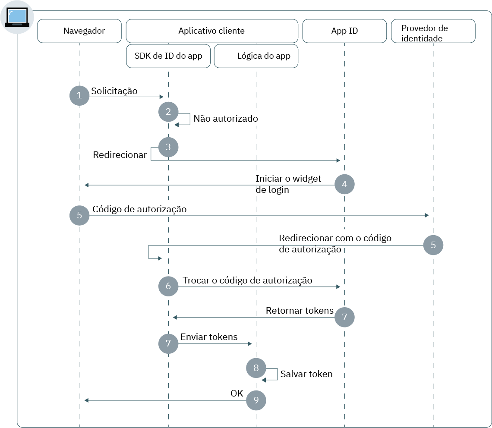

---

copyright:
  years: 2017, 2019
lastupdated: "2019-05-21"

keywords: authentication, authorization, identity, app security, secure, web apps, client, server

subcollection: appid

---

{:new_window: target="_blank"}
{:shortdesc: .shortdesc}
{:screen: .screen}
{:pre: .pre}
{:table: .aria-labeledby="caption"}
{:codeblock: .codeblock}
{:tip: .tip}
{:note: .note}
{:important: .important}
{:deprecated: .deprecated}
{:download: .download}


# Apps da web
{: #web-apps}

Com o {{site.data.keyword.appid_full}}, é possível construir rapidamente uma camada de autenticação para seus
aplicativos da web.
{: shortdesc}

## Entendendo o fluxo
{: #web-understanding}

**Quando esse fluxo seria útil?**

Ao desenvolver um aplicativo da web, é possível usar o fluxo da web do {{site.data.keyword.appid_short_notm}} para
autenticar os usuários com segurança. Os usuários podem, então, acessar o conteúdo protegido do lado do
servidor em seus aplicativos da web.

**Qual é a base técnica do fluxo?**

Os apps da web frequentemente requerem que os usuários sejam autenticados para que possam acessar conteúdo protegido. O
{{site.data.keyword.appid_short_notm}} usa o fluxo de código de autorização do OIDC para autenticar os usuários com
segurança. Com esse fluxo, quando o usuário é autenticado, o aplicativo recebe um código de autorização. Em seguida, o
código é trocado por um token de acesso, de identidade e de atualização. No código, a etapa de troca de tokens sempre é
enviada por meio de um canal de retorno seguro entre o aplicativo e o servidor OIDC. Isso fornece uma camada extra de
segurança, pois o invasor não é capaz de interceptar os tokens. Esses tokens podem ser enviados diretamente para o
aplicativo de hospedagem do servidor da web para autenticação do usuário.

**Como esse fluxo funciona?**



1. Um usuário inicia o fluxo de autorização enviando uma solicitação para o terminal `/authorization` por
meio do SDK ou API do {{site.data.keyword.appid_short_notm}}.

2. Se o usuário estiver desautorizado, o fluxo de autenticação será iniciado com um redirecionamento para o {{site.data.keyword.appid_short_notm}}.

3. Dependendo dos parâmetros de solicitação `/authorization` do usuário ou da configuração do provedor de identidade, ele ativa o Widget de login no navegador do usuário.

4. O usuário escolhe um provedor de identidade com o qual se autenticar e conclui o processo de conexão.

5. O provedor de identidade é redirecionado para o aplicativo cliente com o código de autorização.

6. O SDK do {{site.data.keyword.appid_short_notm}} troca o código de autorização para os tokens de acesso,
de identidade e, opcionalmente, de atualização por meio do serviço do {{site.data.keyword.appid_short_notm}}.

7. Os tokens são salvos pelo SDK do {{site.data.keyword.appid_short_notm}} e ocorre um redirecionamento para o
aplicativo cliente.

8. O usuário tem acesso concedido ao aplicativo.


## Configurando o SDK do Node.js
{: #web-configuring-nodejs}

É possível configurar o {{site.data.keyword.appid_short_notm}} para trabalhar com os aplicativos da web
Node.js.
{: shortdesc}

**Antes de iniciar**

Deve-se ter os pré-requisitos a seguir:

* Uma instância do serviço do {{site.data.keyword.appid_short_notm}}
* Um conjunto de credenciais de serviço
* NPM versão 4 ou superior
* Node versão 6 ou superior
* Seu URI de redirecionamento configurado no painel de serviço do {{site.data.keyword.appid_short_notm}}


Verifique o vídeo a seguir para aprender sobre como proteger aplicativos de Nó com o {{site.data.keyword.appid_short_notm}}. Em seguida, experimente você mesmo usando um [app de amostra de Nó simples](https://github.com/ibm-cloud-security/appid-video-tutorials/tree/master/02a-simple-node-web-app).

<iframe class="embed-responsive-item" id="appid-nodejs" title="Sobre o {{site.data.keyword.appid_short_notm}}" type="text/html" width="640" height="390" src="//www.youtube.com/embed/6roa1ZOvwtw?rel=0" frameborder="0" webkitallowfullscreen mozallowfullscreen allowfullscreen></iframe>


### Instalando o SDK do Node.js
{: #web-nodejs-install}

1. Usando a linha de comandos, mude para o diretório que contém o aplicativo Node.js.

2. Instale o serviço do  {{site.data.keyword.appid_short_notm}} .

  ```bash
  npm install -- save ibmcloud-appid
  ```
  {: codeblock}

### Inicializando o SDK do Node.js
{: #web-nodejs-initialize}

1. Inclua as definições `require` no arquivo `server.js`.

  ```javascript
  const express = require('express');
    const session = require('express-session')
    const passport = require('passport');
    const WebAppStrategy = require("ibmcloud-appid").WebAppStrategy;
    const CALLBACK_URL = "/ibm/cloud/appid/callback";
  ```
  {: codeblock}

2. Configurar seu app express para usar o middleware express-session.

  ```javascript
  const app = express();
    app.use(session({
        secret: "123456",
        resave: true,
        saveUninitialized: true
        }));
    app.use(passport.initialize());
    app.use(passport.session());
  ```
  {: codeblock}

  Você deve configurar o middleware com o armazenamento de sessão adequado para ambientes de produção. Para obter mais informações, consulte os <a href="https://github.com/expressjs/session" target="_blank"> docs do express.js</a>.
  {: note}

3. Obtenha as suas credenciais de uma das maneiras a seguir.

  * Navegando para a guia **Aplicativos** do painel do {{site.data.keyword.appid_short_notm}}. Se você não tiver um aplicativo listado, será possível clicar em **Incluir aplicativo** para criar um novo.

  * Ao fazer uma solicitação de POST para o terminal [`/management/v4/{tenantId}/applications`](https://us-south.appid.cloud.ibm.com/swagger-ui/#/Management%20API%20-%20Applications/mgmt.registerApplication).

    Formato da solicitação:
    ```
    curl -X POST \  https://us-south.appid.cloud.ibm.com/management/v4/39a37f57-a227-4bfe-a044-93b6e6060b61/applications/ \
    -H 'Content-Type: application/json' \
    -H 'Authorization: Bearer IAM_TOKEN' \
    -d '{"name": "ApplicationName"}'
    ```
    {: codeblock}

    Resposta de exemplo:
    ```
    {
    "clientId": "111c22c3-38ea-4de8-b5d4-338744d83b0f",
    "tenantId": "39a37f57-a227-4bfe-a044-93b6e6060b61",
    "secret": "ZmE5ZDQ5ODctMmA1ZS00OGRiLWExZDMtZTA1MjkyZTc4MDB4",
    "name": "ApplicationName",
    "oAuthServerUrl": "https://us-south.appid.cloud.ibm.com/oauth/v4/39a37f57-a227-4bfe-a044-93b6e6060b61"
    }
    ```
    {: screen}

4. Opcional: decida como formatar seu URI de redirecionamento. O redirecionamento pode ser formatado de duas maneiras diferentes.

  * Manualmente em um novo `WebAppStrategy({redirectUri: "...."})`
  * Como uma variável de ambiente denominada `redirectUri`

  Se nenhuma for fornecida, o SDK do {{site.data.keyword.appid_short_notm}} tentará recuperar o `application_uri` do app que está em execução no {{site.data.keyword.cloud_notm}} e anexará um sufixo padrão `/ibm/cloud/appid/callback`.

5. Usando as informações obtidas nas etapas anteriores, inicialize o SDK.

  ```javascript
    passport.use(new WebAppStrategy({
    	  tenantId: "{tenant-id}",
   	    clientId: "{client-id}",
      	secret: "{secret}",
      	oauthServerUrl: "{oauth-server-url}",
      	redirectUri: "{app-url}" + CALLBACK_URL
      }));
  ```
  {: codeblock}

6. Configure o passaporte com serialização e desserialização. Essa etapa de configuração é necessária para a persistência de sessão autenticada nas solicitações de HTTP. Para obter mais informações, consulte os <a href="http://www.passportjs.org/docs/" target="_blank">documentos de passaporte </a>.

  ```javascript
  passport.serializeUser (function (user, cb) {
    cb(null, user);
    });

  passport.deserializeUser(function(obj, cb) {
    cb(null, obj);
    });
  ```
  {: codeblock}

5. Inclua o código a seguir em seu arquivo `server.js` para emitir os redirecionamentos de serviço.

   ```javascript
   app.get(CALLBACK_URL, passport.authenticate(WebAppStrategy.STRATEGY_NAME));
   ```
   {: codeblock}

6. Registre seu terminal protegido.

   ```javascript
   app.get(‘/protected’, passport.authenticate(WebAppStrategy.STRATEGY_NAME), function(req, res) {res.json(req.user); });
   ```
   {: codeblock}

Para obter mais informações, consulte o
<a href="https://github.com/ibm-cloud-security/appid-serversdk-nodejs" target="_blank">{{site.data.keyword.appid_short_notm}}
repositório GitHub do Node.js </a>.


## Configurando o SDK do Liberty for Java
{: #web-configuring-liberty}

É possível configurar o {{site.data.keyword.appid_short_notm}} para trabalhar com os aplicativos da web Liberty for Java.
{:shortdesc}

**Antes de iniciar**

Deve-se ter os pré-requisitos a seguir:
* Uma instância do serviço do {{site.data.keyword.appid_short_notm}}
* Um conjunto de credenciais de serviço
* Apache Maven 3.5 ou superior
* Java 1.8
* Um aplicativo da web Liberty for Java


Verifique o vídeo a seguir para aprender sobre como proteger aplicativos Liberty for Java com o {{site.data.keyword.appid_short_notm}}. Em seguida, experimente você mesmo usando um [app de amostra Liberty for Java simples](https://github.com/ibm-cloud-security/appid-video-tutorials/tree/master/02c-simple-liberty-web-app).

<iframe class="embed-responsive-item" id="appid-liberty-web" title="Sobre o {{site.data.keyword.appid_short_notm}}" type="text/html" width="640" height="390" src="//www.youtube.com/embed/o_Er69YUsMQ?rel=0" frameborder="0" webkitallowfullscreen mozallowfullscreen allowfullscreen></iframe>


### Instalando o SDK do Liberty for Java
{: #web-liberty-install}

1. Inclua um recurso de conexão OpenID em seu `server.xml`.

  ```xml
  <featureManager>
      <feature>ssl-1.0</feature>
      <feature>appSecurity-2.0</feature>
      <feature>openidConnectClient-1.0</feature>
  </featureManager>
  ```
  {: codeblock}

2. Obtenha suas credenciais de uma de duas maneiras.

  * Navegando para a guia **Aplicativos** do painel do {{site.data.keyword.appid_short_notm}}. Se você ainda não tiver um, será possível clicar em **Incluir aplicativo** para criar um novo.

  * Ao fazer uma solicitação de POST para o terminal [`/management/v4/{tenantId}/applications`](https://us-south.appid.cloud.ibm.com/swagger-ui/#!/Applications/registerApplication).

    Formato da solicitação:
    ```
    curl -X POST \  https://us-south.appid.cloud.ibm.com/management/v4/39a37f57-a227-4bfe-a044-93b6e6060b61/applications/ \
    -H 'Content-Type: application/json' \
    -H 'Authorization: Bearer IAM_TOKEN' \
    -d '{"name": "ApplicationName"}'
    ```
    {: codeblock}

    Resposta de exemplo:
    ```
    {
    "clientId": "111c22c3-38ea-4de8-b5d4-338744d83b0f",
    "tenantId": "39a37f57-a227-4bfe-a044-93b6e6060b61",
    "secret": "ZmE5ZDQ5ODctMmA1ZS00OGRiLWExZDMtZTA1MjkyZTc4MDB4",
    "name": "ApplicationName",
    "oAuthServerUrl": "https://us-south.appid.cloud.ibm.com/oauth/v4/39a37f57-a227-4bfe-a044-93b6e6060b61"
    }
    ```
    {: screen}

3. Crie um recurso cliente da conexão OpenID e defina os itens temporários a seguir. Use as credenciais de serviço para
preencher os itens temporários.

  ```xml
  <openidConnectClient
    clientId='{{site.data.keyword.appid_short_notm}} client_ID'
    clientSecret='{{site.data.keyword.appid_short_notm}} Secret'
    authorizationEndpointUrl='oauthServerUrl/authorization'
    tokenEndpointUrl='oauthServerUrl/token'
    jwkEndpointUrl='oauthServerUrl/publickeys'
    issuerIdentifier='Changed according to the region'
    tokenEndpointAuthMethod="basic"
    signatureAlgorithm="RS256"
    authFilterid="myAuthFilter"
    trustAliasName="ibm.com"
  />
  ```
  {: codeblock}

  <table>
  <caption>Tabela. Variáveis do elemento OIDC para os aplicativos Liberty for Java</caption>
    <tr>
      <th> Componente </th>
      <th> Descrição </th>
    </tr>
    <tr>
    <td><code>clientID</code></br><code>secret</code></br><code>oauth-server-url</code></br></td>
    <td>Conclua a etapa dois para obter suas credenciais de serviço.</td>
    </tr>
    <tr>
      <td><code> authorizationEndpointURL </code></td>
      <td> Inclua <code>/authorization</code> no final de sua <code>oauthServerURL</code>.</td>
    </tr>
    <tr>
      <td><code> tokenEndpointUrl </code></td>
      <td>Inclua <code>/token</code> no final de sua <code>oauthServerURL</code>.</td>
    </tr>
    <tr>
      <td><code> jwkEndpointUrl </code></td>
      <td>Inclua <code>/publickeys</code> para o final de sua <code>oauthServerURL</code>.</td>
    </tr>
    <tr>
      <td><code> issuerIdentifier </code></td>
      <td>O identificador do remetente tem o seguinte formato: <code>&lt;region>&gt;.cloud.ibm.com</code>. As opções de região incluem: <code>au-syd</code>, <code>eu-de</code>, <code>eu-gb</code>, <code>jp-tok</code> e <code>us-south</code>.</td>
    </tr>
    <tr>
      <td><code> tokenEndpointAuthMethod </code></td>
      <td>Especificado como "basic".</td>
    </tr>
    <tr>
      <td><code> signatureAlgorithm </code></td>
      <td>Especificado como "RS256".</td>
    </tr>
    <tr>
      <td><code>authFilterid</code></td>
      <td>A lista dos recursos a serem protegidos.</td>
    </tr>
    <tr>
      <td><code> trustAliasName </code></td>
      <td>O nome de seu certificado em seu armazenamento confiável.</td>
    </tr>
  </table>

### Inicializando o SDK do Liberty for Java
{: #web-liberty-initialize}

1. Em seu arquivo `server.xml`, defina um filtro de autorização para especificar os recursos
protegidos. Se um filtro não for
<a href="https://www.ibm.com/support/knowledgecenter/en/SSD28V_9.0.0/com.ibm.websphere.wlp.core.doc/ae/rwlp_auth_filter.html" target="_blank">definido
 </a>, o serviço protegerá todos os
recursos.

  ```xml
  <authFilter id="myAuthFilter">
             <requestUrl id="myRequestUrl" urlPattern="/protected" matchType="contains"/>
    </authFilter>
  ```
  {: codeblock}

2. Defina seu tipo de assunto especial como `ALL_AUTHENTICATED_USERS`.

  ```xml
  <application type="war" id="ProtectedServlet" context-root="/appidSample"
  location="${server.config.dir}/apps/libertySample-1.0.0.war">
    <application-bnd>
        <security-role name="myrole">
        <special-subject type="ALL_AUTHENTICATED_USERS"/>
        </security-role>
            </application-bnd>
        </application>
  ```
  {: codeblock}

3. Faça download do arquivo `libertySample-1.0.0.war` por meio do
<a href="https://github.com/ibm-cloud-security/appid-sample-code-snippets/tree/master/liberty-for-java" target="_blank">GitHub
</a> e coloque-o na pasta de
aplicativos do servidor. Por exemplo, se o seu servidor for denominado `defaultServer`, o arquivo war deverá ficar aqui `target/liberty/wlp/usr/servers/defaultServer/apps/`.

4. Configure o SSL incluindo o seguinte em seu arquivo `server.xml`. Também é necessário criar um armazenamento confiável.

  ```xml
    <keyStore id="defaultKeyStore" password="myPassword"/>
  <keyStore id="appidtruststore" password="Liberty" location="${server.config.dir}/mytruststore.jks"/>
  <ssl id="defaultSSLConfig" keyStoreRef="defaultKeyStore" trustStoreRef="appidtruststore"/>
  ```
  {: codeblock}

Por padrão, a configuração do SSL requer que o armazenamento confiável seja configurado para a conexão OpenID. Saiba mais sobre como <a href="https://www.ibm.com/support/knowledgecenter/en/SSEQTP_liberty/com.ibm.websphere.wlp.doc/ae/twlp_config_oidc_rp.html" target="_blank">configurar
um cliente da conexão OpenID no Liberty </a>
{: tip}


## Configurando o SDK do Spring Boot for Java
{: #web-configuring-spring-boot}

É possível configurar o {{site.data.keyword.appid_short_notm}} para trabalhar com seus aplicativos Spring
Boot.
{:shortdesc}

**Antes de iniciar**

Deve-se ter os pré-requisitos a seguir:

* Uma instância do serviço do {{site.data.keyword.appid_short_notm}}
* Um conjunto de credenciais de serviço
* Um projeto Java + Maven
* Apache Maven 3.5 ou superior
* Java 1.8
* Spring Boot 2.0 e Security OAuth 2.0 ou mais recente


### Inicializando a estrutura da Boot Spring
{: #web-spring-boot-initialize}

1. Inclua o seguinte entre as tags `<project></project>`em seu arquivo `pom.xml`do Maven.

  ```xml
  <parent>
      <groupId>org.springframework.boot</groupId>
      <artifactId>spring-boot-starter-parent</artifactId>
      <version>2.0.2.RELEASE</version>
      <relativePath/>
  </parent>
  ```
  {: codeblock}

2. Inclua as dependências a seguir em seu arquivo `pom.xml` do Maven.

  ```xml
  <dependencies>
      <dependency>
          <groupId>org.springframework.boot</groupId>
          <artifactId>spring-boot-starter-web</artifactId>
      </dependency>
      <dependency>
          <groupId>org.springframework.boot</groupId>
          <artifactId>spring-boot-starter-security</artifactId>
      </dependency>
      <dependency>
          <groupId>org.springframework.security.oauth.boot</groupId>
          <artifactId>spring-security-oauth2-autoconfigure</artifactId>
          <version>2.0.0.RELEASE</version>
      </dependency>
  </dependencies>
  ```
  {: codeblock}

3. No mesmo arquivo, inclua o plug-in Maven.

  ```xml
  <plugin>
      <groupId>org.springframework.boot</groupId>
      <artifactId>spring-boot-maven-plugin</artifactId>
  </plugin>
  ```
  {: codeblock}

### Inicializando o OAuth2
{: #web-oauth-initialize}

1. Inclua as anotações a seguir em seu arquivo Java.

  ```java
  @SpringBootApplication
  @EnableOAuth2Sso
  ```
  {: codeblock}

2. Estenda a classe com `WebSecurityConfigurerAdapter`.
3. Substitua qualquer configuração de segurança e registre seu terminal protegido.

  ```java
    @Override
    protected void configure(HttpSecurity http) throws Exception {
        http.authorizeRequests()
                .antMatchers("/protectedResource").authenticated()
                .and().logout().logoutSuccessUrl("/").permitAll();
    }
  ```
  {: codeblock}


### Incluindo credenciais
{: #web-spring-boot-credentials}

1. Obtenha as suas credenciais de uma das maneiras a seguir.

  * Navegando para a guia **Aplicativos** do painel do {{site.data.keyword.appid_short_notm}}. Se você ainda não tiver um, será possível clicar em **Incluir aplicativo** para criar um novo.

  * Ao fazer uma solicitação de POST para o terminal [`/management/v4/{tenantId}/applications`](https://us-south.appid.cloud.ibm.com/swagger-ui/#!/Applications/registerApplication).

    Formato da solicitação:
    ```
    curl -X POST \  https://us-south.appid.cloud.ibm.com/management/v4/39a37f57-a227-4bfe-a044-93b6e6060b61/applications/ \
    -H 'Content-Type: application/json' \
    -H 'Authorization: Bearer IAM_TOKEN' \
    -d '{"name": "ApplicationName"}'
    ```
    {: codeblock}

    Resposta de exemplo:
    ```
    {
    "clientId": "111c22c3-38ea-4de8-b5d4-338744d83b0f",
    "tenantId": "39a37f57-a227-4bfe-a044-93b6e6060b61",
    "secret": "ZmE5ZDQ5ODctMmA1ZS00OGRiLWExZDMtZTA1MjkyZTc4MDB4",
    "name": "ApplicationName",
    "oAuthServerUrl": "https://us-south.appid.cloud.ibm.com/oauth/v4/39a37f57-a227-4bfe-a044-93b6e6060b61"
    }
    ```
    {: screen}

2. Inclua um arquivo de configuração `application.yml` no diretório `/springbootsample/src/main/resources/`. É possível concluir sua configuração com as informações de suas credenciais de serviço.

  ```
  security:
  oauth2:
    client:
      clientId: {client ID}
      clientSecret: {client Secret}
      accessTokenUri: {oauthServerUrl}/token
      userAuthorizationUri: {oauthServerUrl}/authorization
    resource:
      userInfoUri: {oauthServerUrl}/userinfo
  ```
  {: codeblock}

Para obter um exemplo passo a passo, consulte <a href="https://www.ibm.com/cloud/blog/creating-spring-boot-applications-app-id" target="_blank">este
blog</a>.


## Usando o {{site.data.keyword.appid_short_notm}} com outros idiomas
{: #web-other-languages}

Com um SDK de cliente compatível com OIDC, é possível usar o {{site.data.keyword.appid_short_notm}}com outros idiomas. Consulte a lista de <a href="https://openid.net/developers/certified/">bibliotecas certificadas</a> para obter mais informações.

## Próximas Etapas
{: #web-next}

Com o {{site.data.keyword.appid_short_notm}} instalado em seu aplicativo, você está quase pronto para começar a autenticar os usuários! Tente executar uma das atividades a seguir em seguida:

* Configure os seus [provedores de identidade](/docs/services/appid?topic=appid-social)
* Customize e configure [o Widget de login](/docs/services/appid?topic=appid-login-widget)
* Saiba mais sobre o <a href="https://github.com/ibm-cloud-security/appid-serversdk-nodejs" target="_blank">SDK do Node.js</a>
