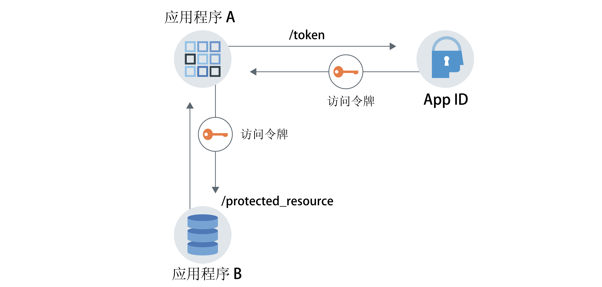

---

copyright:
  years: 2017, 2019
lastupdated: "2019-06-28"

keywords: Authentication, authorization, identity, app security, secure, application identity, app to app, access token

subcollection: appid

---

{:external: target="_blank" .external}
{:shortdesc: .shortdesc}
{:screen: .screen}
{:pre: .pre}
{:table: .aria-labeledby="caption"}
{:codeblock: .codeblock}
{:tip: .tip}
{:note: .note}
{:important: .important}
{:deprecated: .deprecated}
{:download: .download}

# 应用程序身份和授权
{: #app}

通过 {{site.data.keyword.appid_short_notm}}，可以使用应用程序身份和授权流程并利用 OAuth2.0 功能来保护应用程序。
{: shortdesc}

## 了解通信流程
{: #app-understanding}

出于多种原因，您可能希望一个应用程序与另一个服务或应用程序进行通信，而无需任何用户干预。例如，一个非交互式应用程序需要访问另一个应用程序来执行其工作。这可能包括用于监视环境变量并向上游服务器报告这些环境变量的进程、CLI、守护程序或 IoT 设备。特定用例对于每个应用程序是唯一的，但请务必谨记，交换请求是代表应用程序（而不是最终用户）进行的，并且进行认证和授权的是应用程序。


### 此流程是如何运作的？
{: #app-flow-how}

{{site.data.keyword.appid_short_notm}} 利用 OAuth 2.0 客户端凭证流程来保护通信。应用程序向 {{site.data.keyword.appid_short_notm}} 注册后，该应用程序将获得客户端标识和私钥。借助这些信息，应用程序可以向 {{site.data.keyword.appid_short_notm}} 请求访问令牌，并有权访问受保护资源或 API。在应用程序身份和授权流程中，只会向应用程序授予访问令牌。应用程序不会获得身份令牌或刷新令牌。有关令牌的更多信息，请参阅[了解令牌](/docs/services/appid?topic=appid-tokens)。

此工作流程应仅用于可信应用程序，即不存在误用或泄漏私钥的风险的应用程序。应用程序会始终保存客户端私钥。此私钥对于移动应用程序无效。
{: tip}

### 此流程是什么样子的？
{: #app-flow-what}

在下图中，可以查看服务与应用程序之间的通信方向。


图. 应用程序身份和授权流程

1. 向 {{site.data.keyword.appid_short_notm}} 注册需要进行认证才能访问受保护资源的应用程序。 
2. 应用程序 A 向 {{site.data.keyword.appid_short_notm}} 注册以获取客户端标识和私钥。
3. 应用程序 A 通过发送上一步中检索到的凭证，对 {{site.data.keyword.appid_short_notm}} 授权服务器 `/token` 端点发出请求。
4. {{site.data.keyword.appid_short_notm}} 验证请求，对应用程序进行认证，并向应用程序 A 返回包含访问令牌的响应。
5. 应用程序 A 现在能够使用有效的访问令牌对受保护资源（例如，应用程序 B）发送请求。

用于认证客户端的客户端私钥属于高度敏感信息，必须保密。由于应用程序使用的是应用程序内客户端私钥，所以此工作流程只能用于可信应用程序。使用可信应用程序可确保客户端私钥不会泄露或被误用。
{: important}

## 注册应用程序
{: #app-register}

### 使用 GUI
{: #app-register-gui}

1. 在 {{site.data.keyword.appid_short_notm}} 仪表板的**应用程序**选项卡中，单击**添加应用程序**。
2. 添加应用程序名称，然后单击**保存**以返回到已注册应用程序的列表。应用程序的名称不能超过 50 个字符。
3. 从已注册应用程序的列表中，选择在上一步中添加的应用程序。相应行将展开以显示凭证。

### 使用 API
{: #app-register-api}

1. 对 [`/management/v4/{tenantId}/applications` 端点](https://us-south.appid.cloud.ibm.com/swagger-ui/#/Management%20API%20-%20Applications/mgmt.registerApplication){: external}发出 POST 请求。

  请求：

  ```
  curl -X POST \  https://us-south.appid.cloud.ibm.com/management/v4/39a37f57-a227-4bfe-a044-93b6e6060b61/applications/ \
  -H 'Content-Type: application/json' \
  -H 'Authorization: Bearer IAM_TOKEN' \
  -d '{"name": "ApplicationName"}'
  ```
  {: codeblock}

  示例响应：

  ```
  {
    "clientId": "c90830bf-11b0-4b44-bffe-9773f8703bad",
    "tenantId": "b42f7429-fc24-48fa-b4f9-616bcc31cfd5",
    "secret": "YWQyNjdkZjMtMGRhZC00ZWRkLThiOTQtN2E3ODEyZjhkOWQz",
    "name": "testing",
    "oAuthServerUrl": "https://us-south.appid.cloud.ibm.com/oauth/v4/b42f7429-fc24-48fa-b4f9-616bcb31cfd5",
    "profilesUrl": "https://us-south.appid.cloud.ibm.com",
    "discoveryEndpoint": "https://us-south.appid.cloud.ibm.com/oauth/v4/b42f7429-fc24-48fa-b4f9-616bcb31cfd5/.well-known/openid-configuration"
  }
  ```
  {: screen}

## 获取访问令牌
{: #obtain-token}

向 {{site.data.keyword.appid_short_notm}} 注册应用程序并且您已获得凭证后，可以对 {{site.data.keyword.appid_short_notm}} 授权服务器发出请求以获取访问令牌。

1. 对 [`/token` 端点](https://us-south.appid.cloud.ibm.com/swagger-ui/#/Authorization%20Server%20-%20Authorization%20Server%20V4/oauth-server.token){: external}发出 HTTP POST 请求。请求的授权是`基本认证`，其中客户端标识和私钥用作经过 Base64 编码的用户名和密码。

  请求：
  ```
  curl -X POST \
    http://localhost:6002/oauth/v4/39a37f57-a227-4bfe-a044-93b6e6060b61/token \
    -H 'Authorization: Basic base64Encoded{clientId:secret}' \
    -H 'Content-Type: application/x-www-form-urlencoded' \
    -d grant_type=client_credentials
  ```
  {: codeblock}

  示例响应：
  ```
  {
  "access_token": "eyJhbGciOiJS...F9A",
  "expires_in": "3600",
  "token_type": "Bearer"
  }
  ```
  {: codeblock}


## 教程：使用 Node.js SDK 的端到端流程
{: tutorial-node}

1. 通过以下其中一种方式获取[访问令牌](/docs/services/appid?topic=appid-tokens)：

  * 通过 {{site.data.keyword.appid_short_notm}} [Node.js 服务器 SDK](https://github.com/ibm-cloud-security/appid-serversdk-nodejs){: external} 并使用令牌管理器。使用应用程序凭证初始化令牌管理器，然后调用 `getApplicationIdentityToken()` 方法来获取令牌。

    ```
    const TokenManager = require('ibmcloud-appid').TokenManager;
    const config = {
     clientId: "<client-ID>",
     tenantId: "<tenant-ID>",
     secret: "<secret>",
     oauthServerUrl: "https://<region>.appid.cloud.ibm.com/oauth/v4/<tenant-ID>"
    };

    const tokenManager = new TokenManager(config);

    tokenManager.getApplicationIdentityToken().then((appIdAuthContext) => {
     console.log(' Access tokens from SDK : ' + JSON.stringify(appIdAuthContext));
    }).catch((err) => {
     //console.error('Error retrieving tokens : ' + err);
    });
    ```
    {: codeblock}

  * 通过 {{site.data.keyword.appid_short_notm}} 授权服务器。
  
    注册应用程序时，会获取请求中的 `oauthServerUrl`。如果是使用管理 API 注册的应用程序，那么服务器 URL 位于响应主体中。如果是通过将应用程序与 IBM Cloud 控制台绑定来注册的应用程序，那么可以在 VCAP_SERVICES JSON 对象中或通过 Kubernetes 私钥找到该 URL。
    {: note}

    ```
    var request = require('request');

    function getAccessToken() {
      let options = {
          method: 'POST',
          url: oauthServerUrl + '/token',
          headers: { 'content-type': 'application/x-www-form-urlencoded',
              'Authorization': 'Basic ' +Buffer.from('clientId: secret').toString('base64')
          },
          form: {
              grant_type: 'client_credentials'
          }
      };

      return new Promise((resolve, reject) => {
          request(options, function (error, response, body) {
              if (error) {
                  return reject(error);
              }

              let data = JSON.parse(body);
              if(data.access_token) {
                  resolve(data.access_token);
              } else {
                  reject(data);
              }
          })
      });
    }
    ```
    {: codeblock}

2. 使用在上一步中获取的访问令牌对受保护资源发出请求。

  ```
  let options = {
      method: 'GET',
      url: 'http://localhost:8081/protected_resource',
      headers: { authorization : 'Bearer ' + accessToken}
  }

  request(options, function (error, response, body) {
      if (error) {
       console.log(error)
      } else {
          res.status(response.statusCode).send({
      console.log(JSON.stringify(body));
          });
      }
  });
  ```
  {: codeblock}

3. 使用 {{site.data.keyword.appid_short_notm}} Node.js SDK 中的 API 策略来保护受保护资源。

  ```
  const express = require('express'),
    passport = require('passport');
    APIStrategy = require("ibmcloud-appid").APIStrategy;

  var app = express();
  app.use(passport.initialize());

  passport.use(new APIStrategy({
      oauthServerUrl: "https://<region>.appid.cloud.ibm.com/oauth/v4/<tenant-ID>",
      tenantId:"<tenant-ID>"
  }));

  app.get('/protected_resource',
      passport.authenticate(APIStrategy.STRATEGY_NAME, {session: false}),
      (req, res) => {
          res.send("Hello from protected resource");
  });
  ```
  {: codeblock}
