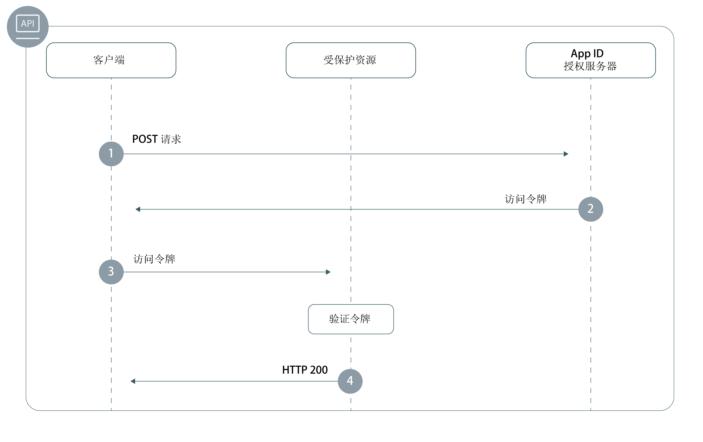

---

copyright:
  years: 2017, 2019
lastupdated: "2019-06-18"

keywords: Authentication, authorization, identity, app security, secure, backend, back-end, oauth, 

subcollection: appid

---

{:external: target="_blank" .external}
{:shortdesc: .shortdesc}
{:screen: .screen}
{:pre: .pre}
{:table: .aria-labeledby="caption"}
{:codeblock: .codeblock}
{:tip: .tip}
{:note: .note}
{:important: .important}
{:deprecated: .deprecated}
{:download: .download}
{:java: .ph data-hd-programlang='java'}
{:javascript: .ph data-hd-programlang='javascript'}
{:swift: .ph data-hd-programlang='swift'}
{:curl: .ph data-hd-programlang='curl'}

# 后端应用程序
{: #backend}

您可以使用 {{site.data.keyword.appid_full}} SDK 和 API 来保护后端应用程序端点和 API。
{: shortdesc}


## 了解流程
{: #backend-understanding}

在开发后端应用程序的过程中，有一部分工作是验证 API 是否受到保护，免受未经授权的访问。通过 {{site.data.keyword.appid_short_notm}} SDK，可以轻松保护 API 端点，并确保应用程序的安全性。


### 流程的技术基础是什么？
{: #backend-technical-flow}

{{site.data.keyword.appid_short_notm}} 实现 [OAuth 2.0](https://tools.ietf.org/html/rfc6749){: external} 和 OIDC 规范，此规范使用不记名令牌进行认证和授权。这些令牌的格式设置为 [JSON Web 令牌](https://tools.ietf.org/html/rfc7519){: external}，系统会对这些令牌进行数字签名，令牌中包含用于描述正在认证的主体以及身份提供者的声明。应用程序的 API 受访问令牌和身份令牌保护。需要访问 API 的客户端可以通过 {{site.data.keyword.appid_short_notm}} 向身份提供者进行认证，以交换这些令牌。必须验证令牌中的声明，以便授予对受保护 API 的访问权。

有关如何在 {{site.data.keyword.appid_short_notm}} 中使用令牌的更多信息，请参阅[了解令牌](/docs/services/appid?topic=appid-tokens#)。
{: tip}


### 此流程是什么样子的？
{: #backend-flow}



1. 客户端向 {{site.data.keyword.appid_short_notm}} 授权服务器发出 POST 请求，以获取访问令牌。POST 请求通常采用以下格式：

  ```
  POST/oauth/v4/{tenantId}/token HTTP/1.1
  Content_type: application/x-www-form-urlencoded
  Authorization header = "Basic" + base64encode({clientId}:{secret})
  FormData = {grant_type}
  ```
  {: screen}

2. 如果客户端符合资格要求，那么授权服务器会返回访问令牌。

3. 客户端向受保护资源发送请求。请求可以通过多种方式发送，具体取决于您使用的 HTTP 客户端库，但请求通常会采用以下格式：

  ```
  curl -H 'Authorization: Bearer {access_token}' {https://my-protected-resource.com}
  ```
  {: screen}

4. 受保护资源或 API 验证令牌。如果令牌有效，将为客户端授予对资源的访问权。如果无法验证此令牌，那么将拒绝授予访问权。


## 使用 SDK 保护资源
{: #backend-secure}

您可以使用 {{site.data.keyword.appid_short_notm}} SDK 对服务器端应用程序强制实施认证和授权。`ApiStrategy` 通过要求作为请求的一部分对访问令牌和身份令牌进行验证，从而保护后端资源。
{: shortdesc}

{{site.data.keyword.appid_short_notm}} Node.js SDK 与 [Passport 框架](http://www.passportjs.org/){: external}一起使用。
{: ph data-hd-programlang='javascript'}

{{site.data.keyword.appid_short_notm}} 服务器端 Swift SDK 提供了用于保护后端应用程序的 API 保护中间件插件。通过将 API 与中间件相关联，可以保护应用程序免受未经授权的访问。在 API 受到保护后，中间件将确保对 {{site.data.keyword.appid_short_notm}} 生成的令牌进行验证。然后，您可以根据验证结果修改 API 的行为。
{: ph data-hd-programlang='swift'}

有关如何保护 `/protectedendpoint` API 的示例，请参阅以下代码片段。
{: ph data-hd-programlang='swift'}

```Swift
import Foundation
import Kitura              // server
import Credentials         // middleware
import IBMCloudAppID       // SDK

// setup routes
let router = Router()

// mandatory option to be passed in if app not deployed on IBM Cloud
let options = [
    "oauthServerUrl": "https://us-south.appid.cloud.ibm.com/oauth/v4/d8438de6-c325-4956-ad34-abd49194affd",
]
let apiCreds = Credentials()

// Minimum macOS version required
if #available(OSX 10.12, *) {

    // setup API protection
    let apiKituraCredentialsPlugin = APIKituraCredentialsPlugin(options: options)
    apiCreds.register(plugin: apiKituraCredentialsPlugin)

    // associate route with API protection
    router.all(middleware: apiCreds)

    // create protected API
    router.get("/protectedendpoint") { request, response, next in

        response.headers["Content-Type"] = "text/html; charset=utf-8"
        do {
            if let userProfile = request.userProfile  {
                try response.status(.OK).send(
                    "<!DOCTYPE html><html><body>" +
                        "Welcome " + userProfile.displayName  +
                        "! You are logged in with " + userProfile.provider + "." +
                    "</body></html>\n\n").end()
                next()
                return
            }
            try response.status(.unauthorized).send(
                "<!DOCTYPE html><html><body>” + “You are not authorized!" +
                "</body></html>\n\n").end()
        }
        catch {}
        next()
    }

    // Start server
    Kitura.addHTTPServer(onPort: 8090, with: router)

    Kitura.run()  
}
```
{: codeblock}
{: ph data-hd-programlang='swift'}

请查看以下视频，以了解有关使用 {{site.data.keyword.appid_short_notm}} 来保护后端 Node 应用程序的信息。然后，使用[简单 Node 样本应用程序](https://github.com/ibm-cloud-security/appid-video-tutorials/tree/master/02b-simple-node-backend-app){: external}自行试用。
{: ph data-hd-programlang='javascript'}

<iframe class="embed-responsive-item" id="appid-backend-nodejs" title="关于 {{site.data.keyword.appid_short_notm}}" type="text/html" width="640" height="390" src="//www.youtube.com/embed/jJLSgkHpZwA?rel=0" frameborder="0" webkitallowfullscreen mozallowfullscreen allowfullscreen></iframe>
{: ph data-hd-programlang='javascript'}


请查看以下视频，以了解有关使用 {{site.data.keyword.appid_short_notm}} 来保护后端 Liberty for Java 应用程序的信息。然后，使用[简单 Liberty for Java 样本应用程序](https://github.com/ibm-cloud-security/appid-video-tutorials/tree/master/02d-simple-liberty-backend-app){: external}自行试用。
{: ph data-hd-programlang='java'}

<iframe class="embed-responsive-item" id="appid-backend-liberty" title="关于 {{site.data.keyword.appid_short_notm}}" type="text/html" width="640" height="390" src="//www.youtube.com/embed/QA6DY2qqLaw?rel=0" frameborder="0" webkitallowfullscreen mozallowfullscreen allowfullscreen></iframe>
{: ph data-hd-programlang='java'}


### 开始之前
{: #backend-secure-before}
{: ph data-hd-programlang='javascript'}

开始之前，必须满足以下先决条件。
{: ph data-hd-programlang='javascript'}
  * {{site.data.keyword.appid_short_notm}} 的实例。
  * NPM V4 或更高版本
  * Node V6 或更高版本
  {: ph data-hd-programlang='javascript'}

### 安装 SDK
{: #backend-secure-install}
{: ph data-hd-programlang='javascript'}

1. 将 {{site.data.keyword.appid_short_notm}} Node.js SDK 添加到应用程序的 `package.json` 文件。
{: ph data-hd-programlang='javascript'}
  ```
  "dependencies": {
      "ibmcloud-appid": "^6.0.0"
  }
  ```
  {: codeblock}
  {: ph data-hd-programlang='javascript'}

2. 运行以下命令。
{: ph data-hd-programlang='javascript'}

  ```
  npm install
  ```
  {: codeblock}
  {: ph data-hd-programlang='javascript'}

### 初始化 SDK
{: #backend-secure-initialize}
{: ph data-hd-programlang='javascript'}

1. 获取 `OAuth 服务器 URL`。
  1. 导航至 {{site.data.keyword.appid_short_notm}} 仪表板的**服务凭证**选项卡。
  2. 如果您还没有凭证集，请单击**新建凭证**，然后单击**添加**以创建新集。如果已有凭证集，请跳过此步骤。
  3. 单击**查看凭证**切换开关以查看您的信息。
  4. 复制 `OAuth 服务器 URL` 以在下一步中使用。
  {: ph data-hd-programlang='javascript'}

2. 初始化 {{site.data.keyword.appid_short_notm}} passport 策略，如以下示例所示。
{: ph data-hd-programlang='javascript'}
  ```javascript
  var express = require('express'); 
  var passport = require('passport');
  var APIStrategy = require('ibmcloud-appid').APIStrategy; 
  passport.use(new APIStrategy({ oauthServerUrl: "{oauth-server-url}" })); 
  var app = express();
  app.use(passport.initialize());
  ```
  {: codeblock}
  {: ph data-hd-programlang='javascript'}


如果 Node.js 应用程序在 {{site.data.keyword.cloud_notm}} 上运行并与 {{site.data.keyword.appid_short_notm}} 的实例绑定，那么无需提供 API 策略配置。{{site.data.keyword.appid_short_notm}} 配置会使用 VCAP_SERVICES 环境变量来获取信息。
{: tip}
{: ph data-hd-programlang='javascript'}


### 保护 API
{: #backend-secure-api-strategy}
{: ph data-hd-programlang='javascript'}

以下片段演示了如何在 Express 应用程序中使用 `ApiStrategy` 来保护 `/protected` GET API。
{: ph data-hd-programlang='javascript'}

  ```javascript
   app.get('/protected', passport.authenticate('APIStrategy.STRATEGY_NAME', { session: false }), function(request, response){
      console.log("Security context", request.appIdAuthorizationContext);
      response.send(200, "Success!");
      }
   );
   ```
  {: codeblock}
  {: ph data-hd-programlang='javascript'}

令牌有效时，将调用请求链中的下一个中间件，并将 `appIdAuthorizationContext` 属性添加到请求对象。此属性包含原始访问令牌和身份令牌，以及相应令牌的已解码有效内容信息。
{: ph data-hd-programlang='javascript'}


## 手动保护资源
{: #backend-secure-api}

要保护后端应用程序和受保护资源，您需要验证令牌。当客户端向资源发送请求时，您可以验证令牌是否符合定义的规范。令牌可能包含标识信息、作用域或您已实施的其他任何配置。可以通过多种方式来验证 {{site.data.keyword.appid_short_notm}} 的访问令牌和身份令牌。要获取帮助，请查看[验证令牌](/docs/services/appid?topic=appid-token-validation)。


## 后续步骤
{: #backend-next}

在应用程序中安装 {{site.data.keyword.appid_short_notm}} 后，您几乎已准备好开始对用户进行认证！接着请尝试执行以下其中一个活动：


* 配置[身份提供者](/docs/services/appid?topic=appid-social)。
* 定制并配置[登录窗口小部件](/docs/services/appid?topic=appid-login-widget)
* 了解有关 [Node.js SDK](https://github.com/ibm-cloud-security/appid-serversdk-nodejs){: external} 的更多信息
* 了解有关 [Swift SDK](https://github.com/ibm-cloud-security/appid-serversdk-swift){: external} 的更多信息


