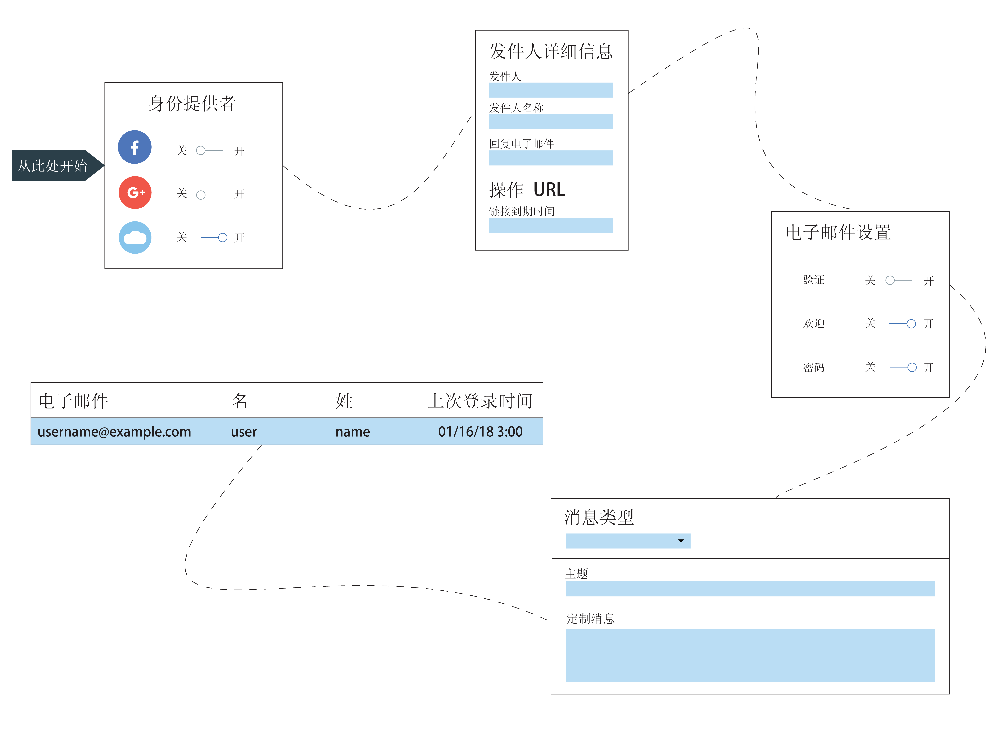

---

copyright:
  years: 2017, 2018
lastupdated: "2018-12-19"

---

{:new_window: target="_blank"}
{:shortdesc: .shortdesc}
{:screen: .screen}
{:codeblock: .codeblock}
{:pre: .pre}
{:tip: .tip}

# Cloud Directory
{: #cd}

通过 {{site.data.keyword.appid_full}}，用户可以使用电子邮件或用户名和密码注册并登录到移动应用程序和 Web 应用程序。Cloud Directory 是在云中维护的用户注册表。当用户注册应用程序时，会将其添加到您的用户目录中。利用此功能，用户可以在应用程序中自由管理自己的帐户。
{: shortdesc}

</br>

## 管理目录设置
{: #cd-settings}

您可以配置通知以及用户对应用程序的控制级别。按照下图所示，可以快速完成 Cloud Directory 的设置。随时可以从服务仪表板更新这些设置。
{: shortdesc}



图. Cloud Directory 的配置过程

1. 在 {{site.data.keyword.appid_short_notm}} 仪表板的**管理**选项卡上，确保将 Cloud Directory 设置为**开启**。

2. 配置常规设置。
  1. 决定您希望用户在登录时是创建用户名还是使用其电子邮件。这两个选项都需要密码。将用户添加到目录后，就无法再在选项之间切换。
  2. 单击密码条件行中的**编辑**以指定要落实的任何需求。密码条件以正则表达式提供。有关确定强度的帮助或要查看常用示例，请参阅[管理密码强度](#strength)。单击**保存**以落实需求。
  3. 将**允许用户向应用程序注册**设置为**是**。如果此项设置为**否**，您仍可以通过控制台来添加用户。但是，通过控制台来添加用户只应针对开发目的。
  4. 如果您希望用户能够重置其密码、更改其密码或重置其详细信息，请将**允许用户通过应用程序管理自己的帐户**设置为**是**。如果要限制用户自助服务，请将此值设置为**否**。
  5. 单击**发件人详细信息**行中的**编辑**以更新电子邮件设置。电子邮件设置会应用于通过 {{site.data.keyword.appid_short_notm}} 发送的所有通信。指定应发送电子邮件的电子邮件地址及其姓名，并留下一封单独的电子邮件供用户发送响应。
  6. 启用**高级密码策略**以创建密码的限制和时间需求。此功能需要另外计费。有关选项的更多信息，请参阅[高级密码策略](#advanced-password)。
  6. 单击**保存**。

3. 配置验证电子邮件设置。
  1. 要让用户验证其电子邮件地址，请将**电子邮件验证**设置为**开启**。用户向应用程序注册时，会收到一封电子邮件，要求他们确认自己已向该应用程序注册。
  2. 如果您已决定希望用户验证其电子邮件，那么接下来您要决定是否允许用户在验证其电子邮件地址之前登录到应用程序。根据您的首选项，将**允许用户在未先验证其电子邮件地址的情况下登录到应用程序**设置为**是**或**否**。
  3. 定制消息内容并设计消息的外观。有一个消息模板，但您可以使用自己的消息来更新文本。可以使用除英语之外的[语言](/docs/services/appid/cloud-directory.html#languages)，但文本的翻译由您负责。要选择其他语言，请使用<a href="https://appid-management.ng.bluemix.net/swagger-ui/#!/Config/updateLocalization" target="_blank">语言管理 API </a>。
  4. 向验证 URL 提供到期时间限制（以分钟为单位指定）。如果在此处设置了此时间，还会影响重置密码链接的有效时间长度。
  5. 如果您希望用户在单击链接时看到特定页面，请输入您自己的验证页面 URL。如果使**定制验证页面 URL** 字段保留为空白，那么 {{site.data.keyword.appid_short_notm}} 会提供缺省验证页面。
  6. 单击**保存**。

4. 配置欢迎电子邮件设置。
  1. 要在用户向应用程序注册时通过电子邮件欢迎用户，请将**欢迎电子邮件**设置为**开启**。
  2. 定制消息内容并设计消息的外观。有一个示例消息可以使用，但您可以使用自己的消息来更新文本。可以使用除英语之外的[语言](#languages)，但文本的翻译由您负责。要选择其他语言，请使用<a href="https://appid-management.ng.bluemix.net/swagger-ui/#!/Config/updateLocalization" target="_blank">语言管理 API </a>。
  3. 单击**保存**。

5. 配置密码重置设置。
  1. 要允许用户请求重置其密码，请将**忘记密码电子邮件**设置为**开启**。**注**：用户必须已验证其电子邮件，然后才能重置其密码。这意味着您必须要求电子邮件验证以允许密码重置。
  2. 定制消息内容并设计消息的外观。有一个示例消息可以使用，但您可以使用自己的消息来更新文本。可以使用除英语之外的[语言](#languages)，但文本的翻译由您负责。要选择其他语言，请使用<a href="https://appid-management.ng.bluemix.net/swagger-ui/#!/Config/updateLocalization" target="_blank">语言管理 API </a>。
  3. 向重置密码 URL 提供到期时间限制（以分钟为单位指定）。如果在此处设置了此时间，还会影响电子邮件验证链接的有效时间长度。
  4. 如果您希望用户在单击链接时看到特定页面，请输入您自己的密码重置 URL。如果使**重置密码页面 URL** 字段保留为空白，那么 {{site.data.keyword.appid_short_notm}} 会提供缺省重置密码页面。
  5. 单击**保存**。

6. 配置更改密码设置。
  1. 要通知用户对密码所做的任何更改，请将**密码已更改电子邮件**设置为**开启**。
  2. 定制消息内容并设计消息的外观。有一个示例消息可以使用，但您可以使用自己的消息来更新文本。可以使用除英语之外的[语言](#languages)，但文本的翻译由您负责。要选择其他语言，请使用<a href="https://appid-management.ng.bluemix.net/swagger-ui/#!/Config/updateLocalization" target="_blank">语言管理 API </a>。
  3. 单击**保存**。

7. 配置多因子认证。
  1. 如果需要用户登录时进行多因子认证，请将**启用电子邮件多因子认证**设置为**开启**。
  2. 使用下面的模板来定制电子邮件的内容和设计。可以使用除英语之外的[语言](#languages)，但文本的翻译由您负责。要选择其他语言，请使用<a href="https://appid-management.ng.bluemix.net/swagger-ui/#!/Config/updateLocalization" target="_blank">语言管理 API </a>。
  3. 单击**保存**。

8. 在**用户**选项卡中，可以看到哪些用户已向应用程序注册。注：60 秒内单个用户最多可尝试登录 5 次。如果进行了第六次尝试，那么将显示错误。


</br>
</br>

## 消息的类型
{: #types}

您可以向用户发送多种类型的消息。您可以选择发送服务提供的示例消息，也可以定制内容以实现更为个性化的应用程序体验。{{site.data.keyword.appid_short_notm}} 使用 <a href="https://www.sendgrid.com" target="_blank">SendGrid </a> 作为邮件传递服务。所有电子邮件都会使用单个 SendGrid 帐户发送。
{: shortdesc}

如果用户未提供参数拉出的信息，那么会显示为空。
{: tip}

<dl>
  <dt>欢迎</dt>
    <dd><p>在用户注册后，您可以通过电子邮件欢迎用户使用您的应用程序。要欢迎用户加入并留住用户，尽可能让消息充满吸引力。</p>
    <table>
      <thead>
        <th colspan=2> 所有消息参数</th>
      </thead>
      <tbody>
        <tr>
          <td><code>%{display.logo}</code></td>
          <td> 显示为登录窗口小部件配置的图像。</td>
        </tr>
        <tr>
          <td><code>%{user.displayName}</code></td>
          <td> 显示用户所选的在与应用程序交互时要使用的屏幕名称。</td>
        </tr>
        <tr>
          <td><code>%{user.email}</code></td>
          <td> 显示用户的注册电子邮件地址。</td>
        </tr>
        <tr>
          <td><code>%{user.username}</code></td>
          <td> 当认证方法设置为用户名和密码时，显示用户指定的用户名。</td>
        </tr>
        <tr>
          <td><code>%{user.firstName}</code></td>
          <td> 显示用户的指定名字。</td>
        </tr>
        <tr>
          <td><code>%{user.formattedName}</code></td>
          <td> 显示用户的全名。</td>
        </tr>
        <tr>
          <td><code>%{user.lastName}</code></td>
          <td> 显示用户的指定姓氏。</td>
        </tr>
      </tbody>
    </table></dd>
  <dt>忘记密码</dt>
    <dd><p>用户在忘记密码或出于任何原因需要更新密码时，可要求重置密码。您可以定制对这些请求的电子邮件响应。当用户请求更改时，在他们单击此电子邮件中的链接之前，其密码仍保持未更改状态。 </p>
    <table>
      <tr>
        <th colspan=2> 忘记密码参数</th>
      </tr>
      <tr>
        <td><code>%{linkExpiration.hours}</code></td>
        <td> 显示链接保持有效的小时数。</td>
      </tr>
      <tr>
        <td><code>%{linkExpiration.minutes}</code></td>
        <td>显示链接保持有效的分钟数。</td>
      </tr>
      <tr>
        <td><code>%{resetPassword.code}</code></td>
        <td> 在 URL 中，显示一次性密码作为其中一部分。这意味着每个人都会收到不同的代码。示例：<code>https://appid.cloud.ibm.com/wfm/verify/6574839563478</code></td>
      </tr>
      <tr>
        <td><code>%{resetPassword.link}</code></td>
        <td> 显示用户单击以重置密码的链接。</td>
      </tr>
     </tbody>
  </table></dd>
  <dt>验证</dt>
    <dd><p>您可以请求用户通过电子邮件验证其帐户。通过请求验证，您可以限制可注册应用程序的伪帐户数。您可以限制为当用户已验证电子邮件后才可访问应用程序，或用于管理您将为哪些用户创建概要文件。请注意，通过 {{site.data.keyword.appid_short_notm}} 仪表板或创建用户 API 手动添加的用户不会自动收到此电子邮件。</p>
    <table>
      <thead>
        <th colspan=2> 验证消息参数</th>
      </thead>
      <tbody>
        <tr>
          <td><code>%{linkExpiration.hours}</code></td>
          <td> 显示链接保持有效的时数。</td>
        </tr>
        <tr>
          <td><code>%{linkExpiration.minutes}</code></td>
          <td> 显示链接保持有效的分钟数。</td>
        </tr>
        <tr>
          <td><code>%{verify.code}</code></td>
          <td> 显示一次性验证 URL。</td>
        </tr>
        <tr>
          <td><code>%{verify.link}</code></td>
          <td> 显示在设置中指定的操作 URL。</td>
        </tr>
      </tbody>
    </table></dd>
  <dt>密码更改</dt>
    <dd><p>您可以在用户密码进行更新后告知用户。在用户并未请求更改密码时，该功能很有用。他们可以采取适当步骤来重新保护帐户的安全。</p>
    <table>
      <thead>
        <th colspan=2> 密码更改参数</th>
      </thead>
      <tbody>
        <tr>
          <td><code>%{passwordChangeInfo.time}</code></td>
          <td> 显示新密码生效的时间。</td>
        </tr>
        <tr>
          <td><code>%{passwordChangeInfo.ipAddress}</code></td>
          <td> 显示请求更改密码的 IP 地址。</td>
        </tr>
      </tbody>
    </table></dd>
    </dd>
    <dt>MFA 验证码</dt>
      <dd><p>如果启用了多因子认证，那么用户可以接收质询代码作为辅助认证方法。</p>
      <table>
        <thead>
          <th colspan=2> 所有消息参数</th>
        </thead>
        <tbody>
          <tr>
            <td><code>%{mfa.code}</code></td>
            <td> 显示一次性 MFA 验证码。</td>
          </tr>
        </tbody>
      </table></dd></dl>

</br>
</br>

## 管理密码强度
{: #strength}

您可以为要用于 Cloud Directory 的密码设置需求。
{: shortdesc}

如果密码强度高，就难以甚至不可能通过手动或自动方式来猜到密码。密码强度设置为正则表达式字符串。

一些常用的密码强度示例：

- 必须至少为 8 个字符。示例正则表达式：`^.{8,}$`
- 必须包含一个数字、一个小写字母和一个大写字母。示例正则表达式：`^(?:(?=.*\d)(?=.*[a-z])(?=.*[A-Z]).*)$`
- 必须仅包含英语字母和数字。示例正则表达式：`^[A-Za-z0-9]*$`
- 必须至少为一个唯一字符。示例正则表达式：`^(\w)\w*?(?!\1)\w+$`

可以在 App ID 控制台的“Cloud Directory 设置”页面中或者使用<a href="https://appid-management.ng.bluemix.net/swagger-ui/#!/Config/set_cloud_directory_password_regex" target="_blank">管理 API </a> 来设置密码强度。

</br>


## 高级密码策略
{: #advanced-password}


您可以通过强制实施其他密码约束来增强应用程序的安全性。
{: shortdesc}


高级密码策略包含 5 个功能，每个功能可单独进行切换。

 - 重复提供错误的凭证后锁定
 - 避免密码复用
 - 密码到期时间
 - 密码更改最短间隔时间
 - 确保密码不包含用户名


 如果启用此功能，那么将激活对高级安全功能的额外计费。有关更多信息，请参阅[定价计算器](faq.html#pricing)。

</br>

### 避免密码复用
{: #avoid-reuse}

用户更改其密码时，您可能希望阻止他们选择最近使用过的密码。
{: shortdesc}

通过使用 GUI 或 API，可以选择用户必须使用了多少个新密码之后才能重复使用先前用过的密码。可以选择 1 到 10 之间的任何整数值。

如果此选项已开启，并且某个用户尝试将其密码设置为自己最近使用过的密码，那么会在缺省登录窗口小部件 UI 中向该用户显示错误，并提示该用户输入其他密码。

先前的密码会以用户当前密码的存储方式安全地存储。

</br>

### 重复提供错误的凭证后锁定
{: #lockout}

您可能希望在检测到可疑行为（例如，尝试使用不正确的密码多次连续登录）时暂时阻止登录能力，从而保护用户的帐户。此度量可以帮助阻止恶意方通过猜测用户密码来获得对用户帐户的访问权。
{: shortdesc}

通过使用 GUI 或 API，可以设置用户在最多尝试登录失败多少次后，其帐户会暂时锁定。您还可以设置帐户锁定的时间长度。可以选择以下选项：

* 尝试次数：1 到 10 之间的任何整数值。
* 锁定期：1 分钟到 24 小时之间的任何整数值（以分钟为单位指定）。

如果帐户已锁定，那么用户无法登录，也无法执行其他任何自助服务操作（例如，更改其密码），直到指定的锁定期过后才行。锁定期结束后，将对用户自动解锁。

您可以在锁定期结束之前对用户解锁。要查看用户是否被锁定，请查看 `active` 字段是否设置为 `false`。还可以检查服务仪表板的**用户**选项卡上用户的状态是否设置为`已禁用`。要对用户解锁，您必须使用 [API](https://appid-management.ng.bluemix.net/swagger-ui/#!/Cloud_Directory_Users/updateCloudDirectoryUser) 将 `active` 字段设置为 `true`。

</br>

### 密码更改最短间隔时间
{: #minimum-time}

您可能希望通过设置用户更改密码时必须等待的最短间隔时间段，以阻止用户快速切换密码。
{: shortdesc}

此功能与“避免密码复用”策略一起使用时特别有用。如果不使用此限制，用户就可以快速连续地多次更改其密码，从而绕过对复用最近用过密码的限制。可以选择 1 小时到 30 天之间的任何值（以小时为单位指定）。

</br>

### 密码到期时间
{: #expiration}

出于安全原因，您可能希望强制实施密码轮换策略，以便用户在一段时间后必须更改其密码。
{: shortdesc}

通过使用 GUI 或 API，可以设置用户密码保持有效的时间段。用户密码到期后，将强制用户在下一次登录时重置其密码。可以选择 1 到 90 天之间的任意整数。

服务提供了缺省 GUI 和使用登录窗口小部件的现成体验。系统会指示用户提供新密码，然后才能完成登录。

如果使用的是定制登录体验，那么用户尝试使用到期的密码登录时会触发错误。配置应用程序以提供必要的用户体验是您的责任。您可以调用更改密码 API 来设置新密码。

令牌端点响应类似于以下内容：

```javascript
{
  "error" : "invalid_grant",
  "error_description" : "Password expired",
  "user_id" : "356e065e-49da-45f6-afa3-091a7b464f51"
}
```
{: screen}

此选项第一次设置为“开启”时，任何现有用户密码都没有到期日期。到期时间段从这些用户更改其密码之日开始计算。您可能希望通过将此功能设置为“开启”，鼓励用户更新其密码。
{: note}

</br>

### 确保密码不包含用户名
{: #no-username}

为了获得更高强度的密码，您可能希望阻止用户在密码中包含其用户名或其电子邮件地址的第一部分。
{: shortdesc}

此约束不区分大小写，这意味着用户无法通过变更其中部分或全部字符的大小写来使用个人信息。要配置此选项，请将开关切换为**开启**。

</br>

## 使用定制电子邮件发件人
{: #custom-email}

通过 {{site.data.keyword.appid_short_notm}}，可以定义定制扩展点，以发送 Cloud Directory 电子邮件消息。通过定义扩展点，您可以全面控制电子邮件发送方式，并且可以使用您自己的域名。
 {: shortdesc}

**为什么要使用定制电子邮件发件人？**

缺省情况下，{{site.data.keyword.appid_short_notm}} 使用 SendGrid 来代表您传递消息。通过配置您自己的定制电子邮件发件人，可以进一步增强应用程序用户的品牌体验。

下面是更具体的示例：
- **个性化域**
通过配置定制电子邮件分派器，可以全面控制电子邮件发送方式。这包括定制电子邮件域，通过定制，可进一步降低电子邮件被当成垃圾邮件过滤掉的机率。
- **洞察和故障诊断**
从电子邮件提供者那里获取洞察，例如：打开电子邮件的人数或哪些消息未传递。由于您可以跟踪各个消息，并且可以查看总体统计信息，因此这可以帮助解决问题。

</br>

**它如何运作？**

配置了扩展点之后，每当需要发送电子邮件时，{{site.data.keyword.appid_short_notm}} 都会调用该扩展点。此扩展点包含有关消息的所有信息，包括电子邮件正文的最终内容。

</br>

**创建定制电子邮件发件人：**

1. 要配置 {{site.data.keyword.appid_short_notm}} 实例以使用定制分派器，请使用<a href="https://appid-management.ng.bluemix.net/swagger-ui/#!/Config/set_cloud_directory_email_dispatcher" target="_blank">管理 API</a>。</br>
您必须提供 URL。此外，还可以提供授权信息。支持的授权类型为：`基本授权`或`常量授权头值`。

  有效配置示例：
  ```
  {
    "custom": {
      "url": "https://example.com/send_mail"
    }
  }
  ```
  {: screen}

  ```
  {
    "custom": {
      "url": "https://example.com/send_mail",
      "authorization": {
        "type": "basic",
        "username": "username",
        "password": "password"
      }
    }
  }
  ```
  {: screen}

  ```
  {
    "custom": {
      "url": "https://example.com/send_mail",
      "authorization": {
        "type": "value",
        "value": "myApiKey"
      }
    }
  }
  ```
  {: screen}

2. 配置可以侦听发布请求的扩展点。此端点应能够读取来自 {{site.data.keyword.appid_short_notm}} 的有效内容，并通过定制电子邮件发件人发送电子邮件。

3. 从 {{site.data.keyword.appid_short_notm}} 发送的主体采用以下格式：`{"jws": "jws-format-string"}`。</br> 解码并验证有效内容后，内容为 JSON 字符串。</br>
  ```
    {
      "tenant": "tenant-id",
      "iss" : "appid-oauth.ng.bluemix.net",
      "iat": 1539173126,
      "jti": "uniq-id",
      "message": {
          "to": "your@mail.com",
          "from": {
              "name": "My Awesome Service",
              "address": "no-reply@company.com"
          },
          "replyTo": {
              "name": "My Awesome Service",
              "address": "yes-reply@company.com"
          },
          "subject": "Welcome to My Awesome Service",
          "body": "<p>Hello<p><br/><p>Thanks for signing up John Doe</p>"
      }
    }
  ```
  {: screen}

  - tenant：App ID 实例 tenantId
  - iat：发送消息时的时间戳记
  - iss：标识发出 JWS 的主体
  - jti：唯一事务标识
  - message：要发送的消息，包含以下字段：
    - to：收件人电子邮件地址
    - from：发件人信息，包含以下字段：
      - name：可选，发件人姓名
      - address：发件人地址
    - reply to：可选，包含以下字段：
      - name：可选，发件人姓名
      - address：可选，发件人地址
    - subject：电子邮件主题
    - body：电子邮件正文（HTML 格式）

  可以通过检查响应状态码来验证请求是否成功。范围在 200 - 299 内的任何状态码都视为成功。如果收到其他任何响应，请重试发出请求。
  {: tip}

4. 对于从 {{site.data.keyword.appid_short_notm}} 发送的每个 HTTP 有效内容，都会使用非对称密钥对根据 JWS 标准自动对其签名。对于每个 {{site.data.keyword.appid_short_notm}} 实例，会生成不在其他实例中共享的专用密钥和公用密钥。专用密钥用于对 HTTP 有效内容签名，并且可以使用公用密钥来验证有效内容是否由 {{site.data.keyword.appid_short_notm}} 生成，并且未被第三方<a href="https://us-south.appid.cloud.ibm.com/swagger-ui/#!/Authorization_Server_V3/publicKeys" target="_blank">公用密钥端点</a>变更。

5. 扩展点的示例代码 (JavaScript)
  ```
  const sgMail = require('@sendgrid/mail');
  const {promisify} = require('bluebird');
  const request = promisify(require('request'));
  const jwtVerify = promisify(require('jsonwebtoken').verify);
  const jwtDecode = require('jsonwebtoken').decode;
  const jwkToPem = require('jwk-to-pem');

  async function obtainPublicKeys() {
  	// Your App ID instance tenant ID
  	const tenantId = '<TENANT-ID>';

  	// Send request to App ID's public keys endpoint
  	const keysOptions = {
  		method: 'GET',
  		url: `https://appid-oauth.<REGION>.bluemix.net/oauth/v3/${tenantId}/publickeys`
  	};
  	const keysResponse = await request(keysOptions);
  	return JSON.parse(keysResponse.body).keys;
  }

  async function verifySignature(keysArray, kid, jws) {
  	const keyJson = keysArray.find(key => key.kid === kid);
  	if (keyJson) {
  		const pem = jwkToPem(keyJson);
  		await jwtVerify(jws, pem);
  		return;
  	}
  	throw new Error ("Unable to verify signature");
  }

  async function verifyAndSendMail(jws) {
  	// The API key for Sendgrid
  	const sgApiKey = '<SENDGRID-API-KEY>';

  	// Init Sendgrind
  	sgMail.setApiKey(sgApiKey);

  	// Decode message to get information
  	const data = jwtDecode(jws, {complete: true});

  	// Extract kid from header
  	const kid = data.header.kid;

  	const keysArray = await obtainPublicKeys();

  	// Verify the signature of the payload with the public keys
  	await verifySignature(keysArray, kid ,jws);

  	// Send the email with Your Sendgrid account
  	const message = data.payload.message;
  	const msg = {
  		to: message.to,
  		from: message.from.address,
  		subject: message.subject,
  		html: message.body,
  	};
  	console.log(`Sending email to ${message.to}`);
  	let sendgridResponse = await sgMail.send(msg);

  	return {result : 'email_sent',sendgridResponse};
  }
  ```
  {: codeblock}

6. 通过测试电子邮件分派器来验证配置是否已正确设置。使用<a href="https://appid-management.ng.bluemix.net/swagger-ui/#!/Config/post_email_dispatcher_test" target="_blank">测试 API</a> 可触发对已配置的定制电子邮件发件人的请求。

有关完整的有效示例，请参阅 <a href="https://www.ibm.com/blogs/bluemix/2018/10/use-ibm-cloud-app-id-and-your-email-provider-to-brand-mails-sent-to-app-users/" target="_blank">Use your own provider for mail sent with {{site.data.keyword.appid_full}}</a>。

</br>
</br>


## 迁移用户
{: #user-migration}

有时，您可能需要设置 {{site.data.keyword.appid_short_notm}} 的新实例。如果您使用的是 Cloud Directory，那么这意味着您的用户必须迁移到新实例。您可以使用管理 API 来帮助进行迁移。
{: shortdesc}

### 开始之前

您必须分配有对 {{site.data.keyword.appid_short_notm}} 的两个实例的`管理者` [IAM 角色](/docs/iam/quickstart.html)。

</br>

**导出**

您需要从当前实例中导出用户后，才能将这些用户添加到新实例。为此，您可以使用<a href="https://appid-management.ng.bluemix.net/swagger-ui/#!/Cloud_Directory_Users/cloudDirectoryExport" target="_blank">导出管理 API </a>。

示例 cURL 命令：

```
curl -X GET --header ‘Accept: application/json’ --header ‘Authorization: Bearer <iam-token>’ ’https://eu-gb.appid.cloud.ibm.com/management/v4/111c9bj3-xxxx-4b5b-zzzz-24ad9440k8j9/cloud_directory/export?encryption_secret=myCoolSecret'
```
{: codeblock}

<table>
  <tr>
    <th>变量 </th>
    <th>描述</th>
  </tr>
  <tr>
    <td><code>encryption_secret</code></td>
    <td>用于加密和解密用户散列密码的定制字符串。</td>
  </tr>
  <tr>
    <td><code>tenantID</code></td>
    <td>可以在服务凭证中找到的服务租户标识。您可以在 App ID 仪表板中找到服务凭证。</td>
  </tr>
</table>

仅会返回 Cloud Directory 用户及其概要文件。不会返回其他身份提供者中的用户。
{: note}

</br>

**导入**

既然您已准备好用户，现在可以将其信息导入到新实例中。为此，您可以使用<a href="https://appid-management.ng.bluemix.net/swagger-ui/#!/Cloud_Directory_Users/cloudDirectoryImport" target="_blank">导入管理 API </a>。

示例 cURL 命令：

```
curl -X POST --header ‘Content-Type: application/json’ --header ‘Accept: application/json’ --header ‘Authorization: Bearer <iam-token>’ -d ‘{“users”: [
    {
      “scimUser”: {
        “originalId”: “3f3f6779-7978-4383-926f-a43aef3b724b”,
        “name”: {
          “givenName”: “<first-name>”,
          “familyName”: “<last-name>”,
          “formatted”: “<first-name> <last-name>”
        },
        “displayName”: “<first-name>”,
        “emails”: [
          {
            “value”: “<user>@gmail.com”,
            “primary”: true
          }
        ],
        “status”: “PENDING”
      },
      “passwordHash”: “<password hash here>“,
      “passwordHashAlg”: “<password hash algorithm>",
      “profile”: {
        “attributes”: {}
      }
    }
]}’ ‘https://eu-gb.appid.cloud.ibm.com/management/v4/111c9bj3-xxxx-4b5b-zzzz-24ad9440k8j9/cloud_directory/import?encryption_secret=myCoolSecret’
```
{: codeblock}

</br>

### 使用迁移脚本

{{site.data.keyword.appid_short_notm}} 提供了可通过 CLI 使用的迁移脚本，可帮助加速迁移过程。

开始之前，请确保您具有以下参数信息：

<table>
  <tr>
    <th>参数</th>
    <th>描述</th>
  </tr>
  <tr>
    <td><code>sourceTenantId</code></td>
    <td>计划从中导出用户的 {{site.data.keyword.appid_short_notm}} 实例的租户标识。</td>
  </tr>
  <tr>
    <td><code>destinationTenantId</code></td>
    <td>计划将用户导入其中的 {{site.data.keyword.appid_short_notm}} 实例的租户标识。</td>
  </tr>
  <tr>
    <td>区域</td>
    <td>当前选项包括：美国南部 (<code>ng</code>)、伦敦 (<code>eu-gb</code>)、悉尼 (<code>au-syd</code>)、华盛顿 (<code>us-east</code>) 和德国 (<code>eu-de</code>)。</td>
  </tr>
  <tr>
    <td>IAM 令牌</td>
    <td>在获取 IAM 令牌之前，请确保您具有<code>管理者</code>许可权。有关获取 IAM 令牌的帮助，请查看<a href="https://console.bluemix.net/docs/iam/apikey_iamtoken.html#iamtoken_from_apikey" target="_blank">文档 </a>。</td>
  </tr>
</table>

要运行脚本，请执行以下操作：

1. 克隆<a href="https://github.com/ibm-cloud-security/appid-sample-code-snippets/tree/master/export-import-cloud-directory-users" target="_blank">存储库 </a>。
2. 打开终端，并浏览到在其中克隆了存储库的文件夹。
3. 运行以下命令。

  ```
  npm install
  ```
  {: codeblock}

4. 使用您的参数运行以下命令：

  ```
  users_export_import 'sourceTenantId' 'destinationTenantId' 'region' 'iamToken'
  ```
  {: codeblock}

  示例命令：

  ```
  users_export_import e00a0366-53c5-4fcf-8fef-ab3e66b2ced8 73321c2b-d35a-497a-9845-15c580fdf58c ng eyJraWQiOiIyMDE3MTAyNS0xNjoyNzoxMCIsImFsZyI6IlJTMjU2In0.eyJpYW1faWQiOiJJQk1pZC0zMTAwMDBUNkZTIiwiaWQiOiJJQk1pZC0zMTAwMDBUNkZTIiwicmVhbG1pZCI6IklCTWlkIiwiaWRlbnRpZmllciI6IjMxMDAwMFQ2RlMiLCJnaXZlbl9uYW1lIjoiUm90ZW0iLCJmYW1pbHlfbmFtZSI6IkJyb3NoIiwibmFtZSI6IlJvdGVtIEJyb3NoIiwiZW1haWwiOiJyb3RlbWJyQGlsLmlibS5jb20iLCJzdWIiOiJyb3RlbWJyQGlsLmlibS5jb20iLCJhY2NvdW50Ijp7ImJzcyI6ImQ3OWM5YTk5NjJkYzc2Y2JkMDZlYTVhNzhjMjY0YzE5In0sImlhdCI6MTUzNzE3Mjg4NCwiZXhwIjoxNTM3MTc2NDg0LCJpc3MiOiJodHRwczovL2lhbS5zdGFnZTEuYmx1ZW1peC5uZXQvaWRlbnRpdHkiLCJncmFudF90eXBlIjoidXJuOmlibTpwYXJhbXM6b2F1dGg6Z3JhbnQtdHlwZTpwYXNzY29kZSIsInNjb3BlIjoiaWJtIG9wZW5pZCIsImNsaWVudF9pZCI6ImJ4IiwiYWNyIjoxLCJhbXIiOlsicHdkIl19.c4vLPzhvvNZLjaLy7znDa37qV4o-yuGmSKmJoQKrEQNZU8IC0NIjxwSo7W9kb0pDi3Yf_03_9ufTTGNfjtltzNWycSXjkNgoL-b9_nU61oHdgn0stY1KmNicqyBWfgUU--4xa904QN_QjRHBaUBeJf3XWEphPIMoF7mZeOxEZLnCMcQXSz9pImCMiP4SNT38cHLiI90Yx01rM7hpteepWULh5MYh-B2V03Gkgxfqvv951HF1LDg6eT4Q9in11laTQKtKuomripUju_4GIIjORVYw9NaAVKIJ9lKrPX0SKPhStsa59qGsC_7Uersms5EY1W1VbZVqOZPJbtp6tVf-Lw
  ```
  {: codeblock}

</br>
</br>


## 支持的语言
{: #languages}

您可以使用<a href="https://appid-management.ng.bluemix.net/swagger-ui/#!/Config/updateLocalization" target="_blank">语言管理 API </a>来设置可编写用户通信的语言。但是，仅英语开箱即用。您负责翻译消息。在使用 API 设置配置后，GUI 将更新，从而使您能够更改模板文本。
{: shortdesc}

<table>
  <col width="20%">
  <col width="25%">
  <col width="35%">
  <tr>
    <th>代码</th>
    <th>语言</th>
    <th>区域</th>
  </tr>
  <tr>
    <td><code>af-ZA</code></td>
    <td>南非荷兰语</td>
    <td>南非</td>
  </tr>
  <tr>
    <td><code>sq-AL</code></td>
    <td>阿尔巴尼亚语</td>
    <td>阿尔巴尼亚</td>
  </tr>
  <tr>
    <td><code>am-ET</code></td>
    <td>阿姆哈拉语</td>
    <td>埃塞俄比亚</td>
  </tr>
  <tr>
    <td><code>ar-DZ</code></td>
    <td>阿拉伯语</td>
    <td>阿尔及利亚</td>
  </tr>
  <tr>
    <td><code>ar-BH</code></td>
    <td>阿拉伯语</td>
    <td>巴林</td>
  </tr>
  <tr>
    <td><code>ar-EG</code></td>
    <td>阿拉伯语</td>
    <td>埃及</td>
  </tr>
  <tr>
    <td><code>ar-IQ</code></td>
    <td>阿拉伯语</td>
    <td>伊拉克</td>
  </tr>
  <tr>
    <td><code>ar-JO</code></td>
    <td>阿拉伯语</td>
    <td>约旦</td>
  </tr>
  <tr>
    <td><code>ar-KW</code></td>
    <td>阿拉伯语</td>
    <td>科威特</td>
  </tr>
  <tr>
    <td><code>ar-LB</code></td>
    <td>阿拉伯语</td>
    <td>黎巴嫩</td>
  </tr>
  <tr>
    <td><code>ar-LY</code></td>
    <td>阿拉伯语</td>
    <td>利比亚</td>
  </tr>
  <tr>
    <td><code>ar-MR</code></td>
    <td>阿拉伯语</td>
    <td>毛里塔尼亚</td>
  </tr>
  <tr>
    <td><code>ar-MA</code></td>
    <td>阿拉伯语</td>
    <td>摩洛哥</td>
  </tr>
  <tr>
    <td><code>ar-OM</code></td>
    <td>阿拉伯语</td>
    <td>阿曼</td>
  </tr>
  <tr>
    <td><code>ar-QA</code></td>
    <td>阿拉伯语</td>
    <td>卡塔尔</td>
  </tr>
  <tr>
    <td><code>ar-SA</code></td>
    <td>阿拉伯语</td>
    <td>沙特阿拉伯</td>
  </tr>
  <tr>
    <td><code>ar-SY</code></td>
    <td>阿拉伯语</td>
    <td>叙利亚</td>
  </tr>
  <tr>
    <td><code>ar-YE</code></td>
    <td>阿拉伯语</td>
    <td>突尼斯</td>
  </tr>
  <tr>
    <td><code>ar-AE</code></td>
    <td>阿拉伯语</td>
    <td>阿拉伯联合酋长国</td>
  </tr>
  <tr>
    <td><code>ar-YE</code></td>
    <td>阿拉伯语</td>
    <td>也门</td>
  </tr>
  <tr>
    <td><code>hy-AM</code></td>
    <td>亚美尼亚语</td>
    <td>亚美尼亚</td>
  </tr>
  <tr>
    <td><code>as-IN</code></td>
    <td>阿萨姆语</td>
    <td>印度</td>
  </tr>
  <tr>
    <td><code>az-AZ</code></td>
    <td>阿塞拜疆语</td>
    <td>阿塞拜疆</td>
  </tr>
  <tr>
    <td><code>eu-ES</code></td>
    <td>巴斯克语</td>
    <td>西班牙</td>
  </tr>
  <tr>
    <td><code>be-BY</code></td>
    <td>白俄罗斯语</td>
    <td>白俄罗斯</td>
  </tr>
  <tr>
    <td><code>bn-BD</code></td>
    <td>孟加拉语</td>
    <td>孟加拉国</td>
  </tr>
  <tr>
    <td><code>be-BY</code></td>
    <td>白俄罗斯语</td>
    <td>白俄罗斯</td>
  </tr>
  <tr>
    <td><code>bn-BD</code></td>
    <td>孟加拉语</td>
    <td>孟加拉国</td>
  </tr>
  <tr>
    <td><code>bn-IN</code></td>
    <td>孟加拉语</td>
    <td>印度</td>
  </tr>
  <tr>
    <td><code>bs-Latn-BA</code></td>
    <td>波斯尼亚语</td>
    <td>波斯尼亚</td>
  </tr>
  <tr>
    <td><code>bg-BG</code></td>
    <td>保加利亚语</td>
    <td>保加利亚</td>
  </tr>
  <tr>
    <td><code>my-MM</code></td>
    <td>缅甸语</td>
    <td>缅甸</td>
  </tr>
  <tr>
    <td><code>ca-ES</code></td>
    <td>加泰隆尼亚语</td>
    <td>西班牙</td>
  </tr>
  <tr>
    <td><code>zh-Hans-CN</code></td>
    <td>简体中文</td>
    <td>中国</td>
  </tr>
  <tr>
    <td><code>zh-Hans-SG</code></td>
    <td>简体中文</td>
    <td>新加坡</td>
  </tr>
  <tr>
    <td><code>zh-Hant-HK</code></td>
    <td>繁体中文</td>
    <td>中国香港特别行政区</td>
  </tr>
  <tr>
    <td><code>zh-Hant-MO</code></td>
    <td>繁体中文</td>
    <td>中国澳门特别行政区</td>
  </tr>
  <tr>
    <td><code>zh-Hant-TW</code></td>
    <td>繁体中文</td>
    <td>台湾</td>
  </tr>
  <tr>
    <td><code>hr-HR</code></td>
    <td>克罗地亚语</td>
    <td>克罗地亚</td>
  </tr>
  <tr>
    <td><code>cs-CZ</code></td>
    <td>捷克语</td>
    <td>捷克共和国</td>
  </tr>
  <tr>
    <td><code>da-DK</code></td>
    <td>丹麦语</td>
    <td>丹麦</td>
  </tr>
  <tr>
    <td><code>nl-BE</code></td>
    <td>荷兰语</td>
    <td>比利时</td>
  </tr>
  <tr>
    <td><code>nl-NL</code></td>
    <td>荷兰语</td>
    <td>荷兰</td>
  </tr>
  <tr>
    <td><code>en-AU</code></td>
    <td>英语</td>
    <td>澳大利亚</td>
  </tr>
  <tr>
    <td><code>eu-BE</code></td>
    <td>英语</td>
    <td>比利时</td>
  </tr>
  <tr>
    <td><code>en-CM</code></td>
    <td>英语</td>
    <td>喀麦隆</td>
  </tr>
  <tr>
    <td><code>eu-CA</code></td>
    <td>英语</td>
    <td>加拿大</td>
  </tr>
  <tr>
    <td><code>en-GH</code></td>
    <td>英语</td>
    <td>加纳</td>
  </tr>
  <tr>
    <td><code>eu-HK</code></td>
    <td>英语</td>
    <td>中国香港特别行政区</td>
  </tr>
  <tr>
    <td><code>en-IN</code></td>
    <td>英语</td>
    <td>印度</td>
  </tr>
  <tr>
    <td><code>en-IE</code></td>
    <td>英语</td>
    <td>爱尔兰</td>
  </tr>
  <tr>
    <td><code>en-KE</code></td>
    <td>英语</td>
    <td>肯尼亚</td>
  </tr>
  <tr>
    <td><code>en-MU</code></td>
    <td>英语</td>
    <td>毛里求斯</td>
  </tr>
  <tr>
    <td><code>en-NZ</code></td>
    <td>英语</td>
    <td>新西兰</td>
  </tr>
  <tr>
    <td><code>en-NG</code></td>
    <td>英语</td>
    <td>尼日利亚</td>
  </tr>
  <tr>
    <td><code>en-PH</code></td>
    <td>英语</td>
    <td>菲律宾</td>
  </tr>
  <tr>
    <td><code>en-SG</code></td>
    <td>英语</td>
    <td>新加坡</td>
  </tr>
  <tr>
    <td><code>en-ZA</code></td>
    <td>英语</td>
    <td>南非</td>
  </tr>
  <tr>
    <td><code>en-TZ</code></td>
    <td>英语</td>
    <td>坦桑尼亚</td>
  </tr>
  <tr>
    <td><code>en-GB</code></td>
    <td>英语</td>
    <td>英国</td>
  </tr>
  <tr>
    <td><code>en-US</code></td>
    <td>英语</td>
    <td>美国</td>
  </tr>
  <tr>
    <td><code>en-ZM</code></td>
    <td>英语</td>
    <td>赞比亚</td>
  </tr>
  <tr>
    <td><code>en</code></td>
    <td>英语</td>
    <td> </td>
  </tr>
  <tr>
    <td><code>et-EE</code></td>
    <td>爱沙尼亚语</td>
    <td>爱沙尼亚</td>
  </tr>
  <tr>
    <td><code>fil-PH</code></td>
    <td>菲律宾语</td>
    <td>菲律宾</td>
  </tr>
  <tr>
    <td><code>fi-FI</code></td>
    <td>芬兰语</td>
    <td>芬兰</td>
  </tr>
  <tr>
    <td><code>fr-DZ</code></td>
    <td>法语</td>
    <td>阿尔及利亚</td>
  </tr>
  <tr>
    <td><code>fr-CM</code></td>
    <td>法语</td>
    <td>喀麦隆</td>
  </tr>
  <tr>
    <td><code>fr-CD</code></td>
    <td>法语</td>
    <td>刚果民主共和国</td>
  </tr>
  <tr>
    <td><code>fr-BE</code></td>
    <td>法语</td>
    <td>比利时</td>
  </tr>
  <tr>
    <td><code>fr-CA</code></td>
    <td>法语</td>
    <td>加拿大</td>
  </tr>
  <tr>
    <td><code>fr-FR</code></td>
    <td>法语</td>
    <td>法国</td>
  </tr>
  <tr>
    <td><code>fr-CI</code></td>
    <td>法语</td>
    <td>科特迪瓦</td>
  </tr>
  <tr>
    <td><code>fr-LU</code></td>
    <td>法语</td>
    <td>卢森堡</td>
  </tr>
  <tr>
    <td><code>fr-MR</code></td>
    <td>法语</td>
    <td>毛里塔尼亚</td>
  </tr>
  <tr>
    <td><code>fr-MU</code></td>
    <td>法语</td>
    <td>毛里求斯</td>
  </tr>
  <tr>
    <td><code>fr-MA</code></td>
    <td>法语</td>
    <td>摩洛哥</td>
  </tr>
  <tr>
    <td><code>fr-SN</code></td>
    <td>法语</td>
    <td>塞内加尔</td>
  </tr>
  <tr>
    <td><code>fr-CH</code></td>
    <td>法语</td>
    <td>瑞士</td>
  </tr>
  <tr>
    <td><code>fr-TN</code></td>
    <td>法语</td>
    <td>突尼斯</td>
  </tr>
  <tr>
    <td><code>gl-ES</code></td>
    <td>加利西亚语</td>
    <td>西班牙</td>
  </tr>
  <tr>
    <td><code>lg-UG</code></td>
    <td>干达语</td>
    <td>乌干达</td>
  </tr>
  <tr>
    <td><code>ka-GE</code></td>
    <td>格鲁吉亚语</td>
    <td>格鲁吉亚</td>
  </tr>
  <tr>
    <td><code>de-AT</code></td>
    <td>德语</td>
    <td>奥地利</td>
  </tr>
  <tr>
    <td><code>de-DE</code></td>
    <td>德语</td>
    <td>德国</td>
  </tr>
  <tr>
    <td><code>de-LU</code></td>
    <td>德语</td>
    <td>卢森堡</td>
  </tr>
  <tr>
    <td><code>de-CH</code></td>
    <td>德语</td>
    <td>瑞士</td>
  </tr>
  <tr>
    <td><code>el-GR</code></td>
    <td>希腊语</td>
    <td>希腊</td>
  </tr>
  <tr>
    <td><code>gu-IN</code></td>
    <td>古吉拉特语</td>
    <td>印度</td>
  </tr>
  <tr>
    <td><code>ha-NG</code></td>
    <td>蒙撒语</td>
    <td>尼日利亚</td>
  </tr>
  <tr>
    <td><code>he-IL</code></td>
    <td>希伯莱语</td>
    <td>以色列</td>
  </tr>
  <tr>
    <td><code>hi-IN</code></td>
    <td>印度语</td>
    <td>印度</td>
  </tr>
  <tr>
    <td><code>hu-HU</code></td>
    <td>匈牙利语</td>
    <td>匈牙利</td>
  </tr>
  <tr>
    <td><code>is-IS</code></td>
    <td>冰岛语</td>
    <td>冰岛</td>
  </tr>
  <tr>
    <td><code>ig-NG</code></td>
    <td>伊博语</td>
    <td>尼日利亚</td>
  </tr>
  <tr>
    <td><code>id-ID</code></td>
    <td>印度尼西亚语</td>
    <td>印度尼西亚</td>
  </tr>
  <tr>
    <td><code>it-IT</code></td>
    <td>意大利语</td>
    <td>意大利</td>
  </tr>
  <tr>
    <td><code>it-CH</code></td>
    <td>意大利语</td>
    <td>瑞士</td>
  </tr>
  <tr>
    <td><code>ja-JP</code></td>
    <td>日语</td>
    <td>日本</td>
  </tr>
  <tr>
    <td><code>kn-IN</code></td>
    <td>卡纳达语</td>
    <td>印度</td>
  </tr>
  <tr>
    <td><code>kk-KZ</code></td>
    <td>哈萨克语</td>
    <td>哈萨克斯坦</td>
  </tr>
  <tr>
    <td><code>km-KH</code></td>
    <td>高棉语</td>
    <td>柬埔寨</td>
  </tr>
  <tr>
    <td><code>rw-RW</code></td>
    <td>卢旺达语</td>
    <td>卢旺达</td>
  </tr>
  <tr>
    <td><code>kok-IN</code></td>
    <td>孔卡尼语</td>
    <td>印度</td>
  </tr>
  <tr>
    <td><code>ko-KR</code></td>
    <td>韩语</td>
    <td>韩国</td>
  </tr>
  <tr>
    <td><code>lo-LA</code></td>
    <td>立陶宛语</td>
    <td>立陶宛</td>
  </tr>
  <tr>
    <td><code>lv-LV</code></td>
    <td>拉脱维亚语</td>
    <td>拉脱维亚</td>
  </tr>
  <tr>
    <td><code>lt-LT</code></td>
    <td>高棉语</td>
    <td>柬埔寨</td>
  </tr>
  <tr>
    <td><code>mk-MK</code></td>
    <td>马其顿语</td>
    <td>马其顿</td>
  </tr>
  <tr>
    <td><code>ms-Latn-MY</code></td>
    <td>马来西亚拉丁语</td>
    <td>马来西亚</td>
  </tr>
  <tr>
    <td><code>ml-IN</code></td>
    <td>马拉雅拉姆语</td>
    <td>印度</td>
  </tr>
  <tr>
    <td><code>mt-MT</code></td>
    <td>马耳他语</td>
    <td>马耳他</td>
  </tr>
  <tr>
    <td><code>mr-IN</code></td>
    <td>马拉地语</td>
    <td>印度</td>
  </tr>
  <tr>
    <td><code>mn-Cyrl-MN</code></td>
    <td>蒙古斯拉夫语</td>
    <td>蒙古</td>
  </tr>
  <tr>
    <td><code>ne-IN</code></td>
    <td>尼泊尔语</td>
    <td>印度</td>
  </tr>
  <tr>
    <td><code>ne-NP</code></td>
    <td>尼泊尔语</td>
    <td>尼泊尔</td>
  </tr>
  <tr>
    <td><code>nb-NO</code></td>
    <td>挪威语</td>
    <td>挪威</td>
  </tr>
  <tr>
    <td><code>nn-NO</code></td>
    <td>西挪威语</td>
    <td>挪威</td>
  </tr>
  <tr>
    <td><code>or-IN</code></td>
    <td>奥里雅语</td>
    <td>印度</td>
  </tr>
  <tr>
    <td><code>om-ET</code></td>
    <td>奥罗莫语</td>
    <td>埃塞俄比亚</td>
  </tr>
  <tr>
    <td><code>pl-PL</code></td>
    <td>波兰语</td>
    <td>波兰</td>
  </tr>
  <tr>
    <td><code>pt-AO</code></td>
    <td>葡萄牙语 </td>
    <td>安哥拉</td>
  </tr>
  <tr>
    <td><code>pt-BR</code></td>
    <td>葡萄牙语 </td>
    <td>巴西</td>
  </tr>
  <tr>
    <td><code>pt-MO</code></td>
    <td>葡萄牙语 </td>
    <td>中国澳门特别行政区</td>
  </tr>
  <tr>
    <td><code>pt-MZ</code></td>
    <td>葡萄牙语 </td>
    <td>莫桑比克</td>
  </tr>
  <tr>
    <td><code>pt-PT</code></td>
    <td>葡萄牙语 </td>
    <td>葡萄牙</td>
  </tr>
  <tr>
    <td><code>pa-IN</code></td>
    <td>旁遮普语</td>
    <td>印度</td>
  </tr>
  <tr>
    <td><code>ro-RO</code></td>
    <td>罗马尼亚语</td>
    <td>罗马尼亚</td>
  </tr>
  <tr>
    <td><code>ru-RU</code></td>
    <td>俄语</td>
    <td>俄罗斯</td>
  </tr>
  <tr>
    <td><code>sr-Cyrl-RS</code></td>
    <td>塞尔维亚西里尔语</td>
    <td>塞尔维亚</td>
  </tr>
  <tr>
    <td><code>sr-Latn-ME</code></td>
    <td>塞尔维亚拉丁语</td>
    <td>黑山共和国</td>
  </tr>
  <tr>
    <td><code>sr-Latn-RS</code></td>
    <td>塞尔维亚拉丁语</td>
    <td>塞尔维亚</td>
  </tr>
  <tr>
    <td><code>si-LK</code></td>
    <td>锡兰语</td>
    <td>斯里兰卡</td>
  </tr>
  <tr>
    <td><code>sk-SK</code></td>
    <td>斯洛伐克语</td>
    <td>斯洛伐克</td>
  </tr>
  <tr>
    <td><code>sl-SI</code></td>
    <td>斯诺文尼亚语</td>
    <td>斯洛文尼亚</td>
  </tr>
  <tr>
    <td><code>es-AR</code></td>
    <td>西班牙语</td>
    <td>阿根廷</td>
  </tr>
  <tr>
    <td><code>es-BO</code></td>
    <td>西班牙语</td>
    <td>玻利维亚</td>
  </tr>
  <tr>
    <td><code>es-CL</code></td>
    <td>西班牙语</td>
    <td>智利</td>
  </tr>
  <tr>
    <td><code>es-CO</code></td>
    <td>西班牙语</td>
    <td>哥伦比亚</td>
  </tr>
  <tr>
    <td><code>es-CR</code></td>
    <td>西班牙语</td>
    <td>哥斯达黎加</td>
  </tr>
  <tr>
    <td><code>es-DO</code></td>
    <td>西班牙语</td>
    <td>多米尼加共和国</td>
  </tr>
  <tr>
    <td><code>es-EC</code></td>
    <td>西班牙语</td>
    <td>厄瓜多尔</td>
  </tr>
  <tr>
    <td><code>es-SV</code></td>
    <td>西班牙语</td>
    <td>萨尔瓦多</td>
  </tr>
  <tr>
    <td><code>es-GT</code></td>
    <td>西班牙语</td>
    <td>危地马拉</td>
  </tr>
  <tr>
    <td><code>es-HN</code></td>
    <td>西班牙语</td>
    <td>洪都拉斯</td>
  </tr>
  <tr>
    <td><code>es-MX</code></td>
    <td>西班牙语</td>
    <td>墨西哥</td>
  </tr>
  <tr>
    <td><code>es-NI</code></td>
    <td>西班牙语</td>
    <td>尼加拉瓜</td>
  </tr>
  <tr>
    <td><code>es-PA</code></td>
    <td>西班牙语</td>
    <td>巴拿马</td>
  </tr>
  <tr>
    <td><code>es-PY</code></td>
    <td>西班牙语</td>
    <td>巴拉圭</td>
  </tr>
  <tr>
    <td><code>es-PE</code></td>
    <td>西班牙语</td>
    <td>秘鲁</td>
  </tr>
  <tr>
    <td><code>es-PR</code></td>
    <td>西班牙语</td>
    <td>波多黎各</td>
  </tr>
  <tr>
    <td><code>es-ES</code></td>
    <td>西班牙语</td>
    <td>西班牙</td>
  </tr>
  <tr>
    <td><code>es-US</code></td>
    <td>西班牙语</td>
    <td>美国</td>
  </tr>
  <tr>
    <td><code>es-UY</code></td>
    <td>西班牙语</td>
    <td>乌拉圭</td>
  </tr>
  <tr>
    <td><code>es-VE</code></td>
    <td>西班牙语</td>
    <td>委内瑞拉</td>
  </tr>
  <tr>
    <td><code>sw-KE</code></td>
    <td>斯瓦希里语</td>
    <td>肯尼亚</td>
  </tr>
  <tr>
    <td><code>sw-TZ</code></td>
    <td>斯瓦希里语</td>
    <td>坦桑尼亚</td>
  </tr>
  <tr>
    <td><code>sv-SE</code></td>
    <td>瑞典语</td>
    <td>瑞典</td>
  </tr>
  <tr>
    <td><code>ta-IN</code></td>
    <td>泰米尔语</td>
    <td>印度</td>
  </tr>
  <tr>
    <td><code>te-IN</code></td>
    <td>泰卢固语</td>
    <td>印度</td>
  </tr>
  <tr>
    <td><code>th-TH</code></td>
    <td>泰语</td>
    <td>泰国</td>
  </tr>
  <tr>
    <td><code>tr-TR</code></td>
    <td>土耳其语</td>
    <td>土耳其</td>
  </tr>
  <tr>
    <td><code>uk-UA</code></td>
    <td>乌克兰语</td>
    <td>乌克兰</td>
  </tr>
  <tr>
    <td><code>ur-IN</code></td>
    <td>乌尔都语</td>
    <td>印度</td>
  </tr>
  <tr>
    <td><code>ur-PK</code></td>
    <td>乌尔都语</td>
    <td>巴基斯坦</td>
  </tr>
  <tr>
    <td><code>uz-Cyrl-UZ</code></td>
    <td>乌兹别克西里尔语</td>
    <td>乌兹别克斯坦</td>
  </tr>
  <tr>
    <td><code>uz-Latn-UZ</code></td>
    <td>乌兹别克拉丁语</td>
    <td>乌兹别克斯坦</td>
  </tr>
  <tr>
    <td><code>vi-VN</code></td>
    <td>越南语</td>
    <td>越南</td>
  </tr>
  <tr>
    <td><code>cy-GB</code></td>
    <td>威尔士语</td>
    <td>英国</td>
  </tr>
  <tr>
    <td><code>yo-NG</code></td>
    <td>约鲁巴语</td>
    <td>尼日利亚</td>
  </tr>
  <tr>
    <td><code>zu-ZA</code></td>
    <td>祖鲁语</td>
    <td>南非</td>
  </tr>
</table>
