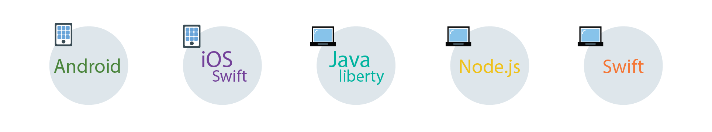

---

copyright:
  years: 2017, 2018
lastupdated: "2018-4-24"

---

{:new_window: target="_blank"}
{:shortdesc: .shortdesc}
{:screen: .screen}
{:codeblock: .codeblock}
{:pre: .pre}
{:tip: .tip}

# 配置 Cloud Directory
{: #cd}

用户可以使用电子邮件和密码注册并登录到移动应用程序和 Web 应用程序。Cloud Directory 是在云中维护的用户注册表。当用户使用电子邮件和密码注册应用程序时，会将其添加到您的用户目录中。利用此功能，用户可以在应用程序中自由管理自己的帐户。
{: shortdesc}

 

## 管理目录设置
{: #cd-settings}

您可以配置通知以及用户对应用程序的控制级别。按照下图所示，您可以快速完成 Cloud Directory 的设置。随时可以从服务仪表板更新这些设置。
{: shortdesc}

1. 确保开启 Cloud Directory 作为身份提供者，并将**允许用户注册并重置密码**设置为**开启**。如果设置为**关闭**，那么仍可以通过控制台添加用户以用于开发目的。
2. 配置发件人详细信息。指定发件人的电子邮件地址，电子邮件消息将显示为从该地址发送，用户可以回复到该地址。
配置操作 URL 时，一定要为用户提供足够的时间来单击链接。用户必须验证其电子邮件中包含特定选项，例如，请求重置其密码的功能。
  {: tip}
3. 确定用户将接收的电子邮件类型以及发件人信息。
4. 借助提供的模板，使用您的品牌或个性化消息来定制消息。有关更多信息，请参阅[管理消息](/docs/services/appid/cloud-directory.html#cd-messages)。
5. 在 GUI 的**用户**选项卡中查看谁注册了您的应用程序。

 

## 管理消息
{: #cd-messages}

模板是您可发送给用户的电子邮件示例。您可以通过更新消息的内容和布局来定制模板。在目录设置标签中，可将这些消息设置为**开启**或**关闭**。
{: shortdesc}

1. 选择**消息类型**。
2. 通过更改消息的内容和设计，对消息进行定制。可以使用参数对消息进行个性化操作。切记保存更改！

### 消息的类型

您可以向用户发送多种类型的消息。您既可以选择发送已编程为 UI 的示例消息发送，也可以定制更为个性化的应用程序体验内容。

<dl>
  <dt>欢迎</dt>
    <dd>
在用户注册后，您可以通过电子邮件欢迎用户使用您的应用程序。要欢迎用户加入并留住用户，尽可能让消息充满吸引力。
    

    <table>
      <thead>
        <th colspan=2>所有消息参数</th>
      </thead>
      <tbody>
        <tr>
          <td> %{display.logo} </td>
          <td> 显示为登录窗口小部件配置的图像。</td>
        </tr>
        <tr>
          <td> %{user.displayName} </td>
          <td> 显示用户所选的在与应用程序交互时要使用的屏幕名称。</td>
        </tr>
        <tr>
          <td> %{user.email} </td>
          <td> 显示用户的注册电子邮件地址。</td>
        </tr>
        <tr>
          <td> %{user.firstName} </td>
          <td> 显示用户的指定名字。</td>
        </tr>
        <tr>
          <td> %{user.formattedName} </td>
          <td> 显示用户的全名。</td>
        </tr>
        <tr>
          <td> %{user.lastName} </td>
          <td> 显示用户的指定姓氏。</td>
        </tr>
      </tbody>
    </table>
    
**注**：如果用户未提供参数拉出的信息，将显示为空。
</dd>
  <dt>忘记密码</dt>
    <dd>
用户在忘记密码或出于任何原因需要更新密码时，可要求重置密码。您可以定制对这些请求的电子邮件响应。当用户请求更改时，在他们单击此电子邮件中的链接之前，其密码仍保持未更改状态。

    

    <table>
      <thead>
        <th colspan=2> 密码更改参数</th>
      </thead>
      <tbody>
        <tr>
          <td> %{linkExpiration.hours} </td>
          <td> 显示链接保持有效的时数。</td>
        </tr>
        <tr>
          <td> %{linkExpiration.minutes} </td>
          <td> 显示链接保持有效的分钟数。</td>
        </tr>
        <tr>
          <td> %{resetPassword.code} </td>
          <td> 在 URL 中，显示一次性密码作为其中一部分。这意味着每个人都会收到不同的代码。示例：<code>https://appid-wfm.bluemix.net/verify/6574839563478 </code> </td>
        </tr>
        <tr>
          <td> %{resetPassword.link} </td>
          <td> 显示用户单击以重置密码的链接。</td>
        </tr>
       </tbody>
    </table>
    </dd>
  <dt>验证</dt>
    <dd>
您可以请求用户通过电子邮件验证其帐户。通过请求验证，您可以限制可注册应用程序的伪帐户数。您可以限制为当用户已验证电子邮件后才可访问应用程序，或用于管理您将为哪些用户创建概要文件。

    <table>
      <thead>
        <th colspan=2> 验证消息参数</th>
      </thead>
      <tbody>
        <tr>
          <td> %{linkExpiration.hours} </td>
          <td> 显示链接保持有效的时数。</td>
        </tr>
        <tr>
          <td> %{linkExpiration.minutes} </td>
          <td> 显示链接保持有效的分钟数。</td>
        </tr>
        <tr>
          <td> %{verify.code} </td>
          <td> 显示一次性验证 URL。</td>
        </tr>
        <tr>
          <td> %{verify.link} </td>
          <td> 显示在设置中指定的操作 URL。</td>
        </tr>
      </tbody>
    </table>
    </dd>
  <dt>密码更改</dt>
    <dd>
您可以在用户密码进行更新后告知用户。在用户并未请求更改密码时，该功能很有用。他们可以采取适当步骤来重新保护帐户的安全。
    

    <table>
      <thead>
        <th colspan=2> 密码更改参数</th>
      </thead>
      <tbody>
        <tr>
          <td> %{passwordChangeInfo.time} </td>
          <td> 显示新密码生效的时间。</td>
        </tr>
        <tr>
          <td> %{passwordChangeInfo.ipAddress} </td>
          <td> 显示请求更改密码的 IP 地址。</td>
        </tr>
      </tbody>
    </table>
    </dd>
</dl>
 
**注**：{{site.data.keyword.appid_short_notm}} 使用 <a href="https://www.sendgrid.com" target="_blank">SendGrid </a> 作为邮件传送服务。所有电子邮件都会使用单个 SendGrid 帐户发送。

 
## 后续步骤
现在您已经配置了 Cloud Directory，就可以将登录窗口小部件的代码添加到应用程序代码中。单击下图中的 SDK 语言图标以查看需要执行的操作。
{: shortdesc}

<map name="options-map" id="options-map">
<area href="login-widget.html#branded-ui-android" alt="使用 Android SDK 管理登录体验。" shape="rect" coords="187, 6, 305, 120" />
<area href="login-widget.html#branded-ui-ios-swift" alt="使用 iOS Swift SDK 管理登录体验。" shape="rect" coords="333, 6, 448, 125" />
<area href="login-widget.html#branded-ui-nodejs" alt="使用 Node.js SDK 管理登录体验。" shape="rect" coords="472, 7, 590, 121" />
</map>
