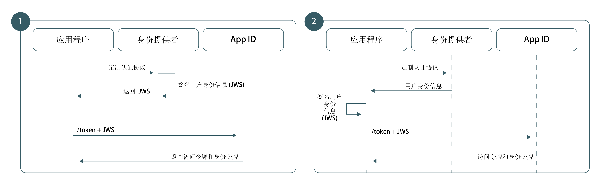

---

copyright:
  years: 2017, 2019
lastupdated: "2019-04-04"

keywords: authentication, authorization, identity, app security, secure, custom, proprietary, 

subcollection: appid

---

{:new_window: target="_blank"}
{:shortdesc: .shortdesc}
{:screen: .screen}
{:pre: .pre}
{:table: .aria-labeledby="caption"}
{:codeblock: .codeblock}
{:tip: .tip}
{:note: .note}
{:important: .important}
{:deprecated: .deprecated}
{:download: .download}

# 在应用程序中使用定制身份
{: #custom-auth}

您可以在进行认证时使用自己的定制身份提供者。您的身份提供者可遵循 {{site.data.keyword.appid_full}} 所支持认证机制之外的任何认证机制，包括专有或原有认证机制。
{: shortdesc}

## 概述
{: #custom-auth-overview}

通过自带身份提供者，可以创建使用您自己的协议的定制认证流程。您将拥有更多控制权，例如针对要共享的信息或存储的信息。
{: shortdesc}

请务必先[配置定制提供者](/docs/services/appid?topic=appid-custom-identity)，然后再将其添加到应用程序。
{: tip}

### 我何时需要使用此流程？
{: #custom-auth-when}

{{site.data.keyword.appid_short_notm}} 未提供对特定身份提供者的直接支持时，您可以使用定制身份流程将认证协议桥接到 {{site.data.keyword.appid_short_notm}} 的现有认证流程。例如，您希望使用 GitHub 或 LinkedIn 来允许用户登录。可以使用身份提供者的现有 SDK 来方便地提供用户认证信息，然后打包这些信息，并将其与 {{site.data.keyword.appid_short_notm}} 进行交换。

在许多情况下，需要不同的认证流程：

 - 专有内部身份提供者
 - 第三方身份提供者
 - 复杂认证流程，可包括专有多因子机制

有时，原有提供者可能会使用其自己的定制认证协议。由于定制身份流程使认证与授权完全相分离，因此可以采用所选的任何认证机制，然后向 {{site.data.keyword.appid_short_notm}} 提供生成的认证信息。所有机制都不会公开用户凭证。

</br>

### 从技术角度来说，此流程是如何运作的？
{: #custom-auth-tech}

定制身份工作流程基于在 Assertion Framework for OAuth 2.0 Authorization Grants [[RFC7521]](https://tools.ietf.org/html/rfc7523#section-2.1) 中定义的 JWT-Bearer 扩展授权类型而构建。为了使用用户信息来交换 {{site.data.keyword.appid_short_notm}} 令牌，认证体系结构将使用非对称 RSA 密钥对来创建与 {{site.data.keyword.appid_short_notm}} 的信任关系。建立了信任后，就可以使用 JWT-Bearer 授权类型，用已签名 JWT 中已验证的用户信息来交换 {{site.data.keyword.appid_short_notm}} 令牌。

### 此流程是什么样子的？
{: #custom-auth-flow}

与所有认证流程一样，定制身份也需要应用程序能够与 {{site.data.keyword.appid_short_notm}} 建立一定程度的信任关系，以确保身份提供者用户信息的完整性。定制身份利用非对称 RSA 公用和专用密钥对来建立其信任关系。根据体系结构需求，定制身份支持两种信任模型，区别仅在于专用密钥的存储位置和用途。


图. 定制认证的请求流程

<dl>
  <dt>1. 身份提供者签名</dt>
    <dd>与传统 OAuth 2.0 流程一样，最安全的信任模型会在身份提供者与授权服务器之间创建关系；在本例中，直接创建与 {{site.data.keyword.appid_short_notm}} 的关系。在此模型下，身份提供者负责存储专用密钥并对 JWT 断言签名。这些断言传递到 {{site.data.keyword.appid_short_notm}} 时，将使用匹配的公用密钥对其进行验证，这可确保来自身份提供者的用户信息在传输过程中不会被恶意变更。</dd>
  <dt>2. 应用程序签名</dt>
    <dd>或者，可以将信任模型基于应用程序与 {{site.data.keyword.appid_short_notm}} 之间的关系。在此工作流程中，专用密钥存储在服务器端应用程序中。成功认证后，应用程序负责将身份提供者响应转换为 JWT，并使用其专用密钥对 JWT 签名，然后应用程序会将该令牌发送到 {{site.data.keyword.appid_short_notm}}。由于此身份提供者与 {{site.data.keyword.appid_short_notm}} 之间没有关系，因此该体系结构将创建较弱的信任模型。虽然 {{site.data.keyword.appid_short_notm}} 可以信任服务器端应用程序发送的信息，但无法确定这些数据是由身份提供者发送的原始信息。</dd>
</dl>


## 生成 JSON Web 令牌
{: #generating-jwts}

可以通过生成 <a href="https://tools.ietf.org/html/rfc7515" target="blank">JSON Web 令牌 </a>，将已验证的用户数据转换为定制身份 JWT。必须使用与预先配置的公用密钥匹配的专用密钥来对此令牌签名。有关令牌签名库的列表，请查看 <a href="https://jwt.io/" target="blank">jwt.io </a>。
{: shortdesc}

### 示例 JWT 格式
{: #jwts-example}

令牌头：
  ```
  {
  "alg": "RS256",
  "typ": "JOSE"
  }
  ```
  {: screen}

令牌有效内容：
  ```
  {
    // Required
    iss: String, // Should reference your identity provider
    aud: String, // Must be the OAuth server URL name
    exp: Int,    // Should be a value with a short lifespan
    sub: String, // Must be the unique user ID provided by your identity provider

    // Normalized claims (optional)
    name: String
    email: String
    locale: String
    picture: String
    gender: String

    // Custom Scopes to add to access token (optional)
    scope="custom_scope1 custom_scope2"

    // Other custom claims (optional)
    role="admin"
  }
  ```
  {: screen}

  <table>
  <thead>
    <th colspan=2> JWS 字段</th>
  </thead>
  <tbody>
    <tr>
      <td><code>iss</code></td>
      <td>应该包含对身份提供者的引用。</td>
    </tr>
    <tr>
      <td><code>aud</code></td>
      <td>OAuth 服务器 URL。格式：https://{region}.appid.cloud.ibm.com/oauth/v4/{tenantId}。</td>
    </tr>
    <tr>
      <td><code>exp</code></td>
      <td>令牌有效的时间长度。出于安全原因，令牌应该具有较短且明确的生命周期。</td>
    </tr>
    <tr>
      <td><code>sub</code></td>
      <td>身份提供者提供的唯一用户标识。</td>
    </tr>
    <tr>
      <td>规范化声明</td>
      <td>在此请求的响应中返回的身份令牌中提供了所有[规范化声明](/docs/services/appid?topic=appid-tokens#tokens)。使用 [`/userinfo` 端点](/docs/services/appid?topic=appid-custom-attributes#custom-attributes)可找到更多定制声明。</td>
    </tr>
    <tr>
      <td>Scope</td>
      <td>缺省情况下，所有 {{site.data.keyword.appid_short_notm}} 令牌都包含一组预设的作用域。可以通过执行以下其中一个操作来请求额外的作用域：<ul><li> 在 JWS 令牌的 scope 字段中指定作用域。</li> <li>通过 `/token` 请求的 URL 格式的 scope 参数来指定作用域。</li></ul></td>
    </tr>
  </tbody>
  </table>

## 检索 {{site.data.keyword.appid_short_notm}} 令牌
{: #exchanging-jwts}

要在定制提供程序与 {{site.data.keyword.appid_short_notm}} 之间创建网桥，您需要具有 {{site.data.keyword.appid_short_notm}} 令牌。要获取服务令牌，请使用 [`/token` 端点](https://us-south.appid.cloud.ibm.com/swagger-ui/#/Authorization_Server_V4/token)来交换已验证的用户信息。
{: shortdesc}

  ```
  Post /token
  Content-Type: application/x-www-from-urlencoded
  grant_type=urn:ietf:params:oauth:grant-type:jwt-bearer
  assertion=<payload>
  scope="<space separated scope array>"
  ```
  {: codeblock}
  <table>
    <thead>
      <th colspan=2> 请求构造</th>
    </thead>
    <tbody>
      <tr>
        <td>Content-type</td>
        <td><code>applications/x-www-from-urlencoded</code></td>
      </tr>
      <tr>
        <td>grant_type</td>
        <td><code>urn:ietf:params:oauth:grant-type:jwt-bearer</code></td>
      </tr>
      <tr>
        <td>assertion</td>
        <td>JWS 有效内容字符串。</td>
      </tr>
      <tr>
        <td>scope</td>
        <td>定制作用域的空格分隔列表。</td>
      </tr>
    </tbody>
  </table>
