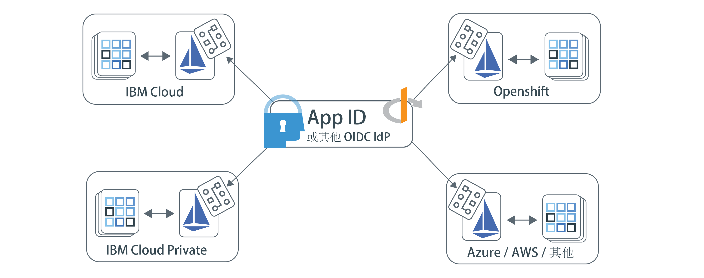

---

copyright:
  years: 2017, 2019
lastupdated: "2019-07-11"

keywords: Authentication, authorization, identity, app security, access, secure, development, any kube, kubernetes, icp, openshift, iks

subcollection: appid

---

{:external: target="_blank" .external}
{:shortdesc: .shortdesc}
{:screen: .screen}
{:pre: .pre}
{:table: .aria-labeledby="caption"}
{:codeblock: .codeblock}
{:tip: .tip}
{:note: .note}
{:important: .important}
{:deprecated: .deprecated}
{:download: .download}

# 使用 Istio 保护多云应用程序
{: #istio-adapter}

通过使用 App Identity and Access 适配器，可以在单个位置集中执行所有身份管理工作。由于企业使用来自多个提供者的云，或者使用内部部署和外部部署解决方案的组合，因此异构部署模型可帮助保留现有基础架构，并避免被供应商套牢。适配器可以配置为使用任何符合 OIDC 的身份提供者，例如 {{site.data.keyword.appid_short_notm}}，因此能够控制包括前端和后端应用程序在内的所有环境中的认证和授权策略。此外，**适配器独立完成所有工作，无需对代码进行任何更改，也无需重新部署应用程序**。
{: shortdesc}


## 多云体系结构
{: #istio-multicloud}

多云计算环境将多个云和/或专用计算环境组合到单个网络体系结构中。通过在多个环境中分布工作负载，您可能会发现弹性、灵活性和成本效益都更高。为了获得这些优点，通常要将基于容器的应用程序与编排层（如 Kubernetes）配合使用。


图. 多云部署 - 通过 App Identity and Access 适配器实现。


## 了解 Istio 和适配器
{: #istio-architecure}

[Istio](https://istio.io) 是一个开放式源代码服务网，用于透明地分层到可以与 Kubernetes 集成的现有分布式应用程序上。为了降低部署的复杂性，Istio 提供了对整个服务网的行为洞察和操作控制。App ID 与 Istio 组合使用时，将成为一个适用于多云体系结构的可缩放的集成身份解决方案，无需任何定制应用程序代码更改。有关更多信息，请查看[“What is Istio?”](https://www.ibm.com/cloud/learn/istio?cm_mmc=OSocial_Youtube-_-Hybrid+Cloud_Cloud+Platform+Digital-_-WW_WW-_-IstioYTDescription&cm_mmca1=000023UA&cm_mmca2=10010608){: external}。

Istio 使用 Envoy 代理侧柜来调解服务网中所有服务的所有入站和出站流量。通过使用代理，Istio 可抽取有关流量的信息（也称为遥测），这些信息将发送到名为 Mixer 的 Istio 组件以强制实施策略决策。App Identity and Access 适配器根据定制策略来分析遥测（属性），以控制对服务网的身份和访问权管理，从而扩展 Mixer 功能。访问管理策略链接到特定的 Kubernetes 服务，可以针对特定的服务端点进行微调。有关策略和遥测的更多信息，请参阅 [Istio 文档](https://istio.io/docs/concepts/observability/){: external}。 

由于 Istio 限制，目前 App Identity and Access 适配器在内部存储用户会话信息，*不*在各个副本中或通过故障转移配置来持久存储信息。使用适配器时，请将工作负载限制为在单个副本上运行，直到此限制解决为止。
{: note}

### 保护前端应用程序
{: #istio-frontend}

如果使用的是基于浏览器的应用程序，那么可以使用 [Open ID Connect (OIDC)](https://openid.net/specs/openid-connect-core-1_0.html){: external}/OAuth 2.0 `authorizationation_grant` 流程来认证用户。检测到未经认证的用户时，会自动将这些用户重定向到认证页面。认证完成后，浏览器会重定向到隐式 `/oidc/callback` 端点，其中适配器会拦截该请求。此时，适配器会从身份提供者那里获取令牌，然后将用户重定向回原始请求的 URL。

要查看用户会话信息（包括会话令牌），可以查看 `Authorization` 头。

```
Authorization: Bearer <access_token> <id_token>
```
{: screen}

您还可以使已认证的用户注销。如以下示例所示，已认证的用户访问附加有 `oidc/logout` 的任何受保护端点时，该用户会注销。

```
https://myhost/path/oidc/logout
```
{: screen}

如果需要，可以使用刷新令牌来自动获取新的访问令牌和身份令牌，而无需用户重新认证。如果配置的身份提供者返回刷新令牌，此令牌会持久存储在会话中，并用于在身份令牌到期时检索新令牌。


### 保护后端应用程序
{: #istio-backend}

适配器可与 OAuth 2.0 [JWT Bearer 流程](https://tools.ietf.org/html/rfc6750){: external}协作使用，通过验证 JWT 不记名令牌来保护服务 API。Bearer 授权流程期望请求包含具有有效访问令牌和可选身份令牌的 Authorization 头。期望的头结构为 `Authorization=Bearer {access_token} [{id_token}]`。未认证的客户机会返回 HTTP 401 响应状态，其中包含获取授权所需的作用域列表。如果令牌无效或到期，那么 API 策略将返回包含可选 error 组成部分的 HTTP 401 响应，其中显示 `Www-Authenticate=Bearer scope="{scope}" error="{error}"`。


有关令牌及其使用方式的更多信息，请参阅[了解令牌](/docs/services/appid?topic=appid-tokens)。


## 开始之前
{: #istio-before}

开始之前，请确保已安装以下必备软件：

- [Kubernetes 集群](https://kubernetes.io/){: external}
- [Helm](https://helm.sh/){: external}
- [Istio V1.1+](https://istio.io/docs/setup/kubernetes/install/){: external}
  
  您还可以使用 [IBM Cloud Kubernetes Service 受管 Istio](/docs/containers?topic=containers-istio)。
  {: note}


## 安装适配器
{: #istio-install-adapter}

要安装 chart，请在集群中初始化 Helm，定义要使用的选项，然后运行安装命令。

1. 如果使用的是 IBM Cloud Kubernetes Service，请确保登录并设置集群的上下文。

2. 在集群中安装 Helm。

    ```bash
    helm init
    ```
    {: codeblock}

    您可能希望将 Helm 配置为使用 `--tls` 方式。有关启用 TLS 的帮助，请查看 [Helm 存储库](https://github.com/helm/helm/blob/master/docs/tiller_ssl.md){: external}。如果启用了 TLS，请确保将 `--tls` 附加到运行的每个 Helm 命令。有关将 Helm 与 IBM Cloud Kubernetes Service 配合使用的更多信息，请参阅[使用 Helm chart 添加服务](/docs/containers?topic=containers-helm#public_helm_install)。
    {: tip}

3. 安装 chart。

    ```bash
    helm install ./helm/appidentityandaccessadapter --name appidentityandaccessadapter
    ```
    {: codeblock}

## 应用授权和认证策略
{: #istio-apply-policy}

认证或授权策略是要使请求能够访问资源而必须满足的一组条件。通过定义身份提供者的服务配置以及概述何时应该使用特定流程的策略，可以控制对服务网中任何资源的访问。要查看示例 CRD，请查看[样本目录](https://github.com/ibm-cloud-security/app-identity-and-access-adapter/tree/master/samples/crds){: external}。

要创建策略，请执行以下操作：

1. 定义配置。
2. 注册端点。

### 定义配置
{: #istio-apply-define}

根据是要保护前端还是后端应用程序，使用下列其中一个选项来创建策略配置。

* 对于前端应用程序：需要用户认证的基于浏览器的应用程序可以配置为使用 OIDC/OAuth 2.0 认证流程。要定义 `OidcConfig` CRD（包含用于支持身份提供者认证流程的客户机），请使用以下示例作为指南。

    ```yaml
    apiVersion: "security.cloud.ibm.com/v1"
    kind: OidcConfig
    metadata:
        name:      oidc-provider-config
        namespace: sample-namespace
    spec:
        discoveryUrl: https://us-south.appid.cloud.ibm.com/oauth/v4/<tenant-ID>/oidc-discovery/.well-known
        clientId:     <client-ID>
        clientSecret: <randomlyGeneratedClientSecret>
        clientSecretRef:
            name: <name-of-my-kube-secret>
            key: <key-in-my-kube-secret>
    ```
    {: screen}

    <table>
        <thead>
        <tr>
            <th>字段</th>
            <th style="text-align:center">类型</th>
            <th style="text-align:center">必需</th>
            <th style="text-align:center">描述</th>
        </tr>
        </thead>
        <tbody>
        <tr>
            <td><code>discoveryUrl</code></td>
            <td style="text-align:center">字符串</td>
            <td style="text-align:center">是</td>
            <td style="text-align:center">一个熟知端点，用于提供包含 OIDC/OAuth 2.0 配置信息的 JSON 文档。</td>
        </tr>
        <tr>
            <td><code>clientId</code></td>
            <td style="text-align:center">字符串</td>
            <td style="text-align:center">是</td>
            <td style="text-align:center">用于认证的客户机的标识。</td>
        </tr>
        <tr>
            <td><code>clientSecret</code></td>
            <td style="text-align:center">字符串</td>
            <td style="text-align:center">*否</td>
            <td style="text-align:center">用于认证客户机的明文私钥。如果未提供，那么必须存在 <code>clientSecretRef</code>。</td>
        </tr>
        <tr>
            <td><code>clientSecretRef</code></td>
            <td style="text-align:center">对象</td>
            <td style="text-align:center">否</td>
            <td style="text-align:center">用于认证客户机的引用私钥。可以使用引用来替代 <code>clientSecret</code>。</td>
        </tr>
        <tr>
            <td><code>clientSecretRef.name</code></td>
            <td style="text-align:center">字符串</td>
            <td style="text-align:center">是</td>
            <td style="text-align:center">包含 <code>clientSecret</code> 的 Kubernetes 私钥的名称。</td>
        </tr>
        <tr>
            <td><code>clientSecretRef.key</code></td>
            <td style="text-align:center">字符串</td>
            <td style="text-align:center">是</td>
            <td style="text-align:center">保存 <code>clientSecret</code> 的 Kubernetes 私钥中的字段。</td>
        </tr>
        </tbody>
    </table>

* 对于后端应用程序：OAuth 2.0 不记名令牌规范使用 [JSON Web 令牌 (JWT)](https://tools.ietf.org/html/rfc7519.html){: external} 定义用于保护 API 的模式。通过使用以下配置作为示例，定义包含用于验证令牌签名的公用密钥资源的 `JwtConfig` CRD。

    ```yaml
    apiVersion: "security.cloud.ibm.com/v1"
    kind: JwtConfig
    metadata:
      name:      jwt-config
      namespace: sample-app
    spec:
        jwksUrl: https://us-south.appid.cloud.ibm.com/oauth/v4/<tenant-ID>/publickeys
    ```
    {: screen}

### 注册应用程序端点
{: #istio-register-endpoints}

在 `Policy` CRD 中注册应用程序端点，以用于验证入局请求并强制实施认证规则。每个 `Policy` 仅应用于对象所在的 Kubernetes 名称空间，并且可以指定要保护的服务、路径和方法。

```yaml
apiVersion: "security.cloud.ibm.com/v1"
kind: Policy
metadata:
  name:      samplepolicy
  namespace: sample-app
spec:
  targets:
    -
      serviceName: <svc-sample-app>
      paths:
        - exact: /web/home
          method: ALL
          policies:
            - policyType: oidc
              config: <oidc-provider-config>
              rules:
                - claim: scope
                  match: ALL
                  source: access_token
                  values:
                    - appid_default
                    - openid
                - claim: amr
                  match: ANY
                  source: id_token
                  values:
                    - cloud_directory
                    - google

        - exact: /web/user
          method: GET
          policies:
            - policyType: oidc
              config: <oidc-provider-config>
              redirectUri: https://github.com/ibm-cloud-security/app-identity-and-access-adapter
        - prefix: /
          method: ALL
          policies:
            -
              policyType: jwt
              config: <jwt-config>
```
{: screen}


|服务对象|类型|必需|描述|
|:----------------:|:----:|:--------:| :-----------: |
|`service`|`string`|是|Policy 名称空间中要保护的 Kubernetes 服务的名称。|
|`paths`|`array[Path Object]`|是|用于定义要保护的端点的路径对象的列表。如果保留为空，那么将保护所有路径。|
{: class="simple-tab-table"}
{: caption="表 1. 了解服务对象组成部分" caption-side="top"}
{: #service-object}
{: tab-title="Service object"}
{: tab-group="objects"}

|路径对象|类型|必需|描述|
|:----------------:|:----:|:--------:|:-----------:|
|`exact 或 prefix`|`string`|是|要应用策略的路径。选项包括 `exact` 和 `prefix`。`exact` 与修剪掉最后一个 `/` 的提供的端点完全匹配。`prefix` 与以提供的路径前缀开头的端点相匹配。|
|`method`|`enum`|否|受保护的 HTTP 方法。有效选项为 ALL、GET、PUT、POST、DELETE 和 PATCH - 缺省值为 ALL：|
|`policies`|`array[Policy]`|否|要应用的 OIDC/JWT 策略。|
{: class="simple-tab-table"}
{: caption="表 2. 了解路径对象组成部分" caption-side="top"}
{: #path-object}
{: tab-title="Path object"}
{: tab-group="objects"}

|策略对象|类型|必需|描述|
|:----------------:|:----:|:--------:| :-----------: |
|`policyType`|`enum`|是|OIDC 策略的类型。选项包括：`jwt` 或 `oidc`。|
|`config` |`string`|是|要使用的提供者配置的名称。|
|`redirectUri`|`string`|否|您希望在用户成功认证后将用户重定向到的 URL，缺省值：原始请求 URL。|
|`rules`|`array[Rule]`|否|要用于令牌验证的一组规则。|
{: class="simple-tab-table"}
{: caption="表 3. 了解策略对象组成部分" caption-side="top"}
{: #policy-object}
{: tab-title="Policy object"}
{: tab-group="objects"}

|规则对象|类型|必需|描述|
|:----------------:|:----:|:--------:| :-----------: |
|`claim`|`string`|是|要验证的声明。|
|`match`|`enum`|否|验证声明所需的条件。选项包括：`ALL`、`ANY` 或 `NOT`。缺省值设置为 `ALL`。|
|`source`|`enum`|否|要应用规则的令牌。选项包括：`access_token` 或 `id_token`。缺省值设置为 `access_token`。|
|`values`|`array[string]`|是|用于验证的一组必需值。|
{: class="simple-tab-table"}
{: caption="表 4. 了解策略对象组成部分" caption-side="top"}
{: #rule-object}
{: tab-title="Rule object"}
{: tab-group="objects"}


## 删除适配器
{: #istio-remove}

要除去适配器和所有关联的 CRD，必须删除 Helm chart 以及关联的签名密钥和加密密钥。

```bash
helm delete --purge appidentityandaccessadapter
kubectl delete secret appidentityandaccessadapter-keys -n istio-system
```
{: codeblock}


## 常见问题和故障诊断
{: #istio-faq}

如果在使用 App Identity and Access 适配器时遇到问题，请考虑以下常见问题和故障诊断方法。有关更多帮助，可以通过论坛提问或开具支持凭单。在使用论坛提问时，请标记您的问题，以便 {{site.data.keyword.appid_short_notm}} 开发团队能看到您的问题。

  * 如果有关于 {{site.data.keyword.appid_short_notm}} 的技术问题，请在 <a href="https://stackoverflow.com/" target="_blank">Stack Overflow </a> 上发帖提问，并使用“ibm-appid”标记您的问题。
  * 有关服务和入门指示信息的问题，请使用 <a href="https://developer.ibm.com/" target="_blank">dW Answers </a> 论坛。包含 `appid` 标记。

有关获取支持的更多信息，请参阅[如何获得我需要的支持](/docs/get-support?topic=get-support-getting-customer-support#getting-customer-support)。


### 故障诊断：日志记录
{: #istio-logging}

缺省情况下，日志的样式为 JSON，并且在 `info` 显示级别提供，以便轻松与外部日志记录系统集成。要更新日志记录配置，可以使用 Helm chart。支持的日志记录级别包括范围 [-1, 7]，如 Zap 核心中所示。有关级别的更多信息，请参阅 [Zap 核心文档](https://godoc.org/go.uber.org/zap/zapcore#Level)。

手动查看 JSON 日志时，您可能希望使用 [`jq`](https://brewinstall.org/install-jq-on-mac-with-brew/) 来跟踪日志并“采用精美格式显示”日志。
{: note}

**适配器**

要查看适配器日志，可以使用 `kubectl` 或通过 Kubernetes 控制台从 `appidentityandaccessadapter` pod 来访问相应 pod。

```bash
$ alias adapter_logs="kubectl -n istio-system logs -f $(kubectl -n istio-system get pods -lapp=appidentityandaccessadapter -o jsonpath='{.items[0].metadata.name}')"
$ adapter_logs | jq
```
{: codeblock}

**Mixer**

如果适配器未显示为接收请求，请检查 Mixer 日志以确保它已成功连接到适配器。

```bash
$ alias mixer_logs="kubectl -n istio-system logs -f $(kubectl -n istio-system get pods -lapp=telemetry -o jsonpath='{.items[0].metadata.name}') -c mixer"
$ mixer_logs | jq
```
{: codeblock}

