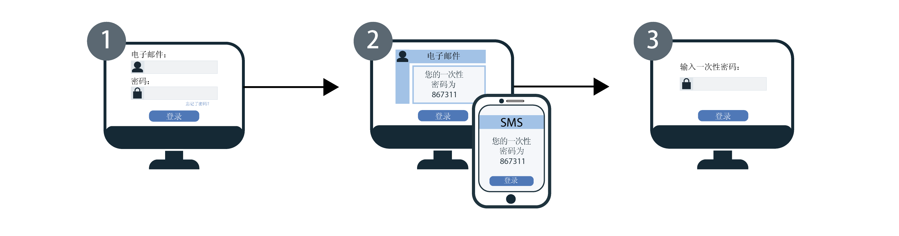

---

copyright:
  years: 2017, 2019
lastupdated: "2019-05-09"

keywords: authentication, authorization, identity, app security, secure, development, two factor, mfa 

subcollection: appid

---

{:new_window: target="_blank"}
{:shortdesc: .shortdesc}
{:screen: .screen}
{:pre: .pre}
{:table: .aria-labeledby="caption"}
{:codeblock: .codeblock}
{:tip: .tip}
{:note: .note}
{:important: .important}
{:deprecated: .deprecated}
{:download: .download}


# 多因子认证
{: #cd-mfa}


通过在登录期间要求提供多个因子，可以提高用户向应用程序进行认证的安全性。使用 {{site.data.keyword.appid_full}} 的 Cloud Directory 时，第一个因子是 Cloud Directory 用户通常用于登录的密码。第二个认证因子是一次性代码，由 {{site.data.keyword.appid_short_notm}} 以 SMS 或电子邮件形式发送给用户。{{site.data.keyword.appid_short_notm}} 使用这两个因子的组合来验证用户的身份。
{: shortdesc}

支持 {{site.data.keyword.appid_short_notm}} MFA 作为 Cloud Directory 用户通过登录窗口小部件进行的 OAuth 2.0 授权代码流程的一部分。如果使用的是采用 SAML 2.0 的企业登录或使用的是社交登录，那么可以通过相应的身份提供者来启用 MFA。
{: note}

启用了 MFA 后，每次用户尝试登录时，{{site.data.keyword.appid_short_notm}} 登录窗口小部件都会要求执行第二种形式的验证（第二个认证因子）。用户成功输入其凭证后，系统会将一次性代码发送到向其帐户注册的电子邮件或电话号码。

查看下图以了解 MFA 流程是如何运作的。



1. 向用户显示 {{site.data.keyword.appid_short_notm}} 的登录窗口小部件，并要求用户输入其 Cloud Directory 用户凭证。凭证可以是其电子邮件或用户名及其密码。Cloud Directory 用户凭证构成第一个认证因子。

2. 凭证通过验证后，系统会返回用于第二个因子验证的 MFA 屏幕。根据第二个因子配置，用户可通过电子邮件或 SMS 来接收一次性代码，并在验证屏幕中输入该代码。

3. 如果 MFA 代码通过了验证，用户会被重定向回应用程序并已登录。


## 了解 MFA
{: #cd-mfa-understanding}


MFA 是一种确认用户身份的方法，该方法要求用户使用多个因子来证明其身份与声明的一致。这些因子除了是用户知道的内容或用户属于的身份外，还可以是用户拥有的东西。
{: shortdesc}

首次启用 MFA 时，缺省情况下会将其设置为使用电子邮件。可以将设置更改为使用 SMS，但不能同时配置这两者。对于电子邮件和 SMS，有一些已配置且无法更改的设置。


<table>
  <tr>
    <th>设置</th>
    <th>描述</th>
  </tr>
  <tr>
    <td>代码字符</td>
    <td>6 个数字字符</td>
  </tr>
  <tr>
    <td>代码到期时间</td>
    <td>15 分钟<br> 如果用户在 15 分钟内未验证其代码，那么只要认证会话未到期，用户就可以请求再次发送代码。在认证会话期间，可以多次发送代码。认证会话到期后，用户必须从头开始重复执行登录过程。</td>
  </tr>
</table>

<p>Cloud Directory 用户的电子邮件或电话号码已在 SCIM 中定义为<a href="https://tools.ietf.org/html/rfc7643#section-2.4" target="_blank">多值属性 </a>，可以包含以下内容：<ul>
  <li>Value：实际属性值，例如电子邮件地址或电话号码。</li>
  <li>Primary：布尔值，用于指示属性的首选值。primary 属性值 <code>true</code> 可以且只能出现一次。如果未指定，会假定 <code>primary</code> 的值为 <code>false</code>。</li>
</ul>有关更多信息，请查看 [Cloud Directory 文档](/docs/services/appid?topic=appid-cloud-directory#cloud-directory)。</p>


## 配置 MFA 电子邮件通道
{: #cd-mfa-configure-email}

可以配置 {{site.data.keyword.appid_short_notm}} 以通过电子邮件向用户发送 MFA 代码。
{: shortdesc} 

第一次启用 MFA 时，会发生以下两个情况：

- 缺省情况下，会选择电子邮件通道。您可以切换到 [SMS 通道](/docs/services/appid?topic=appid-cd-mfa#cd-mfa-configure-sms)。
- {{site.data.keyword.appid_short_notm}} 会自动注册已连接到 Cloud Directory 用户概要文件的主电子邮件。

如果用户的电子邮件尚未通过[管理 API](https://us-south.appid.cloud.ibm.com/swagger-ui/#/) 或通过用户注册时的电子邮件验证进行确认，那么在用户成功验证 MFA 代码后，即会对其进行确认。

开始之前，请确保 {{site.data.keyword.appid_short_notm}} 的实例位于[累进层价格套餐](/docs/services/appid?topic=appid-faq#faq-pricing)上。
{: note}

### 使用 GUI
{: #cd-mfa-configure-email-gui}

可以通过 GUI 来配置 MFA 电子邮件通道。

1. 导航至 {{site.data.keyword.appid_short_notm}} 仪表板的 **Cloud Directory > 多因子认证**选项卡。

2. 在**启用多因子认证**框的**设置**选项卡上，将 MFA 切换到**已启用**。确认您已了解 MFA 是作为[高级安全事件](/docs/services/appid?topic=appid-faq#faq-pricing)收费的。缺省情况下，已选择**电子邮件**作为**认证方法**。

3. 在**电子邮件通道**选项卡中，查看**电子邮件模板**。可以选择发送包含所提供文字的模板，也可以编写您自己的消息。请确保使用正确的 HTML 标记。在 GUI 中，可以添加参数和插入图像。要更改消息的[语言](/docs/services/appid?topic=appid-cd-messages#cd-languages)，可以使用 <a href="https://us-south.appid.cloud.ibm.com/swagger-ui/#/Management%20API%20-%20Config/mgmt.updateLocalization" target="_blank">API </a> 来设置语言。但是，消息的内容和翻译由您自己负责。请查看下表以了解可在此消息中使用的表的列表以及可以发送的其他所有消息。如果用户未提供参数拉出的信息，那么会显示为空。


  <table>
    <thead>
      <tr>
        <th colspan=2> MFA 消息参数</th>
      </tr>
    </thead>
    <tbody>
      <tr>
        <td><code>%{display.logo}</code></td>
        <td> 显示为登录窗口小部件配置的图像。</td>
      </tr>
      <tr>
        <td><code>%{user.displayName}</code></td>
        <td> 显示用户所选的在与应用程序交互时要使用的屏幕名称。</td>
      </tr>
      <tr>
        <td><code>%{user.email}</code></td>
        <td> 显示用户的注册电子邮件地址。</td>
      </tr>
      <tr>
        <td><code>%{user.username}</code></td>
        <td> 当认证方法设置为用户名和密码时，显示用户指定的用户名。</td>
      </tr>
      <tr>
        <td><code>%{user.firstName}</code></td>
        <td> 显示用户的指定名字。</td>
      </tr>
      <tr>
        <td><code>%{user.formattedName}</code></td>
        <td> 显示用户的全名。</td>
      </tr>
      <tr>
        <td><code>%{user.lastName}</code></td>
        <td> 显示用户的指定姓氏。</td>
      </tr>
      <tr>
        <td><code>%{mfa.code}</code></td>
        <td> 显示一次性 MFA 验证码。</td>
      </tr>
    </tbody>
  </table>

  如果用户未提供参数拉出的信息，那么会显示为空。
  {: tip}


### 使用 API
{: #cd-mfa-configure-email-apis}

**开始之前**

确保您已满足以下先决条件：

* {{site.data.keyword.appid_short_notm}} 实例的租户标识。此标识可以在仪表板的**服务凭证**部分中找到。
* Identity and Access Management (IAM) 令牌。有关获取 IAM 令牌的帮助，请查看 [IAM 文档](/docs/iam?topic=iam-iamtoken_from_apikey#iamtoken_from_apikey)。


1. 通过使用 MFA 配置向 `/config/mfa` 端点发出 PUT 请求以将 `isActive` 设置为 `true`，从而启用 MFA。

  头：
  ```
  PUT {management-url}/management/v4/{tenantId}/config/mfa
       Host: <management-server-url>
       Authorization: Bearer <IAM_TOKEN>
       Content-Type: application/json
  ```
  {: codeblock}

  主体：
  ```
   {
       "isActive": true
   }
  ```
  {: codeblock}

  示例请求：
  ```
  $ curl -X PUT
    --header 'Content-Type: application/json'
    --header 'Accept: application/json'
    --header 'Authorization: Bearer <IAM_TOKEN>'
    -d '{
          "isActive": true
      }'
    }'
    '{management-url}/management/v4/{tenantId}/config/mfa'
  ```
  {: screen}

2. 通过使用 MFA 配置向 `/mfa/channels/{channel}` 端点发出 PUT 请求来启用 MFA 通道。`isActive` 设置为 `true` 时，说明 MFA 通道已启用。

  头：
  ```
  PUT /management/v4/{tenantId}/mfa/channels/{channel}
       Host: <management-server-url>
       Authorization: Bearer <IAM_TOKEN>
       Content-Type: application/json
  ```
  {: codeblock}

  主体：
  ```
   {
       "isActive": true
   }
  ```
  {: codeblock}

  示例请求：

  ```
  $ curl -X PUT
    --header 'Content-Type: application/json'
    --header 'Accept: application/json'
    --header 'Authorization: Bearer <IAM_TOKEN>'
    -d '{
          "isActive": true
      }'
    }'
    '{management-url}/management/v4/{tenantId}/mfa/channels/email'
  ```
  {: screen}

如果 {{site.data.keyword.appid_short_notm}} Cloud Directory 实例配置为使用定制电子邮件分派器，那么 MFA 会使用相同的分派器来发送一次性代码。有关设置定制分派器的更多信息，请参阅 [Cloud Directory](/docs/services/appid?topic=appid-cd-messages#cd-custom-email) 文档。
{: note}


## 将 MFA 配置为使用 SMS
{: #cd-mfa-configure-sms}

可以向用户发送 SMS 消息以作为第二种形式的验证。启用 SMS 时，{{site.data.keyword.appid_short_notm}} 会自动尝试注册在 Cloud Directory 用户概要文件中找到的第一个[有效](https://en.wikipedia.org/wiki/E.164)主电话号码。如果该号码无效或在用户概要文件中找不到电话号码，那么会显示注册窗口小部件，供用户添加号码。然后，该号码将成为用户概要文件的一部分，并且在验证后，会成为用于 MFA 的缺省号码。
{: shortdesc}

**开始之前**

{{site.data.keyword.appid_short_notm}} 使用 [Nexmo](https://www.nexmo.com/products/sms) 来发送 MFA SMS 一次性代码。开始之前，请确保您的 {{site.data.keyword.appid_short_notm}} 实例位于[累进层价格套餐](/docs/services/appid?topic=appid-faq#faq-pricing)上，并且您有以下 Nexmo 信息。

 - 获取 Nexmo API 密钥和私钥。可以在 Nexmo 仪表板上的“帐户设置”页面中找到 Nexmo API 密钥和私钥。请查看 [Nexmo 文档](https://developer.nexmo.com/concepts/guides/authentication#api-key-and-secret)，以获取有关如何获取凭证的进一步信息。

 - 向 Nexmo 注册发件人标识或 `from` 号码。此 `from` 号码显示在用户手机上，用于表明 SMS 发送方。在某些国家/地区，Nexmo 支持字母数字发件人标识。{{site.data.keyword.appid_short_notm}} 使用输入的值作为 Nexmo 的发件人标识。因此，如果 Nexmo 支持这些标识，那么可以将标识与 {{site.data.keyword.appid_short_notm}} 配合使用。有关更多信息，请查看 [Nexmo 文档](https://help.nexmo.com/hc/en-us/articles/217571017-What-is-a-Sender-ID)。


### 使用 GUI
{: #cd-mfa-configure-sms-gui}

要使用 GUI 来配置 MFA，请查看 [Cloud Directory](/docs/services/appid?topic=appid-cloud-directory)。
{: note}

1. 导航至 {{site.data.keyword.appid_short_notm}} 仪表板的 **Cloud Directory > 多因子认证**选项卡。

2. 在**启用多因子认证**框的**设置**选项卡上，将 MFA 切换到**已启用**。确认您已了解 MFA 是作为[高级安全事件](/docs/services/appid?topic=appid-faq#faq-pricing)收费的。

3. 选择 **SMS** 作为**认证方法**。

4. 在 **SMS 通道**选项卡中，配置 Nexmo 帐户信息。

    1. 如果您还没有 Nexmo 的帐户，请进行创建。

    2. 在 Nexmo 仪表板中，单击 **SMS**。

    3. 复制**自行编码**部分中的 API 密钥，并将其粘贴到 {{site.data.keyword.appid_short_notm}} 仪表板的**密钥**框中。

    4. 复制 Nexmo 仪表板中的 **API 私钥**，并将其粘贴到 {{site.data.keyword.appid_short_notm}} 仪表板中的**私钥**框中。

    5. 输入消息发件人的[标识](https://help.nexmo.com/hc/en-us/articles/217571017-What-is-a-Sender-ID)。有效号码格式遵循 [E.164 国际编号格式](https://en.wikipedia.org/wiki/E.164)。例如，美国号码的格式为 `+1 999 888 7777`。必须同时指定国家/地区代码（以 `+` 号开头）和国家用户号。在某些国家/地区，Nexmo 支持字母数字发件人标识。{{site.data.keyword.appid_short_notm}} 使用输入的值作为 Nexmo 的发件人标识。因此，如果 Nexmo 支持这些标识，那么可以将标识与 {{site.data.keyword.appid_short_notm}} 配合使用。


### 使用 API
{: #cd-mfa-configure-sms-api}

**开始之前**

确保您已满足以下先决条件：

* {{site.data.keyword.appid_short_notm}} 实例的租户标识。此标识可以在仪表板的**服务凭证**部分中找到。
* Identity and Access Management (IAM) 令牌。有关获取 IAM 令牌的帮助，请查看 [IAM 文档](/docs/iam?topic=iam-iamtoken_from_apikey)。


1. 通过使用 MFA 配置向 `/config/mfa` 端点发出 PUT 请求以将 `isActive` 设置为 `true`，从而启用 MFA。

头：

  ```
  PUT {management-url}/management/v4/{tenantId}/config/mfa
       Host: <management-server-url>
       Authorization: Bearer <IAM_TOKEN>
       Content-Type: application/json
  ```
  {: codeblock}

主体：

  ```
  {
   "isActive": true
   }
  ```
  {: codeblock}


示例请求：

  ```
  $ curl -X PUT
    --header 'Content-Type: application/json'
    --header 'Accept: application/json'
    --header 'Authorization: Bearer <IAM_TOKEN>'
    -d '{
          "isActive": true
      }'
    '{management-url}/management/v4/{tenantId}/config/mfa'
  ```
  {: screen}

2. 通过使用 MFA 配置向 `/mfa/channels/{channel}` 端点发出 PUT 请求来启用 MFA 通道。`isActive` 设置为 `true` 时，说明 MFA 通道已启用。`config` 会采用 Nexmo API 密钥和私钥以及 `from` 号码。

头：

  ```
  PUT /management/v4/{tenantId}/mfa/channels/{channel}
      Host: <management-server-url>
      Authorization: Bearer <IAM_TOKEN>
      Content-Type: application/json
  ```
  {: codeblock}

主体：

  ```
  {
      "isActive": true,
      "config": {
        "key": "nexmo key",
        "secret": "nexmo secret",
        "from": sender-phoneNumber
      }
  }
  ```
  {: codeblock}

示例请求：

  ```
  $ curl -X PUT
    --header 'Content-Type: application/json'
    --header 'Accept: application/json'
    --header 'Authorization: Bearer <IAM_TOKEN>'
    -d '{
          "isActive": true,
      "config": {
        "key": "key",
          "secret": "secret",
          "from": 12345678900
        }
     }'
   '{management-url}/management/v4/{tenantId}/mfa/channels/nexmo'
  ```
  {: screen}


3. 成功配置通道后，使用 UI 上的“测试”按钮或使用管理 API 来验证是否正确设置了 Nexmo 配置和连接。

头：

  ```
  POST /management/v4/{tenantId}/config/cloud_directory/sms_dispatcher/test
     Host: <management-server-url>
     Authorization: Bearer <IAM_TOKEN>
     Content-Type: application/json
  ```
  {: codeblock}

主体：

  ```
  {
    "phone_number": "phoneNumber-receives-test-message"
  }
  ```
  {: codeblock}

示例请求：

  ```
  $ curl -X POST
  --header 'Content-Type: application/json'
  --header 'Accept: application/json'
  --header 'Authorization: Bearer <IAM_TOKEN>'
  -d '{
        "phone_number": "+1 999 999 9999"
      }'
  '{management-url}/management/v4/{tenantId}/config/cloud_directory/sms_dispatcher/test'
  ```
  {: screen}

  </br>
