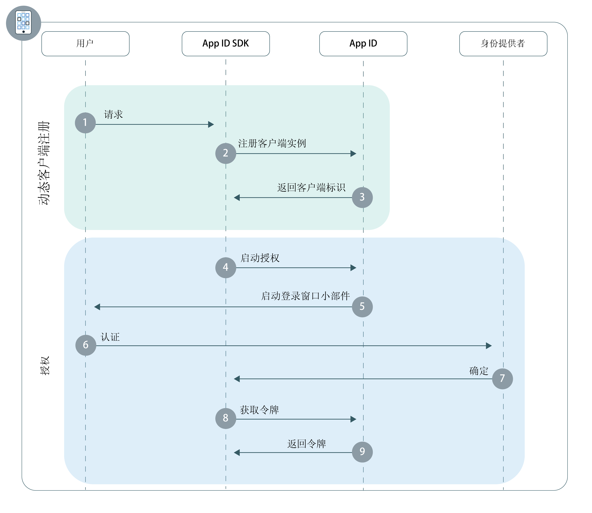

---

copyright:
  years: 2017, 2018
lastupdated: "2018-11-14"

---

{:new_window: target="_blank"}
{:shortdesc: .shortdesc}
{:pre: .pre}
{:tip: .tip}
{:screen: .screen}

# 移动应用程序
{: #adding-mobile}

通过 {{site.data.keyword.appid_full}}，可以为本机或混合移动应用程序快速构造认证层。
{: shortdesc}

## 了解流程
{: #understanding}

**此流程在什么时候有用？**

开发要安装在用户设备上的应用程序（本机应用程序）时，移动流程会非常有用。通过使用此流程，可以在应用程序上安全地认证用户，以便在各设备中提供个性化的用户体验。

**流程的技术基础是什么？**

由于本机应用程序直接安装在用户的设备上，因此第三方可以相对轻松地抽取私有的用户信息和应用程序凭证。缺省情况下，这些类型的应用程序称为不可信客户端，因为它们无法存储全局凭证或用户刷新令牌。因此，不可信客户端要求用户在每次其访问令牌到期时都输入其凭证。

为了将应用程序转换为可信客户端，{{site.data.keyword.appid_short}} 利用了[动态客户端注册](https://tools.ietf.org/html/rfc7591)。应用程序实例在开始认证用户之前，首先会向 {{site.data.keyword.appid_short}} 注册为 OAuth2 客户端。注册客户端后，应用程序将收到特定于安装的客户端标识，可以对该标识进行数字签名，并将其用于通过 {{site.data.keyword.appid_short}} 授权请求。由于 {{site.data.keyword.appid_short}} 存储了应用程序的相应公用密钥，因此可以验证请求签名，以允许将应用程序视为保密客户端。此过程通过允许自动令牌刷新，将应用程序公开凭证的风险降至最低，并且极大改善了用户体验。

注册之后，用户使用 OAuth2 `授权代码`或`资源所有者密码`[授权](https://tools.ietf.org/html/rfc6749#section-1.3)流程来进行认证。

**此流程是什么样子的？**



**动态客户端注册**

1. 用户执行一个操作，触发客户端应用程序对 {{site.data.keyword.appid_short}} SDK 的请求。
2. 如果应用程序尚未注册为移动客户端，那么 SDK 会启动动态注册流程。
3. 成功注册后，{{site.data.keyword.appid_short}} 会返回特定于安装的客户端标识。

**授权流程**

1. {{site.data.keyword.appid_short}} SDK 使用 {{site.data.keyword.appid_short_notm}} `/authorization` 端点来启动授权流程。
2. 这样将向用户显示登录窗口小部件。
3. 用户使用其中一个已配置的身份提供者进行认证。
4. {{site.data.keyword.appid_short}} 返回授权。
5. 将使用授权来交换来自 {{site.data.keyword.appid_short_notm}} `/token` 端点的访问令牌、身份令牌和刷新令牌。


## 使用 {{site.data.keyword.appid_short}} SDK 配置移动应用程序
{: #configuring}

开始使用采用 SDK 的 {{site.data.keyword.appid_short}}。
{: shortdesc}

**开始之前**

您需要以下信息：

* {{site.data.keyword.appid_short_notm}} 实例

* 实例的租户标识。这可以在服务仪表板的**服务凭证**选项卡中找到。

* 实例的部署 {{site.data.keyword.Bluemix}} 区域。可以通过查看控制台来找到您所在的区域。

  <table><caption> 表 1. {{site.data.keyword.Bluemix_notm}} 区域及对应的 SDK 值</caption>
  <tr>
    <th>{{site.data.keyword.Bluemix}} 区域</th>
    <th>SDK 值</th>
  </tr>
  <tr>
    <td>美国南部</td>
    <td><code>AppID.REGION_US_SOUTH</code> </td>
  </tr>
  <tr>
    <td>悉尼</td>
    <td><code>AppID.REGION_SYDNEY</code></td>
  </tr>
  <tr>
    <td>英国</td>
    <td><code>AppID.REGION_UK</code></td>
  </tr>
  <tr>
    <td>德国</td>
    <td><code>AppID.REGION_GERMANY</code></td>
  </tr>
</table>

## 使用 Android SDK 进行认证
{: #android-setup}

**开始之前**

开始之前，您必须满足以下先决条件：

  * API 27 或更高版本
  * Java 8.x 
  * Android SDK Tools 26.1.1+
  * Android SDK Platform Tools 27.0.1+
  * Android Build Tools V27.0.0+

</br>

**安装 SDK**

1. 创建 Android Studio 项目或打开现有项目。

2. 将 JitPack 存储库添加到根 `build.gradle` 文件。

  ```gradle
    allprojects {
	    repositories {
		    ...
		    maven { url 'https://jitpack.io' }
	    }
    }
  ```
  {: codeblock}

3. 找到应用程序的 `build.gradle` 文件。**注：**请确保打开应用程序的这一文件，而不是项目的 `build.gradle` 文件。


  1. 将 {{site.data.keyword.appid_short_notm}} 客户端 SDK 添加到 dependencies 部分。

    ```gradle
   dependencies {
       compile group: 'com.github.ibm-cloud-security:appid-clientsdk-android:4.+'
   }
  ```
    {: codeblock}

  2. 在 `defaultConfig` 部分中，配置重定向方案。

    ```gradle
  defaultConfig {
  ...
      manifestPlaceholders = ['appIdRedirectScheme': android.defaultConfig.applicationId]
  }
  ```
    {: codeblock}

6. 使用 Gradle 同步项目。单击**工具 > Android > 使用 Gradle 文件同步项目**。

</br>

**初始化 SDK**


1. 将上下文、租户标识和区域参数传递到初始化方法以配置 SDK。

    在 Android 应用程序中，通常会将初始化代码放置在主活动的 onCreate 方法中，但这不是强制性的。
    {: tip}

    ```java
    AppID.getInstance().initialize(getApplicationContext(), <tenantId>, <region>);
    ```
    {: codeblock}

</br>
</br>

## 使用 iOS Swift SDK 进行认证
{: #ios-setup}

使用 {{site.data.keyword.appid_short}} 客户端 SDK 来保护移动应用程序。
{:shortdesc}

</br>
**开始之前**

开始之前，您必须满足以下先决条件：

  * Xcode 9.0 或更高版本
  * CocoaPods 1.1.0 或更高版本
  * iOS 10.0 或更高版本

</br>

**安装 SDK**

{{site.data.keyword.appid_short_notm}} 客户端 SDK 通过 CocoaPods 进行分发；CocoaPods 是用于 Swift 和 Objective-C Cocoa 项目的依赖项管理器。CocoaPods 会下载工件，并将其提供给项目使用。

1. 创建 Xcode 项目或打开现有项目。

2. 在项目的目录中新建或打开现有 `Podfile`。

3. 将 `IBMCloudAppID` pod 和 `use_frameworks!` 命令添加到目标的依赖项。

  ```swift
  target '<yourTarget>' do
     use_frameworks!
     pod 'IBMCloudAppID'
  end
  ```
  {: codeblock}

4. 通过命令行在项目目录中安装依赖项。

  ```swift
  $ pod install --repo-update
  ```
  {: codeblock}

5. 安装后，打开包含 Xcode 项目和所链接依赖项的 `<your app>.xcworkspace` 文件。

6. 在 Xcode 项目中启用密钥链共享。浏览到**项目设置> 功能 > 密钥链共享**并选择**启用密钥链共享**。

7. 打开**项目设置 > 信息 > URL 类型**，并添加 **URL 类型**。将以下值放在**标识**和
**URL 方案**文本框中。

  ```
  $(PRODUCT_BUNDLE_IDENTIFIER)
  ```
  {: codeblock}

</br>

**初始化 SDK**

1. 通过将租户标识和区域参数传递到 initialize 方法来初始化客户端 SDK。

  ```swift
    AppID.sharedInstance.initialize(tenantId: <tenantId>, region: <region>)
  ```
  {: codeblock}

  通常会将初始化代码放置在 Swift 应用程序的 AppDelegate 文件的 `application:didFinishLaunchingWithOptions` 方法中，但这不是强制性的。 
  {: tip}

2. 将 {{site.data.keyword.appid_short}} SDK 导入到 `AppDelegate` 文件。

  ```swift
    import IBMCloudAppID
    ```
  {: codeblock}

3. 将应用程序配置为通过 {{site.data.keyword.appid_short}} 来处理重定向。

  ```swift
  func application( application: UIApplication, open url: URL, options :[UIApplicationOpenURLOptionsKey : Any]) -> Bool {
          return AppID.sharedInstance.application(application, open: url, options: options)
      }
  ```
  {: codeblock}

</br>
</br>

## 访问受保护 API
{: #accessing-protected-apis}

成功登录后，您可以使用访问令牌和身份令牌来调用使用所选 SDK 或联网库的受保护后端资源。

</br>

### 使用 Swift SDK 访问受保护 API

1.  将以下导入项添加到要在其中调用受保护资源请求的文件：

  ```swift
  import BMSCore
  import IBMCloudAppID
  ```
  {: codeblock}

2. 调用受保护资源

   ```swift
  BMSClient.sharedInstance.initialize(region: <region>)
  BMSClient.sharedInstance.authorizationManager = AppIDAuthorizationManager(appid: AppID.sharedInstance)

  let request =  Request(url: "<your protected resource url>")

  request.send { (response: Response?, error: Error?) in

      guard let response = response, error == null else {
          print("An error occurred invoking a protected resources", error?.localizedDescription ?? "No response was received")
          return;
      }
      // use your response object
  })
  ```
  {: codeblock}

</br>

### 使用 Android SDK 访问受保护 API

1. 将以下导入项添加到要在其中调用受保护资源请求的文件：

  ```java
  import com.ibm.mobilefirstplatform.clientsdk.android.core.api.BMSClient;
  import com.ibm.cloud.appid.android.api.AppIDAuthorizationManager;
  ```

2. 调用受保护资源：

   ```java
   BMSClient bmsClient = BMSClient.getInstance();
   bmsClient.initialize(getApplicationContext(), <region>);

   AppIDAuthorizationManager appIdAuthMgr = new AppIDAuthorizationManager(AppID.getInstance())
  bmsClient.setAuthorizationManager(appIdAuthMgr);

  

   Request request = new Request("<your protected resource url>", Request.GET);
  request.send(this, new ResponseListener() {
  

   @Override
		public void onSuccess (Response response) {
			
       Log.d("My app", "onSuccess :: " + response.getResponseText());
   }

   @Override
	public void onFailure (Response response, Throwable t, JSONObject extendedInfo) {
		
if (null != t) {
			Log.d("My app", "onFailure :: " + t.getMessage());
       } else if (null != extendedInfo) {
           Log.d("My app", "onFailure :: " + extendedInfo.toString());
       } else {
           Log.d("My app", "onFailure :: " + response.getResponseText());
           }
       }
   });
  ```
  {: codeblock}

</br>

### 不使用 SDK 访问受保护 API

通过所选的库，将 `Authorization` 请求头设置为使用 `Bearer` 认证方案来传输访问令牌。

示例请求格式：

  ```
  GET /resource HTTP/1.1
  Host: server.example.com
  Authorization: Bearer <access token> <optional identity token>
  ```
  {: screen}

</br>
</br>

## 后续步骤
{: #next}

在应用程序中安装 {{site.data.keyword.appid_short}} 后，您几乎已准备好开始对用户进行认证！接着请尝试执行以下其中一个活动：

* 配置[身份提供者](/docs/services/appid/identity-providers.html)
* 定制并配置[登录窗口小部件](/docs/services/appid/login-widget.html)
* 了解有关 <a href="https://github.com/ibm-cloud-security/appid-clientsdk-android" target="_blank">Android SDK </a> 的更多信息
* 了解有关 <a href="https://github.com/ibm-cloud-security/appid-clientsdk-swift" target="_blank">iOS SDK </a> 的更多信息
