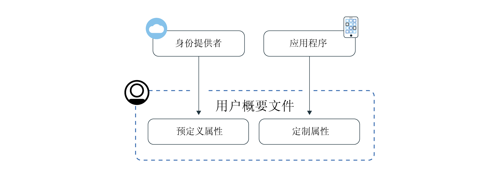
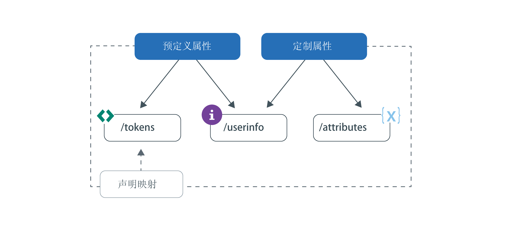

---

copyright:
  years: 2017, 2019
lastupdated: "2019-06-06"

keywords: Authentication, authorization, identity, app security, secure, attributes, user information, storing, accessing

subcollection: appid

---

{:new_window: target="_blank"}
{:shortdesc: .shortdesc}
{:screen: .screen}
{:pre: .pre}
{:table: .aria-labeledby="caption"}
{:codeblock: .codeblock}
{:tip: .tip}
{:note: .note}
{:important: .important}
{:deprecated: .deprecated}
{:download: .download}
{:java: .ph data-hd-programlang='java'}
{:javascript: .ph data-hd-programlang='javascript'}
{:swift: .ph data-hd-programlang='swift'}
{:curl: .ph data-hd-programlang='curl'}


# 存储和访问概要文件
{: #profiles}

用户概要文件是将特定用户的所有已知信息汇集成一个对象并由 {{site.data.keyword.appid_full}} 进行存储的结果。这些信息可以是预定义的信息、分配的信息，或者是在用户与应用程序交互期间了解到的关于用户的信息。通过利用概要文件功能，可以为每个用户构建个性化的应用程序体验。
{: shortdesc}


在查找有关 Cloud Directory 用户的信息？请查看[管理用户](/docs/services/appid?topic=appid-cd-users)。
{: tip}

App ID 可以获取并存储两种类型的信息：预定义属性和定制属性。预定义属性特定于用户身份，并在用户登录到应用程序时由身份提供者返回，可能包含用户的姓名或年龄等信息。定制属性用于存储有关用户的其他信息。定制属性可以由您进行设置，也可以在用户与应用程序交互期间进行了解。定制属性可能包含分配的角色、食品偏好或乘坐飞机时首选靠近过道的座位。



图. 用户概要文件信息流程


您可以为每个用户存储 100 KB 信息。
{: note}


## 访问用户概要文件
{: #profile-access}

可通过不同的方式来访问属性。在用户认证成功后，应用程序会从 {{site.data.keyword.appid_short_notm}} 收到访问令牌和身份令牌。用户信息端点和定制属性端点均受 {{site.data.keyword.appid_short_notm}} 在认证过程结束时生成的访问令牌的保护。身份令牌包含身份提供者返回的用户属性（信息）的标准化子集。要获取完整的用户属性列表，可使用 OIDC [`/userinfo` 端点](https://us-south.appid.cloud.ibm.com/swagger-ui/#/Authorization_Server_V4/userInfo)。
{: shortdesc}


有关身份令牌和访问令牌的更多信息，请参阅[了解令牌](/docs/services/appid?topic=appid-tokens#tokens)和[验证令牌](/docs/services/appid?topic=appid-token-validation)。


查看下图以了解可以获取用户信息的不同方法。


图. 访问用户概要文件选项


App ID 会自动将属性子集注入到访问令牌和身份令牌中。您可以利用定制声明映射，并将其他预定义和定制声明映射到令牌中。有关访问用户信息的建议方式的更多详细信息，请参阅[定制令牌](/docs/services/appid?topic=appid-customizing-tokens)。
{: note}


### 使用 SDK 访问 /userinfo 端点
{: #profile-predefined-access}

要查看有关已配置身份提供者提供的用户的信息，可以访问预定义属性。
{: shortdesc}

**iOS Swift**
{: ph data-hd-programlang='swift'}

如果未显式地将新令牌传递给 SDK，那么 {{site.data.keyword.appid_short_notm}} 使用上次收到的令牌来检索并验证响应。例如，您可以在认证成功后执行以下代码，并且 SDK 检索有关用户的其他信息。
{: ph data-hd-programlang='swift'}

```
AppID.sharedInstance.userProfileManager.getUserInfo { (error: Error?, userInfo: [String: Any]?) in
	guard let userInfo = userInfo, err == nil {
		return // an error has occurred
	}
	// retrieved user info successfully
}
```
{: codeblock}
{: ph data-hd-programlang='swift'}

或者，也可以显式地传递访问和身份令牌。身份令牌为可选，但是在传递时，用于验证用户信息响应。
{: ph data-hd-programlang='swift'}

```
AppID.sharedInstance.userProfileManager.getUserInfo(accessToken: String, identityToken: String?) { (error: Error?, userInfo: [String: Any]?) in
	guard let userInfo = userInfo, err == nil {
		return // an error has occurred
	}
	// retrieved user info successfully
}
```
{: codeblock}
{: ph data-hd-programlang='swift'}

**Java**
{: ph data-hd-programlang='java'}

如果未显式地将新令牌传递给 SDK，那么 {{site.data.keyword.appid_short_notm}} 使用上次收到的令牌来检索并验证响应。例如，您可以在认证成功后执行以下代码，并且 SDK 检索有关用户的其他信息。
{: ph data-hd-programlang='java'}

```
AppID appId = AppID.getInstance();

appId.getUserProfileManager().getUserInfo(new UserProfileResponseListener() {
	@Override
	public void onSuccess(JSONObject userInfo) {
		// retrieved user info successfully
	}

	@Override
	public void onFailure(UserInfoException e) {
		// exception occurred
	}
});
```
{: codeblock}
{: ph data-hd-programlang='java'}

或者，也可以显式地传递访问和身份令牌。身份令牌是可选的。但是如果传递了身份令牌，会将其用于验证响应。
{: ph data-hd-programlang='java'}

```
AppID appId = AppID.getInstance();

appId.getUserProfileManager().getUserInfo(accessToken, identityToken, new UserProfileResponseListener() {
	@Override
	public void onSuccess(JSONObject userInfo) {
		// retrieved attribute "name" successfully
	}

	@Override
	public void onFailure(UserInfoException e) {
		// exception occurred
	}
});
```
{: codeblock}
{: ph data-hd-programlang='java'}

**Node.js**
{: ph data-hd-programlang='javascript'}

通过使用服务器端 SDK，您可以检索有关用户的其他信息。您可以使用存储的访问和身份令牌来调用以下方法，也可以显式地传递令牌。身份令牌为可选，但是在传递时，用于验证用户信息响应。
{: ph data-hd-programlang='javascript'}

```javascript
let userProfileManager = UserProfileManager(options: options)

let accessToken = req.session[WebAppStrategy.AUTH_CONTEXT].accessToken;
let identityToken = req.session[WebAppStrategy.AUTH_CONTEXT].identityToken;


// Retrieve user info and validate against the given identity token
userProfileManager.getUserInfo(accessToken, identityToken).then(function (profile) {
	// retrieved user info successfully
});

// Retrieve user info without validation
userProfileManager.getUserInfo(accessToken).then(function (profile) {
	// retrieved user info successfully
});
```
{: codeblock}
{: ph data-hd-programlang='javascript'}


**服务器端 Swift**
{: ph data-hd-programlang='swift'}

通过使用服务器端 SDK，您可以检索有关用户的其他信息。您可以使用存储的访问和身份令牌来调用以下方法，也可以显式地传递令牌。身份令牌为可选，但是在传递时，用于验证用户信息响应。
{: ph data-hd-programlang='swift'}


```swift
let userProfileManager = UserProfileManager(options: options)

let accessToken = "<access token>"
let identityToken = "<identity token>"

// If identity token is provided (recommended approach), response is validated against the identity token
userProfileManager.getUserInfo(accessToken: accessToken, identityToken: identityToken) { (err, userInfo) in
	guard let userInfo = userInfo, err == nil {
		return // an error has occurred
	}
	// retrieved user info successfully
}

// Retrieve the UserInfo without any validation
userProfileManager.getUserInfo(accessToken: accessToken) { (err, userInfo) in
	guard let userInfo = userInfo, err == nil {
		return // an error has occurred
	}
	// retrieved user info successfully
}
```
{: codeblock}
{: ph data-hd-programlang='swift'}


### 使用 API 访问 /userinfo 端点
{: #profile-predefined-api}


您可以通过 `/userinfo` 端点查看其他信息。

1. 请确保您具有范围为 `openid` 的有效访问令牌。您可以使用 `/introspect` 端点来验证令牌是否有效。

2. 对 [`/userinfo` 端点](https://us-south.appid.cloud.ibm.com/swagger-ui/#/Authorization_Server_V4/userInfo)发出请求。
  ```
  GET [POST] https://{oauth-server-endpoint}/userinfo
  Authorization: 'Bearer {ACCESS_TOKEN}'
  ```
  {: codeblock}

  下面是输出示例：
  ```
  "sub": "cad9f1d4-e23b-3683-b81b-d1c4c4fd7d4c",
  "name": "John Doe",
  "email": "john.doe@gmail.com",
  "picture": "https://lh3.googleusercontent.com/-XdUIqdbhg/AAAAAAAAI/AAAAAAA/42rbcbv5M/photo.jpg",
  "gender": "male",
  "locale": "en",
  "identities": [
      {
          "provider": "google",
          "id": "104560903311317789798",
          "profile": {
              "id": "104560903311317789798",
              "email": "john.doe@gmail.com",
              "verified_email": true,
              "name": "John Doe",
              "given_name": "John",
              "family_name": "Doe",
              "link": "https://plus.google.com/104560903311317789798",
              "picture": "https://lh3.googleusercontent.com/-XdUIqdbhg/AAAAAAAAI/AAAAAAA/42rbcbv5M/photo.jpg",
              "gender": "male",
              "locale": "en",
              "idpType": "google"
          }
      }
  ]
  ```
  {: screen}

3. 验证 `sub` 声明是否与身份令牌中的 `sub` 声明完全匹配。如果不匹配，那么请勿使用返回的信息。要了解有关令牌替换的更多信息，请参阅 <a href="https://openid.net/specs/openid-connect-core-1_0.html#TokenSubstitution" target="__blank">OIDC 规范 </a>。

如果外部身份提供者执行更改，那么在用户再次登录时可获取更新的信息。新令牌会检索最新的数据。
{: tip}


### 访问 `/attributes` 端点
{: #profile-attributes-access}

根据您的配置，当用户与应用程序交互时，属性会被加密并保存为用户概要文件的一部分。交互可能是用户登录，也可能是在应用程序中设置首选项。要访问这些属性，请通过 API 方法来传递访问令牌。
{: shortdesc}

**iOS Swift**
{: ph data-hd-programlang='swift'}

  ```
  func setAttribute(key: String, value: String, completionHandler: @escaping(Error?, [String:Any]?) -> Void)
  func setAttribute(key: String, value: String, accessTokenString: String, completionHandler: @escaping(Error?, [String:Any]?) -> Void)
  func getAttribute(key: String, completionHandler: @escaping(Error?, [String:Any]?) -> Void)
  func getAttribute(key: String, accessTokenString: String, completionHandler: @escaping(Error?, [String:Any]?) -> Void)
  func getAttributes(completionHandler: @escaping(Error?, [String:Any]?) -> Void)
  func getAttributes(accessTokenString: String, completionHandler: @escaping(Error?, [String:Any]?) -> Void)
  func deleteAttribute(key: String, completionHandler: @escaping(Error?, [String:Any]?) -> Void)
  func deleteAttribute(key: String, accessTokenString: String, completionHandler: @escaping(Error?, [String:Any]?) -> Void)
  ```
  {: codeblock}
  {: ph data-hd-programlang='swift'}

  **Java**
  {: ph data-hd-programlang='java'}

  ```
  void setAttribute(@NonNull String name, @NonNull String value, UserAttributeResponseListener listener);
  void setAttribute(@NonNull String name, @NonNull String value, @NonNull AccessToken accessToken, UserAttributeResponseListener listener);

  void getAttribute(@NonNull String name, UserAttributeResponseListener listener);
  void getAttribute(@NonNull String name, @NonNull AccessToken accessToken, UserAttributeResponseListener listener);

  void deleteAttribute(@NonNull String name, UserAttributeResponseListener listener);
  void deleteAttribute(@NonNull String name, @NonNull AccessToken accessToken, UserAttributeResponseListener listener);

  void getAllAttributes(@NonNull UserAttributeResponseListener listener);
  void getAllAttributes(@NonNull AccessToken accessToken, @NonNull UserAttributeResponseListener listener);
  ```
  {: codeblock}
  {: ph data-hd-programlang='java'}

  **Node.js**
  {: ph data-hd-programlang='javascript'}

  ```
function getAllAttributes(accessTokenString) {}
	function getAttribute(accessTokenString, key) {}
	function setAttribute(accessTokenString, key, value) {}
	function deleteAttribute(accessTokenString, name) {}
  ```
  {: codeblock}
  {: ph data-hd-programlang='javascript'}

  **服务器端 Swift**
  {: ph data-hd-programlang='swift'}

  ```
  func getAllAttributes(accessToken: String, completionHandler: (Swift.Error?, [String: Any]?) -> Void)
  func getAttribute(accessToken: String, attributeName: String, completionHandler: (Swift.Error?, [String: Any]?) -> Void)
  func setAttribute(accessToken: String, attributeName: String, attributeValue : "abc", completionHandler: (Swift.Error?, [String: Any]?) -> Void)
  func deleteAllAttributes(accessToken: String, completionHandler: (Swift.Error?, [String: Any]?) -> Void)
  ```
  {: codeblock}
  {: ph data-hd-programlang='swift'}


## 设置定制属性
{: #profile-set-custom}

通过设置定制属性，可以向用户概要文件添加有关用户的信息，例如角色或首选项。
{: shortdesc}

缺省情况下，定制属性是可修改的，并且可以通过客户端应用程序使用 App ID 访问令牌来更新。这意味着，只要用户或应用程序有权对访问令牌进行访问，那么在第一个用户登录后，该用户或应用程序就可以立即更新定制属性，而不必执行适当的预防措施。这可能会导致意外的后果。例如，用户可以将其角色从用户更改为管理员，而这可能会向恶意用户公开管理特权。
{: important}

1. 导航至 App ID 仪表板的**概要文件**选项卡，然后将定制属性切换到**已启用**。
2. [获取访问令牌](/docs/services/appid?topic=appid-obtain-tokens)。对应用程序的所有入局请求都具有授权头，并包含 `access_token`。
3. 对[属性 API](https://us-south.appid.cloud.ibm.com/swagger-ui/#/Attributes) 发出请求，或将以下其中一个片段添加到代码，以使用其中一个提供的 SDK。

  **iOS Swift**
  {: ph data-hd-programlang='swift'}

  ```
	AppID.sharedInstance.userProfileManager?.setAttribute("key", "value") { (error, result) in
		guard let result = result, error == nil else {
	  		return // an error has occurred
		}
		// attributes recieved as a Dictionary
	})
  ```
  {: codeblock}
  {: ph data-hd-programlang='swift'}

  **Java**
  {: ph data-hd-programlang='java'}

  ```
appId.getUserProfileManager().setAttribute(name, value, useThisToken, new UserProfileResponseListener() {
	@Override
		public void onSuccess(JSONObject attributes) {
			//attributes received in JSON format on successful response
		}

		@Override
		public void onFailure(UserAttributesException e) {
			// exception occurred
	}
});
  ```
  {: codeblock}
  {: ph data-hd-programlang='java'}

  **Node.js**
  {: ph data-hd-programlang='javascript'}

  ```
	const userProfileManager = require("ibmcloud-appid").UserProfileManager;
	userProfileManager.init();

	var accessToken = req.session[WebAppStrategy.AUTH_CONTEXT].accessToken;

	userProfileManager.setAttribute(accessToken, name, value).then(function (attributes) {
		// attributes returned as dictionary
	});
  ```
  {: codeblock}
  {: ph data-hd-programlang='javascript'}

**服务器端 Swift**
{: ph data-hd-programlang='swift'}

  ```
let userProfileManager = UserProfileManager(options: options)
	let accesstoken = "access token"

	userProfileManager.setAttribute(accessToken: accessToken, attributeName: "name", attributeValue : "abc") { (error, response) in
		guard let response = response, error == error else {
			return // an error has occurred
		}
		// attributes received as a Dictionary
  }
  ```
  {: codeblock}
  {: ph data-hd-programlang='swift'}


## 后续步骤
{: #next-custom-attributes}

有关使用特定语言 SDK 的更多信息，请参阅以下 GitHub 存储库：

* <a href="https://github.com/ibm-cloud-security/appid-clientsdk-android" target="_blank">Android SDK </a>
* <a href="https://github.com/ibm-cloud-security/appid-clientsdk-swift" target="_blank">iOS Swift SDK </a>
* <a href="https://github.com/ibm-cloud-security/appid-serversdk-nodejs" target="_blank">Node.js SDK </a>
* <a href="https://github.com/ibm-cloud-security/appid-serversdk-swift" target="_blank">服务器 Swift SDK </a>

