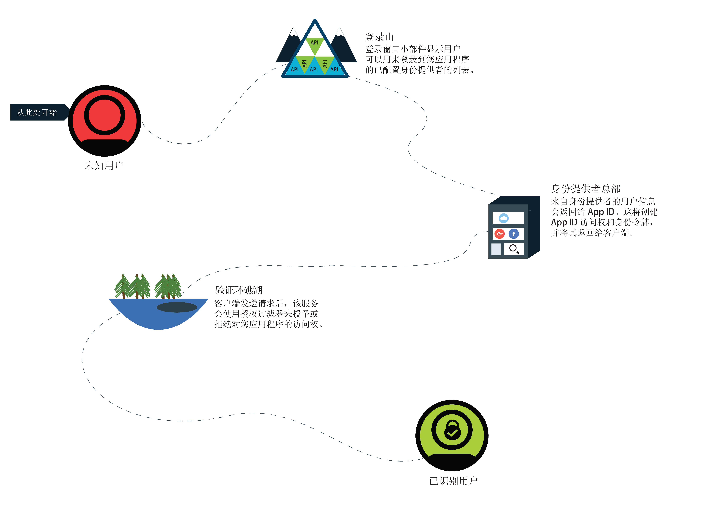
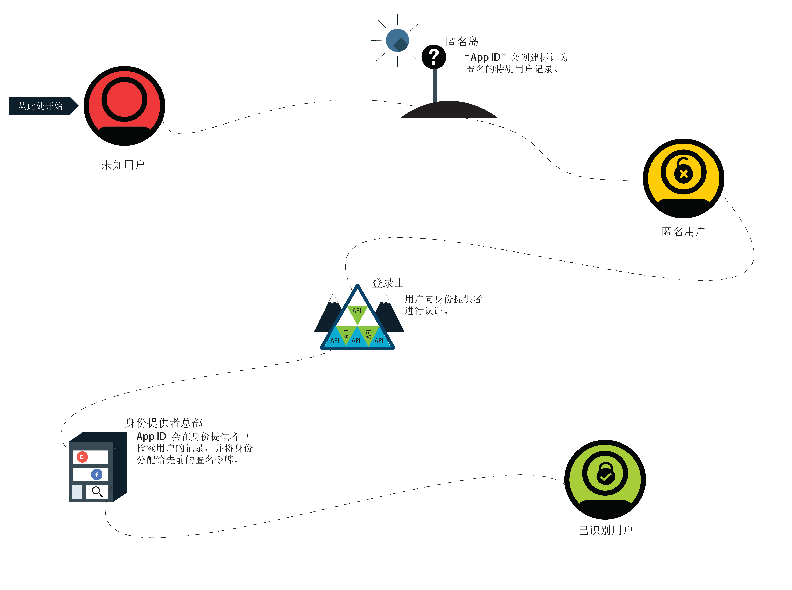

---

copyright:
  years: 2017, 2019
lastupdated: "2019-03-06"

keywords: authentication, authorization, identity, app security, secure, anonymous, progressive, profiles, sign in

subcollection: appid

---

{:new_window: target="_blank"}
{:shortdesc: .shortdesc}
{:screen: .screen}
{:pre: .pre}
{:table: .aria-labeledby="caption"}
{:codeblock: .codeblock}
{:tip: .tip}
{:note: .note}
{:important: .important}
{:deprecated: .deprecated}
{:download: .download}

# 匿名认证
{: #anonymous}

在开发应用程序时，一个最重要的问题就是安全性。如何确保只有拥有正确访问权限的用户才能使用应用程序？您需要使用授权流程。在大多数流程中，授权和认证一起进行耦合，这会让更改安全策略和身份提供者变得复杂。利用 {{site.data.keyword.appid_full}}，可以将授权和认证分为不同的流程。
{: shortdesc}

用户成功登录后，即成为已识别用户。身份提供者会将包含用户相关信息的访问令牌和身份令牌返回到 {{site.data.keyword.appid_short}}。该服务接收提供的令牌，并确定用户有没有可访问应用程序的正确凭证。如果令牌通过了验证，那么该服务会授权用户访问应用程序。用户获得授权后，认证信息会与用户概要文件相关联。概要文件及其属性可由使用相同身份提供者进行认证的任何客户端再次访问。

## 渐进式认证
{: #progressive}

利用 {{site.data.keyword.appid_short_notm}}，匿名用户可以选择成为已识别用户。

如果用户选择不立即登录，就会被视为匿名用户。例如，用户无需登录就可以立即开始向购物车添加项目。对于匿名用户，{{site.data.keyword.appid_short_notm}} 会创建特别用户概要文件，并调用将返回匿名访问令牌和身份令牌的 OAuth 登录 API。通过使用这些令牌，应用程序可以创建、读取、更新和删除存储在用户概要文件中的属性。

在匿名用户登录时，他们的访问令牌将会传递到登录 API。该服务会通过身份提供者认证调用。然后，该服务会使用访问令牌来查找匿名概要文件，并将用户的身份附加到其中。新的访问令牌和身份令牌包含身份提供者共享的公共信息。识别用户之后，其匿名令牌将失效。不过，用户仍可访问其属性，因为使用新令牌即可访问。

只能为尚未分配给其他用户的身份分配匿名概要文件。
{: tip}

如果身份已经与其他 {{site.data.keyword.appid_short_notm}} 用户关联，那么令牌会包含该用户概要文件的信息，并提供对其属性的访问权。先前匿名用户的属性将无法通过新的令牌进行访问。在此令牌到期之前，仍可通过匿名访问令牌来访问这些信息。开发应用程序时，您可以选择要如何将匿名属性合并到已知用户。
