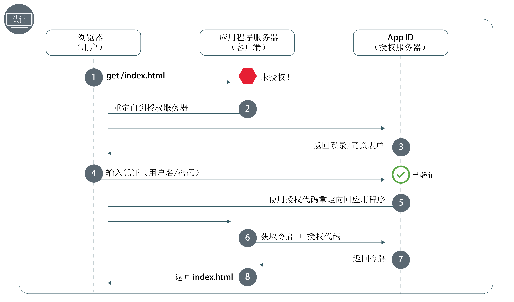

---

copyright:
  years: 2017, 2019
lastupdated: "2019-07-11"

keywords: Authentication, authorization, identity, app security, secure, development, nodejs, frontend, web apps, 

subcollection: appid

---

{:external: target="_blank" .external}
{:shortdesc: .shortdesc}
{:screen: .screen}
{:pre: .pre}
{:table: .aria-labeledby="caption"}
{:codeblock: .codeblock}
{:tip: .tip}
{:note: .note}
{:important: .important}
{:deprecated: .deprecated}
{:download: .download}


# Web：Node.js
{: #web-node}

通过 {{site.data.keyword.appid_short_notm}}，您可以轻松保护 Node.js 前端 Web 应用程序。使用本指南，您可以在不到 20 分钟的时间内快速入门和熟悉运用简单的认证流程。
{: shortdesc}

查看下图以了解授权代码 OAuth 2.0 工作流程。



1. 用户尝试获取对受保护 Web 应用程序的访问权，但该用户未经授权。
2. 应用程序将该用户重定向到 {{site.data.keyword.appid_short_notm}}。
3. {{site.data.keyword.appid_short_notm}} 显示用户可用于认证的登录屏幕。
4. 用户输入其凭证，例如用户名和密码。App ID 对凭证进行验证。
5. {{site.data.keyword.appid_short_notm}} 使用授权代码将用户重定向回应用程序。
6. 通过使用授权代码，应用程序向 {{site.data.keyword.appid_short_notm}} 发出请求以确保对用户进行验证。有关获取访问令牌的更多信息，请参阅[获取令牌](/docs/services/appid?topic=appid-obtain-tokens)。
7. {{site.data.keyword.appid_short_notm}} 返回已验证用户的访问令牌和身份令牌。
8. 然后，授权用户访问应用程序。


## 视频教程
{: #web-node-video}

请查看以下视频，以了解如何使用 {{site.data.keyword.appid_short_notm}} 来保护简单的 Node.js Web 应用程序。视频中涵盖的所有信息还可在此页面上找到对应的书面文字。

<iframe class="embed-responsive-item" id="appid-web-node" title="关于 {{site.data.keyword.appid_short_notm}} Node.js 应用程序" type="text/html" width="640" height="390" src="//www.youtube.com/embed/6roa1ZOvwtw?rel=0" frameborder="0" webkitallowfullscreen mozallowfullscreen allowfullscreen></iframe>

您没有可以试用此流程的应用程序吗？没问题！{{site.data.keyword.appid_short_notm}} 提供了[简单的 Node.js Web 样本应用程序](https://github.com/ibm-cloud-security/appid-video-tutorials/tree/master/02a-simple-node-web-app){: external}。

 

## 开始之前
{: #web-node-before}

在 Node.js Web 应用程序中开始使用 {{site.data.keyword.appid_short_notm}} 之前，您必须满足以下先决条件。
{: shortdesc}

* [{{site.data.keyword.appid_short_notm}} 服务](https://cloud.ibm.com/catalog/services/app-id){: external}的实例
* [IBM Cloud CLI](/docs/cli?topic=cloud-cli-getting-started)
* [NPM V4+](https://www.npmjs.com/get-npm){: external}
* [Node V6+](https://nodejs.org/en/download/){: external}


## 步骤 1：注册重定向 URI
{: #node-web-redirect-uri}

重定向 URI 是应用程序的回调端点。在执行登录流程期间，{{site.data.keyword.appid_short_notm}} 在允许客户端参与授权工作流程之前，会先验证 URI，这有助于防止网络钓鱼攻击和授权代码泄漏。通过注册 URI，即向 {{site.data.keyword.appid_short_notm}} 表明该 URI 是可信的，重定向您的用户没有问题。
{: shortdesc}

1. 单击**管理认证 > 认证设置**。

2. 在**添加 Web 重定向 URI** 字段中，输入 URI。每个 URI 都应以 `http://` 或 `https://` 开头，并且必须包含完整路径，包括支持成功重定向的任何查询参数。

3. 单击**添加 Web 重定向 URI** 框中的 **+** 号。

4. 重复步骤 1 到 3，直到将所有可能的 URI 都添加到列表中。


## 步骤 2：获取凭证
{: #node-web-credentials}

可以通过以下两种方式之一来获取凭证。
{: shortdesc}

  * 导航至 {{site.data.keyword.appid_short_notm}} 仪表板的**应用程序**选项卡。如果尚未具有应用程序，那么可以单击**添加应用程序**来创建新应用程序。

  * 对 [`/management/v4/{tenantId}/applications` 端点](https://us-south.appid.cloud.ibm.com/swagger-ui/#!/Applications/registerApplication)发出 POST 请求。

    请求格式：
    ```javascript
    curl -X POST \  https://us-south.appid.cloud.ibm.com/management/v4/39a37f57-a227-4bfe-a044-93b6e6060b61/applications/ \
    -H 'Content-Type: application/json' \
    -H 'Authorization: Bearer IAM_TOKEN' \
    -d '{"name": "ApplicationName"}'
    ```
    {: codeblock}

    示例响应：
    ```javascript
    {
      "clientId": "xxxxx-34a4-4c5e-b34d-d12cc811c86d",
      "tenantId": "xxxxx-9b1f-433e-9d46-0a5521f2b1c4",
      "secret": "ZDk5YWZkYmYt*******",
      "name": "app1",
      "oAuthServerUrl": "https://us-south.appid.cloud.ibm.com/oauth/v4/xxxxx-9b1f-433e-9d46-0a5521f2b1c4",
      "profilesUrl": "https://us-south.appid.cloud.ibm.com",
      "discoveryEndpoint": "https://us-south.appid.cloud.ibm.com/oauth/v4/xxxxxx-9b1f-433e-9d46-0a5521f2b1c4/.well-known/openid-configuration"
    }
    ```
    {: screen}


## 步骤 3：初始化 SDK
{: #web-node-install}

使用 {{site.data.keyword.appid_short_notm}} 的最简单方法是利用 Node.JS SDK。
{: shortdesc}


1. 使用命令行来切换到包含 Node.js 应用程序的目录。

2. 安装以下 NPM 需求。

    ```javascript
    npm install --save express express-session passport
    ```
    {: codeblock}

3. 安装 {{site.data.keyword.appid_short_notm}} 服务。

    ```javascript
  npm install --save ibmcloud-appid
  ```
    {: codeblock}

4. 将以下需求添加到 `server.js` 文件。

    ```javascript
    const express = require('express'); 								// https://www.npmjs.com/package/express
    const session = require('express-session');							// https://www.npmjs.com/package/express-session
    const passport = require('passport');								// https://www.npmjs.com/package/passport
    const WebAppStrategy = require('ibmcloud-appid').WebAppStrategy;	// https://www.npmjs.com/package/ibmcloud-appid
    ```
    {: shortdesc}

5. 使用在步骤 1 中获取的凭证，将应用程序设置为使用 express-session 中间件。可以选择以下两种方式之一来设置重定向 URI 的格式：手动使用新的 `WebAppStrategy({redirectUri: "...."})`，或者将值设置为环境变量，如示例代码中所示。

    ```javascript
    const app = express();
    app.use(session({
        secret: '123456',
        resave: true,
        saveUninitialized: true
    }));
    app.use(passport.initialize());
    app.use(passport.session());
    passport.serializeUser((user, cb) => cb(null, user));
    passport.deserializeUser((user, cb) => cb(null, user));
    passport.use(new WebAppStrategy({
        tenantId: "<tenant_ID>",
        clientId: "<client_ID>",
        secret: "<secret>",
        oauthServerUrl: "<OAuth_Server_URL>",
        redirectUri: "<redirect_URI>"
    }));
    ```
    {: codeblock}

    必须针对生产环境为中间件配置合适的会话存储量。有关更多信息，请参阅 <a href="https://github.com/expressjs/session" target="_blank">express.js 文档 </a>。
    {: note}


## 步骤 4：保护应用程序
{: #node-web-protect}

既然您已安装了 {{site.data.keyword.appid_short_notm}}，说明您已准备好保护应用程序。您可以选择通过定义 Web 应用程序策略来保护整个应用程序或仅保护特定资源。
{: shortdesc}


1. 配置回调端点。该回调通过从 App ID 中检索访问令牌和身份令牌，并将用户重定向到下列其中一个位置来完成授权过程：<ul><li>触发认证的请求的原始 URL，此 URL 持久存储在 `WebAppStrategy.ORIGINAL_URL` 所在的 HTTP 会话中。</li><li>指定用于在认证成功时执行的重定向。</li><li>应用程序根目录 (`/`)，如下一步中所示。</li></ul>

    ```javascript
   app.get(CALLBACK_URL, passport.authenticate(WebAppStrategy.STRATEGY_NAME));
   ```
    {: codeblock}

2. 设置登录端点，用于始终将浏览器重定向到登录窗口小部件。确保添加成功重定向选项，以避免最终产生无限认证循环。

    ```javascript
    app.get('/appid/login', passport.authenticate(WebAppStrategy.STRATEGY_NAME, {
        successRedirect: '/',
        forceLogin: true
    }));
    ```
    {: codeblock}

3. 配置注销。用户从应用程序中注销时，将从该会话中清除该用户的所有认证信息。要与应用程序进行交互，用户需要重新登录。

    ```javascript
    app.get('/appid/logout', function(req, res){
        webappstrategy.logout(req);
        res.redirect('/');
    });
    ```
    {: shortdesc}

## 步骤 5：个性化应用程序
{: #node-web-user-info}

可以拉取身份提供者提供的信息来个性化应用程序体验。
{: shortdesc}

1. 配置应用程序以获取用户信息。`protected` 是占位符变量，可以更改为与应用程序的端点相匹配。

    ```javascript
    app.get("/protected", passport.authenticate(WebAppStrategy.STRATEGY_NAME), function(req, res){
        res.json(req.user);
    });
    ```
    {: codeblock}

    例如，在样本应用程序中，可以看到如何获取用户名来个性化应用程序。
    ```javascript
    app.get('/api/user', (req, res) => {
        // console.log(req.session[WebAppStrategy.AUTH_CONTEXT]);
        res.json({
            user: {
                name: req.user.name
            }
        });
    });
    ```
    {: codeblock}


## 步骤 6：测试配置
{: #node-web-test}

要测试授权配置，请导航至服务器在侦听的 URL（在应用程序中定义）。请尝试登录，然后尝试注销。确保配置按预期工作。 

准备好移至下一步时，可以尝试启用[针对 Cloud Directory 的多因子认证](/docs/services/appid?topic=appid-cd-mfa)或添加[定制属性](/docs/services/appid?topic=appid-profiles)以进一步个性化应用程序。


