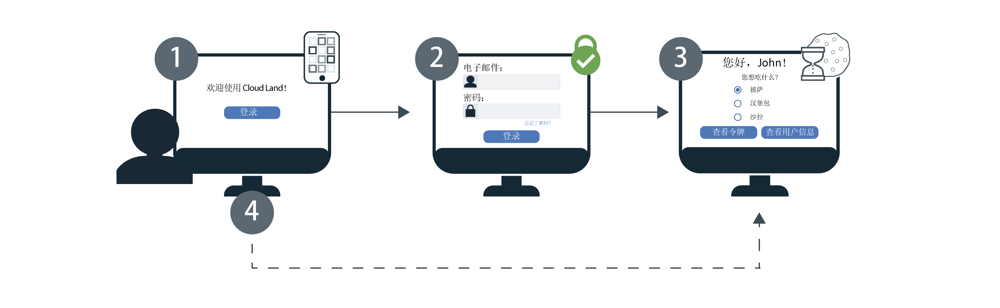

---

copyright:
  years: 2017, 2019
lastupdated: "2019-07-09"

keywords: Authentication, authorization, identity, app security, secure, development, sso, directory, users, registry, multiple apps

subcollection: appid

---

{:external: target="_blank" .external}
{:shortdesc: .shortdesc}
{:screen: .screen}
{:pre: .pre}
{:table: .aria-labeledby="caption"}
{:codeblock: .codeblock}
{:tip: .tip}
{:note: .note}
{:important: .important}
{:deprecated: .deprecated}
{:download: .download}


# 单点登录 (SSO)
{: #cd-sso}

通过 Cloud Directory 的单点登录 (SSO)，可以提供在多个 Web 应用程序之间的顺利认证体验。如果用户初始登录时开启了 SSO，那么用户下次登录时，无需重新输入其凭证。相反，用户会自动登录到由同一 {{site.data.keyword.appid_short_notm}} 实例进行保护的任何应用程序。


## 工作方式
{: #cd-sso-how-it-works}

查看下图以了解 SSO 的工作方式。



1. Cloud Directory 用户首次登录到应用程序。
2. 系统要求他们通过提供用户名或电子邮件和密码进行认证。
3. 如果凭证有效，用户将登录到应用程序。同时，{{site.data.keyword.appid_short_notm}} 会创建会话并在用户的浏览器上设置 cookie。
4. 如果用户尝试登录到其他某个应用程序，那么 {{site.data.keyword.appid_short_notm}} 会检测会话 cookie，并使用户自动登录到该应用程序。{{site.data.keyword.appid_short_notm}} 会话 cookie 是特定于实例的，并且由实例的唯一专用密钥进行签名。

此时，SSO 已配置为在 Cloud Directory 是启用的唯一身份提供者时有效。如果 {{site.data.keyword.appid_short_notm}} 的实例配置为使用多个身份提供者，那么启用 SSO 不会影响登录流程。用户每次登录时，系统都会提示用户输入其 Cloud Directory 凭证或选择其他某个提供者。
{: note}


## 配置 SSO
{: #cd-sso-configure}

可以使用 {{site.data.keyword.appid_short_notm}} 仪表板或使用 API 来配置单点登录。
{: shortdesc}


### 使用 GUI
{: #cd-sso-configure-gui}


可以通过 GUI 来配置 SSO。

1. 导航至 {{site.data.keyword.appid_short_notm}} 仪表板的 **Cloud Directory > 单点登录**选项卡。

2. 在**启用单点登录**框中，将 SSO 切换到**已启用**。

3. 设置 SSO 会话将在用户处于不活动状态多久之后到期。会话到期后，用户必须重新登录。此时间以分钟为单位进行指定，并且允许的最长不活动时间为 10,080 分钟（7 天）。缺省时间为 1440 分钟，相当于 1 天。

4. 将重定向 URI 添加到**注销重定向 URI** 框，然后单击 **+** 号。请确保仅注册您信任的应用程序。通过注册 URI，可授权 {{site.data.keyword.appid_short_notm}} 将应用程序包含在授权工作流程中。

5. 单击**保存**。


### 使用 API
{: #cd-sso-configure-api}

通过使用 SSO 配置管理 API 来定义三个设置，可以开启 SSO 功能。

示例调用：

```json
{
  "isActive": true,
  "inactivityTimeoutSeconds": 86400,
  "logoutRedirectUris": [
    "http://my-first-app.com/after_logout",
    "http://my-second-app.com/after_logout"
  ]
}
```
{: screen}

<table>
  <tr>
    <th>设置</th>
    <th>定义</th>
  </tr>
  <tr>
    <td><code>isActive</code></td>
    <td>要启用 SSO，请将此值设置为 <code>true</code>。缺省设置为 <code>false</code>。</td>
  </tr>
  <tr>
    <td><code>inactivityTimeoutSeconds</code></td>
    <td>在要求用户重新输入其凭证之前，允许没有任何用户活动的最长时间。此值以秒为单位进行指定，最大可以是 <code>604800 秒</code>（7 天）。缺省设置为 <code>86400 秒</code>（1 天）。</td>
  </tr>
  <tr>
    <td><code>logoutRedirectUris</code></td>
    <td>{{site.data.keyword.appid_short_notm}} 可以在用户注销后将用户重定向到的允许 URI 的逗号分隔列表。</td>
  </tr>
</table>


## 配置注销
{: #cd-sso-log-out}

通过 {{site.data.keyword.appid_short_notm}}，可以针对用户的当前浏览器结束用户的 SSO 会话。如果 API 端点是通过用户的浏览器访问的，那么会终止用户的会话，并且系统会在用户下次尝试在该浏览器中登录时，提示用户输入其凭证 - 对于任何应用程序都会要求这样做。
{: shortdesc}


启动了更改密码、重置密码或更新密码这其中一个流程时，系统会自动终止用户在所有客户端中的会话。
{: note}


### 使用 API
{: #cd-sso-log-out-api}

要注销用户，请使用您的信息完成以下 API 调用，以重定向用户的浏览器。

```
https://<region>.appid.cloud.ibm.com/oauth/v4/<tenant-id>/cloud_directory/sso/logout?redirect_uri=<redirect_uri>&client_id=<clientId>
```
{: codeblock}

<table>
  <tr>
    <th>变量 </th>
    <th>值</th>
  </tr>
  <tr>
    <td><code>区域</code></td>
    <td>供应 {{site.data.keyword.appid_short_notm}} 实例的区域。选项包括：<code>au-syd</code>、<code>eu-de</code>、<code>eu-gb</code>、<code>jp-tok</code> 和 <code>us-south</code>。</td>
  </tr>
  <tr>
    <td><code>tenant-id</code></td> <td>{{site.data.keyword.appid_short_notm}} 的实例的唯一标识。可以在 {{site.data.keyword.appid_short_notm}} 仪表板的<em>服务凭证</em>选项卡中找到此值。如果没有服务凭证集，可以进行创建，然后从中获取此值。</td>
  </tr>
  <tr>
    <td><code>redirect_uri</code></td>
    <td>通过 {{site.data.keyword.appid_short_notm}} 仪表板在 SSO 配置中指定的 URI。出于安全原因，如果未指定值，那么不会执行重定向，并且会显示错误。</td>
  </tr>
</table>

即使 SSO 会话已结束，只要用户在其会话中存储的有效访问令牌未到期，那么用户也可能无需再次输入其凭证。缺省情况下，令牌会在一小时后到期。
{: note}


### 使用 Node.JS 服务器 SDK
{: #cd-sso-log-out-nodejs}

您还可以使用 {{site.data.keyword.appid_short_notm}} Node.js 服务器 SDK 来自动处理重定向。

    示例：

```javascript
app.get('/logoutSSO', (req, res) => {
  res.clearCookie("refreshToken");
  webAppStrategy.logoutSSO(req,res, { "redirect_uri": "https://my-app.com/after_logout" });
  });
```
{: screen}


## 结束用户的所有会话
{: cd-sso-ending-all-sessions}

作为管理员，您可以使用 {{site.data.keyword.appid_short_notm}} 管理 API 来结束任何给定用户的所有 SSO 会话。这些 API 由 Cloud IAM 令牌进行保护。

示例 API 请求：

```
POST https://<region>.appid.cloud.ibm.com/management/v4/{tenant-id}/cloud_directory/Users/{user-id}/sso/logout
Headers:
Authorization: <IAM TOKEN>
```
{: codeblock}

<table>
  <tr>
    <th>变量 </th>
    <th>值</th>
  </tr>
  <tr>
    <td><code>区域</code></td>
    <td>供应 {{site.data.keyword.appid_short_notm}} 实例的区域。选项包括：<code>us-south</code>、<code>eu-gb</code> 和 <code>eu-de</code>。</td>
  </tr>
  <tr>
    <td><code>tenant-id</code></td> <td>{{site.data.keyword.appid_short_notm}} 的实例的唯一标识。可以在 {{site.data.keyword.appid_short_notm}} 仪表板的<em>服务凭证</em>选项卡中找到此值。如果没有服务凭证集，可以进行创建，然后从中获取此值。</td>
  </tr>
  <tr>
    <td><code>user-id</code></td>
    <td>Cloud Directory 用户的唯一标识。可以使用 [Cloud Directory 用户 API](https://us-south.appid.cloud.ibm.com/swagger-ui/#/) 或通过查看用户的身份令牌来获取此标识。</td>
  </tr>
</table>

调用此 API 时，指定用户的所有 SSO 会话都会失效。这意味着下次该用户尝试从任何设备或浏览器登录到任何应用程序时，都需要重新输入其凭证。

