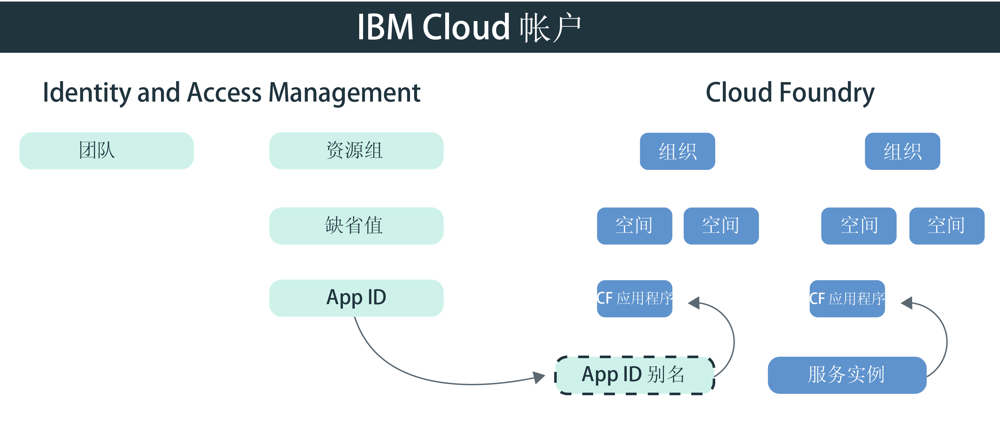

---

copyright:
  years: 2017, 2019
lastupdated: "2019-05-09"

keywords: authentication, authorization, identity, app security, secure, development, cloud foundry, access management, iam, java, node.js

subcollection: appid

---

{:new_window: target="_blank"}
{:shortdesc: .shortdesc}
{:screen: .screen}
{:pre: .pre}
{:table: .aria-labeledby="caption"}
{:codeblock: .codeblock}
{:tip: .tip}
{:note: .note}
{:important: .important}
{:deprecated: .deprecated}
{:download: .download}


# 教程：将 Cloud Foundry 配置为使用 {{site.data.keyword.appid_short_notm}}
{: #cloud-foundry}

通过 {{site.data.keyword.cloud_notm}}，您可以使用两种不同类型的访问管理来保护应用程序：Identity and Access Management (IAM) 和 Cloud Foundry。缺省情况下，{{site.data.keyword.appid_short_notm}} 的所有新实例都使用 IAM 资源组来管理访问权。如果要使用 Cloud Foundry 来管理应用程序，那么可以通过创建服务别名并将服务绑定到应用程序来桥接管理模型。
{: shortdesc}


## 了解 Cloud Foundry
{: #cf-understand}

别名在 IAM 管理的服务（如 {{site.data.keyword.appid_short_notm}}）与 Cloud Foundry 应用程序之间创建连接。绑定应用程序时，会创建服务凭证并自动将其传递给应用程序。尽管绑定是配置中的必需步骤，但它具有以下优点：

* 自动化：使用 VCAP_SERVICES 环境变量中存储的服务凭证时，您不再需要手动将其复制到应用程序。这一切操作都会使用 {{site.data.keyword.appid_short_notm}} SDK 代表您在后台完成。
* 安全：配置可防出错，因为该过程是自动执行的。
* 安全性：由于服务凭证仅存在于环境变量中，因此不会将与访问相关的任何内容硬编码到应用程序中。

Cloud Foundry 应用程序是在其他平台上托管的？没问题。您可以在应用程序中定义应用程序凭证以将其绑定到服务。可以通过 {{site.data.keyword.appid_short_notm}} 仪表板或向 [/applications 端点](https://us-south.appid.cloud.ibm.com/swagger-ui/#!/Applications/registerApplication)发出请求来查找应用程序凭证。
{: tip}

在下图中查看模型的组合方式：



## 开始之前
{: #cf-before}

开始之前，请确保满足以下先决条件：

* {{site.data.keyword.cloud_notm}} 帐户
* {{site.data.keyword.appid_short_notm}} 的实例。
* 本地安装的 [{{site.data.keyword.cloud_notm}} CLI](/docs/cli/reference/ibmcloud?topic=cloud-cli-ibmcloud-cli#ibmcloud-cli)

## 部署 Node.js 应用程序
{: #cf-node}


1. 导航至 {{site.data.keyword.appid_short_notm}} 的实例。

2. 单击服务仪表板的**概述**选项卡上的**下载样本**。

3. 单击 **Node.js**。下载并解压缩样本应用程序。

4. 验证是否满足所有 Node.js 先决条件。

5. 打开终端并切换到样本文件夹。

6. 登录到 {{site.data.keyword.cloud_notm}} CLI。如果未指定帐户和区域，CLI 将提示您进行选择。

  ```
  ibmcloud login -a cloud.ibm.com -r <region>
  ```
  {: codeblock}

  <table>
    <tr>
      <th>区域</th>
      <th>端点</th>
    </tr>
    <tr>
      <td>达拉斯</td>
      <td><code>us-south</code></td>
    </tr>
    <tr>
      <td>法兰克福</td>
      <td><code>eu-de</code></td>
    </tr>
    <tr>
      <td>悉尼</td>
      <td><code>au-syd</code></td>
    </tr>
    <tr>
      <td>伦敦</td>
      <td><code>eu-gb</code></td>
    </tr>
    <tr>
      <td>东京</td>
      <td><code>jp-tok</code></td>
    </tr>
  </table>

7. 将要在其中工作的 Cloud Foundry 组织和空间设定为目标，并按照提示设置目标组织和空间。

  ```
  ibmcloud target --cf
  ```
  {: codeblock}

8. 创建 {{site.data.keyword.appid_short_notm}} 服务实例的别名。

  ```
  ibmcloud resource service-alias-create {ALIAS_NAME} --instance-name {SERVICE_INSTANCE_NAME}
  ```
  {: codeblock}

9. 在 `manifest.yml` 中，将创建的别名添加到服务。

10. 通过部署样本应用程序，绑定 `manifest.yml` 文件中列出的服务。

  ```
  ibmcloud app push
  ```
  {: codeblock}

## 部署 Java 应用程序
{: #java}

1. 导航至 {{site.data.keyword.appid_short_notm}} 的实例。

2. 单击服务仪表板的**概述**选项卡上的**下载样本**。

3. 单击 **Java**。下载并解压缩样本应用程序。

4. 验证是否满足所有 Java 先决条件。

5. 打开终端并切换到样本文件夹。

6. 生成 `war` 文件并上传该文件。

  ```
  mvn clean install
  ```
  {: codeblock}

7. 切换到 Liberty 文件夹。

8. 登录到 {{site.data.keyword.cloud_notm}} CLI。如果未指定帐户和区域，CLI 将提示您进行选择。

  ```
  ibmcloud login -a cloud.ibm.com -r <region>
  ```
  {: codeblock}

8. 将要在其中工作的 Cloud Foundry 组织和空间设定为目标，并按照提示设置目标组织和空间。

  ```
  ibmcloud target --cf
  ```
  {: codeblock}

10. 创建 {{site.data.keyword.appid_short_notm}} 服务实例的别名。

  ```
  ibmcloud resource service-alias-create {ALIAS_NAME} --instance-name {SERVICE_INSTANCE_NAME}
  ```
  {: codeblock}

11. 在 `manifest.yml` 中，将创建的别名添加到服务。

      示例：
  ```
    applications:
  - name: ApplicationName
    memory: 512M
    services:
    - AppID-alias
  ```
  {: screen}

13. 通过部署样本应用程序，绑定 `manifest.yml` 文件中列出的服务。

  ```
  ibmcloud app push
  ```
  {: codeblock}

