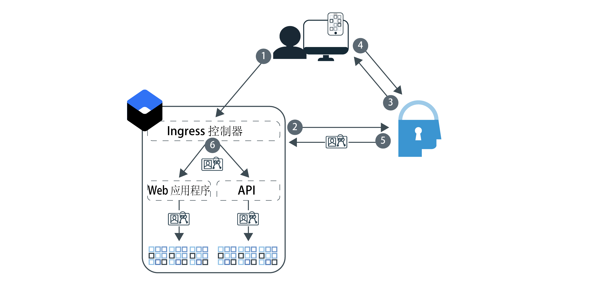

---

copyright:
  years: 2017, 2019
lastupdated: "2019-07-09"

keywords: Authentication, authorization, identity, app security, secure, development, ingress, policy, networking, containers, kubernetes

subcollection: appid

---

{:external: target="_blank" .external}
{:shortdesc: .shortdesc}
{:screen: .screen}
{:pre: .pre}
{:table: .aria-labeledby="caption"}
{:codeblock: .codeblock}
{:tip: .tip}
{:note: .note}
{:important: .important}
{:deprecated: .deprecated}
{:download: .download}


# 教程：配置 Ingress 以使用 {{site.data.keyword.appid_short_notm}}
{: #kube-auth}

您可以使用 {{site.data.keyword.containerlong}} 中的 Ingress 联网功能，以一致的方式来强制实施策略驱动的安全性。通过此方法，无需更改应用程序代码，就能同时对集群中的所有应用程序启用授权和认证！在本分步指南中，您可以了解如何配置 Ingress 控制器以使用 {{site.data.keyword.appid_short_notm}}。
{: shortdesc}

查看下图以了解认证流程：



1. 用户打开应用程序，并触发了对 Web 应用程序或 API 的请求。
2. 对于 API 流程，Ingress 控制器会尝试验证所提供的令牌。如果使用的是 Web 流程，那么将启动三重 OIDC 认证过程。
3. {{site.data.keyword.appid_short_notm}} 在认证过程中首先会显示登录窗口小部件。
4. 用户提供用户名或电子邮件和密码。
5. Ingress 控制器从 {{site.data.keyword.appid_short_notm}} 获取访问权和身份令牌以用于授权。
6. Ingress 控制器验证并转发到应用程序的每个请求都具有包含令牌的授权头。

目前，Ingress 控制器与 {{site.data.keyword.appid_short_notm}} 的集成不支持刷新令牌。因此，访问令牌和身份令牌到期时，用户必须重新认证。
{: note}


## 开始之前
{: #kube-prereqs}

开始之前，请确保您已满足以下先决条件。
{: shortdesc}


* 应用程序或样本应用程序。

* 标准 Kubernetes 集群，其中每个专区至少有两个工作程序节点。如果要在多专区集群中使用 Ingress，请查看 [Kubernetes Service 文档](/docs/containers?topic=containers-ingress#config_prereqs)中的额外先决条件。

* 部署了集群的相同区域中的 {{site.data.keyword.appid_short_notm}} 实例。确保服务名称不包含任何空格。

* 以下 [{{site.data.keyword.cloud_notm}} IAM 角色](/docs/containers?topic=containers-access_reference#access_reference)：
  * 集群：管理员平台角色
  * Kubernetes 名称空间：管理者服务角色

* 以下 CLI：

  * [{{site.data.keyword.cloud_notm}}](/docs/cli?topic=cloud-cli-getting-started)
  * [Kubernetes](https://kubernetes.io/docs/tasks/tools/install-kubectl/)
  * [Docker](https://www.docker.com/products/container-runtime#/download)

* 以下 [ CLI 插件](/docs/cli?topic=cloud-cli-install-devtools-manually#idt-install-kubernetes-cli-plugin)：

  * {{site.data.keyword.containershort}}
  * {{site.data.keyword.registryshort_notm}}

要获得有关获取已下载的 CLI 和插件以及配置的 Kubernetes Service 环境的帮助，请查看[创建 Kubernetes 集群](/docs/containers?topic=containers-cs_cluster_tutorial#cs_cluster_tutorial_lesson1)教程。
{: tip}


让我们开始吧！

## 步骤 1：将 {{site.data.keyword.appid_short_notm}} 绑定到集群
{: #kube-create-appid}

通过将 {{site.data.keyword.appid_short_notm}} 实例绑定到集群，可由同一 {{site.data.keyword.appid_short_notm}} 实例控制位于该集群中的所有应用程序实例。此外，应用程序启动后，{{site.data.keyword.appid_short_notm}} 元数据和凭证即作为 Kubernetes 私钥可用。
{: shortdesc}


1. 登录到 {{site.data.keyword.cloud_notm}} CLI。遵循 CLI 中的提示来完成登录。如果使用的是联合标识，请确保将 `--sso` 标志附加到命令末尾。

  ```
  ibmcloud login -a cloud.ibm.com -r <region>
  ```
  {: codeblock}

  <table>
    <tr>
      <th>区域</th>
      <th>端点</th>
    </tr>
    <tr>
      <td>达拉斯</td>
      <td><code>us-south</code></td>
    </tr>
    <tr>
      <td>法兰克福</td>
      <td><code>eu-de</code></td>
    </tr>
    <tr>
      <td>悉尼</td>
      <td><code>au-syd</code></td>
    </tr>
    <tr>
      <td>伦敦</td>
      <td><code>eu-gb</code></td>
    </tr>
    <tr>
      <td>东京</td>
      <td><code>jp-tok</code></td>
    </tr>
  </table>

2. 设置集群的上下文。

  1. 获取命令以设置环境变量并下载 Kubernetes 配置文件。

    ```
    ibmcloud ks cluster-config <cluster_name_or_ID>
    ```
    {: codeblock}

  2. 复制以 `export` 开头的输出，并将其粘贴到终端以设置 `KUBCONFIG` 环境变量。

3. 检查以确定在缺省名称空间中是否已有 Ingress 控制器。IBM Cloud Kubernetes Service 支持每个名称空间一个 Ingress。如果您已经拥有 Ingress，那么可以更新现有 Ingress 配置，或者使用其他名称空间。

  ```
  kubectl get ingress
  ```
  {: codeblock}

4. 绑定 {{site.data.keyword.appid_short_notm}} 的实例。绑定操作将为服务实例创建服务密钥。可以使用 `-key` 标志来指定现有服务密钥。

  ```
  ibmcloud ks cluster-service-bind --cluster <cluster_name_or_ID> --namespace <namespace> --service <App-ID_instance_name> [--key <service_instance_key>]
  ```
  {: codeblock}

  如果未指定名称空间，那么将在 `default` 名称空间中创建私钥。
  {: tip}

  下面是输出示例：

  ```
  ibmcloud ks cluster-service-bind --cluster mycluster --namespace default --service appid1
  Binding service instance to namespace...
  OK
  Namespace:    default
  Secret name:  binding-appid1
  ```
  {: screen}

非常好！

## 步骤 2：将应用程序推送到 Container Registry
{: #kube-registry}

为了使应用程序能够在 Kubernetes 中运行，必须在注册表中托管该应用程序。
{: shortdesc}


1. 登录到 Container Registry CLI 插件。

  ```
  ibmcloud cr login
  ```
  {: codeblock}

2. 创建 Container Registry 名称空间。

  ```
  ibmcloud cr namespace-add <my_namespace>
  ```
  {: codeblock}

3. 构建和标记应用程序，并将应用程序作为映像推送到 Container Registry 中的名称空间。请确保在命令末尾包含句点 (.)。

  ```
  ibmcloud cr build -t registry.{region}.icr.io.net/{namespace}/{app-name}:{tag} .
  ```
  {: codeblock}

非常好！您几乎已准备好进行部署。

## 步骤 3：配置 Ingress
{: kube-ingress}

创建集群期间，会创建专用和公共 IBM Kubernetes Service 应用程序负载均衡器 (ALB)。要部署应用程序并利用 Ingress 控制器，请创建部署脚本。
{: shortdesc}


要确保集成的最佳性能，建议您始终使用最新版本的 IBM Kubernetes Service 应用程序负载均衡器 (ALB)。缺省情况下，集群已启用自动更新。有关自动更新的更多信息，请参阅 [On-demand ALB update feature on {{site.data.keyword.containershort}}](https://www.ibm.com/cloud/blog/on-demand-alb-update-feature-on-ibm-cloud-kubernetes-service)。
{: tip}

1. 获取在将 {{site.data.keyword.appid_short_notm}} 绑定到集群时，在集群名称空间中创建的私钥。注：这**不是** Container Registry 名称空间。

  ```
  kubectl get secrets --namespace=<namespace>
  ```
  {: codeblock}

  下面是输出示例：

  ```
  NAME                       TYPE                                  DATA      AGE
  binding-appid1             Opaque                                1         1m
  bluemix-default-secret     kubernetes.io/dockercfg               1         1h
  default-token-kf97z        kubernetes.io/service-account-token   3         1h
  ```
  {: screen}

2. 使用以下示例 `yaml` 文件来创建 Ingress 配置。有关定义部署其他部分的帮助，请查看[使用 CLI 部署应用程序](/docs/containers?topic=containers-app#app_cli)。

  ```
  apiVersion: extensions/v1beta1
  kind: Ingress
  metadata:
    name: myingress
    annotations:
      ingress.bluemix.net/appid-auth: "bindSecret=<bind_secret> namespace=<namespace> requestType=<request_type> serviceName=<myservice> [idToken=false]"
  spec:
    tls:
    - hosts:
      - mydomain
      secretName: mytlssecret
    rules:
    - host: mydomain
      http:
        paths:
        - path: /
          backend:
            serviceName: myservice
            servicePort: 8080
  ```
  {: screen}

  <table>
    <tr>
      <th>变量 </th>
      <th>描述</th>
    </tr>
    <tr>
      <td><code>bindSecret</code></td>
      <td>将 {{site.data.keyword.appid_short_notm}} 服务实例绑定到集群时创建的 Kubernetes 私钥。</td>
    </tr>
    <tr>
      <td><code>namespace</code></td>
      <td>在其中创建 <code>bindSecret</code> 的名称空间。如果未指定名称空间，那么将使用 <code>default</code> 名称空间。</td>
    </tr>
    <tr>
      <td><code>requestType</code></td>
      <td><p>要发送到 {{site.data.keyword.appid_short_notm}} 的请求的类型。选项包括：<code>web</code> 和 <code>api</code>。如果将请求类型设置为 <code>web</code>，那么将验证包含 {{site.data.keyword.appid_short_notm}} 访问令牌的 Web 请求。如果令牌验证失败，将拒绝 Web 请求。如果请求不包含访问令牌，那么会将请求重定向到 {{site.data.keyword.appid_short_notm}} 登录页面。要使 {{site.data.keyword.appid_short_notm}} Web 认证能够正常运作，必须在用户的浏览器中启用 cookie。</p><p>如果将请求类型设置为 <code>api</code>，那么将验证包含 {{site.data.keyword.appid_short_notm}} 访问令牌的 API 请求。如果请求不包含访问令牌，将向用户返回 <code>401: Unauthorized</code> 错误消息。</p></td>
    </tr>
    <tr>
      <td><code>serviceName</code></td>
      <td><p>必需：为应用程序创建的 Kubernetes Service 的名称。如果未包含服务名称，那么将对所有服务启用注释。</p> <p>要在同一集群中使用多种请求类型，请将 {{site.data.keyword.appid_short_notm}} 的一个实例配置为使用 <code>web</code>，另一个实例配置为使用 <code>api</code>。</p></td>
    </tr>
    <tr>
      <td><code>idToken</code></td>
      <td>可选：Liberty OIDC 客户端无法同时解析访问令牌和身份令牌。使用 Liberty 时，请将此值设置为 <code>false</code>，这样就不会将身份令牌发送到 Liberty 服务器。</td>
    </tr>
    <tr>
      <td><code>secretName</code></td>
      <td>与 TLS 证书关联的 TLS 私钥。如果证书是在 IBM Cloud Certificate Manager 中托管的，那么可以运行 <code>ibmcloud ks alb-cert-deploy --secret-name <secret_name> --cluster <cluster_name_or_ID> --cert-crn <certificate_crn></code> 以将其部署到集群。如果没有证书，请完成[使用 Ingress 公开应用程序](/docs/containers?topic=containers-ingress#ingress_expose_public)中的步骤 3。</td>
    </tr>
  </table>

3. 运行配置文件。

  ```
  kubectl apply -f <file-name>.yaml
  ```
  {: codeblock}

非常好！


## 步骤 4：添加重定向 URL
{: #kube-add-redirect}

重定向 URL 是您希望 {{site.data.keyword.appid_short_notm}} 在用户成功认证后将用户转至的站点的 URL。
{: shortdesc}

1. 导航至 {{site.data.keyword.cloud_notm}} GUI 并打开 {{site.data.keyword.appid_short_notm}} 仪表板。

2. 在**身份提供者 > 管理**中，将要使用的提供者设置为**开启**。如果未启用提供者，那么将向用户发出访问令牌，以提供对应用程序的匿名访问权。

3. 单击**认证设置**。

4. 单击**添加 Web 重定向 URL** 框中的 **+** 号。

  * 定制域：

    向定制域注册的 URL 可能类似于：`http://mydomain.net/myapp2path/appid_callback`。如果要公开的应用程序位于同一集群中，但在不同名称空间中，那么可以使用通配符来一次性指定集群中的所有应用程序。这在开发期间可能会非常有用，但如果是在生产环境中使用通配符，那么应十分谨慎。例如：`https://custom_domain.net/*`

  * Ingress 子域：

    如果应用程序是向 IBM Ingress 子域注册的，那么回调 URL 可能类似于：`https://mycluster.us-south.containers.appdomain.cloud/myapp1path/appid_callback`

{{site.data.keyword.appid_short_notm}} 提供了注销功能：如果 {{site.data.keyword.appid_short_notm}} 路径中存在 `/logout`，那么会除去 cookie，并且用户会返回到登录页面。要使用此功能，请将 `/appid_logout` 附加到域，格式为 `https://mycluster.us-south.containers.appdomain.cloud/myapp1path/appid_logout`，然后将其包含在重定向 URL 中。
{: note}


太棒了！现在，可以通过导航至 Ingress 子域或定制域进行试用来验证部署是否成功。


## 后续步骤
{: #kube-next}

既然应用程序已在 Kubernetes 集群中运行并且 Ingress 已配置，您可以尝试以下操作：

* 使用定制属性[设置角色](/docs/services/appid?topic=appid-tutorial-roles)
* 配置[多因子认证](/docs/services/appid?topic=appid-cd-mfa)
* 定制[登录窗口小部件](/docs/services/appid?topic=appid-login-widget)


