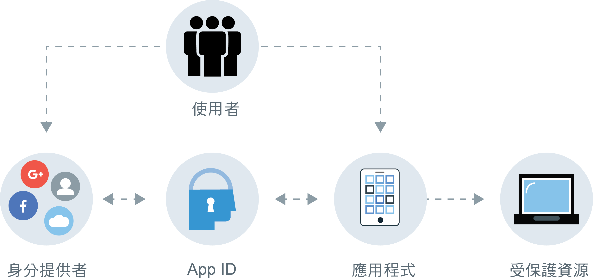

---

copyright:
  years: 2017, 2019
lastupdated: "2019-06-18"

keywords: Authentication, authorization, identity, app security, secure, compliance, high availability, ha, disaster recover, dr, protocols, oauth, oidc

subcollection: appid

---

{:external: target="_blank" .external}
{:shortdesc: .shortdesc}
{:screen: .screen}
{:pre: .pre}
{:table: .aria-labeledby="caption"}
{:codeblock: .codeblock}
{:tip: .tip}
{:note: .note}
{:important: .important}
{:deprecated: .deprecated}
{:download: .download}

# 關於 {{site.data.keyword.appid_short_notm}}
{: #about}

應用程式安全可能非常複雜。對於大部分的開發人員而言，這是建立應用程式時，其中一個最難的部分。如何才能確定您正在保護使用者的資訊？透過將 {{site.data.keyword.appid_full}} 整合至您的應用程式，您可以保護資源並新增鑑別 - 即使您沒有太多安全經驗也能做到。
{: shortdesc}

## 使用服務的原因
{: #about-reasons}

{{site.data.keyword.appid_short_notm}} 可協助開發人員使用幾行的程式碼，輕鬆地將鑑別新增至其 Web 及行動應用程式，並保護其在 {{site.data.keyword.cloud_notm}} 上的雲端原生應用程式及服務。透過要求使用者登入您的應用程式，您可以儲存使用者資料（例如應用程式喜好設定）或來自公用社交設定檔中的資訊，然後利用該資料來自訂每位使用者在應用程式內的體驗。{{site.data.keyword.appid_short_notm}} 為您提供一種登入架構，但您也可以帶入自己的品牌登入畫面，以與 Cloud Directory 搭配使用。
{: shortdesc}

Cloud Directory 可以為您做什麼？請觀看此視訊，以進一步瞭解您可以使用該服務的各種不同方式，然後詳讀下表中關於其他情境的詳細說明。

<iframe class="embed-responsive-item" id="about-appid" title="關於 {{site.data.keyword.appid_short_notm}}" type="text/html" width="640" height="390" src="//www.youtube.com/embed/XlrCjHdK43Q?rel=0" frameborder="0" webkitallowfullscreen mozallowfullscreen allowfullscreen> </iframe>

<table>
  <tr>
    <th>情境</th>
    <th>解決方案</th>
  </tr>
  <tr>
    <td>您需要將[授權及鑑別](/docs/services/appid?topic=appid-key-concepts)新增至行動及 Web 應用程式，但沒有處於安全的背景。</td>
    <td>{{site.data.keyword.appid_short_notm}} 可讓您輕鬆地將鑑別步驟新增至應用程式。您可以使用 API、SDK、預先建置的使用者介面或自己的品牌使用者介面，將電子郵件或使用者名稱、社交登入或企業登入新增至您的應用程式。</td>
  </tr>
  <tr>
    <td>您想要限制應用程式及後端資源的存取權。</td>
    <td>您可以使用 {{site.data.keyword.appid_short_notm}} 所提供的標準型鑑別，輕鬆地保護應用程式、後端資源及 API 的安全。</td>
  </tr>
  <tr>
    <td>您想要為使用者建置個人化的應用程式體驗。</td>
    <td>使用 {{site.data.keyword.appid_short_notm}}，您可以[儲存使用者資料](/docs/services/appid?topic=appid-profiles)（例如其公用社交設定檔中的應用程式喜好設定或資訊），然後使用該資料來自訂您應用程式的每一個體驗。</td>
  </tr>
  <tr>
    <td>您想要以可擴充的方式來管理使用者。</td>
    <td> {{site.data.keyword.appid_short_notm}} 可讓您建立 [Cloud Directory](/docs/services/appid?topic=appid-cloud-directory)，使您能夠將使用者註冊及登入新增至您的應用程式。「雲端目錄」提供架構來維護可隨著使用者族群調整的使用者登錄。使用自助的預先建置功能（例如電子郵件驗證及密碼重設），您可以確定應用程式安全地鑑別使用者。</td>
  </tr>
</table>

## 如何運作
{: #about-how-it-works}

使用 {{site.data.keyword.appid_short_notm}}，您可以透過要求使用者登入，將安全等級新增至應用程式。您也可以使用伺服器 SDK 或 API 來保護後端資源。
{: shortdesc}

<dl>
  <dt>應用程式</dt>
    <dd><strong>伺服器 SDK</strong>：您可以使用伺服器 SDK，來保護 {{site.data.keyword.cloud_notm}} 及 Web 應用程式上管理的後端資源。它會從要求擷取存取記號，並向 {{site.data.keyword.appid_short_notm}} 驗證它。 
    <strong>用戶端 SDK</strong>：您可以使用 Android 或 iOS 用戶端 SDK 來保護行動應用程式。用戶端 SDK 會與您的雲端資源通訊，以在偵測到授權盤查時啟動鑑別處理程序。</dd>
  <dt>{{site.data.keyword.cloud_notm}}</dt>
    <dd><strong>{{site.data.keyword.appid_short_notm}}</strong>：在成功鑑別之後，{{site.data.keyword.appid_short_notm}} 會將存取及身分記號傳回給您的應用程式。 
    <strong>Cloud Directory</strong>：使用者可以利用其電子郵件及密碼來註冊您的服務。然後，您可以透過使用者介面以清單視圖管理您的使用者。透過 Cloud Directory，{{site.data.keyword.appid_short_notm}} 可充當您的身分提供者。</dd>
  <dt>外部（協力廠商）</dt>
    <dd><strong>社交及企業身分提供者</strong>：{{site.data.keyword.appid_short_notm}} 支援 Facebook、Google+ 及 SAML 2.0 Federation 作為身分提供者選項。服務會安排重新導向至身分提供者，並驗證所傳回的鑑別記號。如果記號有效，則服務甚至不必對實際通行詞組具有存取權，即可有權存取您的應用程式。</dd>
</dl>

## 整合
{: #about-integrations}

您可以使用 {{site.data.keyword.appid_short_notm}} 與其他 {{site.data.keyword.cloud_notm}} 供應項目搭配。
{:shortdesc}

<dl>
  <dt>{{site.data.keyword.containershort_notm}}</dt>
    <dd>透過在標準叢集中配置 Ingress，您可以在叢集層次上保護應用程式的安全。請查看 <a href="/docs/containers?topic=containers-ingress_annotation#appid-auth">{{site.data.keyword.appid_short_notm}} 鑑別 Ingress 註釋</a>或 <a href="https://www.ibm.com/cloud/blog/announcing-app-id-integration-ibm-cloud-kubernetes-service">Announcing {{site.data.keyword.appid_short_notm}} integration to {{site.data.keyword.containerlong_notm}} </a> 部落格文章，以開始使用。</dd>
  <dt>{{site.data.keyword.openwhisk_short}} 及 {{site.data.keyword.apiconnect_short}}</dt>
    <dd>使用 [{{site.data.keyword.openwhisk_short}}](/docs/openwhisk?topic=cloud-functions-getting-started) 和 [API Connect](/docs/services/apiconnect?topic=apiconnect-getting-started) 來建立 API 時，您可以在閘道而不是在應用程式碼中保護應用程式的安全。若要查看整合的運作狀況，請觀看 <a href="https://www.youtube.com/watch?v=Fa9YD2NGZiE" target="_blank">Simple and fast social login OAuth with API Connect and {{site.data.keyword.appid_short_notm}} </a>。</dd>
  <dt>Cloud Foundry</dt>
    <dd>試用提供的其中一個範例 Cloud Foundry 應用程式，以瞭解如何將 {{site.data.keyword.appid_short_notm}} 整合至應用程式。</dd>
  <dt>{{site.data.keyword.cloudaccesstrailshort}}</dt>
    <dd>您可以使用 [{{site.data.keyword.cloudaccesstrailshort}} 文件](/docs/services/cloud-activity-tracker?topic=cloud-activity-tracker-getting-started)，監視 {{site.data.keyword.appid_short_notm}} 中所進行的管理活動（例如儀表板配置的變更）。</dd>
  <dt>iOS Programming Guide</dt>
    <dd>您要為 Apple 開發應用程式嗎？請試用 [iOS 程式設計手冊](/docs/swift?topic=swift-getting-started)，以學習、實驗及加強您現有的 iOS 應用程式與 {{site.data.keyword.cloud_notm}} 的搭配。</dd>
  <dt>Node.js 程式設計手冊</dt>
    <dd>您要使用 Node.js 開發應用程式嗎？請試用 [Node.js 程式設計手冊](/docs/node?topic=nodejs-getting-started)，以學習、實驗及加強您現有的 Node.js 應用程式與 {{site.data.keyword.cloud_notm}} 的搭配。</dd>
</dl>

## 法規遵循與標準
{: #about-compliance}

{{site.data.keyword.appid_short_notm}} 已順利完成數個認證、審核及標準。
{: shortdesc}

{{site.data.keyword.appid_short_notm}} 是根據一組在企業及消費者互動應用程式中經常看到的知名業界標準通訊協定及規格，即 OAuth 2.0 Authorization Framework 及 Open ID Connect。OAuth 2.0 是用來取得及驗證存取受保護資源的授權。除此之外，Open ID Connect 還會在您的應用程式中多增加一層鑑別及身分保護。

請參閱 {{site.data.keyword.appid_short_notm}} 軟體產品相容性報告 5.4 節，以檢閱[憑證](https://www.ibm.com/software/reports/compatibility/clarity-reports/report/html/softwareReqsForProduct?deliverableId=BF31C8008D7C11E59F9AD7336D7D0FFB){: external}的完整清單。除了憑證之外，{{site.data.keyword.appid_short_notm}} 也遵循下列規格：OAuth 2.0、OpenID Connect、JSON Web Token (JWT)、JSON Web Signature (JWS)、System for Cross-domain Identity Management (SCIM)。 

## 地區高可用性
{: #ha-dr}

{{site.data.keyword.appid_short_notm}} 是在多個區域中執行的高可用性地區服務。
{: shortdesc}

在每一個支援的多區域地區中，每一個區域都有自己的 {{site.data.keyword.containerlong_notm}} 叢集，其中包含數個工作者節點。每一個工作者節點執行數個 {{site.data.keyword.appid_short_notm}} 元件實例。每一個地區的前緣均是廣域負載平衡器及 Web 應用程式防火牆。

儲存在 {{site.data.keyword.appid_short_notm}} 中的資料會加密並持續保存在分散於可用性區域的資料庫叢集中。資料也會備份在個別的加密物件儲存空間中。

因為 {{site.data.keyword.appid_short_notm}} 是地區服務，所以它不提供自動跨區失效接手或跨區災難回復。不過，{{site.data.keyword.appid_short_notm}} 有提供一個 [擴充的 API](https://us-south.appid.cloud.ibm.com/swagger-ui/#/){: external}，開發人員可利用它將其服務配置與 {{site.data.keyword.appid_short_notm}} 的另一個實例或多個實例進行手動同步化。

