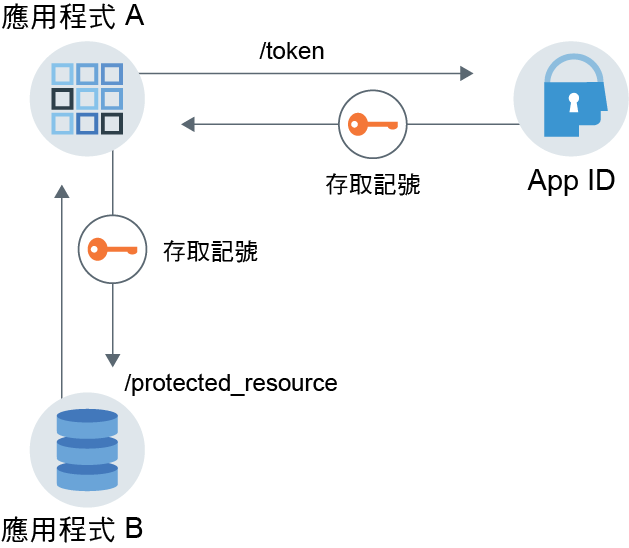

---

copyright:
  years: 2017, 2019
lastupdated: "2019-06-28"

keywords: Authentication, authorization, identity, app security, secure, application identity, app to app, access token

subcollection: appid

---

{:external: target="_blank" .external}
{:shortdesc: .shortdesc}
{:screen: .screen}
{:pre: .pre}
{:table: .aria-labeledby="caption"}
{:codeblock: .codeblock}
{:tip: .tip}
{:note: .note}
{:important: .important}
{:deprecated: .deprecated}
{:download: .download}

# 應用程式身分及授權
{: #app}

有了 {{site.data.keyword.appid_short_notm}}，您可以運用 OAuth2.0 功能，利用應用程式身分和授權流程來保護應用程式。
{: shortdesc}

## 瞭解通訊流程
{: #app-understanding}

您想要讓某個應用程式在沒有任何使用者介入的情況下與另一個服務或應用程式進行通訊的原因有很多。例如，需要存取另一個應用程式以執行其工作的非互動式應用程式。這可以包括處理程序、CLI、常駐程式，或監視環境變數並將其報告給上游伺服器的 IoT 裝置。特定使用案例對於每一個應用程式都是唯一的，但是要記住的最重要一件事，就是代表應用程式而不是一般使用者來交換要求，而且它是已鑑別且已授權的應用程式。


### 流程如何運作？
{: #app-flow-how}

{{site.data.keyword.appid_short_notm}} 會運用 OAuth 2.0 用戶端認證流程來保護通訊。在應用程式向 {{site.data.keyword.appid_short_notm}} 登錄之後，應用程式會取得用戶端 ID 及密碼。透過此資訊，應用程式可以向 {{site.data.keyword.appid_short_notm}} 要求存取記號，並獲得授權以存取受保護的資源或 API。在應用程式身分及授權流程中，應用程式僅獲授與存取記號。它不會取得身分記號或重新整理記號。如需記號的相關資訊，請參閱[瞭解記號](/docs/services/appid?topic=appid-tokens)。

表示只會使用此工作流程與沒有密碼被濫用或洩漏之風險的授信應用程式搭配。應用程式一律保留用戶端密碼。它不適用於行動應用程式。
{: tip}

### 流程具有怎樣的外觀？
{: #app-flow-what}

在下列影像中，您可以看到服務與應用程式之間的通訊方向。


圖. 應用程式身分與授權流程

1. 您可以向 {{site.data.keyword.appid_short_notm}} 登錄需要鑑別以存取受保護資源的應用程式。 
2. Application A 向 {{site.data.keyword.appid_short_notm}} 登錄，以取得用戶端 ID 及密碼。
3. Application A 透過傳送前一個步驟中所擷取的認證，對 {{site.data.keyword.appid_short_notm}} 授權伺服器 `/token` 端點提出要求。
4. {{site.data.keyword.appid_short_notm}} 驗證要求、鑑別應用程式，並將回應傳回至包含存取記號的 Application A。
5. Application A 現在可以使用有效的存取記號，將要求傳送至例如 Application B 的受保護資源。

用來鑑別用戶端的用戶端密碼屬於高度機密，且必須保密。因為應用程式會在應用程式中使用用戶端密碼，所以此工作流程必須只與受信任的應用程式搭配使用。使用受信任的應用程式能確保用戶端密碼不會洩漏或遭到誤用。
{: important}

## 登錄您的應用程式
{: #app-register}

### 使用 GUI
{: #app-register-gui}

1. 在 {{site.data.keyword.appid_short_notm}} 儀表板的**應用程式**標籤中，按一下**新增應用程式**。
2. 新增應用程式名稱，然後按一下**儲存**，以回到已登錄應用程式的清單。應用程式的名稱不能超過 50 個字元。
3. 從已登錄應用程式的清單中，選取您在前一個步驟中新增的應用程式。此列會展開以顯示您的認證。

### 使用 API
{: #app-register-api}

1. 對 [`/management/v4/{tenantId}/applications` 端點](https://us-south.appid.cloud.ibm.com/swagger-ui/#/Management%20API%20-%20Applications/mgmt.registerApplication){: external}提出 POST 要求。

  要求：

  ```
  curl -X POST \  https://us-south.appid.cloud.ibm.com/management/v4/39a37f57-a227-4bfe-a044-93b6e6060b61/applications/ \
  -H 'Content-Type: application/json' \
  -H 'Authorization: Bearer IAM_TOKEN' \
  -d '{"name": "ApplicationName"}'
  ```
  {: codeblock}

  回應範例：

  ```
  {
    "clientId": "c90830bf-11b0-4b44-bffe-9773f8703bad",
    "tenantId": "b42f7429-fc24-48fa-b4f9-616bcc31cfd5",
    "secret": "YWQyNjdkZjMtMGRhZC00ZWRkLThiOTQtN2E3ODEyZjhkOWQz",
    "name": "testing",
    "oAuthServerUrl": "https://us-south.appid.cloud.ibm.com/oauth/v4/b42f7429-fc24-48fa-b4f9-616bcb31cfd5",
    "profilesUrl": "https://us-south.appid.cloud.ibm.com",
    "discoveryEndpoint": "https://us-south.appid.cloud.ibm.com/oauth/v4/b42f7429-fc24-48fa-b4f9-616bcb31cfd5/.well-known/openid-configuration"
  }
  ```
  {: screen}

## 取得存取記號
{: #obtain-token}

在您的應用程式向 {{site.data.keyword.appid_short_notm}} 登錄，且您已取得認證之後，您可以對 {{site.data.keyword.appid_short_notm}} 授權伺服器提出要求，以取得「存取記號」。

1. 對 [`/token` 端點提出 HTTP POST 要求](https://us-south.appid.cloud.ibm.com/swagger-ui/#/Authorization%20Server%20-%20Authorization%20Server%20V4/oauth-server.token){: external}。要求的授權為 `Basic auth`，而用戶端 ID 及密碼則用作 base64 編碼的使用者名稱及密碼。

  要求：
  ```
  curl -X POST \
    http://localhost:6002/oauth/v4/39a37f57-a227-4bfe-a044-93b6e6060b61/token \
    -H 'Authorization: Basic base64Encoded{clientId:secret}' \
    -H 'Content-Type: application/x-www-form-urlencoded' \
    -d grant_type=client_credentials
  ```
  {: codeblock}

  回應範例：
  ```
  {
  "access_token": "eyJhbGciOiJS...F9A",
  "expires_in": "3600",
  "token_type": "Bearer"
  }
  ```
  {: codeblock}


## 指導教學：搭配 Node.js SDK 的端對端流程
{: tutorial-node}

1. 使用下列其中一種方式來取得[存取記號](/docs/services/appid?topic=appid-tokens)：

  * 從 {{site.data.keyword.appid_short_notm}} [Node.js 伺服器 SDK](https://github.com/ibm-cloud-security/appid-serversdk-nodejs){: external}中，使用記號管理程式。使用您的應用程式認證來起始設定記號管理程式，並呼叫 `getApplicationIdentityToken()` 方法來取得記號。

    ```
    const TokenManager = require('ibmcloud-appid').TokenManager;
    const config = {
     clientId: "<client-ID>",
     tenantId: "<tenant-ID>",
     secret: "<secret>",
     oauthServerUrl: "https://<region>.appid.cloud.ibm.com/oauth/v4/<tenant-ID>"
    };

    const tokenManager = new TokenManager(config);

    tokenManager.getApplicationIdentityToken().then((appIdAuthContext) => {
     console.log(' Access tokens from SDK : ' + JSON.stringify(appIdAuthContext));
    }).catch((err) => {
     //console.error('Error retrieving tokens : ' + err);
    });
    ```
    {: codeblock}

  * 從 {{site.data.keyword.appid_short_notm}} 授權伺服器。
  
    登錄應用程式時，會取得要求中的 `oauthServerUrl`。如果您已使用管理 API 登錄應用程式，則伺服器 URL 位於回應內文中。如果您透過將應用程式與 IBM Cloud 主控台連結來登錄應用程式，則可以在 VCAP_SERVICES JSON 物件中或透過 Kubernetes 密碼找到 URL。
    {: note}

    ```
    var request = require('request');

    function getAccessToken() {
      let options = {
          method: 'POST',
          url: oauthServerUrl + '/token',
          headers: { 'content-type': 'application/x-www-form-urlencoded',
              'Authorization': 'Basic ' +Buffer.from('clientId: secret').toString('base64')
          },
          form: {
              grant_type: 'client_credentials'
          }
      };

      return new Promise((resolve, reject) => {
          request(options, function (error, response, body) {
              if (error) {
                  return reject(error);
              }

              let data = JSON.parse(body);
              if(data.access_token) {
                  resolve(data.access_token);
              } else {
                  reject(data);
              }
          })
      });
    }
    ```
    {: codeblock}

2. 使用您在前一個步驟中取得的存取記號，對受保護的資源提出要求。

  ```
  let options = {
      method: 'GET',
      url: 'http://localhost:8081/protected_resource',
      headers: { authorization : 'Bearer ' + accessToken}
  }

  request(options, function (error, response, body) {
      if (error) {
       console.log(error)
      } else {
          res.status(response.statusCode).send({
      console.log(JSON.stringify(body));
          });
      }
  });
  ```
  {: codeblock}

3. 使用來自 {{site.data.keyword.appid_short_notm}} Node.js SDK 的 API 策略來保護受保護的資源。

  ```
  const express = require('express'),
    passport = require('passport');
    APIStrategy = require("ibmcloud-appid").APIStrategy;

  var app = express();
app.use(passport.initialize());

passport.use(new APIStrategy({
      oauthServerUrl: "https://<region>.appid.cloud.ibm.com/oauth/v4/<tenant-ID>",
      tenantId:"<tenant-ID>"
  }));

  app.get('/protected_resource',
      passport.authenticate(APIStrategy.STRATEGY_NAME, {session: false}),
      (req, res) => {
          res.send("Hello from protected resource");
  });
  ```
  {: codeblock}
