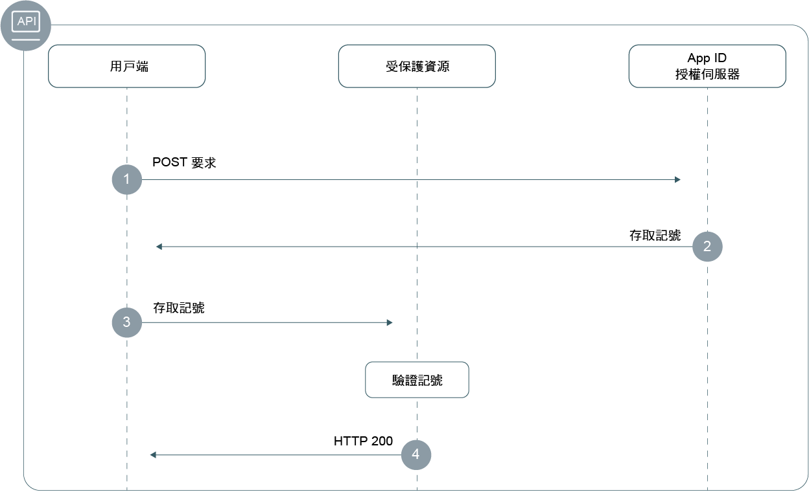

---

copyright:
  years: 2017, 2018
lastupdated: "2018-12-19"

---

{:new_window: target="_blank"}
{:shortdesc: .shortdesc}
{:pre: .pre}
{:tip: .tip}
{:screen: .screen}

# 後端應用程式
{: #adding-backend}

您可以使用 {{site.data.keyword.appid_full}} SDK 及 API，來保護後端應用程式端點和 API。
{: shortdesc}


## 瞭解流程
{: #understanding}

**此流程何時有用？**

開發後端應用程式的一部分是驗證您的 API 是否受到保護，而不會遭到未獲授權的存取。{{site.data.keyword.appid_short_notm}} SDK 可讓您保護 API 端點，並確保應用程式的安全。

**何謂流程的技術基準？**

{{site.data.keyword.appid_short_notm}} 實作 [OAuth2](https://tools.ietf.org/html/rfc6749) 和 OIDC 規格，其會使用載送記號來進行鑑別和授權。這些記號會格式化為 [JSON Web 記號](https://tools.ietf.org/html/rfc7519)，其是以數位方式簽署，且包含說明正在鑑別之主題及身分提供者的要求。應用程式的 API 受存取記號及身分記號保護。需要存取 API 的用戶端可以透過 {{site.data.keyword.appid_short_notm}} 向身分提供者進行鑑別，以交換這些記號。必須驗證記號中的要求，才能授與對受保護 API 的存取權。

如需如何在 {{site.data.keyword.appid_short_notm}} 中使用記號的相關資訊，請參閱[瞭解記號](/docs/services/appid/authorization.html#tokens)。
{: tip}

**此流程看起來像什麼？**



1. 用戶端向 {{site.data.keyword.appid_short_notm}} 授權伺服器提出 POST 要求，以取得存取記號。POST 要求通常會採用下列格式：

  ```
  POST/oauth/v3/{tenantId}/token HTTP/1.1
  Content_type: application/x-www-form-urlencoded
  Authorization header = "Basic" + base64encode({clientId}:{secret})
  FormData = {grant_type}
  ```
  {: screen}

2. 如果客戶符合資格，則授權伺服器會傳回存取記號。

3. 用戶端會將要求傳送至受保護的資源。

4. 受保護的資源或 API 會驗證記號。如果記號有效，則會將資源的存取權授與用戶端。如果無法驗證記號，則會拒絕存取。


## 使用 Node.js SDK 保護資源
{: #secure-node}

{{site.data.keyword.appid_short_notm}} 伺服器 SDK 強制使用 [Passport 架構](http://www.passportjs.org/)來進行鑑別及授權。使用 `ApiStrategy`，您可以藉由需要在授權標頭中驗證存取及身分記號，作為要求的一部分，來保護支援的資源。
{: shortdesc}

**開始之前**

您必須具有下列必備項目，才能開始：
 * {{site.data.keyword.appid_short_notm}} 的實例。
 * NPM 第 4 版或更高版本
 * 節點第 6 版或更高版本

**安裝 SDK**

1. 將 {{site.data.keyword.appid_short_notm}} Node.js SDK 新增至應用程式的 `package.json` 檔案。

  ```
"dependencies": {
"ibmcloud-appid": "^4.0.0"
  }
  ```
  {: codeblock}

2. 執行下列指令。

  ```
  npm install
  ```
  {: codeblock}

**起始設定 SDK**

您可以使用 `oauth server url` 來起始設定 SDK。

1. 取得您的 `oauth server url`。
  1. 導覽至 {{site.data.keyword.appid_short_notm}} 儀表板的**服務認證**標籤。
  2. 如果您還沒有一組認證，請按一下**新建認證**，然後按一下**新增**來建立一組新的認證。如果已有一組認證，請跳過此步驟。
  3. 按一下**檢視認證**切換，以查看您的資訊。
  4. 複製 `oauth server url`，以在下一步中使用。

2. 起始設定 {{site.data.keyword.appid_short_notm}} 通行證策略，如下列範例所示。

  ```javascript
  var express = require('express'); 
  var passport = require('passport');
  var APIStrategy = require('ibmcloud-appid').APIStrategy; 
  passport.use(new APIStrategy({ oauthServerUrl: "{oauth-server-url}" })); 
  var app = express();
  app.use(passport.initialize());
  ```
  {: codeblock}


如果您的 Node.js 應用程式在 {{site.data.keyword.Bluemix_notm}} 上執行，且連結至您的 {{site.data.keyword.appid_short_notm}} 實例，則不需要提供 API 策略配置。{{site.data.keyword.appid_short_notm}} 配置會使用 VCAP_SERVICES 環境變數取得資訊。
{: tip}

**保護 API**

下列 Snippet 示範如何在 Express 應用程式中使用 `ApiStrategy` 來保護 `/protected` GET API。

  ```javascript
   app.get('/protected', passport.authenticate('APIStrategy.STRATEGY_NAME', { session: false }), function(request, response){
      console.log("Security context", request.appIdAuthorizationContext);
      response.send(200, "Success!");
      }
   );
   ```
  {: codeblock}

當記號有效時，會呼叫要求鏈中的下一個中介軟體，並將 `appIdAuthorizationContext` 內容新增至要求物件。此內容包含原始存取及身分記號，以及個別記號的解碼有效負載資訊。


## 使用 Swift SDK 保護資源
{: #secure-swift}

您可以使用 {{site.data.keyword.appid_short_notm}}，利用 Swift SDK 來保護伺服器端資源。
{: shortdesc}

{{site.data.keyword.appid_short_notm}} [ Swift 伺服器 SDK](https://github.com/ibm-cloud-security/appid-serversdk-swift) 提供一個用來保護後端應用程式的 API 保護中介軟體外掛程式。藉由建立 API 與中介軟體的關聯，您可以保護應用程式免於未獲授權的存取。在 API 受到保護之後，中介軟體可確保驗證由 {{site.data.keyword.appid_short_notm}} 產生的記號。然後，您可以根據驗證結果來修改 API 的行為。

請參閱下列程式碼 Snippet，以取得如何保護 `/protectedendpoint` API 的範例。

```Swift
import Foundation
import Kitura              // server
import Credentials         // middleware
import IBMCloudAppID       // SDK

// setup routes
let router = Router()

// mandatory option to be passed in if app not deployed on IBM Cloud
let options = [
    "oauthServerUrl": "https://appid-oauth.ng.bluemix.net/oauth/v3/d8438de6-c325-4956-ad34-abd49194affd",
]
let apiCreds = Credentials()

// Minimum macOS version required
if #available(OSX 10.12, *) {

    // setup API protection
    let apiKituraCredentialsPlugin = APIKituraCredentialsPlugin(options: options)
    apiCreds.register(plugin: apiKituraCredentialsPlugin)

    // associate route with API protection
    router.all(middleware: apiCreds)

    // create protected API
    router.get("/protectedendpoint") { request, response, next in

        response.headers["Content-Type"] = "text/html; charset=utf-8"
        do {
            if let userProfile = request.userProfile  {
                try response.status(.OK).send(
                    "<!DOCTYPE html><html><body>" +
                        "Welcome " + userProfile.displayName  +
                        "! You are logged in with " + userProfile.provider + ".
" +
                    "</body></html>\n\n").end()
                next()
                return
            }
            try response.status(.unauthorized).send(
                "<!DOCTYPE html><html><body>” + “You are not authorized!" +
                "</body></html>\n\n").end()
        }
        catch {}
        next()
    }

    // Start server
    Kitura.addHTTPServer(onPort: 8090, with: router)

    Kitura.run()  
}
```
{: codeblock}

## 手動保護資源
{: secure-api}

保護後端應用程式及受保護資源涉及驗證記號。您可以採用數種方式來驗證 {{site.data.keyword.appid_short_notm}} 存取及身分記號。如需協助驗證記號，請參閱[驗證記號](/docs/services/appid/tokens.html)。


## 後續步驟
{: #next}

在您的應用程式中安裝 {{site.data.keyword.appid_short_notm}} 之後，您幾乎可以開始鑑別使用者！請嘗試執行下列其中一個動作：

* 配置您的[身分提供者](/docs/services/appid/identity-providers.html)
* 自訂並配置[登入小組件](/docs/services/appid/login-widget.html)
* 進一步瞭解 <a href="https://github.com/ibm-cloud-security/appid-serversdk-nodejs" target="_blank">Node.js SDK</a>
* 進一步瞭解 <a href="https://github.com/ibm-cloud-security/appid-serversdk-swift" target="_blank">Swift SDK</a>
