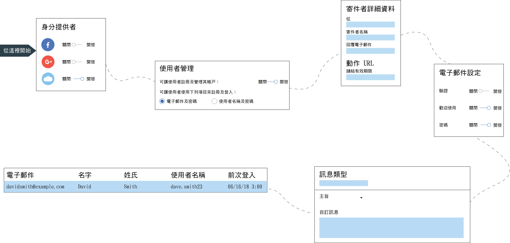

---

copyright:
  years: 2017, 2018
lastupdated: "2018-12-19"

---

{:new_window: target="_blank"}
{:shortdesc: .shortdesc}
{:screen: .screen}
{:codeblock: .codeblock}
{:pre: .pre}
{:tip: .tip}

# Cloud Directory
{: #cd}

有了 {{site.data.keyword.appid_full}}，使用者可以使用電子郵件或使用者名稱及密碼來註冊與登入行動及 Web 應用程式。雲端目錄是雲端中所維護的使用者登錄。使用者註冊應用程式時，即會將它們新增至使用者目錄。使用此特性，使用者可以在應用程式內自由管理自己的帳戶。
{: shortdesc}

</br>

## 管理目錄設定
{: #cd-settings}

您可以針對應用程式配置通知及使用者控制層次。設定雲端目錄可以快速完成，如下圖所示。隨時可以從服務儀表板中更新這些設定。
{: shortdesc}



圖. Cloud Directory 的配置行程

1. 在 {{site.data.keyword.appid_short_notm}} 儀表板的**管理**標籤中，確定將「雲端目錄」設為**開啟**。

2. 配置一般設定。
  1. 決定是否想要您的使用者在登入時建立使用者名稱或使用其電子郵件。這兩個選項都需要密碼。在使用者新增至您的目錄之後，您再也無法切換這些選項。
  2. 按一下密碼準則列中的**編輯**，以指定您想要放在定位的任何需求。密碼準則是以正規表示式提供。如需協助判斷強度，或若要查看一般範例，請參閱[管理密碼強度](#strength)。按一下**儲存**，讓您的需求運作。
  3. 將**容許使用者註冊至您的應用程式**設為**是**。如果設為**否**，則您仍然可以透過主控台新增使用者。不過，您應該只為了開發目的透過主控台新增使用者。
  4. 如果您想要使用者能夠重設其密碼、變更其密碼或重設其詳細資料，請將**容許使用者從應用程式管理其帳戶**設為**是**。如果想要限制使用者的自我服務，請將值設為**否**。
  5. 按一下**寄件者詳細資料**列中的**編輯**，以更新您的電子郵件設定。電子郵件設定適用於透過 {{site.data.keyword.appid_short_notm}} 傳送的所有通訊。指定應該傳送電子郵件的電子郵件位址、其名稱，以及保留個別電子郵件，供使用者傳送回應。
  6. 啟用**進階密碼原則**，來建立密碼的限制及時間需求。此功能需要額外計費。如需選項的相關資訊，請參閱[進階密碼原則](#advanced-password)。
  6. 按一下**儲存**。

3. 配置您的驗證電子郵件設定。
  1. 若要讓使用者驗證其電子郵件位址，請將**電子郵件驗證**設為**開啟**。當使用者註冊您的應用程式時，他們會收到一封電子郵件，要求他們確認他們已註冊應用程式。
  2. 如果您已決定想要使用者驗證其電子郵件，則下一個決定為是否要容許使用者在驗證其電子郵件位址之前進入您的應用程式。根據您的喜好設定，將**容許使用者登入您的應用程式，而不需要先驗證其電子郵件位址**設為**是**或**否**。
  3. 自訂內容並設計訊息的外觀。有一個訊息範本，但是您可以使用自己的訊息來更新文字。您可以使用英文以外的[語言](/docs/services/appid/cloud-directory.html#languages)，但必須負責文字的翻譯。若要選擇另一種語言，請使用<a href="https://appid-management.ng.bluemix.net/swagger-ui/#!/Config/updateLocalization" target="_blank">語言管理 API </a>。
  4. 為驗證 URL 提供一個有效期限，以分鐘指定。在這裡設定此時間時，它也會影響您的重設密碼鏈結的有效時間長度。
  5. 如果您具有想要使用者在按一下鏈結時看到的特定頁面，請輸入您自己的驗證頁面 URL。如果您將**自訂驗證頁面 URL**欄位保留空白，則 {{site.data.keyword.appid_short_notm}} 會提供預設驗證頁面。
  6. 按一下**儲存**。

4. 配置您的歡迎使用電子郵件設定。
  1. 若要在使用者註冊您的應用程式時，透過電子郵件歡迎他們，請將**歡迎使用電子郵件**設為**開啟**。
  2. 自訂內容並設計訊息的外觀。有一個您可以使用的範例訊息，但是您可以使用自己的訊息來更新文字。您可以使用英文以外的[語言](#languages)，但必須負責文字的翻譯。若要選擇另一種語言，請使用<a href="https://appid-management.ng.bluemix.net/swagger-ui/#!/Config/updateLocalization" target="_blank">語言管理 API </a>。
  3. 按一下**儲存**。

5. 配置您的密碼重設設定。
  1. 若要容許使用者要求重設其密碼，請將**忘記密碼電子郵件**設為**開啟**。**附註**：使用者在重設密碼之前，必須先驗證其電子郵件。這表示您必須需要電子郵件驗證才能容許密碼重設。
  2. 自訂內容並設計訊息的外觀。有一個您可以使用的範例訊息，但是您可以使用自己的訊息來更新文字。您可以使用英文以外的[語言](#languages)，但必須負責文字的翻譯。若要選擇另一種語言，請使用<a href="https://appid-management.ng.bluemix.net/swagger-ui/#!/Config/updateLocalization" target="_blank">語言管理 API </a>。
  3. 為重設密碼 URL 提供一個有效期限，以分鐘指定。在這裡設定此時間時，它也會影響您的電子郵件驗證鏈結的有效時間長度。
  4. 如果您具有想要使用者在按一下鏈結時看到的特定頁面，請輸入您自己的密碼重設 URL。如果您將**重設密碼頁面 URL**欄位保留空白，則 {{site.data.keyword.appid_short_notm}} 會提供預設重設密碼頁面。
  5. 按一下**儲存**。

6. 配置您的變更密碼設定。
  1. 若要將任何對使用者密碼所做的變更通知使用者，請將**密碼變更電子郵件**設為**開啟**。
  2. 自訂內容並設計訊息的外觀。有一個您可以使用的範例訊息，但是您可以使用自己的訊息來更新文字。您可以使用英文以外的[語言](#languages)，但必須負責文字的翻譯。若要選擇另一種語言，請使用<a href="https://appid-management.ng.bluemix.net/swagger-ui/#!/Config/updateLocalization" target="_blank">語言管理 API </a>。
  3. 按一下**儲存**。

7. 配置多因子鑑別
  1. 若要在使用者登入時需要多因子鑑別，請將**啟用電子郵件多因子鑑別**設為**開啟**。
  2. 使用下列範本來自訂電子郵件的內容及設計。您可以使用英文以外的[語言](#languages)，但必須負責文字的翻譯。若要選擇另一種語言，請使用<a href="https://appid-management.ng.bluemix.net/swagger-ui/#!/Config/updateLocalization" target="_blank">語言管理 API </a>。
  3. 按一下**儲存**。

8. 在**使用者**標籤中，您可以查看誰已註冊您的應用程式。附註：單一使用者 60 秒內最多可以嘗試登入 5 次。如果嘗試第六次，便會顯示錯誤。

</br>
</br>

## 訊息類型
{: #types}

您可將數種類型的訊息傳送給您的使用者。您可以選擇傳送服務所提供的範例訊息，或自訂更個人的應用程式體驗的內容。{{site.data.keyword.appid_short_notm}} 使用 <a href="https://www.sendgrid.com" target="_blank">SendGrid </a> 作為郵件傳送服務。所有電子郵件都是使用單一 SendGrid 帳戶所傳送。
{: shortdesc}

如果使用者未提供參數所取回的資訊，則它會出現空白。
{: tip}

<dl>
  <dt>歡迎使用</dt>
    <dd><p>在使用者完成登錄之後，您可以透過電子郵件歡迎使用者使用您的應用程式。若要歡迎並留住您的使用者，請讓您的訊息儘可能吸引人。</p>
    <table>
      <thead>
        <th colspan=2> 所有訊息參數</th>
      </thead>
      <tbody>
        <tr>
          <td><code>%{display.logo}</code></td>
          <td> 顯示您已針對登入小組件配置的影像。</td>
        </tr>
        <tr>
          <td><code>%{user.displayName}</code></td>
          <td> 顯示使用者選擇要在與應用程式互動時使用的畫面名稱。</td>
        </tr>
        <tr>
          <td><code>%{user.email}</code></td>
          <td> 顯示使用者的已登錄電子郵件位址。</td>
        </tr>
        <tr>
          <td><code>%{user.username}</code></td>
          <td> 鑑別方法設為使用者名稱及密碼時，會顯示使用者的指定使用者名稱。 </td>
        </tr>
        <tr>
          <td><code>%{user.firstName}</code></td>
          <td> 顯示使用者的指定名字。</td>
        </tr>
        <tr>
          <td><code>%{user.formattedName}</code></td>
          <td> 顯示使用者的完整名稱。</td>
        </tr>
        <tr>
          <td><code>%{user.lastName}</code></td>
          <td> 顯示使用者的指定暱稱。</td>
        </tr>
      </tbody>
    </table></dd>
  <dt>忘記密碼</dt>
    <dd><p>如果使用者忘記其密碼，或基於任何原因而需要更新其密碼，使用者可以要求重設其密碼。您可以自訂對其要求的電子郵件回應。當使用者要求變更時，其密碼會保持不變，直到他們按一下此電子郵件中的鏈結。

    </p>
    <table>
      <tr>
        <th colspan=2> 忘記密碼參數</th>
      </tr>
      <tr>
        <td><code>%{linkExpiration.hours}</code></td>
        <td> 顯示鏈結有效的時數。</td>
      </tr>
      <tr>
        <td><code>%{linkExpiration.minutes}</code></td>
        <td>顯示鏈結有效的分鐘數。</td>
      </tr>
      <tr>
        <td><code>%{resetPassword.code}</code></td>
        <td> 將一次性通行碼顯示為 URL 的一部分。這表示每一個人員都將具有不同的通行碼。範例：<code>https://appid.cloud.ibm.com/wfm/verify/6574839563478</code> </td>
      </tr>
      <tr>
        <td><code>%{resetPassword.link}</code></td>
        <td> 顯示使用者按一下即可重設其密碼的鏈結。</td>
      </tr>
     </tbody>
  </table></dd>
  <dt>驗證</dt>
    <dd><p>您可以透過電子郵件要求使用者驗證其帳戶。藉由要求驗證，您可以限制可以登入您應用程式之偽造帳戶的數目。您可以限制應用程式的存取，直到使用者已驗證其電子郵件，或使用它作為管理您可以為哪些使用者建立設定檔的方法。請注意，透過 {{site.data.keyword.appid_short_notm}} 儀表板或建立使用者 API 手動新增的使用者，不會自動收到此電子郵件。</p>
    <table>
      <thead>
        <th colspan=2> 驗證訊息參數</th>
      </thead>
      <tbody>
        <tr>
          <td><code>%{linkExpiration.hours}</code></td>
          <td> 顯示鏈結有效的時數。</td>
        </tr>
        <tr>
          <td><code>%{linkExpiration.minutes}</code></td>
          <td> 顯示鏈結有效的分鐘數。</td>
        </tr>
        <tr>
          <td><code>%{verify.code}</code></td>
          <td> 顯示一次性驗證 URL。</td>
        </tr>
        <tr>
          <td><code>%{verify.link}</code></td>
          <td> 顯示您已在設定中指定的動作 URL。</td>
        </tr>
      </tbody>
    </table></dd>
  <dt>密碼變更</dt>
    <dd><p>您可以讓使用者知道其密碼何時已更新。如果他們並未要求變更其密碼，此舉很有用。他們可以採取適當的步驟來重新保護其帳戶的安全。</p>
    <table>
      <thead>
        <th colspan=2> 密碼變更參數</th>
      </thead>
      <tbody>
        <tr>
          <td><code>%{passwordChangeInfo.time}</code></td>
          <td> 顯示新密碼生效的時間。</td>
        </tr>
        <tr>
          <td><code>%{passwordChangeInfo.ipAddress}</code></td>
          <td> 顯示從中要求密碼變更的 IP 位址。</td>
        </tr>
      </tbody>
    </table></dd>
    </dd>
    <dt>MFA 驗證碼</dt>
      <dd><p>當啟用多因子鑑別時，使用者可以接收盤查碼，作為次要的鑑別方法。</p>
      <table>
        <thead>
          <th colspan=2> 所有訊息參數</th>
        </thead>
        <tbody>
          <tr>
            <td><code>%{mfa.code}</code></td>
            <td> 顯示一次性 MFA 驗證碼。</td>
          </tr>
        </tbody>
      </table></dd></dl>

</br>
</br>

## 管理密碼強度
{: #strength}

您可以設定可與「雲端目錄」搭配使用的密碼需求。
{: shortdesc}

高保護性密碼會讓人很難甚至無法使用手動或自動化方式來猜測密碼。密碼強度設為正規表示式字串。

部分共用密碼強度範例：

- 必須至少為八個字元。範例正規表示式：`^.{8,}$`
- 必須包含一個數字、一個小寫字母，以及一個大寫字母。範例正規表示式：`^(?:(?=.*\d)(?=.*[a-z])(?=.*[A-Z]).*)$`
- 只能包含英文字母及數字。範例正規表示式：`^[A-Za-z0-9]*$`
- 必須至少一個唯一字元。範例正規表示式：`^(\w)\w*?(?!\1)\w+$`

密碼強度可以在「App ID 主控台」中的「雲端目錄」設定頁面中設定，或使用<a href="https://appid-management.ng.bluemix.net/swagger-ui/#!/Config/set_cloud_directory_password_regex" target="_blank">管理 API </a>來設定。

</br>


## 進階密碼原則
{: #advanced-password}


您可以透過強制執行其他密碼限制來加強應用程式的安全。
{: shortdesc}


進階密碼原則由 5 個功能組成，它們每一個可以分別切換。

 - 在重複錯誤的認證之後鎖定
 - 避免密碼重複使用
 - 密碼有效期限
 - 密碼變更之間的最短期間
 - 確保密碼不包括使用者名稱


 如果啟用此功能，則會啟動進階安全功能的其他計費。如需相關資訊，請參閱[定價計算機](faq.html#pricing)。

</br>

### 避免密碼重複使用
{: #avoid-reuse}

當您的使用者變更其密碼時，您可能想要防止他們選擇最近使用的密碼。
{: shortdesc}

藉由使用 GUI 或 API，您可以選擇使用者在可以重複之前使用的密碼之前必須具有的密碼數目。您可以選取介於 1 與 10 之間的任何整數值。

如果開啟此選項，且您的其中一個使用者嘗試將其密碼設為他們最近使用的密碼，則會在小組件使用者介面的預設登入中顯示一個錯誤，並提示輸入不同的密碼。

安全地儲存先前的密碼，其儲存方式與使用者現行密碼的儲存方式相同。

</br>

### 在重複錯誤的認證之後鎖定
{: #lockout}

您可能想要保護使用者的帳戶，方法是在偵測到可疑行為時，暫時封鎖登入的能力，例如使用不正確的密碼，連續進行多次登入嘗試。此措施有助於防止惡意一方藉由猜測使用者的密碼來取得使用者帳戶的存取權。
{: shortdesc}

藉由使用 GUI 或 API，您可以設定在暫時鎖定使用者的帳戶之前，使用者可以進行的不成功登入嘗試次數上限。您也可以設定帳戶的鎖定時間量。您具有下列選項：

* 嘗試次數：介於 1 與 10 之間的任何整數值。
* 鎖定期間：介於 1 分鐘與 24 小時之間的任何整數值，以分鐘指定。

如果帳戶已遭鎖定，則使用者無法登入或執行任何其他自助作業（例如變更其密碼），直到經歷了指定的鎖定週期。當鎖定期間結束時，便會自動解除鎖定使用者。

您可以在鎖定期間結束之前解除鎖定使用者。若要查看他們是否已遭鎖定，請查看 `active` 欄位是否設為 `false`。您也可以查看其在服務儀表板的**使用者**標籤上的狀態是否設為 `disabled`。若要解除鎖定使用者，您必須使用 [API](https://appid-management.ng.bluemix.net/swagger-ui/#!/Cloud_Directory_Users/updateCloudDirectoryUser)，將 `active` 欄位設為 `true`。

</br>

### 密碼變更之間的最短期間
{: #minimum-time}

您可能想要防止使用者快速切換密碼，方法是設定使用者在密碼變更之間必須等待的最短時間。
{: shortdesc}

此功能在與「避免密碼重複使用」原則一起使用時特別有用。若沒有這項限制，使用者就可以快速連續變更其密碼多次，以規避重複使用最近密碼的限制。您可以選取介於 1 小時與 30 天之間的任何值，以小時指定。

</br>

### 密碼有效期限
{: #expiration}

基於安全原因，您可能想要強制執行密碼輪換原則，讓使用者在一段時間之後必須變更其密碼。
{: shortdesc}

藉由使用 GUI 或 API，您可以設定使用者密碼將保留有效的時段。在使用者密碼到期之後，在下次登入時，就會強制重設其密碼。您可以選取介於 1 與 90 之間的任意完整天數。

服務會利用登入小組件提供預設 GUI，以及立即可用的體驗。在登入完成之前，會指引使用者提供新密碼。

如果您是使用自訂登入體驗，則當使用者嘗試使用過期密碼登入時，即會觸發錯誤。配置您的應用程式以提供必要的使用者體驗，這是您的責任。您可以呼叫變更密碼 API 來設定新密碼。

記號端點回應如下所示：

```javascript
{
  "error" : "invalid_grant",
  "error_description" : "Password expired",
  "user_id" : "356e065e-49da-45f6-afa3-091a7b464f51"
}
```
{: screen}

當此選項第一次設為開啟時，任何現有的使用者密碼將沒有到期日。當那些使用者的密碼變更時，其有效期間即會開始。在此功能設為開啟之後，您可能想要鼓勵使用者更新其密碼。
{: note}

</br>

### 確保密碼不包括使用者名稱
{: #no-username}

如需更高保護性密碼，您可能想要防止密碼包含其使用者名稱，或其電子郵件位址的第一個部分。
{: shortdesc}

此限制不區分大小寫，這表示使用者無法變更部分或全部字元的大小寫，以便使用個人資訊。若要配置此選項，請將開關切換至**開啟**。

</br>

## 使用自訂電子郵件寄件者
{: #custom-email}

使用 {{site.data.keyword.appid_short_notm}}，您可以定義自訂延伸點來傳送「雲端目錄」電子郵件訊息。藉由定義延伸點，您可以完全控制電子郵件的傳送方式，以及您可以使用自己的網域名稱。
 {: shortdesc}

**我為何想要使用自訂電子郵件寄件者？**

依預設，{{site.data.keyword.appid_short_notm}} 會使用 SendGrid 來代表您遞送訊息。藉由配置自己的自訂電子郵件寄件者，您可以進一步加強應用程式使用者的品牌體驗。

一些更具體的範例：
- **個人化網域**
藉由配置自訂電子郵件分派器，您可以完全控制電子郵件訊息的傳送方式。這包括自訂電子郵件網域，如此可進一步降低電子郵件被過濾為垃圾郵件的機會。
- **見解與疑難排解**
從電子郵件提供者獲得見解，例如：已開啟電子郵件的人員數目或哪些訊息尚未遞送。因為您可以追蹤個別訊息，並查看整體統計資料，所以這可以協助解決問題。

</br>

**運作方式？**

在配置延伸點之後，每當需要傳送電子郵件訊息時，{{site.data.keyword.appid_short_notm}} 都會呼叫它。延伸點包含訊息的所有相關資訊，包括電子郵件內文的最終內容。

</br>

**若要建立自訂電子郵件寄件者，請執行下列動作：**

1. 若要將 {{site.data.keyword.appid_short_notm}} 實例配置為使用自訂分派器，請使用<a href="https://appid-management.ng.bluemix.net/swagger-ui/#!/Config/set_cloud_directory_email_dispatcher" target="_blank">管理 API</a>。</br>
您必須提供 URL。此外，您還可以提供授權資訊。支援的授權類型為：`基本授權`或`常數授權標頭值`。

  有效的配置範例：
  ```
  {
    "custom": {
      "url": "https://example.com/send_mail"
    }
  }
  ```
  {: screen}

  ```
  {
    "custom": {
      "url": "https://example.com/send_mail",
      "authorization": {
        "type": "basic",
        "username": "username",
        "password": "password"
      }
    }
  }
  ```
  {: screen}

  ```
  {
    "custom": {
      "url": "https://example.com/send_mail",
      "authorization": {
        "type": "value",
        "value": "myApiKey"
      }
    }
  }
  ```
  {: screen}

2. 配置可以接聽 POST 要求的延伸點。此端點應該能夠讀取來自 {{site.data.keyword.appid_short_notm}} 的有效負載，並利用您的自訂電子郵件寄件者來傳送電子郵件。

3. 來自 {{site.data.keyword.appid_short_notm}} 的內文採用下列格式：`{"jws": "jws-format-string"}`。</br> 在您解碼並驗證有效負載之後，內容是一個 JSON 字串。</br>
  ```
    {
      "tenant": "tenant-id",
      "iss" : "appid-oauth.ng.bluemix.net",
      "iat": 1539173126,
      "jti": "uniq-id",
      "message": {
          "to": "your@mail.com",
          "from": {
              "name": "My Awesome Service",
              "address": "no-reply@company.com"
          },
          "replyTo": {
              "name": "My Awesome Service",
              "address": "yes-reply@company.com"
          },
          "subject": "Welcome to My Awesome Service",
          "body": "<p>Hello<p><br/><p>Thanks for signing up John Doe</p>"
      }
    }
  ```
  {: screen}

  - tenant：App ID 實例承租戶 ID
  - iat：傳送訊息時的時間戳記
  - iss：識別發出 JWS 的主體。
  - jti：唯一的交易 ID
  - message：要傳送的訊息，由下列欄位組成：
    - to：收件者電子郵件位址
    - from：寄件者資訊由下列欄位組成：
      - name：選用，寄件者名稱
      - address：寄件者位址
    - reply to：選用，由下列欄位組成：
      - name：選用，寄件者名稱
      - address：選用，寄件者位址
    - subject：電子郵件主旨
    - body：HTML 格式的電子郵件內文

  您可以檢查回應狀態碼，以驗證您的要求是否成功。範圍在 200 - 299 中的任何回應都視為成功。如果您收到任何其他回應，請嘗試重新提出要求。
  {: tip}

4. 從 {{site.data.keyword.appid_short_notm}} 傳送的每個 HTTP 有效負載都會使用非對稱金鑰配對，根據 JWS 標準自動簽署。對於每個 {{site.data.keyword.appid_short_notm}} 實例，都會產生一個私密金鑰及一個公開金鑰，而這兩個金鑰不會在其他實例之中共用。私密金鑰是用來簽署 HTTP 有效負載，而且您可以使用公開金鑰來驗證有效負載是由 {{site.data.keyword.appid_short_notm}} 產生，且不是由第三方（<a href="https://us-south.appid.cloud.ibm.com/swagger-ui/#!/Authorization_Server_V3/publicKeys" target="_blank">公開金鑰端點</a>）變更。

5. 延伸點的程式碼範例 (JavaScript)
  ```
  const sgMail = require('@sendgrid/mail');
  const {promisify} = require('bluebird');
  const request = promisify(require('request'));
  const jwtVerify = promisify(require('jsonwebtoken').verify);
  const jwtDecode = require('jsonwebtoken').decode;
  const jwkToPem = require('jwk-to-pem');

  async function obtainPublicKeys() {
  	// Your App ID instance tenant ID
  	const tenantId = '<TENANT-ID>';

  	// Send request to App ID's public keys endpoint
  	const keysOptions = {
  		method: 'GET',
  		url: `https://appid-oauth.<REGION>.bluemix.net/oauth/v3/${tenantId}/publickeys`
  	};
  	const keysResponse = await request(keysOptions);
  	return JSON.parse(keysResponse.body).keys;
  }

  async function verifySignature(keysArray, kid, jws) {
  	const keyJson = keysArray.find(key => key.kid === kid);
  	if (keyJson) {
  		const pem = jwkToPem(keyJson);
  		await jwtVerify(jws, pem);
  		return;
  	}
  	throw new Error ("Unable to verify signature");
  }

  async function verifyAndSendMail(jws) {
  	// The API key for Sendgrid
  	const sgApiKey = '<SENDGRID-API-KEY>';

  	// Init Sendgrind
  	sgMail.setApiKey(sgApiKey);

  	// Decode message to get information
  	const data = jwtDecode(jws, {complete: true});

  	// Extract kid from header
  	const kid = data.header.kid;

  	const keysArray = await obtainPublicKeys();

  	// Verify the signature of the payload with the public keys
  	await verifySignature(keysArray, kid ,jws);

  	// Send the email with Your Sendgrid account
  	const message = data.payload.message;
  	const msg = {
  		to: message.to,
  		from: message.from.address,
  		subject: message.subject,
  		html: message.body,
  	};
  	console.log(`Sending email to ${message.to}`);
  	let sendgridResponse = await sgMail.send(msg);

  	return {result : 'email_sent',sendgridResponse};
  }
  ```
  {: codeblock}

6. 測試電子郵件分派器，驗證是否已正確設定您的配置。請使用<a href="https://appid-management.ng.bluemix.net/swagger-ui/#!/Config/post_email_dispatcher_test" target="_blank">測試 API</a>，對您配置的自訂電子郵件寄件者觸發要求。

如需完整運作範例，請參閱 <a href="https://www.ibm.com/blogs/bluemix/2018/10/use-ibm-cloud-app-id-and-your-email-provider-to-brand-mails-sent-to-app-users/" target="_blank">Use your own provider for mail sent with {{site.data.keyword.appid_full}}</a>。

</br>
</br>


## 移轉使用者
{: #user-migration}

您有時可能需要設定新的 {{site.data.keyword.appid_short_notm}}實例。如果您是使用「雲端目錄」，這表示您的使用者必須移轉至新的實例。您可以使用管理 API 來協助移轉。
{: shortdesc}

### 開始之前

您必須為 {{site.data.keyword.appid_short_notm}} 的兩個實例指派 `Manager` [IAM 角色](/docs/iam/quickstart.html)。

</br>

**匯出**

在可以將您的使用者新增至新的實例之前，您需要從現行實例中匯出他們。若要這樣做，您可以使用<a href="https://appid-management.ng.bluemix.net/swagger-ui/#!/Cloud_Directory_Users/cloudDirectoryExport" target="_blank">匯出管理 API </a>。

範例 cURL 指令：

```
curl -X GET --header ‘Accept: application/json’ --header ‘Authorization: Bearer <iam-token>’ ’https://eu-gb.appid.cloud.ibm.com/management/v4/111c9bj3-xxxx-4b5b-zzzz-24ad9440k8j9/cloud_directory/export?encryption_secret=myCoolSecret'
```
{: codeblock}

<table>
  <tr>
    <th>變數</th>
    <th>說明</th>
  </tr>
  <tr>
    <td><code>encryption_secret</code></td>
    <td>用來加密和解密使用者雜湊式密碼的自訂字串。</td>
  </tr>
  <tr>
    <td><code> tenantID </code> </td>
    <td>服務承租戶 ID 可在您的服務認證中找到。您可以在 App ID 儀表板中找到服務認證。</td>
  </tr>
</table>

只會傳回您的「雲端目錄」使用者及其設定檔。來自其他身分提供者的使用者則不會。
{: note}

</br>

**匯入**

既然您已備妥使用者，就可以將其資訊匯入至新的實例。若要這樣做，您可以使用<a href="https://appid-management.ng.bluemix.net/swagger-ui/#!/Cloud_Directory_Users/cloudDirectoryImport" target="_blank">匯入管理 API </a>。

範例 cURL 指令：

```
curl -X POST --header ‘Content-Type: application/json’ --header ‘Accept: application/json’ --header ‘Authorization: Bearer <iam-token>’ -d ‘{“users”: [
    {
      “scimUser”: {
        “originalId”: “3f3f6779-7978-4383-926f-a43aef3b724b”,
        “name”: {
          “givenName”: “<first-name>”,
          “familyName”: “<last-name>”,
          “formatted”: “<first-name> <last-name>”
        },
        “displayName”: “<first-name>”,
        “emails”: [
          {
            “value”: “<user>@gmail.com”,
            “primary”: true
          }
        ],
        “status”: “PENDING”
      },
      “passwordHash”: “<password hash here>“,
      “passwordHashAlg”: “<password hash algorithm>",
      “profile”: {
        “attributes”: {}
      }
    }
]}’ ‘https://eu-gb.appid.cloud.ibm.com/management/v4/111c9bj3-xxxx-4b5b-zzzz-24ad9440k8j9/cloud_directory/import?encryption_secret=myCoolSecret’
```
{: codeblock}

</br>

### 使用移轉 Script

{{site.data.keyword.appid_short_notm}} 提供一個可讓您透過 CLI 使用的移轉 Script，其可協助加速移轉處理程序。

開始之前，請確定您具有下列參數資訊：

<table>
  <tr>
    <th>參數</th>
    <th>說明</th>
  </tr>
  <tr>
    <td><code>sourceTenantId</code></td>
    <td>您計劃從其中匯出使用者之 {{site.data.keyword.appid_short_notm}} 實例的承租戶 ID。</td>
  </tr>
  <tr>
    <td><code>destinationTenantId</code></td>
    <td>您計劃將使用者匯入其中之 {{site.data.keyword.appid_short_notm}} 實例的承租戶 ID。</td>
  </tr>
  <tr>
    <td>地區</td>
    <td>現行選項包含：美國南部：<code>ng</code>、倫敦：<code>eu-gb</code>、雪梨：<code>au-syd</code>、華盛頓州：<code>us-east</code>，以及德國：<code>eu-de</code>。</td>
  </tr>
  <tr>
    <td>IAM 記號</td>
    <td>在取得記號之前，請確定您具有 <code>manager</code> 許可權。如需協助取得 IAM 記號，請參閱<a href="https://console.bluemix.net/docs/iam/apikey_iamtoken.html#iamtoken_from_apikey" target="_blank">文件 </a>。</td>
  </tr>
</table>

若要執行 Script，請執行下列動作：

1. 複製<a href="https://github.com/ibm-cloud-security/appid-sample-code-snippets/tree/master/export-import-cloud-directory-users" target="_blank">儲存庫 </a>。
2. 開啟終端機，並導覽至您在其中複製儲存庫的資料夾。
3. 執行下列指令。

  ```
  npm install
  ```
  {: codeblock}

4. 搭配您的參數，執行下列指令。

  ```
  users_export_import 'sourceTenantId' 'destinationTenantId' 'region' 'iamToken'
  ```
  {: codeblock}

  範例指令：

  ```
  users_export_import e00a0366-53c5-4fcf-8fef-ab3e66b2ced8 73321c2b-d35a-497a-9845-15c580fdf58c ng eyJraWQiOiIyMDE3MTAyNS0xNjoyNzoxMCIsImFsZyI6IlJTMjU2In0.eyJpYW1faWQiOiJJQk1pZC0zMTAwMDBUNkZTIiwiaWQiOiJJQk1pZC0zMTAwMDBUNkZTIiwicmVhbG1pZCI6IklCTWlkIiwiaWRlbnRpZmllciI6IjMxMDAwMFQ2RlMiLCJnaXZlbl9uYW1lIjoiUm90ZW0iLCJmYW1pbHlfbmFtZSI6IkJyb3NoIiwibmFtZSI6IlJvdGVtIEJyb3NoIiwiZW1haWwiOiJyb3RlbWJyQGlsLmlibS5jb20iLCJzdWIiOiJyb3RlbWJyQGlsLmlibS5jb20iLCJhY2NvdW50Ijp7ImJzcyI6ImQ3OWM5YTk5NjJkYzc2Y2JkMDZlYTVhNzhjMjY0YzE5In0sImlhdCI6MTUzNzE3Mjg4NCwiZXhwIjoxNTM3MTc2NDg0LCJpc3MiOiJodHRwczovL2lhbS5zdGFnZTEuYmx1ZW1peC5uZXQvaWRlbnRpdHkiLCJncmFudF90eXBlIjoidXJuOmlibTpwYXJhbXM6b2F1dGg6Z3JhbnQtdHlwZTpwYXNzY29kZSIsInNjb3BlIjoiaWJtIG9wZW5pZCIsImNsaWVudF9pZCI6ImJ4IiwiYWNyIjoxLCJhbXIiOlsicHdkIl19.c4vLPzhvvNZLjaLy7znDa37qV4o-yuGmSKmJoQKrEQNZU8IC0NIjxwSo7W9kb0pDi3Yf_03_9ufTTGNfjtltzNWycSXjkNgoL-b9_nU61oHdgn0stY1KmNicqyBWfgUU--4xa904QN_QjRHBaUBeJf3XWEphPIMoF7mZeOxEZLnCMcQXSz9pImCMiP4SNT38cHLiI90Yx01rM7hpteepWULh5MYh-B2V03Gkgxfqvv951HF1LDg6eT4Q9in11laTQKtKuomripUju_4GIIjORVYw9NaAVKIJ9lKrPX0SKPhStsa59qGsC_7Uersms5EY1W1VbZVqOZPJbtp6tVf-Lw
  ```
  {: codeblock}

</br>
</br>


## 支援的語言
{: #languages}

您可以使用<a href="https://appid-management.ng.bluemix.net/swagger-ui/#!/Config/updateLocalization" target="_blank">語言管理 API </a> 設定可用來寫入使用者通訊的語言。不過，預設只能使用英文。您負責翻譯訊息。使用 API 設定配置之後，就會更新 GUI，讓您能夠變更範本文字。
{: shortdesc}

<table>
  <col width="20%">
  <col width="25%">
  <col width="35%">
  <tr>
    <th>代碼</th>
    <th>語言</th>
    <th>地區</th>
  </tr>
  <tr>
    <td><code>af-ZA</code></td>
    <td>南非荷蘭文</td>
    <td>南非</td>
  </tr>
  <tr>
    <td><code>sq-AL</code></td>
    <td>阿爾巴尼亞文</td>
    <td>阿爾巴尼亞</td>
  </tr>
  <tr>
    <td><code>am-ET</code></td>
    <td>阿姆哈拉文</td>
    <td>衣索比亞</td>
  </tr>
  <tr>
    <td><code>ar-DZ</code></td>
    <td>阿拉伯文</td>
    <td>阿爾及利亞</td>
  </tr>
  <tr>
    <td><code>ar-BH</code></td>
    <td>阿拉伯文</td>
    <td>巴林</td>
  </tr>
  <tr>
    <td><code>ar-EG</code></td>
    <td>阿拉伯文</td>
    <td>埃及</td>
  </tr>
  <tr>
    <td><code>ar-IQ</code></td>
    <td>阿拉伯文</td>
    <td>伊拉克</td>
  </tr>
  <tr>
    <td><code>ar-JO</code></td>
    <td>阿拉伯文</td>
    <td>約旦</td>
  </tr>
  <tr>
    <td><code>ar-KW</code></td>
    <td>阿拉伯文</td>
    <td>科威特</td>
  </tr>
  <tr>
    <td><code>ar-LB</code></td>
    <td>阿拉伯文</td>
    <td>黎巴嫩</td>
  </tr>
  <tr>
    <td><code>ar-LY</code></td>
    <td>阿拉伯文</td>
    <td>利比亞</td>
  </tr>
  <tr>
    <td><code>ar-MR</code></td>
    <td>阿拉伯文</td>
    <td>茅利塔尼亞</td>
  </tr>
  <tr>
    <td><code>ar-MA</code></td>
    <td>阿拉伯文</td>
    <td>摩洛哥</td>
  </tr>
  <tr>
    <td><code>ar-OM</code></td>
    <td>阿拉伯文</td>
    <td>阿曼</td>
  </tr>
  <tr>
    <td><code>ar-QA</code></td>
    <td>阿拉伯文</td>
    <td>卡達</td>
  </tr>
  <tr>
    <td><code>ar-SA</code></td>
    <td>阿拉伯文</td>
    <td>沙烏地阿拉伯</td>
  </tr>
  <tr>
    <td><code>ar-SY</code></td>
    <td>阿拉伯文</td>
    <td>敘利亞</td>
  </tr>
  <tr>
    <td><code>ar-YE</code></td>
    <td>阿拉伯文</td>
    <td>突尼西亞</td>
  </tr>
  <tr>
    <td><code>ar-AE</code></td>
    <td>阿拉伯文</td>
    <td>阿拉伯聯合大公國</td>
  </tr>
  <tr>
    <td><code>ar-YE</code></td>
    <td>阿拉伯文</td>
    <td>葉門</td>
  </tr>
  <tr>
    <td><code>hy-AM</code></td>
    <td>亞美尼亞文</td>
    <td>亞美尼亞</td>
  </tr>
  <tr>
    <td><code>as-IN</code></td>
    <td>阿薩姆文</td>
    <td>印度</td>
  </tr>
  <tr>
    <td><code>az-AZ</code></td>
    <td>亞塞拜然文</td>
    <td>亞塞拜然</td>
  </tr>
  <tr>
    <td><code>eu-ES</code></td>
    <td>巴斯克文</td>
    <td>西班牙</td>
  </tr>
  <tr>
    <td><code>be-BY</code></td>
    <td>白俄羅斯文</td>
    <td>白俄羅斯</td>
  </tr>
  <tr>
    <td><code>bn-BD</code></td>
    <td>孟加拉文</td>
    <td>孟加拉</td>
  </tr>
  <tr>
    <td><code>be-BY</code></td>
    <td>白俄羅斯文</td>
    <td>白俄羅斯</td>
  </tr>
  <tr>
    <td><code>bn-BD</code></td>
    <td>孟加拉文</td>
    <td>孟加拉</td>
  </tr>
  <tr>
    <td><code>bn-IN</code></td>
    <td>孟加拉文</td>
    <td>印度</td>
  </tr>
  <tr>
    <td><code>bs-Latn-BA</code></td>
    <td>波士尼亞文</td>
    <td>波士尼亞</td>
  </tr>
  <tr>
    <td><code>bg-BG</code></td>
    <td>保加利亞文</td>
    <td>保加利亞</td>
  </tr>
  <tr>
    <td><code>my-MM</code></td>
    <td>緬甸文</td>
    <td>緬甸</td>
  </tr>
  <tr>
    <td><code>ca-ES</code></td>
    <td>加泰蘭文</td>
    <td>西班牙</td>
  </tr>
  <tr>
    <td><code>zh-Hans-CN</code></td>
    <td>簡體中文</td>
    <td>中國</td>
  </tr>
  <tr>
    <td><code>zh-Hans-SG</code></td>
    <td>簡體中文</td>
    <td>新加坡</td>
  </tr>
  <tr>
    <td><code>zh-Hant-HK</code></td>
    <td>繁體中文</td>
    <td>中國香港特別行政區</td>
  </tr>
  <tr>
    <td><code>zh-Hant-MO</code></td>
    <td>繁體中文</td>
    <td>澳門</td>
  </tr>
  <tr>
    <td><code>zh-Hant-TW</code></td>
    <td>繁體中文</td>
    <td>台灣</td>
  </tr>
  <tr>
    <td><code>hr-HR</code></td>
    <td>克羅埃西亞文</td>
    <td>克羅埃西亞共和國</td>
  </tr>
  <tr>
    <td><code>cs-CZ</code></td>
    <td>捷克文</td>
    <td>捷克共和國</td>
  </tr>
  <tr>
    <td><code>da-DK</code></td>
    <td>丹麥文</td>
    <td>丹麥</td>
  </tr>
  <tr>
    <td><code>nl-BE</code></td>
    <td>荷蘭文</td>
    <td>比利時</td>
  </tr>
  <tr>
    <td><code>nl-NL</code></td>
    <td>荷蘭文</td>
    <td>荷蘭</td>
  </tr>
  <tr>
    <td><code>en-AU</code></td>
    <td>英文</td>
    <td>澳洲</td>
  </tr>
  <tr>
    <td><code>eu-BE</code></td>
    <td>英文</td>
    <td>比利時</td>
  </tr>
  <tr>
    <td><code>en-CM</code></td>
    <td>英文</td>
    <td>喀麥隆</td>
  </tr>
  <tr>
    <td><code>eu-CA</code></td>
    <td>英文</td>
    <td>加拿大</td>
  </tr>
  <tr>
    <td><code>en-GH</code></td>
    <td>英文</td>
    <td>迦納</td>
  </tr>
  <tr>
    <td><code>eu-HK</code></td>
    <td>英文</td>
    <td>中國香港特別行政區</td>
  </tr>
  <tr>
    <td><code>en-IN</code></td>
    <td>英文</td>
    <td>印度</td>
  </tr>
  <tr>
    <td><code>en-IE</code></td>
    <td>英文</td>
    <td>愛爾蘭</td>
  </tr>
  <tr>
    <td><code>en-KE</code></td>
    <td>英文</td>
    <td>肯亞</td>
  </tr>
  <tr>
    <td><code>en-MU</code></td>
    <td>英文</td>
    <td>模里西斯</td>
  </tr>
  <tr>
    <td><code>en-NZ</code></td>
    <td>英文</td>
    <td>紐西蘭</td>
  </tr>
  <tr>
    <td><code>en-NG</code></td>
    <td>英文</td>
    <td>奈及利亞</td>
  </tr>
  <tr>
    <td><code>en-PH</code></td>
    <td>英文</td>
    <td>菲律賓</td>
  </tr>
  <tr>
    <td><code>en-SG</code></td>
    <td>英文</td>
    <td>新加坡</td>
  </tr>
  <tr>
    <td><code>en-ZA</code></td>
    <td>英文</td>
    <td>南非</td>
  </tr>
  <tr>
    <td><code>en-TZ</code></td>
    <td>英文</td>
    <td>坦尚尼亞</td>
  </tr>
  <tr>
    <td><code>en-GB</code></td>
    <td>英文</td>
    <td>英國</td>
  </tr>
  <tr>
    <td><code>en-US</code></td>
    <td>英文</td>
    <td>美國</td>
  </tr>
  <tr>
    <td><code>en-ZM</code></td>
    <td>英文</td>
    <td>尚比亞</td>
  </tr>
  <tr>
    <td><code>en</code></td>
    <td>英文</td>
    <td> </td>
  </tr>
  <tr>
    <td><code>et-EE</code></td>
    <td>愛沙尼亞文</td>
    <td>愛沙尼亞</td>
  </tr>
  <tr>
    <td><code>fil-PH</code></td>
    <td>菲律賓文</td>
    <td>菲律賓</td>
  </tr>
  <tr>
    <td><code>fi-FI</code></td>
    <td>芬蘭文</td>
    <td>芬蘭</td>
  </tr>
  <tr>
    <td><code>fr-DZ</code></td>
    <td>法文</td>
    <td>阿爾及利亞</td>
  </tr>
  <tr>
    <td><code>fr-CM</code></td>
    <td>法文</td>
    <td>喀麥隆</td>
  </tr>
  <tr>
    <td><code>fr-CD</code></td>
    <td>法文</td>
    <td>剛果民主共和國</td>
  </tr>
  <tr>
    <td><code>fr-BE</code></td>
    <td>法文</td>
    <td>比利時</td>
  </tr>
  <tr>
    <td><code>fr-CA</code></td>
    <td>法文</td>
    <td>加拿大</td>
  </tr>
  <tr>
    <td><code>fr-FR</code></td>
    <td>法文</td>
    <td>法國</td>
  </tr>
  <tr>
    <td><code>fr-CI</code></td>
    <td>法文</td>
    <td>象牙海岸（象牙海岸共和國）</td>
  </tr>
  <tr>
    <td><code>fr-LU</code></td>
    <td>法文</td>
    <td>盧森堡</td>
  </tr>
  <tr>
    <td><code>fr-MR</code></td>
    <td>法文</td>
    <td>茅利塔尼亞</td>
  </tr>
  <tr>
    <td><code>fr-MU</code></td>
    <td>法文</td>
    <td>模里西斯</td>
  </tr>
  <tr>
    <td><code>fr-MA</code></td>
    <td>法文</td>
    <td>摩洛哥</td>
  </tr>
  <tr>
    <td><code>fr-SN</code></td>
    <td>法文</td>
    <td>塞內加爾</td>
  </tr>
  <tr>
    <td><code>fr-CH</code></td>
    <td>法文</td>
    <td>瑞士</td>
  </tr>
  <tr>
    <td><code>fr-TN</code></td>
    <td>法文</td>
    <td>突尼西亞</td>
  </tr>
  <tr>
    <td><code>gl-ES</code></td>
    <td>加利西亞文</td>
    <td>西班牙</td>
  </tr>
  <tr>
    <td><code>lg-UG</code></td>
    <td>干達文</td>
    <td>烏干達</td>
  </tr>
  <tr>
    <td><code>ka-GE</code></td>
    <td>喬治亞文</td>
    <td>喬治亞共和國</td>
  </tr>
  <tr>
    <td><code>de-AT</code></td>
    <td>德文</td>
    <td>奧地利</td>
  </tr>
  <tr>
    <td><code>de-DE</code></td>
    <td>德文</td>
    <td>德國</td>
  </tr>
  <tr>
    <td><code>de-LU</code></td>
    <td>德文</td>
    <td>盧森堡</td>
  </tr>
  <tr>
    <td><code>de-CH</code></td>
    <td>德文</td>
    <td>瑞士</td>
  </tr>
  <tr>
    <td><code>el-GR</code></td>
    <td>希臘文</td>
    <td>希臘</td>
  </tr>
  <tr>
    <td><code>gu-IN</code></td>
    <td>古吉拉特文</td>
    <td>印度</td>
  </tr>
  <tr>
    <td><code>ha-NG</code></td>
    <td>豪薩文</td>
    <td>奈及利亞</td>
  </tr>
  <tr>
    <td><code>he-IL</code></td>
    <td>希伯來文</td>
    <td>以色列</td>
  </tr>
  <tr>
    <td><code>hi-IN</code></td>
    <td>北印度文</td>
    <td>印度</td>
  </tr>
  <tr>
    <td><code>hu-HU</code></td>
    <td>匈牙利人</td>
    <td>匈牙利</td>
  </tr>
  <tr>
    <td><code>is-IS</code></td>
    <td>冰島文</td>
    <td>冰島</td>
  </tr>
  <tr>
    <td><code>ig-NG</code></td>
    <td>伊博文</td>
    <td>奈及利亞</td>
  </tr>
  <tr>
    <td><code>id-ID</code></td>
    <td>印尼文</td>
    <td>印尼</td>
  </tr>
  <tr>
    <td><code>it-IT</code></td>
    <td>義大利文</td>
    <td>意大利</td>
  </tr>
  <tr>
    <td><code>it-CH</code></td>
    <td>義大利文</td>
    <td>瑞士</td>
  </tr>
  <tr>
    <td><code>ja-JP</code></td>
    <td>日文</td>
    <td>日本</td>
  </tr>
  <tr>
    <td><code>kn-IN</code></td>
    <td>坎那達文</td>
    <td>印度</td>
  </tr>
  <tr>
    <td><code>kk-KZ</code></td>
    <td>哈薩克文</td>
    <td>哈薩克</td>
  </tr>
  <tr>
    <td><code>km-KH</code></td>
    <td>高棉文</td>
    <td>柬埔寨</td>
  </tr>
  <tr>
    <td><code>rw-RW</code></td>
    <td>金亞盧安文</td>
    <td>盧安達</td>
  </tr>
  <tr>
    <td><code>kok-IN</code></td>
    <td>貢根文</td>
    <td>印度</td>
  </tr>
  <tr>
    <td><code>ko-KR</code></td>
    <td>韓文</td>
    <td>南韓</td>
  </tr>
  <tr>
    <td><code>lo-LA</code></td>
    <td>立陶宛文</td>
    <td>立陶宛</td>
  </tr>
  <tr>
    <td><code>lv-LV</code></td>
    <td>拉脫維亞文</td>
    <td>拉脫維亞</td>
  </tr>
  <tr>
    <td><code>lt-LT</code></td>
    <td>高棉文</td>
    <td>柬埔寨</td>
  </tr>
  <tr>
    <td><code>mk-MK</code></td>
    <td>馬其頓文</td>
    <td>馬其頓</td>
  </tr>
  <tr>
    <td><code>ms-Latn-MY</code></td>
    <td>馬來拉丁文</td>
    <td>馬來西亞</td>
  </tr>
  <tr>
    <td><code>ml-IN</code></td>
    <td>馬來亞拉姆文</td>
    <td>印度</td>
  </tr>
  <tr>
    <td><code>mt-MT</code></td>
    <td>馬爾他文</td>
    <td>馬爾他</td>
  </tr>
  <tr>
    <td><code>mr-IN</code></td>
    <td>馬拉地文</td>
    <td>印度</td>
  </tr>
  <tr>
    <td><code>mn-Cyrl-MN</code></td>
    <td>蒙古斯拉夫語</td>
    <td>蒙古</td>
  </tr>
  <tr>
    <td><code>ne-IN</code></td>
    <td>尼泊爾文</td>
    <td>印度</td>
  </tr>
  <tr>
    <td><code>ne-NP</code></td>
    <td>尼泊爾文</td>
    <td>尼泊爾</td>
  </tr>
  <tr>
    <td><code>nb-NO</code></td>
    <td>挪威波克莫爾文</td>
    <td>挪威</td>
  </tr>
  <tr>
    <td><code>nn-NO</code></td>
    <td>新挪威文</td>
    <td>挪威</td>
  </tr>
  <tr>
    <td><code>or-IN</code></td>
    <td>奧里亞文（歐迪亞文）</td>
    <td>印度</td>
  </tr>
  <tr>
    <td><code>om-ET</code></td>
    <td>奧里亞文</td>
    <td>衣索比亞</td>
  </tr>
  <tr>
    <td><code>pl-PL</code></td>
    <td>波蘭文</td>
    <td>波蘭</td>
  </tr>
  <tr>
    <td><code>pt-AO</code></td>
    <td>葡萄牙文</td>
    <td>安哥拉</td>
  </tr>
  <tr>
    <td><code>pt-BR</code></td>
    <td>葡萄牙文</td>
    <td>巴西</td>
  </tr>
  <tr>
    <td><code>pt-MO</code></td>
    <td>葡萄牙文</td>
    <td>澳門</td>
  </tr>
  <tr>
    <td><code>pt-MZ</code></td>
    <td>葡萄牙文</td>
    <td>莫三比克</td>
  </tr>
  <tr>
    <td><code>pt-PT</code></td>
    <td>葡萄牙文</td>
    <td>葡萄牙</td>
  </tr>
  <tr>
    <td><code>pa-IN</code></td>
    <td>旁遮普文</td>
    <td>印度</td>
  </tr>
  <tr>
    <td><code>ro-RO</code></td>
    <td>羅馬尼亞文</td>
    <td>羅馬尼亞</td>
  </tr>
  <tr>
    <td><code>ru-RU</code></td>
    <td>俄文</td>
    <td>俄羅斯</td>
  </tr>
  <tr>
    <td><code>sr-Cyrl-RS</code></td>
    <td>塞爾維亞斯拉夫語</td>
    <td>塞爾維亞</td>
  </tr>
  <tr>
    <td><code>sr-Latn-ME</code></td>
    <td>塞爾維亞拉丁文</td>
    <td>芒特尼格羅共和國</td>
  </tr>
  <tr>
    <td><code>sr-Latn-RS</code></td>
    <td>塞爾維亞拉丁文</td>
    <td>塞爾維亞</td>
  </tr>
  <tr>
    <td><code>si-LK</code></td>
    <td>辛哈拉文</td>
    <td>斯里蘭卡</td>
  </tr>
  <tr>
    <td><code>sk-SK</code></td>
    <td>斯洛伐克文</td>
    <td>斯洛伐克</td>
  </tr>
  <tr>
    <td><code>sl-SI</code></td>
    <td>斯洛維尼亞文</td>
    <td>斯洛維尼亞</td>
  </tr>
  <tr>
    <td><code>es-AR</code></td>
    <td>西班牙文</td>
    <td>阿根廷</td>
  </tr>
  <tr>
    <td><code>es-BO</code></td>
    <td>西班牙文</td>
    <td>玻利維亞</td>
  </tr>
  <tr>
    <td><code>es-CL</code></td>
    <td>西班牙文</td>
    <td>智利</td>
  </tr>
  <tr>
    <td><code>es-CO</code></td>
    <td>西班牙文</td>
    <td>哥倫比亞</td>
  </tr>
  <tr>
    <td><code>es-CR</code></td>
    <td>西班牙文</td>
    <td>哥斯大黎加</td>
  </tr>
  <tr>
    <td><code>es-DO</code></td>
    <td>西班牙文</td>
    <td>多明尼加共和國</td>
  </tr>
  <tr>
    <td><code>es-EC</code></td>
    <td>西班牙文</td>
    <td>厄瓜多爾</td>
  </tr>
  <tr>
    <td><code>es-SV</code></td>
    <td>西班牙文</td>
    <td>薩爾瓦多</td>
  </tr>
  <tr>
    <td><code>es-GT</code></td>
    <td>西班牙文</td>
    <td>瓜地馬拉</td>
  </tr>
  <tr>
    <td><code>es-HN</code></td>
    <td>西班牙文</td>
    <td>宏都拉斯</td>
  </tr>
  <tr>
    <td><code>es-MX</code></td>
    <td>西班牙文</td>
    <td>墨西哥</td>
  </tr>
  <tr>
    <td><code>es-NI</code></td>
    <td>西班牙文</td>
    <td>尼加拉瓜</td>
  </tr>
  <tr>
    <td><code>es-PA</code></td>
    <td>西班牙文</td>
    <td>巴拿馬</td>
  </tr>
  <tr>
    <td><code>es-PY</code></td>
    <td>西班牙文</td>
    <td>巴拉圭</td>
  </tr>
  <tr>
    <td><code>es-PE</code></td>
    <td>西班牙文</td>
    <td>秘魯</td>
  </tr>
  <tr>
    <td><code>es-PR</code></td>
    <td>西班牙文</td>
    <td>波多黎各</td>
  </tr>
  <tr>
    <td><code>es-ES</code></td>
    <td>西班牙文</td>
    <td>西班牙</td>
  </tr>
  <tr>
    <td><code>es-US</code></td>
    <td>西班牙文</td>
    <td>美國</td>
  </tr>
  <tr>
    <td><code>es-UY</code></td>
    <td>西班牙文</td>
    <td>烏拉圭</td>
  </tr>
  <tr>
    <td><code>es-VE</code></td>
    <td>西班牙文</td>
    <td>委內瑞拉</td>
  </tr>
  <tr>
    <td><code>sw-KE</code></td>
    <td>斯華西里文</td>
    <td>肯亞</td>
  </tr>
  <tr>
    <td><code>sw-TZ</code></td>
    <td>斯華西里文</td>
    <td>坦尚尼亞</td>
  </tr>
  <tr>
    <td><code>sv-SE</code></td>
    <td>瑞典文</td>
    <td>瑞典</td>
  </tr>
  <tr>
    <td><code>ta-IN</code></td>
    <td>泰米爾文</td>
    <td>印度</td>
  </tr>
  <tr>
    <td><code>te-IN</code></td>
    <td>泰盧固文</td>
    <td>印度</td>
  </tr>
  <tr>
    <td><code>th-TH</code></td>
    <td>泰文</td>
    <td>泰國</td>
  </tr>
  <tr>
    <td><code>tr-TR</code></td>
    <td>土耳其文</td>
    <td>土耳其</td>
  </tr>
  <tr>
    <td><code>uk-UA</code></td>
    <td>烏克蘭文</td>
    <td>烏克蘭</td>
  </tr>
  <tr>
    <td><code>ur-IN</code></td>
    <td>烏都文</td>
    <td>印度</td>
  </tr>
  <tr>
    <td><code>ur-PK</code></td>
    <td>烏都文</td>
    <td>巴基斯坦</td>
  </tr>
  <tr>
    <td><code>uz-Cyrl-UZ</code></td>
    <td>烏茲別克斯拉夫語</td>
    <td>烏玆別克</td>
  </tr>
  <tr>
    <td><code>uz-Latn-UZ</code></td>
    <td>烏茲別克拉丁文</td>
    <td>烏玆別克</td>
  </tr>
  <tr>
    <td><code>vi-VN</code></td>
    <td>越南文</td>
    <td>越南</td>
  </tr>
  <tr>
    <td><code>cy-GB</code></td>
    <td>威爾斯文</td>
    <td>英國</td>
  </tr>
  <tr>
    <td><code>yo-NG</code></td>
    <td>優魯巴文</td>
    <td>奈及利亞</td>
  </tr>
  <tr>
    <td><code>zu-ZA</code></td>
    <td>祖魯文</td>
    <td>南非</td>
  </tr>
</table>
