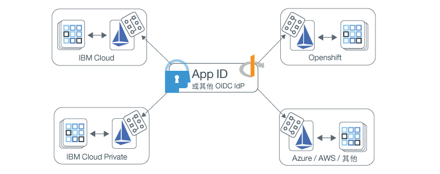

---

copyright:
  years: 2017, 2019
lastupdated: "2019-07-11"

keywords: Authentication, authorization, identity, app security, access, secure, development, any kube, kubernetes, icp, openshift, iks

subcollection: appid

---

{:external: target="_blank" .external}
{:shortdesc: .shortdesc}
{:screen: .screen}
{:pre: .pre}
{:table: .aria-labeledby="caption"}
{:codeblock: .codeblock}
{:tip: .tip}
{:note: .note}
{:important: .important}
{:deprecated: .deprecated}
{:download: .download}

# 使用 Istio 保護多雲端應用程式
{: #istio-adapter}

透過使用應用程式身分及存取配接器，您可以將所有身分管理集中置於單一位置。因為企業從多個提供者或外部部署解決方案的組合使用雲端，異質部署模型可協助您保留現有的基礎架構，並避免供應商鎖定。配接器可以配置為使用符合任何 OIDC 標準的身分提供者，例如 {{site.data.keyword.appid_short_notm}}，這可讓它控制在包括前端和後端應用程式的所有環境中的鑑別及授權原則。而且，**無需變更您的程式碼或重新部署應用程式即可完成**。
{: shortdesc}


## 多雲端架構
{: #istio-multicloud}

多雲端運算環境可將多雲端及/或專用運算環境結合為單一網路架構。透過在多個環境之間配送工作負載，您可能會發現更好的備援、更佳的彈性及更高的成本效益。若要達到效益，常見的方式是使用具有編排層的容器型應用程式，例如 Kubernetes。


圖. 多雲端部署 - 使用應用程式身分及存取配接器達成。


## 瞭解 Istio 及配接器
{: #istio-architecure}

[Istio](https://istio.io) 是開放程式碼服務網，可透通地分層到可以與 Kubernetes 整合的現有配送應用程式上。若要降低部署 Istio 的複雜性，可對整個服務網提供行為見解及作業控制。當「應用程式 ID」與 Istio 結合時，這將成為可調式整合的身分解決方案，適用於不需要變更任何自訂應用程式碼的多雲端架構。如需相關資訊，請參閱 [「何謂 Istio？」](https://www.ibm.com/cloud/learn/istio?cm_mmc=OSocial_Youtube-_-Hybrid+Cloud_Cloud+Platform+Digital-_-WW_WW-_-IstioYTDescription&cm_mmca1=000023UA&cm_mmca2=10010608){: external}.

Istio 使用 Envoy Proxy sidecar 來調解服務網中所有服務的所有入埠和出埠資料流量。透過使用 Proxy，Istio 會擷取資料流量的相關資訊（也稱為遙測），將其傳送至稱為「混合器」的 Istio 元件，以施行原則決策。應用程式身分及存取配接器會延伸「混合器」功能，方法是分析自訂原則的遙測（屬性），來控制進入與跨服務網的 Identity and Access Management。存取管理原則會鏈結至特定 Kubernetes 服務，且可以更精確調整至特定的服務端點。如需原則及遙測的相關資訊，請參閱 [Istio 文件](https://istio.io/docs/concepts/observability/){: external}。 

因為 Istio 限制，應用程式身分及存取配接器目前已在內部儲存使用者階段作業資訊，且*不* 會將資訊持續保存在多個抄本或失效接手配置中。當您使用配接器時，請將工作負載限制於單一抄本，直到解決限制為止。
{: note}

### 保護前端應用程式
{: #istio-frontend}

如果您是使用瀏覽器型的應用程式，您可以使用 [Open ID Connect (OIDC)](https://openid.net/specs/openid-connect-core-1_0.html){: external} / OAuth 2.0 `authorization_grant` 流程來鑑別使用者。偵測到未經鑑別的使用者時，會自動將它們重新導向至鑑別頁面。鑑別完成時，瀏覽器會重新導向至隱含的 `/oidc/callback` 端點，而配接器會在其中截取要求。此時，配接器會從身分提供者取得記號，然後將使用者重新導向回其原始要求的 URL。

若要檢視使用者階段作業資訊（包括階段作業記號），您可以查看`授權`標頭。

```
Authorization: Bearer <access_token> <id_token>
```
{: screen}

您也可以登出已鑑別的使用者。當已鑑別使用者存取具有 `oidc/logout` 的任何受保護端點時，如下列範例所示，則會將他們登出。

```
https://myhost/path/oidc/logout
```
{: screen}

必要的話，可以使用重新整理記號來自動取得新的存取及身分記號，而無需重新鑑別使用者。如果所配置的身分提供者傳回重新整理記號，它會持續保存在階段作業中，並在身分記號到期時用來擷取新的記號。


### 保護後端應用程式
{: #istio-backend}

配接器可以與 OAuth 2.0 [JWT Bearer 流程](https://tools.ietf.org/html/rfc6750){: external}協作使用，透過驗證 JWT Bearer 記號來保護服務 API。Bearer 授權流程預期要求要包含具有有效存取記號及選用身分記號的「授權」標頭。預期的標頭結構為：`Authorization=Bearer {access_token} [{id_token}]`。未經鑑別的用戶端會傳回 HTTP 401 回應狀態，其中含有取得授權所需的範圍清單。如果記號無效或已過期，API 策略會傳回具有選用錯誤元件的 HTTP 401 回應，指出 `Www-Authenticate=Bearer scope="{scope}" error="{error}"`。


如需記號及如何使用它們的相關資訊，請參閱[瞭解記號](/docs/services/appid?topic=appid-tokens)。


## 開始之前
{: #istio-before}

開始之前，請確定您已安裝下列必備項目。

- [Kubernetes 叢集](https://kubernetes.io/){: external}
- [Helm](https://helm.sh/){: external}
- [Istio v1.1+](https://istio.io/docs/setup/kubernetes/install/){: external}
  
  您也可以使用 [IBM Cloud Kubernetes Service Managed Istio](/docs/containers?topic=containers-istio)。
  {: note}


## 安裝配接器
{: #istio-install-adapter}

若要安裝圖表，請在叢集中起始設定 Helm、定義您要使用的選項，然後執行安裝指令。

1. 如果您是使用 IBM Cloud Kubernetes 服務，請務必登入並設定叢集的環境定義。

2. 在叢集中安裝 Helm。

    ```bash
    helm init
    ```
    {: codeblock}

    您可能要配置 Helm 以使用 `--tls` 模式。如需啟用 TLS 的說明，請參閱 [Helm 儲存庫](https://github.com/helm/helm/blob/master/docs/tiller_ssl.md){: external}。如果您啟用 TLS，請務必對您所執行的每個 Helm 指令附加 `--tls`。
  如需搭配使用 Helm 與 IBM Cloud Kubernetes Service 的相關資訊，請參閱[使用 Helm 圖表新增服務](/docs/containers?topic=containers-helm#public_helm_install)。
    {: tip}

3. 安裝圖表。

    ```bash
    helm install ./helm/appidentityandaccessadapter --name appidentityandaccessadapter
    ```
    {: codeblock}

## 套用授權及鑑別原則
{: #istio-apply-policy}

鑑別或授權原則是在要求可以對資源存取進行存取之前必須符合的一組條件。透過定義身分提供者的服務配置，以及在應該使用特定流程時概述的原則，您可以控制對服務網中任何資源的存取。若要查看範例 CRD，請參閱[範例目錄](https://github.com/ibm-cloud-security/app-identity-and-access-adapter/tree/master/samples/crds){: external}。

若要建立原則，請執行下列動作：

1. 定義配置。
2. 登錄端點。

### 定義配置
{: #istio-apply-define}

根據您是要保護前端還是後端應用程式，使用下列其中一個選項建立原則配置。

* 針對前端應用程式：需要使用者鑑別的瀏覽器型應用程式可以配置為使用 OIDC/OAuth 2.0 鑑別流程。若要定義一個 `OidcConfig` CRD，其中包含用來協助使用身分提供者的鑑別流程的用戶端，請使用下列範例作為指引。

    ```yaml
    apiVersion: "security.cloud.ibm.com/v1"
    kind: OidcConfig
    metadata:
        name:      oidc-provider-config
        namespace: sample-namespace
    spec:
        discoveryUrl: https://us-south.appid.cloud.ibm.com/oauth/v4/<tenant-ID>/oidc-discovery/.well-known
        clientId:     <client-ID>
        clientSecret: <randomlyGeneratedClientSecret>
        clientSecretRef:
            name: <name-of-my-kube-secret>
            key: <key-in-my-kube-secret>
    ```
    {: screen}

    <table>
        <thead>
        <tr>
            <th>欄位</th>
            <th style="text-align:center">類型</th>
            <th style="text-align:center">必要</th>
            <th style="text-align:center">說明</th>
        </tr>
        </thead>
        <tbody>
        <tr>
            <td><code>discoveryUrl</code></td>
            <td style="text-align:center">字串</td>
            <td style="text-align:center">是</td>
            <td style="text-align:center">常用端點，提供 OIDC/OAuth 2.0 配置資訊的 JSON 文件。</td>
        </tr>
        <tr>
            <td><code>clientId</code></td>
            <td style="text-align:center">字串</td>
            <td style="text-align:center">是</td>
            <td style="text-align:center">用戶端的 ID，用於鑑別。</td>
        </tr>
        <tr>
            <td><code>clientSecret</code></td>
            <td style="text-align:center">字串</td>
            <td style="text-align:center">*否</td>
            <td style="text-align:center">用來鑑別用戶端的純文字密碼。如果未提供，則 <code>clientSecretRef</code> 必須存在。</td>
        </tr>
        <tr>
            <td><code>clientSecretRef</code></td>
            <td style="text-align:center">物件</td>
            <td style="text-align:center">否</td>
            <td style="text-align:center">用來鑑別用戶端的參照密碼。可使用此參照替代 <code>clientSecret</code>。</td>
        </tr>
        <tr>
            <td><code>clientSecretRef.name</code></td>
            <td style="text-align:center">字串</td>
            <td style="text-align:center">是</td>
            <td style="text-align:center">包含 <code>clientSecret</code> 的 Kubernetes 密碼的名稱。</td>
        </tr>
        <tr>
            <td><code>clientSecretRef.key</code></td>
            <td style="text-align:center">字串</td>
            <td style="text-align:center">是</td>
            <td style="text-align:center">在 Kubernetes 密碼內的欄位，其包含 <code>clientSecret</code>。</td>
        </tr>
        </tbody>
    </table>

* 針對後端應用程式：OAuth 2.0 Bearer 記號規格使用 [JSON Web 記號 (JWT)](https://tools.ietf.org/html/rfc7519.html){: external} 來定義保護 API 的型樣。透過使用下列配置作為範例，定義包含公開金鑰資源的 `JwtConfig` CRD，該公開金鑰資源用於驗證記號簽章。

    ```yaml
    apiVersion: "security.cloud.ibm.com/v1"
    kind: JwtConfig
    metadata:
      name:      jwt-config
      namespace: sample-app
    spec:
        jwksUrl: https://us-south.appid.cloud.ibm.com/oauth/v4/<tenant-ID>/publickeys
    ```
    {: screen}

### 登錄應用程式端點
{: #istio-register-endpoints}

請在 `Policy` CRD 中登錄應用程式端點，以驗證送入的要求並施行鑑別規則。每一個 `Policy` 專用於物件所在的 Kubernetes 名稱空間，並可以指定要保護的服務、路徑及方法。

```yaml
apiVersion: "security.cloud.ibm.com/v1"
kind: Policy
metadata:
  name:      samplepolicy
  namespace: sample-app
spec:
  targets:
    -
      serviceName: <svc-sample-app>
      paths:
        - exact: /web/home
          method: ALL
          policies:
            - policyType: oidc
              config: <oidc-provider-config>
              rules:
                - claim: scope
                  match: ALL
                  source: access_token
                  values:
                    - appid_default
                    - openid
                - claim: amr
                  match: ANY
                  source: id_token
                  values:
                    - cloud_directory
                    - google

        - exact: /web/user
          method: GET
          policies:
            - policyType: oidc
              config: <oidc-provider-config>
              redirectUri: https://github.com/ibm-cloud-security/app-identity-and-access-adapter
        - prefix: /
          method: ALL
          policies:
            -
              policyType: jwt
              config: <jwt-config>
```
{: screen}


|服務物件|類型|必要|說明|
|:----------------:|:----:|:--------:| :-----------: |
| `service` | `string` |是|您要保護的「原則」名稱空間中 Kubernetes 服務的名稱。|
| `paths` | `array[Path Object]` |是|定義您要保護的端點的路徑物件清單。如果保留空白，則會保護所有路徑。|
{: class="simple-tab-table"}
{: caption="表 1. 瞭解服務物件元件" caption-side="top"}
{: #service-object}
{: tab-title="Service object"}
{: tab-group="objects"}

|路徑物件|類型|必要|說明|
|:----------------:|:----:|:--------:|:-----------:|
| `exact 或 prefix` | `string` |是|要對其套用原則的路徑。選項包括 `exact` 及 `prefix`。`exact` 會完整比對所提供的端點及最後一個修整的 `/`。`prefix` 會比對您提供的路徑字首開頭的端點。|
| `method` | `enum` |否| HTTP 方法受保護。有效選項 ALL、GET、PUT、POST、DELETE、PATCH - 預設為 ALL：  |
| `policies` | `array[Policy]` |否| 您想要套用的 OIDC/JWT 原則。|
{: class="simple-tab-table"}
{: caption="表 2. 瞭解路徑物件元件" caption-side="top"}
{: #path-object}
{: tab-title="Path object"}
{: tab-group="objects"}

|原則物件|類型|必要|說明|
|:----------------:|:----:|:--------:| :-----------: |
| `policyType` | `enum` |是| OIDC 原則的類型。選項包括：`jwt` 或 `oidc`。|
| `config` | `string` |是|您要使用的提供者配置的名稱。|
| `redirectUri` | `string` |否|在順利鑑別之後，您希望重新導向使用者的 URL，預設值：原始要求 URL。|
| `rules` | `array[Rule]` |否|您要用於記號驗證的規則集。|
{: class="simple-tab-table"}
{: caption="表 3. 瞭解原則物件元件" caption-side="top"}
{: #policy-object}
{: tab-title="Policy object"}
{: tab-group="objects"}

|規則物件|類型|必要|說明|
|:----------------:|:----:|:--------:| :-----------: |
| `claim` | `string` |是|您要驗證的要求。|
| `match` | `enum` |否|要求驗證所需的準則。選項包括：`ALL`、`ANY` 或 `NOT`。預設值設為 `ALL`。|
| `source` | `enum` |否|您要套用規則的記號。選項包括：`access_token` 或 `id_token`。預設值設為 `access_token`。|
| `values` | `array[string]` |是|驗證的必要值集。|
{: class="simple-tab-table"}
{: caption="表 4. 瞭解原則物件元件" caption-side="top"}
{: #rule-object}
{: tab-title="Rule object"}
{: tab-group="objects"}


## 正在刪除配接器
{: #istio-remove}

若要移除配接器及所有相關聯的 CRD，您必須刪除 Helm 圖表及相關聯的簽署與加密金鑰。

```bash
helm delete --purge appidentityandaccessadapter
kubectl delete secret appidentityandaccessadapter-keys -n istio-system
```
{: codeblock}


## 常見問題 (FAQ) 與疑難排解
{: #istio-faq}

如果您在使用應用程式身分及存取配接器時遇到問題，請考量下列的 FAQ 及疑難排解技術。如需其他協助，您可以透過討論區提問，或開立支援問題單。當您使用討論區提問時，請標記您的問題，以便 {{site.data.keyword.appid_short_notm}} 開發團隊能看到它。

  * 如果您有 {{site.data.keyword.appid_short_notm}} 的相關技術問題，請將問題張貼在 <a href="https://stackoverflow.com/" target="_blank">Stack Overflow </a>，並使用 "ibm-appid" 來標記問題。
  * 若為服務及開始使用指示的相關問題，請使用 <a href="https://developer.ibm.com/" target="_blank">dW Answers </a> 討論區。請包括 `appid` 標籤。

如需取得支援的相關資訊，請參閱[如何取得所需的支援](/docs/get-support?topic=get-support-getting-customer-support#getting-customer-support)。


### 疑難排解：記載
{: #istio-logging}

依預設，日誌的樣式為 JSON，且會以 `info` 可見性層次提供，以便於與外部記載系統整合。若要更新記載配置，您可以使用 Helm 圖表。支援的記載層次包括範圍 [-1, 7]（如 Zap 核心中所示）。如需層次的相關資訊，請參閱 [Zap 核心文件](https://godoc.org/go.uber.org/zap/zapcore#Level)。

手動檢視 JSON 日誌時，您可能想要使用 [`jq`](https://brewinstall.org/install-jq-on-mac-with-brew/) 來自訂日誌及採用「細緻列印」。
{: note}

**配接器**

若要查看配接器日誌，您可以從 Kubernetes 主控台使用 `kubectl` 或從 `appidentityandaccessadapter` Pod 存取 Pod。

```bash
$ alias adapter_logs="kubectl -n istio-system logs -f $(kubectl -n istio-system get pods -lapp=appidentityandaccessadapter -o jsonpath='{.items[0].metadata.name}')"
$ adapter_logs | jq
```
{: codeblock}

**混合器**

如果配接器似乎沒有接收要求，請檢查「混合器」日誌，確保它已順利連接至配接器。

```bash
$ alias mixer_logs="kubectl -n istio-system logs -f $(kubectl -n istio-system get pods -lapp=telemetry -o jsonpath='{.items[0].metadata.name}') -c mixer"
$ mixer_logs | jq
```
{: codeblock}

