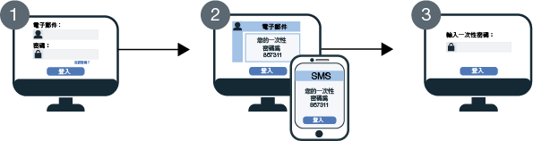

---

copyright:
  years: 2017, 2019
lastupdated: "2019-05-09"

keywords: authentication, authorization, identity, app security, secure, development, two factor, mfa 

subcollection: appid

---

{:new_window: target="_blank"}
{:shortdesc: .shortdesc}
{:screen: .screen}
{:pre: .pre}
{:table: .aria-labeledby="caption"}
{:codeblock: .codeblock}
{:tip: .tip}
{:note: .note}
{:important: .important}
{:deprecated: .deprecated}
{:download: .download}


# 多因子鑑別
{: #cd-mfa}


透過在登入期間要求多個因素，您可以增加使用者鑑別在應用程式中的安全性。在 Cloud Directory for {{site.data.keyword.appid_full}} 中，第一個因素是 Cloud Directory 使用者密碼，它們通常用來登入。第二個鑑別因素是 {{site.data.keyword.appid_short_notm}} 以 SMS 或電子郵件傳送給使用者的一次性程式碼。{{site.data.keyword.appid_short_notm}} 會使用這兩個因素的組合來驗證使用者的身分。
{: shortdesc}

支援 {{site.data.keyword.appid_short_notm}} MFA 作為 Cloud Directory 使用者透過「登入小組件」進行的 OAuth 2.0 授權碼流程的一部分。如果您要使用搭配 SAML 2.0 的企業登入或是社交登入，則可以透過該身分提供者啟用 MFA。
{: note}

啟用 MFA 之後，每次使用者嘗試登入時，{{site.data.keyword.appid_short_notm}}「登入小組件」需要第二種驗證形式（第二個鑑別因素）。使用者順利輸入其認證之後，一次性代碼會傳送至已登錄至其帳戶的電子郵件或電話號碼。

請查看下圖，以瞭解 MFA 流程如何運作。



1. 會向使用者顯示 {{site.data.keyword.appid_short_notm}} 的「登入小組件」，使用者要輸入其 Cloud Directory 使用者認證。認證可以是其電子郵件或使用者名稱及其密碼。Cloud Directory 使用者認證形成第一個鑑別因素。

2. 認證經過驗證後，會回到第二個因素驗證的 MFA 畫面。根據第二個因素配置，使用者會收到具有一次性代碼的電子郵件或 SMS，並將其輸入驗證畫面。

3. 如果已驗證 MFA 代碼，則使用者會重新導向回應用程式，並且進行登入。


## 瞭解 MFA
{: #cd-mfa-understanding}


MFA 是一種確認使用者身分的方法，需要使用者使用多個因素來證明其表明的身分。除了他們知道什麼或他們是什麼之外，這些因素還可以是他們擁有什麼。
{: shortdesc}

第一次啟用 MFA 時，依預設，它會設為使用電子郵件。您可以將此設定變更為使用 SMS，但無法同時配置這兩者。不論是電子郵件還是 SMS，有一些為您所配置的設定是無法變更的。


<table>
  <tr>
    <th>設定</th>
    <th>說明</th>
  </tr>
  <tr>
    <td>代碼字元</td>
    <td>六個數值字元</td>
  </tr>
  <tr>
    <td>代碼有效期限</td>
    <td>15 分鐘<br> 如果使用者未在 15 分鐘內驗證其代碼，則只要鑑別階段作業尚未過期，他們就可以要求傳送另一個代碼。在鑑別階段作業內，可以多次傳送代碼。一旦鑑別階段作業到期，使用者就必須從頭開始重複登入處理程序。</td>
  </tr>
</table>

<p>在 SCIM 中定義為<a href="https://tools.ietf.org/html/rfc7643#section-2.4" target="_blank">多值屬性 </a> 的 Cloud Directory 使用者電子郵件或電話號碼可以包含下列各項：
<ul>
  <li>Value：實際的屬性值，例如電子郵件位址或電話號碼。</li>
  <li>Primary：指出屬性偏好值的布林值。primary 屬性值 <code>true</code> 只能出現一次。如果未指定，則會假設 <code>primary</code> 的值為 <code>false</code>。</li>
</ul>如需相關資訊，請參閱 [Cloud Directory 文件](/docs/services/appid?topic=appid-cloud-directory#cloud-directory)。</p>


## 配置 MFA 電子郵件通道
{: #cd-mfa-configure-email}

您可以配置 {{site.data.keyword.appid_short_notm}} 透過電子郵件將 MFA 代碼傳送給使用者。
{: shortdesc} 

當您第一次啟用 MFA 時，會發生下列兩件事：

- 依預設，會選取電子郵件通道。您可以切換至 [SMS 通道](/docs/services/appid?topic=appid-cd-mfa#cd-mfa-configure-sms)。
- {{site.data.keyword.appid_short_notm}} 會自動登錄已附加至 Cloud Directory 使用者設定檔的主要電子郵件。

如果使用者的電子郵件尚未在使用者註冊時透過[管理 API](https://us-south.appid.cloud.ibm.com/swagger-ui/#/) 或透過電子郵件驗證進行確認，則會在順利驗證 MFA 代碼時加以確認。

開始之前，請確定 {{site.data.keyword.appid_short_notm}} 的實例屬於[累進層級定價方案](/docs/services/appid?topic=appid-faq#faq-pricing)。
{: note}

### 使用 GUI
{: #cd-mfa-configure-email-gui}

您可以透過 GUI 配置 MFA 電子郵件通道。

1. 導覽至 {{site.data.keyword.appid_short_notm}} 儀表板的 **Cloud Directory > 多因子鑑別**標籤。

2. 在**設定標籤**的**啟用多因子鑑別**方框中，將 MFA 切換至**已啟用**。請確認您瞭解 MFA 是以[進階安全事件](/docs/services/appid?topic=appid-faq#faq-pricing)來收費。依預設，會選取**電子郵件**作為**鑑別方法**。

3. 在**電子郵件通道**標籤中，檢閱**電子郵件範本**。您可以選擇傳送含有所提供文字的範本，或撰寫您自己的訊息。請務必使用正確的 HTML 標記。在 GUI 中，您可以新增參數及插入影像。若要變更訊息的[語言](/docs/services/appid?topic=appid-cd-messages#cd-languages)，您可以利用 <a href="https://us-south.appid.cloud.ibm.com/swagger-ui/#/Management%20API%20-%20Config/mgmt.updateLocalization" target="_blank">API </a> 來設定語言。不過，您要負責訊息的內容及翻譯。請參閱下表，以查看您可以在此訊息中使用的表格清單，以及您可以傳送的所有其他訊息。如果使用者未提供參數所取回的資訊，則它會出現空白。

  <table>
    <thead>
      <tr>
        <th colspan=2> MFA 訊息參數</th>
      </tr>
    </thead>
    <tbody>
      <tr>
        <td><code>%{display.logo}</code></td>
        <td> 顯示您為「登入小組件」配置的影像。</td>
      </tr>
      <tr>
        <td><code>%{user.displayName}</code></td>
        <td> 顯示使用者選擇要在與應用程式互動時使用的畫面名稱。</td>
      </tr>
      <tr>
        <td><code>%{user.email}</code></td>
        <td> 顯示使用者的已登錄電子郵件位址。</td>
      </tr>
      <tr>
        <td><code>%{user.username}</code></td>
        <td> 鑑別方法設為使用者名稱及密碼時，會顯示使用者的指定使用者名稱。 </td>
      </tr>
      <tr>
        <td><code>%{user.firstName}</code></td>
        <td> 顯示使用者的指定名字。</td>
      </tr>
      <tr>
        <td><code>%{user.formattedName}</code></td>
        <td> 顯示使用者的完整名稱。</td>
      </tr>
      <tr>
        <td><code>%{user.lastName}</code></td>
        <td> 顯示使用者的指定暱稱。</td>
      </tr>
      <tr>
        <td><code>%{mfa.code}</code></td>
        <td> 顯示一次性 MFA 驗證碼。</td>
      </tr>
    </tbody>
  </table>

  如果使用者未提供參數所取回的資訊，則它會出現空白。
  {: tip}


### 使用 API
{: #cd-mfa-configure-email-apis}

**開始之前**

確定您具有下列必備項目：

* {{site.data.keyword.appid_short_notm}} 實例的承租戶 ID。您可以在儀表板的**服務認證**區段中找到此 ID。
* Identity and Access Management (IAM) 記號。如需協助取得 IAM 記號，請參閱 [IAM 文件](/docs/iam?topic=iam-iamtoken_from_apikey#iamtoken_from_apikey)。


1. 啟用 MFA，方法是使用將 `isActive` 設為 `true` 的 MFA 配置，以對 `/config/mfa` 端點提出 PUT 要求。

  標頭：
  ```
  PUT {management-url}/management/v4/{tenantId}/config/mfa
       Host: <management-server-url>
       Authorization: Bearer <IAM_TOKEN>
       Content-Type: application/json
  ```
  {: codeblock}

  內文：
  ```
   {
       "isActive": true
   }
  ```
  {: codeblock}

  要求範例：
  ```
  $ curl -X PUT
    --header 'Content-Type: application/json'
    --header 'Accept: application/json'
    --header 'Authorization: Bearer <IAM_TOKEN>'
    -d '{
          "isActive": true
      }'
    }'
    '{management-url}/management/v4/{tenantId}/config/mfa'
  ```
  {: screen}

2. 啟用 MFA 頻道，方法是使用 MFA 配置，對 `/mfa/channels/{channel}` 端點提出 PUT 要求。當 `isActive` 設為 `true` 時，會啟用 MFA 頻道。

  標頭：
  ```
  PUT /management/v4/{tenantId}/mfa/channels/{channel}
       Host: <management-server-url>
       Authorization: Bearer <IAM_TOKEN>
       Content-Type: application/json
  ```
  {: codeblock}

  內文：
  ```
   {
       "isActive": true
   }
  ```
  {: codeblock}

  要求範例：

  ```
  $ curl -X PUT
    --header 'Content-Type: application/json'
    --header 'Accept: application/json'
    --header 'Authorization: Bearer <IAM_TOKEN>'
    -d '{
          "isActive": true
      }'
    }'
    '{management-url}/management/v4/{tenantId}/mfa/channels/email'
  ```
  {: screen}

如果 {{site.data.keyword.appid_short_notm}} Cloud Directory 實例配置為使用自訂電子郵件分派器，則 MFA 會使用相同的分派器來傳送一次性代碼。如需設定自訂分派器的相關資訊，請參閱 [Cloud Directory](/docs/services/appid?topic=appid-cd-messages#cd-custom-email) 文件。
{: note}


## 配置 MFA 以使用 SMS
{: #cd-mfa-configure-sms}

您可以將 SMS 訊息傳送給使用者，作為第二種驗證形式。當您啟用 SMS 時，{{site.data.keyword.appid_short_notm}} 會自動嘗試登錄在 Cloud Directory 使用者設定檔中所找到之第一個[有效的](https://en.wikipedia.org/wiki/E.164)主要電話號碼。如果此號碼無效，或在使用者設定檔上找不到任何電話號碼，則會顯示登錄小組件，讓使用者新增號碼。然後，該號碼即成為使用者設定檔的一部分，在驗證之後，它會變成用於 MFA 的預設號碼。
{: shortdesc}

**開始之前**

{{site.data.keyword.appid_short_notm}} 使用 [Nexmo](https://www.nexmo.com/products/sms) 來傳送 MFA SMS 一次性代碼。開始之前，請確定您具備屬於[累進層級定價方案](/docs/services/appid?topic=appid-faq#faq-pricing)的 {{site.data.keyword.appid_short_notm}} 實例以及下列 Nexmo 資訊。


 - 取得 Nexmo API 金鑰及密碼。您可以在 Nexmo 儀表板的帳戶設定頁面中找到 Nexmo API 金鑰及密碼。如需如何取得認證的進一步資訊，請參閱 [Nexmo 文件](https://developer.nexmo.com/concepts/guides/authentication#api-key-and-secret)。

 - 向 Nexmo 登錄您的傳送端 ID 或 `from` 號碼。這個 `from` 號碼出現在使用者的電話中，以顯示 SMS 來自何人。在某些國家/地區中，Nexmo 支援英數傳送端 ID。{{site.data.keyword.appid_short_notm}} 會使用您輸入的值為 Nexmo 的傳送端 ID。因此，如果 Nexmo 支援它們，您可以將 ID 用於 {{site.data.keyword.appid_short_notm}}。如需相關資訊，請參閱 [Nexmo 文件](https://help.nexmo.com/hc/en-us/articles/217571017-What-is-a-Sender-ID)。


### 使用 GUI
{: #cd-mfa-configure-sms-gui}

若要透過 GUI 配置 MFA，請參閱 [Cloud Directory](/docs/services/appid?topic=appid-cloud-directory)。
{: note}

1. 導覽至 {{site.data.keyword.appid_short_notm}} 儀表板的 **Cloud Directory > 多因子鑑別**標籤。

2. 在**設定標籤**的**啟用多因子鑑別**方框中，將 MFA 切換至**已啟用**。請確認您瞭解 MFA 是以[進階安全事件](/docs/services/appid?topic=appid-faq#faq-pricing)來收費。

3. 選取 **SMS** 作為**鑑別方法**。

4. 在 **SMS 通道**標籤中，配置您的 Nexmo 帳戶資訊。

    1. 如果您還沒有 Nexmo 的帳戶，請建立一個帳戶。

    2. 從 Nexmo 儀表板中，按一下 **SMS**。

    3. 在**自己撰寫代碼**區段中，複製您的 API 金鑰，並將它貼到 {{site.data.keyword.appid_short_notm}} 儀表板的**金鑰**方框中。

    4. 複製 Nexmo 儀表板中的 **API 密碼**，並將它貼到 {{site.data.keyword.appid_short_notm}} 儀表板的**密碼**方框中。

    5. 輸入您要從中傳送訊息的 [ID](https://help.nexmo.com/hc/en-us/articles/217571017-What-is-a-Sender-ID)。有效號碼格式遵循 [E.164 國際編號格式](https://en.wikipedia.org/wiki/E.164)（例如 USA 號碼格式為 `+1 999 888 7777 `）。您必須同時指定國碼（以 `+` 符號開頭）及國家訂閱者號碼。在某些國家/地區中，Nexmo 支援英數傳送端 ID。{{site.data.keyword.appid_short_notm}} 會使用您輸入的值為 Nexmo 的傳送端 ID。因此，如果 Nexmo 支援它們，您可以將 ID 用於 {{site.data.keyword.appid_short_notm}}。


### 使用 API
{: #cd-mfa-configure-sms-api}

**開始之前**

確定您具有下列必備項目：

* {{site.data.keyword.appid_short_notm}} 實例的承租戶 ID。您可以在儀表板的**服務認證**區段中找到此 ID。
* Identity and Access Management (IAM) 記號。如需協助取得 IAM 記號，請參閱 [IAM 文件](/docs/iam?topic=iam-iamtoken_from_apikey)。


1. 啟用 MFA，方法是使用將 `isActive` 設為 `true` 的 MFA 配置，以對 `/config/mfa` 端點提出 PUT 要求。

標頭：

  ```
  PUT {management-url}/management/v4/{tenantId}/config/mfa
       Host: <management-server-url>
       Authorization: Bearer <IAM_TOKEN>
       Content-Type: application/json
  ```
  {: codeblock}

內文：

  ```
  {
   "isActive": true
   }
  ```
  {: codeblock}


要求範例：

  ```
  $ curl -X PUT
    --header 'Content-Type: application/json'
    --header 'Accept: application/json'
    --header 'Authorization: Bearer <IAM_TOKEN>'
    -d '{
          "isActive": true
      }'
    '{management-url}/management/v4/{tenantId}/config/mfa'
  ```
  {: screen}

2. 啟用 MFA 頻道，方法是使用 MFA 配置，對 `/mfa/channels/{channel}` 端點提出 PUT 要求。當 `isActive` 設為 `true` 時，會啟用 MFA 頻道。`config` 會接受 Nexmo API 金鑰和密碼，以及 `from` 號碼。

標頭：

  ```
  PUT /management/v4/{tenantId}/mfa/channels/{channel}
      Host: <management-server-url>
      Authorization: Bearer <IAM_TOKEN>
      Content-Type: application/json
  ```
  {: codeblock}

內文：

  ```
  {
      "isActive": true,
      "config": {
        "key": "nexmo key",
        "secret": "nexmo secret",
        "from": sender-phoneNumber
      }
  }
  ```
  {: codeblock}

要求範例：

  ```
  $ curl -X PUT
    --header 'Content-Type: application/json'
    --header 'Accept: application/json'
    --header 'Authorization: Bearer <IAM_TOKEN>'
    -d '{
          "isActive": true,
      "config": {
        "key": "key",
          "secret": "secret",
          "from": 12345678900
        }
     }'
   '{management-url}/management/v4/{tenantId}/mfa/channels/nexmo'
  ```
  {: screen}


3. 順利配置通道之後，請利用使用者介面上的測試按鈕，或使用管理 API，以驗證您的 Nexmo 配置及連線是否設定正確。

標頭：

  ```
  POST /management/v4/{tenantId}/config/cloud_directory/sms_dispatcher/test
     Host: <management-server-url>
     Authorization: Bearer <IAM_TOKEN>
     Content-Type: application/json
  ```
  {: codeblock}

內文：

  ```
  {
    "phone_number": "phoneNumber-receives-test-message"
  }
  ```
  {: codeblock}

要求範例：

  ```
  $ curl -X POST
  --header 'Content-Type: application/json'
  --header 'Accept: application/json'
  --header 'Authorization: Bearer <IAM_TOKEN>'
  -d '{
        "phone_number": "+1 999 999 9999"
      }'
  '{management-url}/management/v4/{tenantId}/config/cloud_directory/sms_dispatcher/test'
  ```
  {: screen}

  </br>
