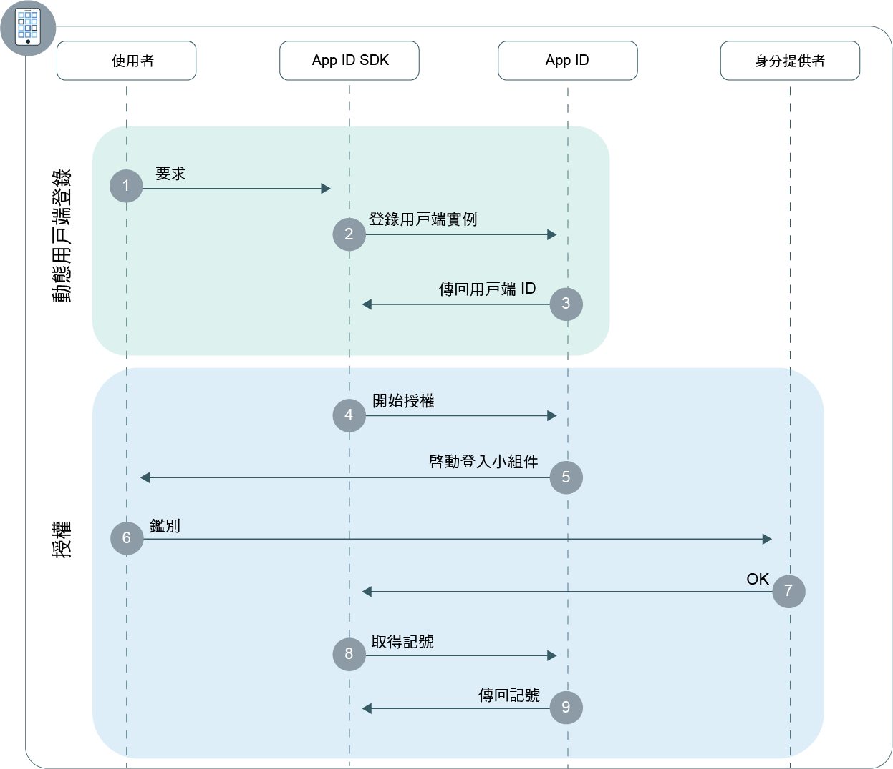

---

copyright:
  years: 2017, 2018
lastupdated: "2018-11-14"

---

{:new_window: target="_blank"}
{:shortdesc: .shortdesc}
{:pre: .pre}
{:tip: .tip}
{:screen: .screen}

# 行動應用程式
{: #adding-mobile}

使用 {{site.data.keyword.appid_full}}，您可以快速建構原生或混合式行動應用程式的鑑別層。
{: shortdesc}

## 瞭解流程
{: #understanding}

**此流程何時有用？**

當您開發要安裝在使用者裝置上的應用程式（原生應用程式）時，行動流程十分有用。透過使用此流程，您可以在應用程式上安全地鑑別使用者，以在裝置之間提供個人化使用者體驗。

**何謂流程的技術基準？**

因為原生應用程式直接安裝至使用者裝置，所以第三方可以相當輕鬆地擷取專用使用者資訊及應用程式認證。依預設，這些類型的應用程式稱為未授信的用戶端，因為它們無法儲存廣域認證或使用者重新整理記號。因此，未授信的用戶端會要求使用者在每次其存取記號到期時輸入其認證。

為了將應用程式轉換為授信用戶端，{{site.data.keyword.appid_short}} 會運用[動態用戶端登錄](https://tools.ietf.org/html/rfc7591)。應用程式實例開始鑑別使用者之前，會先向 {{site.data.keyword.appid_short}} 登錄為 OAuth2 用戶端。在用戶端登錄之後，您的應用程式會收到安裝特定用戶端 ID，而安裝特定用戶端 ID 可以進行數位簽署，並用來使用 {{site.data.keyword.appid_short}} 來授權要求。因為 {{site.data.keyword.appid_short}} 會儲存應用程式的對應公開金鑰，所以可以驗證您的要求簽章，以允許將您的應用程式當成機密用戶端進行檢視。此處理程序可以將應用程式無限公開認證的風險降至最低，並透過容許自動記號重新整理來大幅改善使用者體驗。

登錄之後，您的使用者會使用 OAuth2 `授權碼`或`資源擁有者密碼`[授權](https://tools.ietf.org/html/rfc6749#section-1.3)流程來鑑別使用者。

**此流程看起來像什麼？**



**動態用戶端登錄**

1. 使用者會執行動作來觸發用戶端應用程式對 {{site.data.keyword.appid_short}} SDK 的要求。
2. 如果您的應用程式尚未登錄為行動用戶端，則 SDK 會起始動態登錄流程。
3. 成功登錄時，{{site.data.keyword.appid_short}} 會傳回您的安裝特定用戶端 ID。

**授權流程**

1. {{site.data.keyword.appid_short}} SDK 使用 {{site.data.keyword.appid_short_notm}} `/authorization` 端點來啟動授權處理程序。
2. 向使用者顯示登入小組件。
3. 使用其中一個已配置的身分提供者，來鑑別使用者。
4. {{site.data.keyword.appid_short}} 會傳回授權。
5. 從 {{site.data.keyword.appid_short_notm}} `/token` 端點交換存取、身分及重新整理記號的授權。


## 使用 {{site.data.keyword.appid_short}} SDK 配置行動應用程式
{: #configuring}

開始搭配使用 {{site.data.keyword.appid_short}} 與 SDK。
{: shortdesc}

**開始之前**

您需要下列資訊：

* {{site.data.keyword.appid_short_notm}} 實例

* 實例的承租戶 ID。您可以在服務儀表板的**服務認證**標籤中找到此值。

* 您實例的部署 {{site.data.keyword.Bluemix}} 地區。您可以查看主控台來找到您的地區。

  <table><caption> 表 1. {{site.data.keyword.Bluemix_notm}} 地區及對應的 SDK 值</caption>
  <tr>
    <th>{{site.data.keyword.Bluemix}} 地區</th>
    <th>SDK 值</th>
  </tr>
  <tr>
    <td>美國南部</td>
    <td><code>AppID.REGION_US_SOUTH</code> </td>
  </tr>
  <tr>
    <td>雪梨</td>
    <td><code>AppID.REGION_SYDNEY </code></td>
  </tr>
  <tr>
    <td>英國</td>
    <td><code>AppID.REGION_UK </code></td>
  </tr>
  <tr>
    <td>德國</td>
    <td><code>AppID.REGION_GERMANY</code></td>
  </tr>
</table>

## 使用 Android SDK 進行鑑別
{: #android-setup}

**開始之前**

開始之前，您必須具有下列必備項目：

  * API 27 或更高版本
  * Java 8.x 
  * Android SDK Tools 26.1.1+
  * Android SDK Platform Tools 27.0.1+
  * Android Build Tools 27.0.0+ 版

</br>

**安裝 SDK**

1. 建立 Android Studio 專案，或開啟現有專案。

2. 將 JitPack 儲存庫新增至根 `build.gradle` 檔案。

  ```gradle
    allprojects {
	    repositories {
		    ...
		    maven { url 'https://jitpack.io' }
	    }
    }
  ```
  {: codeblock}

3. 尋找應用程式的 `build.gradle` 檔案。**附註**：請務必開啟您應用程式的檔案，而非專案 `build.gradle` 檔案。


  1. 將 {{site.data.keyword.appid_short_notm}} 用戶端 SDK 新增至 dependencies 區段。

    ```gradle
   dependencies {
       compile group: 'com.github.ibm-cloud-security:appid-clientsdk-android:4.+'
   }
  ```
    {: codeblock}

  2. 在 `defaultConfig` 區段中，配置重新導向架構。

    ```gradle
  defaultConfig {
  ...
      manifestPlaceholders = ['appIdRedirectScheme': android.defaultConfig.applicationId]
  }
  ```
    {: codeblock}

6. 將專案與 Gradle 同步化。按一下**工具 > Android > 將專案與 Gradle 檔案同步化**。

</br>

**起始設定 SDK**


1. 將環境定義、承租戶 ID 及地區參數傳遞給起始設定方法，以配置 SDK。

    放置起始設定碼的一般（但非強制）位置是在 Android 應用程式中主要活動的 onCreate 方法。
    {: tip}

    ```java
    AppID.getInstance().initialize(getApplicationContext(), <tenantId>, <region>);
    ```
    {: codeblock}

</br>
</br>

## 使用 iOS Swift SDK 進行鑑別
{: #ios-setup}

使用 {{site.data.keyword.appid_short}} 用戶端 SDK 保護行動應用程式。
{:shortdesc}

</br>
**開始之前**

開始之前，您必須具有下列必備項目：

  * Xcode 9.0 或更高版本
  * CocoaPods 1.1.0 或更高版本
  * iOS 10.0 或更高版本

</br>

**安裝 SDK**

{{site.data.keyword.appid_short_notm}} 用戶端 SDK 是使用 CocoaPods（Swift 及 Objective-C Cocoa 專案的相依關係管理程式）進行配送。CocoaPods 會下載構件，並讓它們可供您的專案使用。

1. 建立 Xcode 專案，或開啟現有專案。

2. 在專案的目錄中，建立新的或開啟現有 `Podfile`。

3. 將 `IBMCloudAppID` Pod 及 `use_frameworks!` 指令新增至目標的相依關係

  ```swift
  target '<yourTarget>' do
     use_frameworks!
     pod 'IBMCloudAppID'
  end
  ```
  {: codeblock}

4. 在專案目錄內，從指令行安裝相依關係。

  ```swift
  $ pod install --repo-update
  ```
  {: codeblock}

5. 安裝之後，開啟包含 Xcode 專案及已鏈結相依關係的 `<your app>.xcworkspace` 檔案

6. 在 Xcode 專案中啟用金鑰鏈共用。導覽至**專案設定 > 功能 > 金鑰鏈共用**，然後選取**啟用金鑰鏈共用**。

7. 開啟**專案設定 > 資訊 > URL 類型**，然後新增 **URL 類型**。將下列值同時置於 **ID** 及 **URL 架構**文字框中。

  ```
  $(PRODUCT_BUNDLE_IDENTIFIER)
  ```
  {: codeblock}

</br>

**起始設定 SDK**

1. 將承租戶 ID 及地區參數傳遞給起始設定方法，以起始設定用戶端 SDK。

  ```swift
    AppID.sharedInstance.initialize(tenantId: <tenantId>, region: <region>)
  ```
  {: codeblock}

  放置起始設定碼的一般（但非強制）位置是在 Swift 應用程式之 AppDelegate 檔案的 `application:didFinishLaunchingWithOptions` 方法。
  {: tip}

2. 將 {{site.data.keyword.appid_short}} SDK 匯入至 `AppDelegate` 檔案。

  ```swift
    import IBMCloudAppID
    ```
  {: codeblock}

3. 配置應用程式，以透過 {{site.data.keyword.appid_short}} 處理重新導向。

  ```swift
  func application( application: UIApplication, open url: URL, options :[UIApplicationOpenURLOptionsKey : Any]) -> Bool {
          return AppID.sharedInstance.application(application, open: url, options: options)
      }
  ```
  {: codeblock}

</br>
</br>

## 存取受保護的 API
{: #accessing-protected-apis}

在成功登入流程之後，您可以使用存取及身分記號來呼叫受保護的後端資源，而這些資源使用您選擇的 SDK 或網路檔案庫。

</br>

### 使用 Swift SDK 存取受保護 API

1.  將下列匯入項目新增至您要呼叫受保護資源要求的檔案：

  ```swift
  import BMSCore
  import IBMCloudAppID
  ```
  {: codeblock}

2. 呼叫受保護的資源

   ```swift
  BMSClient.sharedInstance.initialize(region: <region>)
  BMSClient.sharedInstance.authorizationManager = AppIDAuthorizationManager(appid: AppID.sharedInstance)

  let request =  Request(url: "<your protected resource url>")

  request.send { (response: Response?, error: Error?) in

      guard let response = response, error == null else {
          print("An error occurred invoking a protected resources", error?.localizedDescription ?? "No response was received")
          return;
      }
      // use your response object
  })
  ```
  {: codeblock}
</br>

### Accessing protected APIs with the Android SDK

1. 將下列匯入項目新增至您要呼叫受保護資源要求的檔案：

  ```java
  import com.ibm.mobilefirstplatform.clientsdk.android.core.api.BMSClient;
  import com.ibm.cloud.appid.android.api.AppIDAuthorizationManager;
  ```

2. 呼叫受保護的資源

   ```java
   BMSClient bmsClient = BMSClient.getInstance();
   bmsClient.initialize(getApplicationContext(), <region>);

   AppIDAuthorizationManager appIdAuthMgr = new AppIDAuthorizationManager(AppID.getInstance())
  bmsClient.setAuthorizationManager(appIdAuthMgr);

  

   Request request = new Request("<your protected resource url>", Request.GET);
  request.send(this, new ResponseListener() {
  

   @Override
	public void onSuccess (Response response) {
		
       Log.d("My app", "onSuccess :: " + response.getResponseText());
   }

   @Override
	public void onFailure (Response response, Throwable t, JSONObject extendedInfo) {
		
if (null != t) {
			Log.d("My app", "onFailure :: " + t.getMessage());
       } else if (null != extendedInfo) {
           Log.d("My app", "onFailure :: " + extendedInfo.toString());
       } else {
           Log.d("My app", "onFailure :: " + response.getResponseText());
           }
       }
   });
  ```
  {: codeblock}

</br>

### Accessing protected APIs without an SDK

使用您選擇的檔案庫，設定您的 'Authorization' 要求標頭，以使用 'Bearer' 鑑別方法來傳輸存取記號。

範例要求格式：

  ```
  GET /resource HTTP/1.1
  Host: server.example.com
  Authorization: Bearer <access token> <optional identity token>
  ```
  {: screen}

</br>
</br>

## Next steps
{: #next}

使用您應用程式中所安裝的 {{site.data.keyword.appid_short}}，您幾乎已準備好開始鑑別使用者！接下來，請嘗試執行下列其中一個活動：

* 配置[身分提供者](/docs/services/appid/identity-providers.html)
* 自訂及配置[登入小組件](/docs/services/appid/login-widget.html)
* 進一步瞭解 <a href="https://github.com/ibm-cloud-security/appid-clientsdk-android" target="_blank">Android SDK</a>
* 進一步瞭解 <a href="https://github.com/ibm-cloud-security/appid-clientsdk-swift" target="_blank">iOS SDK</a>
