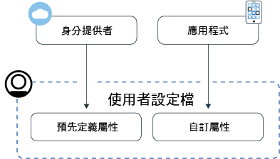
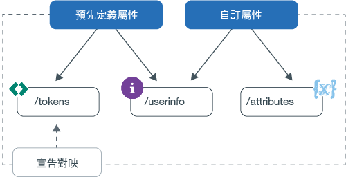

---

copyright:
  years: 2017, 2019
lastupdated: "2019-06-06"

keywords: Authentication, authorization, identity, app security, secure, attributes, user information, storing, accessing

subcollection: appid

---

{:new_window: target="_blank"}
{:shortdesc: .shortdesc}
{:screen: .screen}
{:pre: .pre}
{:table: .aria-labeledby="caption"}
{:codeblock: .codeblock}
{:tip: .tip}
{:note: .note}
{:important: .important}
{:deprecated: .deprecated}
{:download: .download}
{:java: .ph data-hd-programlang='java'}
{:javascript: .ph data-hd-programlang='javascript'}
{:swift: .ph data-hd-programlang='swift'}
{:curl: .ph data-hd-programlang='curl'}


# 儲存及存取設定檔
{: #profiles}

使用者設定檔是關於特定使用者的所有已知資訊，編譯成為一個物件，並由 {{site.data.keyword.appid_full}} 儲存。資訊可能是預先定義、受指派，或是在使用者與應用程式互動時得知。透過利用設定檔特性，您可以為每位使用者建置個人化的應用程式體驗。
{: shortdesc}


在尋找 Cloud Directory 使用者的相關資訊？請參閱[管理使用者](/docs/services/appid?topic=appid-cd-users)。
{: tip}

有兩種類型的資訊可由 App ID 取得並儲存：預先定義的屬性和自訂屬性。預先定義的屬性專屬於使用者的身分，當使用者登入應用程式時會由身分提供者傳回，且可以包含例如姓名或年齡的資訊。自訂屬性是用來儲存使用者的其他相關資訊。它們可以由您設定，或是在使用者與應用程式互動時得知。自訂屬性可能包含已指派的角色、食物喜好設定或飛機上喜好的走道座位。



圖. 使用者設定檔資訊流程


您可以為每位使用者儲存 100 KB 的資訊。
{: note}


## 存取使用者設定檔
{: #profile-access}

您可以使用不同的方式來存取屬性。在成功使用者鑑別之後，您的應用程式會從 {{site.data.keyword.appid_short_notm}} 收到存取及身分記號。在鑑別處理程序結束時，{{site.data.keyword.appid_short_notm}} 所產生的存取記號會同時保護使用者資訊及自訂屬性端點。身分記號包含身分提供者所傳回之使用者屬性（資訊）的正規化子集。若要取得完整的使用者屬性清單，您可以使用 OIDC [`/userinfo` 端點](https://us-south.appid.cloud.ibm.com/swagger-ui/#/Authorization_Server_V4/userInfo)。
{: shortdesc}


如需身分及存取記號的相關資訊，請參閱[瞭解](/docs/services/appid?topic=appid-tokens#tokens)及[驗證記號](/docs/services/appid?topic=appid-token-validation)。


請檢閱下列影像，以查看您可以取得使用者資訊的不同方法。


圖. 存取使用者設定檔選項


App ID 會自動將部分屬性注入您的存取及身分記號中。您可以利用自訂宣告對映，將其他預先定義和自訂宣告對映到您的記號。如需存取使用者資訊之建議方式的詳細資料，請參閱[自訂記號](/docs/services/appid?topic=appid-customizing-tokens)。
{: note}


### 使用 SDK 存取 /userinfo 端點
{: #profile-predefined-access}

若要查看已配置之身分提供者所提供的使用者相關資訊，您可以存取預先定義的屬性。
{: shortdesc}

**iOS Swift**
{: ph data-hd-programlang='swift'}

如果新的記號未明確地傳遞至 SDK，則 {{site.data.keyword.appid_short_notm}} 會使用最後一個收到的記號來擷取及驗證回應。例如，您可以在成功鑑別之後執行下列程式碼，而 SDK 會擷取使用者的其他資訊。
{: ph data-hd-programlang='swift'}

```
AppID.sharedInstance.userProfileManager.getUserInfo { (error: Error?, userInfo: [String: Any]?) in
	guard let userInfo = userInfo, err == nil {
		return // an error has occurred
	}
	// retrieved user info successfully
}
```
{: codeblock}
{: ph data-hd-programlang='swift'}

或者，您可以明確地傳遞存取及身分記號。身分記號是選用性的，但如果有傳遞，則會用它來驗證使用者資訊回應。
{: ph data-hd-programlang='swift'}

```
AppID.sharedInstance.userProfileManager.getUserInfo(accessToken: String, identityToken: String?) { (error: Error?, userInfo: [String: Any]?) in
	guard let userInfo = userInfo, err == nil {
		return // an error has occurred
	}
	// retrieved user info successfully
}
```
{: codeblock}
{: ph data-hd-programlang='swift'}

**Java**
{: ph data-hd-programlang='java'}

如果新的記號未明確地傳遞至 SDK，則 {{site.data.keyword.appid_short_notm}} 會使用最後一個收到的記號來擷取及驗證回應。例如，您可以在成功鑑別之後執行下列程式碼，而 SDK 會擷取使用者的其他資訊。
{: ph data-hd-programlang='java'}

```
AppID appId = AppID.getInstance();

appId.getUserProfileManager().getUserInfo(new UserProfileResponseListener() {
	@Override
	public void onSuccess(JSONObject userInfo) {
		// retrieved user info successfully
	}

	@Override
	public void onFailure(UserInfoException e) {
		// exception occurred
	}
});
```
{: codeblock}
{: ph data-hd-programlang='java'}

或者，您可以明確地傳遞存取及身分記號。身分記號是選用項目。但如果有傳遞，則會用它來驗證回應。
{: ph data-hd-programlang='java'}

```
AppID appId = AppID.getInstance();

appId.getUserProfileManager().getUserInfo(accessToken, identityToken, new UserProfileResponseListener() {
	@Override
	public void onSuccess(JSONObject userInfo) {
		// retrieved attribute "name" successfully
	}

	@Override
	public void onFailure(UserInfoException e) {
		// exception occurred
	}
});
```
{: codeblock}
{: ph data-hd-programlang='java'}

**Node.js**
{: ph data-hd-programlang='javascript'}

藉由使用伺服器端 SDK，您可以擷取使用者的其他資訊。 您可以使用預存存取及身分記號來呼叫下列方法，也可以明確地傳遞記號。身分記號是選用性的，但如果有傳遞，則會用它來驗證使用者資訊回應。
{: ph data-hd-programlang='javascript'}

```javascript
let userProfileManager = UserProfileManager(options: options)

let accessToken = req.session[WebAppStrategy.AUTH_CONTEXT].accessToken;
let identityToken = req.session[WebAppStrategy.AUTH_CONTEXT].identityToken;


// Retrieve user info and validate against the given identity token
userProfileManager.getUserInfo(accessToken, identityToken).then(function (profile) {
	// retrieved user info successfully
});

// Retrieve user info without validation
userProfileManager.getUserInfo(accessToken).then(function (profile) {
	// retrieved user info successfully
});
```
{: codeblock}
{: ph data-hd-programlang='javascript'}


**伺服器端 Swift**
{: ph data-hd-programlang='swift'}

藉由使用伺服器端 SDK，您可以擷取使用者的其他資訊。 您可以使用預存存取及身分記號來呼叫下列方法，也可以明確地傳遞記號。身分記號是選用性的，但如果有傳遞，則會用它來驗證使用者資訊回應。
{: ph data-hd-programlang='swift'}


```swift
let userProfileManager = UserProfileManager(options: options)

let accessToken = "<access token>"
let identityToken = "<identity token>"

// If identity token is provided (recommended approach), response is validated against the identity token
userProfileManager.getUserInfo(accessToken: accessToken, identityToken: identityToken) { (err, userInfo) in
	guard let userInfo = userInfo, err == nil {
		return // an error has occurred
	}
	// retrieved user info successfully
}

// Retrieve the UserInfo without any validation
userProfileManager.getUserInfo(accessToken: accessToken) { (err, userInfo) in
	guard let userInfo = userInfo, err == nil {
		return // an error has occurred
	}
	// retrieved user info successfully
}
```
{: codeblock}
{: ph data-hd-programlang='swift'}


### 使用 API 存取 /userinfo 端點
{: #profile-predefined-api}


您可以透過 `/userinfo` 端點來檢視其他資訊。

1. 確保您具有含 `openid` 範圍的有效存取記號。您可以使用 `/introspect` 端點來驗證記號是否有效。

2. 對 [`/userinfo` 端點](https://us-south.appid.cloud.ibm.com/swagger-ui/#/Authorization_Server_V4/userInfo)提出要求。
  ```
  GET [POST] https://{oauth-server-endpoint}/userinfo
  Authorization: 'Bearer {ACCESS_TOKEN}'
  ```
  {: codeblock}

  輸出範例：
  ```
  "sub": "cad9f1d4-e23b-3683-b81b-d1c4c4fd7d4c",
  "name": "John Doe",
  "email": "john.doe@gmail.com",
  "picture": "https://lh3.googleusercontent.com/-XdUIqdbhg/AAAAAAAAI/AAAAAAA/42rbcbv5M/photo.jpg",
  "gender": "male",
  "locale": "en",
  "identities": [
      {
          "provider": "google",
          "id": "104560903311317789798",
          "profile": {
              "id": "104560903311317789798",
              "email": "john.doe@gmail.com",
              "verified_email": true,
              "name": "John Doe",
              "given_name": "John",
              "family_name": "Doe",
              "link": "https://plus.google.com/104560903311317789798",
              "picture": "https://lh3.googleusercontent.com/-XdUIqdbhg/AAAAAAAAI/AAAAAAA/42rbcbv5M/photo.jpg",
              "gender": "male",
              "locale": "en",
              "idpType": "google"
          }
      }
  ]
  ```
  {: screen}

3. 驗證 `sub` 宣告與身分記號中的 `sub` 宣告完全相符。如果這些不相符，則請不要使用傳回的資訊。若要進一步瞭解記號替代，請參閱 <a href="https://openid.net/specs/openid-connect-core-1_0.html#TokenSubstitution" target="__blank">OIDC 規格 </a>。

如果外部身分提供者進行變更，則您可以在使用者重新登入時取得更新過的資訊。您的新記號會擷取最新的資料。
{: tip}


### 存取 `/attributes` 端點
{: #profile-attributes-access}

取決於您的配置，當使用者與您的應用程式互動時，屬性會加密並儲存為使用者設定檔的一部分。互動可以是使用者登入，或在您的應用程式中設定喜好設定。若要存取屬性，請透過 API 方法來傳遞存取記號。
{: shortdesc}

**iOS Swift**
{: ph data-hd-programlang='swift'}

  ```
  func setAttribute(key: String, value: String, completionHandler: @escaping(Error?, [String:Any]?) -> Void)
  func setAttribute(key: String, value: String, accessTokenString: String, completionHandler: @escaping(Error?, [String:Any]?) -> Void)
  func getAttribute(key: String, completionHandler: @escaping(Error?, [String:Any]?) -> Void)
  func getAttribute(key: String, accessTokenString: String, completionHandler: @escaping(Error?, [String:Any]?) -> Void)
  func getAttributes(completionHandler: @escaping(Error?, [String:Any]?) -> Void)
  func getAttributes(accessTokenString: String, completionHandler: @escaping(Error?, [String:Any]?) -> Void)
  func deleteAttribute(key: String, completionHandler: @escaping(Error?, [String:Any]?) -> Void)
  func deleteAttribute(key: String, accessTokenString: String, completionHandler: @escaping(Error?, [String:Any]?) -> Void)
  ```
  {: codeblock}
  {: ph data-hd-programlang='swift'}

  **Java**
  {: ph data-hd-programlang='java'}

  ```
  void setAttribute(@NonNull String name, @NonNull String value, UserAttributeResponseListener listener);
  void setAttribute(@NonNull String name, @NonNull String value, @NonNull AccessToken accessToken, UserAttributeResponseListener listener);

  void getAttribute(@NonNull String name, UserAttributeResponseListener listener);
  void getAttribute(@NonNull String name, @NonNull AccessToken accessToken, UserAttributeResponseListener listener);

  void deleteAttribute(@NonNull String name, UserAttributeResponseListener listener);
  void deleteAttribute(@NonNull String name, @NonNull AccessToken accessToken, UserAttributeResponseListener listener);

  void getAllAttributes(@NonNull UserAttributeResponseListener listener);
  void getAllAttributes(@NonNull AccessToken accessToken, @NonNull UserAttributeResponseListener listener);
  ```
  {: codeblock}
  {: ph data-hd-programlang='java'}

  **Node.js**
  {: ph data-hd-programlang='javascript'}

  ```
function getAllAttributes(accessTokenString) {}
	function getAttribute(accessTokenString, key) {}
	function setAttribute(accessTokenString, key, value) {}
	function deleteAttribute(accessTokenString, name) {}
  ```
  {: codeblock}
  {: ph data-hd-programlang='javascript'}

  **伺服器端 Swift**
  {: ph data-hd-programlang='swift'}

  ```
  func getAllAttributes(accessToken: String, completionHandler: (Swift.Error?, [String: Any]?) -> Void)
  func getAttribute(accessToken: String, attributeName: String, completionHandler: (Swift.Error?, [String: Any]?) -> Void)
  func setAttribute(accessToken: String, attributeName: String, attributeValue : "abc", completionHandler: (Swift.Error?, [String: Any]?) -> Void)
  func deleteAllAttributes(accessToken: String, completionHandler: (Swift.Error?, [String: Any]?) -> Void)
  ```
  {: codeblock}
  {: ph data-hd-programlang='swift'}


## 設定自訂屬性
{: #profile-set-custom}

您可以藉由設定自訂屬性，將使用者的相關資訊（例如角色或喜好設定）新增至其設定檔。
{: shortdesc}

依預設，自訂屬性是可修改的，而且可以使用來自用戶端應用程式的 App ID 存取記號予以更新。這表示，在沒有採取適當預防措施的情況下，若使用者或應用程式對存取記號具有存取權，則在第一位使用者登入之後，他們就可以立即更新自訂屬性。這可能會導致非預期的結果。例如，使用者可以將其角色從使用者變更為管理者，因而可能會向惡意使用者公開管理專用權。
{: important}

1. 導覽至 App ID 儀表板的**設定檔**標籤，並將自訂屬性切換至**已啟用**。
2. [取得存取記號](/docs/services/appid?topic=appid-obtain-tokens)。您應用程式的所有送入要求都具有授權標頭，且含有 `access_token`。
3. 對 [attributes API](https://us-south.appid.cloud.ibm.com/swagger-ui/#/Attributes) 提出要求，或將下列其中一個 Snippet 新增至程式碼，以利用其中一個提供的 SDK。

  **iOS Swift**
  {: ph data-hd-programlang='swift'}

  ```
	AppID.sharedInstance.userProfileManager?.setAttribute("key", "value") { (error, result) in
		guard let result = result, error == nil else {
	  		return // an error has occurred
		}
		// attributes recieved as a Dictionary
	})
  ```
  {: codeblock}
  {: ph data-hd-programlang='swift'}

  **Java**
  {: ph data-hd-programlang='java'}

  ```
appId.getUserProfileManager().setAttribute(name, value, useThisToken, new UserProfileResponseListener() {
	@Override
		public void onSuccess(JSONObject attributes) {
			//attributes received in JSON format on successful response
		}

		@Override
		public void onFailure(UserAttributesException e) {
			// exception occurred
	}
});
  ```
  {: codeblock}
  {: ph data-hd-programlang='java'}

  **Node.js**
  {: ph data-hd-programlang='javascript'}

  ```
	const userProfileManager = require("ibmcloud-appid").UserProfileManager;
	userProfileManager.init();

	var accessToken = req.session[WebAppStrategy.AUTH_CONTEXT].accessToken;

	userProfileManager.setAttribute(accessToken, name, value).then(function (attributes) {
		// attributes returned as dictionary
	});
  ```
  {: codeblock}
  {: ph data-hd-programlang='javascript'}

**伺服器端 Swift**
{: ph data-hd-programlang='swift'}

  ```
let userProfileManager = UserProfileManager(options: options)
	let accesstoken = "access token"

	userProfileManager.setAttribute(accessToken: accessToken, attributeName: "name", attributeValue : "abc") { (error, response) in
		guard let response = response, error == error else {
			return // an error has occurred
		}
		// attributes received as a Dictionary
  }
  ```
  {: codeblock}
  {: ph data-hd-programlang='swift'}


## 後續步驟
{: #next-custom-attributes}

如需使用特定語言 SDK 的相關資訊，請參閱下列 GitHub 儲存庫：

* <a href="https://github.com/ibm-cloud-security/appid-clientsdk-android" target="_blank">Android SDK </a>
* <a href="https://github.com/ibm-cloud-security/appid-clientsdk-swift" target="_blank">iOS Swift SDK </a>
* <a href="https://github.com/ibm-cloud-security/appid-serversdk-nodejs" target="_blank">Node.js SDK </a>
* <a href="https://github.com/ibm-cloud-security/appid-serversdk-swift" target="_blank">伺服器 Swift SDK </a>

