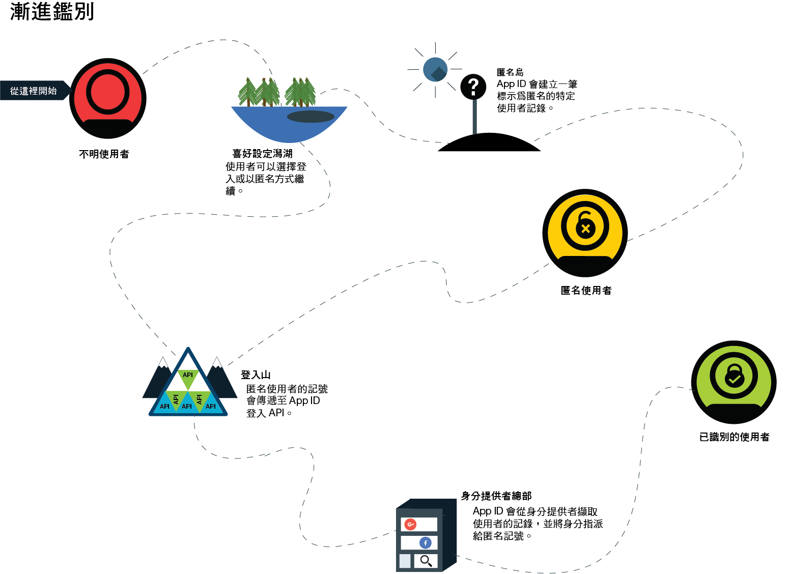
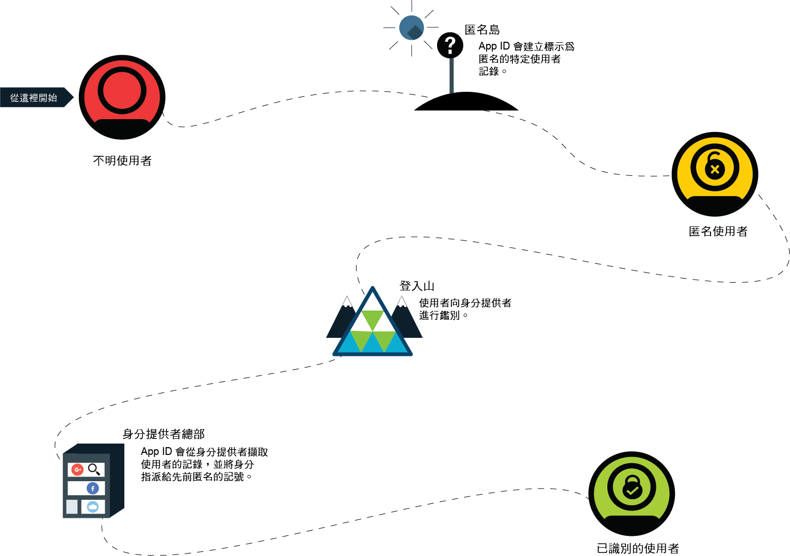

---

copyright:
  years: 2017, 2019
lastupdated: "2019-03-06"

keywords: authentication, authorization, identity, app security, secure, anonymous, progressive, profiles, sign in

subcollection: appid

---

{:new_window: target="_blank"}
{:shortdesc: .shortdesc}
{:screen: .screen}
{:pre: .pre}
{:table: .aria-labeledby="caption"}
{:codeblock: .codeblock}
{:tip: .tip}
{:note: .note}
{:important: .important}
{:deprecated: .deprecated}
{:download: .download}

# 匿名鑑別
{: #anonymous}

開發應用程式時，其中一個最大的問題是安全。如何確定只有具有正確存取權的使用者才能使用應用程式？您需要使用授權處理程序。在大部分處理程序中，授權和鑑別會連結在一起，這樣做會讓變更您的安全原則和身分提供者更加複雜。使用 {{site.data.keyword.appid_full}} 時，授權及鑑別是不同的處理程序。
{: shortdesc}

當使用者順利登入時，他們就會變成已識別的使用者。身分提供者會將包含使用者相關資訊的存取及身分記號傳回給 {{site.data.keyword.appid_short}}。此服務會採用提供的記號，並判斷使用者是否有適當的認證可以存取應用程式。如果已驗證記號，則服務會授權使用者存取應用程式。授權使用者之後，鑑別資訊會與使用者的設定檔相關聯。可從使用相同身分提供者進行鑑別的任何用戶端中，重新存取設定檔及其屬性。

## 漸進鑑別
{: #progressive}

使用 {{site.data.keyword.appid_short_notm}}，匿名使用者可以選擇變成已識別的使用者。

使用者選擇不要立即登入時，就會將他們視為匿名使用者。例如，使用者可以在其中立即開始將項目新增至購物車，而不需要登入。對於匿名使用者，{{site.data.keyword.appid_short_notm}} 會建立特定的使用者設定檔，並呼叫 OAuth 登入 API 以傳回匿名存取及身分記號。使用這些記號，應用程式可以建立、讀取、更新及刪除使用者設定檔中所儲存的屬性。

匿名使用者登入時，其存取記號會傳遞至登入 API。服務會向身分提供者鑑別呼叫。服務會使用存取記號來尋找匿名設定檔，並且將使用者的身分附加至其中。新的存取及身分記號包含身分提供者所共用的公用資訊。在識別使用者之後，其匿名記號會變成無效。不過，使用者仍然能夠存取其屬性，因為可使用新記號存取它們。

如果身分尚未指派給另一位使用者，則只能將它指派給匿名設定檔。
{: tip}

如果身分已與另一個 {{site.data.keyword.appid_short_notm}} 使用者相關聯，則記號會包含該使用者設定檔的資訊，並提供其屬性的存取權。透過新的記號，無法存取先前匿名使用者的屬性。除非記號到期，否則仍然可以透過匿名存取記號來存取這項資訊。開發應用程式時，您可以選擇如何將匿名屬性合併至已知使用者。
