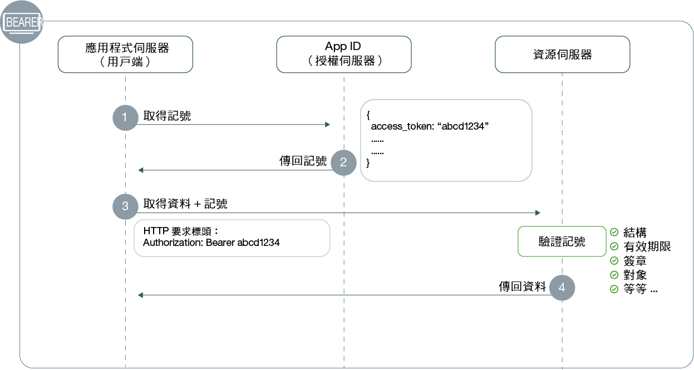

---

copyright:
  years: 2017, 2019
lastupdated: "2019-07-11"

keywords: Authentication, authorization, identity, app security, secure, development, access management, liberty, backend, java, token

subcollection: appid

---

{:external: target="_blank" .external}
{:shortdesc: .shortdesc}
{:screen: .screen}
{:pre: .pre}
{:table: .aria-labeledby="caption"}
{:codeblock: .codeblock}
{:tip: .tip}
{:note: .note}
{:important: .important}
{:deprecated: .deprecated}
{:download: .download}


# 後端：Liberty for Java
{: #backend-liberty}

使用 {{site.data.keyword.appid_short_notm}}，您可以輕鬆地保護 API 端點，並確保 Liberty for Java 後端應用程式的安全。使用本手冊，您可以在 20 分鐘以內快速開始並執行簡單的鑑別流程。
{: shortdesc}




1. 若要提出受保護資源的要求，用戶端必須具有存取記號。在步驟 1 中，用戶端對 {{site.data.keyword.appid_short_notm}} 提出記號要求。如需取得存取記號的相關資訊，請參閱[取得記號](/docs/services/appid?topic=appid-obtain-tokens)。
2. {{site.data.keyword.appid_short_notm}} 傳回記號。
3. 用戶端可以使用存取記號，來要求存取受保護的資源。
4. 資源會驗證記號，包括結構、有效期限、簽章、對象及任何其他現有欄位。如果記號無效，資源伺服器會拒絕存取。如果記號驗證成功，它會傳回資料。


## 視訊指導教學
{: #backend-liberty-video}

請觀看下列視訊，以參閱您可以如何使用 {{site.data.keyword.appid_short_notm}} 來保護簡單的 Liberty for Java 應用程式。視訊中涵蓋的所有資訊也可以在此頁面上以書寫格式找到。

<iframe class="embed-responsive-item" id="appid-liberty-backend-app" title="關於 {{site.data.keyword.appid_short_notm}}" type="text/html" width="640" height="390" src="//www.youtube.com/embed/QA6DY2qqLaw?rel=0" frameborder="0" webkitallowfullscreen mozallowfullscreen allowfullscreen></iframe> 沒有可以嘗試流程的應用程式嗎？沒有問題！{{site.data.keyword.appid_short_notm}} 提供 [簡單的 Liberty for Java 範例應用程式](https://github.com/ibm-cloud-security/appid-video-tutorials/tree/master/02d-simple-liberty-backend-app)。


## 開始之前
{: #liberty-before}

在您的 Liberty for Java 後端應用程式中，開始使用 {{site.data.keyword.appid_short_notm}} 之前，您必須具有下列必備項目：

* [ {{site.data.keyword.appid_short_notm}} 服務的實例](https://cloud.ibm.com/catalog/services/app-id){: external}
* [IBM Cloud CLI](/docs/cli?topic=cloud-cli-getting-started)
* [Apache Maven 3.5 版及更新版本](https://maven.apache.org/download.cgi){: external}
* [Java 第 8 版及更新版本](https://www.java.com/download/){: external}
* 用於測試的 [{{site.data.keyword.appid_short_notm}} Postman 集合](https://github.com/ibm-cloud-security/appid-postman){: external}

## 步驟 1：取得您的認證
{: #liberty-obtain-credentials}

您可以透過下列兩種方式之一來取得您的認證。

  * 導覽至 {{site.data.keyword.appid_short_notm}} 儀表板的**應用程式**標籤。如果您還沒有任何應用程式，可以按一下**新增應用程式**來建立一個新的應用程式。

  * 透過對 [`/management/v4/{tenantId}/applications` 端點提出 POST 要求](https://us-south.appid.cloud.ibm.com/swagger-ui/#!/Applications/registerApplication){: external}。

    要求格式：
    ```
    curl -X POST \  https://us-south.appid.cloud.ibm.com/management/v4/<tenantID>/applications/ \
    -H 'Content-Type: application/json' \
    -H 'Authorization: Bearer IAM_TOKEN' \
    -d '{"name": "ApplicationName"}'
    ```
    {: codeblock}

    回應範例：
    ```
    {
      "clientId": "xxxxx-34a4-4c5e-b34d-d12cc811c86d",
      "tenantId": "xxxxx-9b1f-433e-9d46-0a5521f2b1c4",
      "secret": "ZDk5YWZkYmYt*******",
      "name": "app1",
      "oAuthServerUrl": "https://us-south.appid.cloud.ibm.com/oauth/v4/xxxxx-9b1f-433e-9d46-0a5521f2b1c4",
      "profilesUrl": "https://us-south.appid.cloud.ibm.com",
      "discoveryEndpoint": "https://us-south.appid.cloud.ibm.com/oauth/v4/xxxxxx-9b1f-433e-9d46-0a5521f2b1c4/.well-known/openid-configuration"
    }
    ```
    {: screen}


## 步驟 2：配置 `server.xml` 檔
{: #liberty-configure-server}
 
1. 開啟 `server.xml` 檔案。
2. 將下列特性新增至 `featureManager` 區段。部分特性可能隨附於 Liberty 中。如果您在執行伺服器時收到錯誤，您可以從 Liberty 安裝的 bin 目錄執行 `.installUtility install <name_of_server>` 來安裝它們。

    ```xml
    <featureManager>
        <feature>appSecurity-2.0</feature>
        <feature>openidConnectClient-1.0</feature>
        <feature>ssl-1.0</feature>
        <feature>servlet-3.1</feature>
    </featureManager>
    ```
    {: codeblock}

3. 將下列項目新增至 `server.xml` 檔案，以配置 SSL。 

    ```xml
    <keyStore id="defaultKeyStore" password="{password}"/>
    <keyStore id="RootCA" password="{password}" location="${server.config.dir}/resources/security/{myTrustStore}"/>
    <ssl id="{sslID}" keyStoreRef="defaultKeyStore" trustStoreRef="{truststore-ref}"/>
    ```
    {: codeblock}

4. 建立 Open ID Connect Client 特性，並定義下列位置保留元。使用您取得的認證，填入位置保留元。

    ```xml
    <openidConnectClient 
        id="oidc-client-simple-liberty-backend-app" 		
        inboundPropagation="required"
        jwkEndpointUrl="{region}.appid.cloud.ibm.com/oauth/v4/{tenantID}/publickeys"
        issuerIdentifier="{region).appid.cloud.ibm.com/oauth/v4/{tenantID}"
        signatureAlgorithm="RS256"
        audiences="{client-id}"
        sslRef="oidcClientSSL"
    /> 	
    ```
    {: codeblock}

    <table>
    <caption>表. Liberty for Java 應用程式的 OIDC 元素變數</caption>
        <tr>
            <th colspan="2"> 瞭解 OIDC 元素變數</th>
        </tr>
        <tr>
            <td><code>id</code></td>
            <td>應用程式的名稱。</td>
        </tr>
        <tr>
            <td><code>inboundPropagation</code></td>
            <td>若要延伸在記號中收到的資訊，該值必須設為「必要」。</td>
        </tr>
        <tr>
            <td><code> jwkEndpointUrl </code></td> <td>用來取得金鑰以驗證記號的端點。地區選項包括：<code>au-syd</code>、<code>eu-de</code>、<code>eu-gb</code>、<code>jp-tok</code> 及 <code>us-south</code>。您可以在先前建立的認證中找到您的承租戶 ID。</td>
        </tr>
        <tr>
            <td><code> issuerIdentifier </code></td> <td>發證者 ID 會定義您的授權伺服器。地區選項包括：<code>au-syd</code>、<code>eu-de</code>、<code>eu-gb</code>、<code>jp-tok</code> 及 <code>us-south</code>。您可以在先前建立的認證中找到您的承租戶 ID。</td>
        </tr>
        <tr>
            <td><code> signatureAlgorithm </code></td> <td>指定為 "RS256"。</td>
        </tr>
        <tr>
            <td><code>audiences</code></td>
            <td>依預設，會對您的應用程式認證中找到的 {{site.data.keyword.appid_short_notm}} 用戶端 ID 發出記號。</td>
        </tr>
        <tr>
            <td><code>sslRef</code></td>
            <td>您要使用的 SSL 配置名稱。</td>
        </tr>
    </table>

5. 將特殊主旨類型定義為 `ALL_AUTHENTICATED_USERS`。

    ```xml
    <application 
        id="simple-liberty-backend-app" 
        location="location-of-your-war-file" 
        name="simple-liberty-backend-app" 
        type="war">

        <application-bnd>
            <security-role name="myrole">
                <special-subject type="ALL_AUTHENTICATED_USERS"/>
            </security-role>
        </application-bnd>
    </application>
    ```
    {: codeblock}


## 步驟 3：配置您的 `web.xml` 檔案
{: #liberty-configure-web}

在 `web.xml` 檔案中，定義您要保護的應用程式區域。

1. 定義安全角色。這應該與您在 `server.xml` 檔案中定義的角色相同。

    ```
    <security-role>
		<role-name>myrole</role-name>
	</security-role>
    ```
    {: codeblock}

2. 定義安全限制。

    ```
	<security-constraint>
		<display-name>Security Constraints</display-name>
		<web-resource-collection>
			<web-resource-name>ProtectedArea</web-resource-name>
			<url-pattern>/api/*</url-pattern>
		</web-resource-collection>
		<auth-constraint>
			<role-name>myrole</role-name>
		</auth-constraint>
		<user-data-constraint>
			<transport-guarantee>NONE</transport-guarantee>
		</user-data-constraint>
	</security-constraint>
    ```
    {: codeblock}


## 步驟 4：測試配置
{: #liberty-test}

現在，您已完成起始安裝，建置應用程式並測試配置，以確保一切都如預期運作。

1. 切換至您的應用程式目錄。

2. 建置應用程式。

    ```
    server run
    ```
    {: codeblock}

3. 對受保護的端點提出要求。傳回錯誤。

4. [取得存取記號](/docs/services/appid?topic=appid-obtain-tokens)。

5. 使用您在前一個步驟中取得的存取記號，對端點提出要求。您現在應該能夠存取受保護的端點。驗證回應是否包含您所預期的內容。


## 後續步驟
{: #liberty-next}

準備好開始完善您的鑑別體驗嗎？嘗試瀏覽[此部落格](https://www.ibm.com/cloud/blog/perfecting-the-login-experience-with-liberty-oauth2-and-appid){: external}或瞭解更多[應用程式到應用程式之間的通訊](/docs/services/appid?topic=appid-app)之相關資訊。


