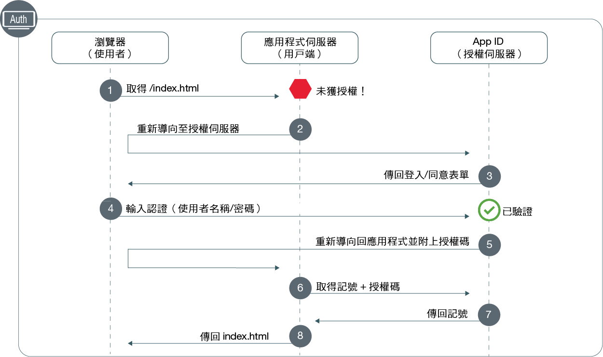

---

copyright:
  years: 2017, 2019
lastupdated: "2019-07-11"

keywords: Authentication, authorization, identity, app security, secure, development, nodejs, frontend, web apps, 

subcollection: appid

---

{:external: target="_blank" .external}
{:shortdesc: .shortdesc}
{:screen: .screen}
{:pre: .pre}
{:table: .aria-labeledby="caption"}
{:codeblock: .codeblock}
{:tip: .tip}
{:note: .note}
{:important: .important}
{:deprecated: .deprecated}
{:download: .download}


# Web：Node.js
{: #web-node}

使用 {{site.data.keyword.appid_short_notm}}，您可以輕鬆地保護 Node.js 前端系統 Web 應用程式。使用本手冊，您可以在 20 分鐘以內快速開始並執行簡單的鑑別流程。
{: shortdesc}

請查看下列圖表，以瞭解授權碼 OAuth 2.0 工作流程。



1. 使用者嘗試存取受保護 Web 應用程式，但它們未獲授權。
2. 您的應用程式會將使用者重新導向至 {{site.data.keyword.appid_short_notm}}。
3. {{site.data.keyword.appid_short_notm}} 會顯示使用者可用來鑑別的登入畫面。
4. 它們會輸入其認證，例如：使用者名稱及密碼。應用程式 ID 會驗證認證。
5. {{site.data.keyword.appid_short_notm}} 會使用授權碼將使用者重新導向回應用程式。
6. 透過使用授權碼，您的應用程式可以向 {{site.data.keyword.appid_short_notm}} 發出要求，以確保驗證使用者。如需取得存取記號的相關資訊，請參閱 [取得記號](/docs/services/appid?topic=appid-obtain-tokens)。
7. {{site.data.keyword.appid_short_notm}} 傳回經驗證使用者的存取及身分記號。
8. 然後會將您的應用程式存取授與使用者。


## 視訊指導教學
{: #web-node-video}

請觀看下列視訊，以參閱您可以如何使用 {{site.data.keyword.appid_short_notm}} 來保護簡單的 Node.js Web 應用程式。視訊中涵蓋的所有資訊也可以在此頁面上以書寫格式找到。

<iframe class="embed-responsive-item" id="appid-web-node" title="關於 {{site.data.keyword.appid_short_notm}} Node.js 應用程式" type="text/html" width="640" height="390" src="//www.youtube.com/embed/6roa1ZOvwtw?rel=0" frameborder="0" webkitallowfullscreen mozallowfullscreen allowfullscreen></iframe>

沒有可以嘗試流程的應用程式嗎？沒有問題！{{site.data.keyword.appid_short_notm}} 提供 [簡單的 Node.js Web 範例應用程式](https://github.com/ibm-cloud-security/appid-video-tutorials/tree/master/02a-simple-node-web-app){: external}。

 

## 開始之前
{: #web-node-before}

在 Node.js Web 應用程式中開始使用 {{site.data.keyword.appid_short_notm}} 之前，您必須具有下列必備項目。
{: shortdesc}

* [ {{site.data.keyword.appid_short_notm}} 服務的實例](https://cloud.ibm.com/catalog/services/app-id){: external}
* [IBM Cloud CLI](/docs/cli?topic=cloud-cli-getting-started)
* [NPM 第 4 版或更新版本](https://www.npmjs.com/get-npm){: external}
* [Node 第 6 版或更新版本](https://nodejs.org/en/download/){: external}


## 步驟 1：登錄您的重新導向 URI
{: #node-web-redirect-uri}

重新導向 URI 是應用程式的回呼端點。在登入流程期間，{{site.data.keyword.appid_short_notm}} 會在容許用戶端參與授權工作流程之前先驗證 URI，這有助於防止網路釣魚攻擊及授權碼洩漏。透過登錄 URI，您將告訴 {{site.data.keyword.appid_short_notm}} 此 URI 是可信任的，可以將您的使用者重新導向。
{: shortdesc}

1. 按一下**管理鑑別 > 鑑別設定**。

2. 在**新增 Web 重新導向 URI** 欄位中，鍵入 URI。每一個 URI 都應該以 `http://` 或 `https://` 作為開頭，而且必須包含完整路徑，其中包括要讓重新導向順利完成的任何查詢參數。

3. 按一下**新增 Web 重新導向 URI** 方框中的 **+** 符號。

4. 重複步驟 1 到 3，直到所有可能的 URI 都新增至您的清單為止。


## 步驟 2：取得您的認證
{: #node-web-credentials}

您可以透過下列兩種方式之一來取得您的認證。
{: shortdesc}

  * 導覽至 {{site.data.keyword.appid_short_notm}} 儀表板的**應用程式**標籤。如果您還沒有任何應用程式，可以按一下**新增應用程式**來建立一個新的應用程式。

  * 透過對 [`/management/v4/{tenantId}/applications` 端點提出 POST 要求](https://us-south.appid.cloud.ibm.com/swagger-ui/#!/Applications/registerApplication)。

    要求格式：
    ```javascript
    curl -X POST \  https://us-south.appid.cloud.ibm.com/management/v4/39a37f57-a227-4bfe-a044-93b6e6060b61/applications/ \
    -H 'Content-Type: application/json' \
    -H 'Authorization: Bearer IAM_TOKEN' \
    -d '{"name": "ApplicationName"}'
    ```
    {: codeblock}

    回應範例：
    ```javascript
    {
      "clientId": "xxxxx-34a4-4c5e-b34d-d12cc811c86d",
      "tenantId": "xxxxx-9b1f-433e-9d46-0a5521f2b1c4",
      "secret": "ZDk5YWZkYmYt*******",
      "name": "app1",
      "oAuthServerUrl": "https://us-south.appid.cloud.ibm.com/oauth/v4/xxxxx-9b1f-433e-9d46-0a5521f2b1c4",
      "profilesUrl": "https://us-south.appid.cloud.ibm.com",
      "discoveryEndpoint": "https://us-south.appid.cloud.ibm.com/oauth/v4/xxxxxx-9b1f-433e-9d46-0a5521f2b1c4/.well-known/openid-configuration"
    }
    ```
    {: screen}


## 步驟 3：起始設定 SDK
{: #web-node-install}

使用 {{site.data.keyword.appid_short_notm}} 的最簡單方式是利用 Node.JS SDK。
{: shortdesc}


1. 使用指令行，切換至包含 Node.js 應用程式的目錄。

2. 安裝下列 NPM 需求。

    ```javascript
    npm install --save express express-session passport
    ```
    {: codeblock}

3. 安裝 {{site.data.keyword.appid_short_notm}} 服務。

    ```javascript
  npm install --save ibmcloud-appid
  ```
    {: codeblock}

4. 將下列需求新增至 `server.js` 檔。

    ```javascript
    const express = require('express'); 								// https://www.npmjs.com/package/express
    const session = require('express-session');							// https://www.npmjs.com/package/express-session
    const passport = require('passport');								// https://www.npmjs.com/package/passport
    const WebAppStrategy = require('ibmcloud-appid').WebAppStrategy;	// https://www.npmjs.com/package/ibmcloud-appid
    ```
    {: shortdesc}

5. 使用您在步驟 1 中取得的認證設定應用程式以使用快速階段作業中介軟體。您可以選擇以兩種方式的其中一種來格式化重導向 URI。手動使用新的 `WebAppStrategy({redirectUri: "...."})` 或將值設定為環境變數，如在範例碼中顯示。

    ```javascript
    const app = express();
    app.use(session({
        secret: '123456',
        resave: true,
        saveUninitialized: true
    }));
    app.use(passport.initialize());
    app.use(passport.session());
    passport.serializeUser((user, cb) => cb(null, user));
    passport.deserializeUser((user, cb) => cb(null, user));
    passport.use(new WebAppStrategy({
        tenantId: "<tenant_ID>",
        clientId: "<client_ID>",
        secret: "<secret>",
        oauthServerUrl: "<OAuth_Server_URL>",
        redirectUri: "<redirect_URI>"
    }));
    ```
    {: codeblock}

    您必須為正式作業環境配置具有適當階段作業儲存空間的中介軟體。如需相關資訊，請參閱 <a href="https://github.com/expressjs/session" target="_blank"> express.js 文件 </a>。
    {: note}


## 步驟 4：保護應用程式
{: #node-web-protect}

現在您已安裝 {{site.data.keyword.appid_short_notm}}，您就可以保護您的應用程式。您可以透過定義 Web 應用程式策略，選擇保護整個應用程式，或只保護特定資源。
{: shortdesc}


1. 配置回呼端點。回呼會完成授權程序，方法是透過從 App ID 擷取存取及身分記號，並將使用者重新導向至下面其中一個位置：<ul><li>觸發鑑別之要求的原始 URL，會在 HTTP 階段作業中作為 `WebAppStrategy.ORIGINAL_URL` 保留。</li><li>指定在發生鑑別成功事件時的重新導向。</li><li>應用程式根目錄 (`/`)，如下一個步驟所示。</li></ul>

    ```javascript
   app.get(CALLBACK_URL, passport.authenticate(WebAppStrategy.STRATEGY_NAME));
   ```
    {: codeblock}

2. 將登入端點設定為一律將瀏覽器重新導向至「登入小組件」。請務必新增順利重新導向選項，如此您就不會在鑑別無限迴圈中結束。

    ```javascript
    app.get('/appid/login', passport.authenticate(WebAppStrategy.STRATEGY_NAME, {
        successRedirect: '/',
        forceLogin: true
    }));
    ```
    {: codeblock}

3. 配置登出。當使用者登出您的應用程式時，會從該階段作業中清除其所有鑑別資訊。若要與應用程式進行互動，他們需要重新登入。

    ```javascript
    app.get('/appid/logout', function(req, res){
        webappstrategy.logout(req);
        res.redirect('/');
    });
    ```
    {: shortdesc}

## 步驟 5：個人化您的應用程式
{: #node-web-user-info}

您可以取回身分提供者所提供的資訊，以個人化您的應用程式體驗。
{: shortdesc}

1. 配置應用程式以取得使用者資訊。`protected` 是一個位置保留元變數，您可以變更此變數以符合應用程式的端點。

    ```javascript
    app.get("/protected", passport.authenticate(WebAppStrategy.STRATEGY_NAME), function(req, res){
        res.json(req.user);
    });
    ```
    {: codeblock}

    For example, in the sample application you can see how to obtain the users name to personalize your application.
    ```javascript
    app.get('/api/user', (req, res) => {
        // console.log(req.session[WebAppStrategy.AUTH_CONTEXT]);
        res.json({
            user: {
                name: req.user.name
            }
        });
    });
    ```
    {: codeblock}


## 步驟 6：測試配置
{: #node-web-test}

要測試授權配置，請導覽至伺服器正在接聽的 URL，如應用程式中所定義。請嘗試登入，並嘗試登出。確保配置如預期般運作。 

當您準備好移至下一步時，您可以嘗試啟用 [Cloud Directory 的多因素鑑別](/docs/services/appid?topic=appid-cd-mfa)或新增[自訂屬性](/docs/services/appid?topic=appid-profiles)，以進一步個人化您的應用程式。


