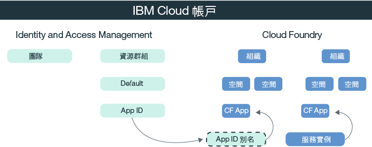

---

copyright:
  years: 2017, 2019
lastupdated: "2019-03-20"

keywords: authentication, authorization, identity, app security, secure, development, cloud foundry, access management, iam, java, node.js

subcollection: appid

---

{:new_window: target="_blank"}
{:shortdesc: .shortdesc}
{:screen: .screen}
{:pre: .pre}
{:table: .aria-labeledby="caption"}
{:codeblock: .codeblock}
{:tip: .tip}
{:note: .note}
{:important: .important}
{:deprecated: .deprecated}
{:download: .download}


# 指導教學：配置 Cloud Foundry 來使用 {{site.data.keyword.appid_short_notm}}
{: #cloud-foundry}

透過 {{site.data.keyword.cloud_notm}}，您可以使用兩種不同類型的存取管理來保護應用程式：Identity and Access Management (IAM) 及 Cloud Foundry。依預設，{{site.data.keyword.appid_short_notm}} 的所有新實例都使用 IAM 資源群組來管理存取權。如果您是使用 Cloud Foundry 來管理應用程式，則可以透過建立服務別名並將服務連結至應用程式，來橋接管理模型。
{: shortdesc}


## 瞭解 Cloud Foundry
{: #cf-understand}

別名使 IAM 管理的服務（例如 {{site.data.keyword.appid_short_notm}}）與 Cloud Foundry 應用程式之間有了連結。當您連結應用程式時，即會建立服務認證，並自動傳遞給應用程式。雖然連結是配置中的必要步驟，但具有下列好處：

* 自動化：透過在 VCAP_SERVICES 環境變數中儲存服務認證，您不再需要將它們手動複製到應用程式。一切將由 {{site.data.keyword.appid_short_notm}} SDK 代表您在幕後完成。
* 安全：配置變成防錯，因為該處理程序為自動執行。
* 安全：因為服務認證僅存在於環境變數中，所以與存取權相關的一切資訊都不會寫在應用程式中。

您的 Cloud Foundry 應用程式是否在另一個平台上管理？沒有問題。您可以在應用程式中定義應用程式認證，將其連結至服務。您可以透過 {{site.data.keyword.appid_short_notm}} 儀表板，或對 [/applications 端點](https://us-south.appid.cloud.ibm.com/swagger-ui/#!/Applications/registerApplication)提出要求，來尋找您的應用程式認證。
{: tip}

請查看下圖中的模型如何配合使用：



## 開始之前
{: #cf-before}

開始之前，請確定您具有下列必備項目：

* {{site.data.keyword.cloud_notm}} 帳戶
* {{site.data.keyword.appid_short_notm}} 的實例。
* 在本端安裝的 [{{site.data.keyword.cloud_notm}} CLI](/docs/cli/reference/ibmcloud?topic=cloud-cli-ibmcloud-cli#ibmcloud-cli)

## 部署 Node.js 應用程式
{: #cf-node}


1. 導覽至您的 {{site.data.keyword.appid_short_notm}} 實例。

2. 按一下服務儀表板之**概觀**標籤上的**下載範例**。

3. 按一下 **Node.js**。下載並解壓縮範例應用程式。

4. 驗證您具有所有 Node.js 必備項目。

5. 開啟終端機，並切換至範例資料夾。

6. 登入 {{site.data.keyword.cloud_notm}} CLI。如果您未指定帳戶及地區，CLI 會提示您加以選取。

  ```
  ibmcloud login -a cloud.ibm.com -r <region>
  ```
  {: pre}

  <table>
    <tr>
      <th>地區</th>
      <th>端點</th>
    </tr>
    <tr>
      <td>達拉斯</td>
      <td><code>us-south</code></td>
    </tr>
    <tr>
      <td>法蘭克福</td>
      <td><code>eu-de</code></td>
    </tr>
    <tr>
      <td>雪梨</td>
      <td><code>au-syd</code></td>
    </tr>
    <tr>
      <td>倫敦</td>
      <td><code>eu-gb</code></td>
    </tr>
    <tr>
      <td>東京</td>
      <td><code>jp-tok</code></td>
    </tr>
  </table>

7. 以您要在其中工作的 Cloud Foundry 組織及空間為目標，並遵循提示來瞄準某個組織及空間。

  ```
  ibmcloud target --cf
  ```
  {: pre}

8. 建立 {{site.data.keyword.appid_short_notm}} 服務實例的別名。

  ```
  ibmcloud resource service-alias-create {ALIAS_NAME} --instance-name {SERVICE_INSTANCE_NAME}
  ```
  {: pre}

9. 使用在前一個指令中取得的資訊，在專案的 `manifest.yml` 中編輯主機及名稱值。將您建立的別名新增至您的服務。

10. 透過部署範例應用程式來連結 `manifest.yml` 檔案中列出的各項服務。

  ```
  ibmcloud app push
  ```
  {: pre}

## 部署 Java 應用程式
{: #java}

1. 導覽至您的 {{site.data.keyword.appid_short_notm}} 實例。

2. 按一下服務儀表板之**概觀**標籤上的**下載範例**。

3. 按一下 **Java**。下載並解壓縮範例應用程式。

4. 驗證您具有所有 Java 必備項目。

5. 開啟終端機，並切換至範例資料夾。

6. 產生 `war` 檔案並上傳該檔案。

  ```
  mvn clean install
  ```
  {: pre}

7. 切換至 Liberty 資料夾。

8. 登入 {{site.data.keyword.cloud_notm}} CLI。如果您未指定帳戶及地區，CLI 會提示您加以選取。

  ```
  ibmcloud login -a cloud.ibm.com -r <region>
  ```
  {: pre}

8. 以您要在其中工作的 Cloud Foundry 組織及空間為目標，並遵循提示來瞄準某個組織及空間。

  ```
  ibmcloud target --cf
  ```
  {: pre}

10. 建立 {{site.data.keyword.appid_short_notm}} 服務實例的別名。

  ```
  ibmcloud resource service-alias-create {ALIAS_NAME} --instance-name {SERVICE_INSTANCE_NAME}
  ```
  {: pre}

11. 使用在前一個指令中取得的資訊，在專案的 `manifest.yml` 中編輯主機及名稱值。將您建立的別名新增至您的服務。

  範例：
  ```
    applications:
  - name: ApplicationName
    host: HostName
    buildpack: liberty-for-java
    instances: 1
    memory: 512M
    disk_quota: 1024M
    timeout: 180
    services:
    - AppID-alias
  ```
  {: screen}

13. 透過部署範例應用程式來連結 `manifest.yml` 檔案中列出的各項服務。

  ```
  ibmcloud app push
  ```
  {: pre}

