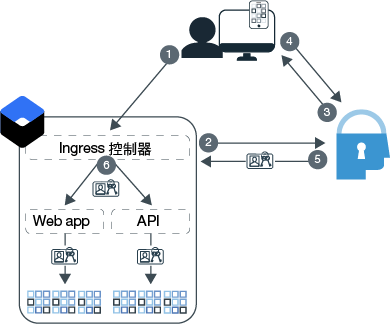

---

copyright:
  years: 2017, 2019
lastupdated: "2019-03-21"

keywords: authentication, authorization, identity, app security, secure, development, ingress, policy, networking, containers, kubernetes

subcollection: appid

---

{:new_window: target="_blank"}
{:shortdesc: .shortdesc}
{:screen: .screen}
{:pre: .pre}
{:table: .aria-labeledby="caption"}
{:codeblock: .codeblock}
{:tip: .tip}
{:note: .note}
{:important: .important}
{:deprecated: .deprecated}
{:download: .download}


# 指導教學：配置 Ingress 來使用 {{site.data.keyword.appid_short_notm}}
{: #kube-auth}

您可以使用 {{site.data.keyword.containerlong}} 中的 Ingress 網路功能，一直不斷地施行原則驅動的安全。透過此方法，您可以同時為叢集中的所有應用程式啟用授權及鑑別，完全不需要變更應用程式碼！使用此逐步指引，您可以瞭解如何配置 Ingress 控制器來使用 {{site.data.keyword.appid_short_notm}}。
{: shortdesc}

請查看下圖，以瞭解鑑別流程：



1. 使用者會開啟您的應用程式，並觸發對 Web 應用程式或 API 的要求。
2. 對於 API 流程，Ingress 控制器會嘗試驗證所提供的記號。如果使用 Web 流程，它將開始三腳式 OIDC 鑑別處理程序。
3. {{site.data.keyword.appid_short_notm}} 透過顯示「登入小組件」來開始鑑別處理程序。
4. 使用者提供使用者名稱或電子郵件及密碼。
5. Ingress 控制器會取得 {{site.data.keyword.appid_short_notm}} 中的存取記號及身分記號以進行授權。
6. Ingress 控制器驗證及轉遞至應用程式的每一個要求都具有包含記號的授權標頭。

Ingress 控制器與 {{site.data.keyword.appid_short_notm}} 的整合目前不支援重新整理記號。當您的存取記號及身分記號到期時，使用者必須重新鑑別。
{: note}


## 開始之前
{: #kube-prereqs}

開始之前，請確定您具有下列必備項目。
{: shortdesc}

基於安全理由，{{site.data.keyword.appid_short_notm}} 鑑別只支援已啟用 TLS/SSL 的後端。
{: note}

* 應用程式或範例應用程式。
* 一個標準的 Kubernetes 叢集，其中每個區域至少有兩個工作者節點。如果您在多區域叢集中使用 Ingress，請檢閱 [Kubernetes 服務文件](/docs/containers?topic=containers-ingress#config_prereqs)中的額外必要條件。
* 叢集部署所在之相同地區中的 {{site.data.keyword.appid_short_notm}} 實例。請確定服務名稱不含任何空格。

* 下列 [{{site.data.keyword.cloud_notm}} IAM 角色](/docs/containers?topic=containers-access_reference#access_reference)：
  * 叢集：管理者平台角色
  * Kubernetes 名稱空間：管理服務程式角色

* 下列 CLI：

  * [{{site.data.keyword.cloud_notm}}](/docs/cli/reference/ibmcloud/cloud-cli-install_use?topic=cloud-cli-ibmcloud-cli#ibmcloud-cli)
  * [Kubernetes](https://kubernetes.io/docs/tasks/tools/install-kubectl/)
  * [Docker](https://www.docker.com/products/docker-engine#/download)

* 下列 [{{site.data.keyword.cloud_notm}} CLI 外掛程式](/docs/cli/reference/ibmcloud?topic=cloud-cli-plug-ins#plug-ins)：

  * Kubernetes 服務
  * Container Registry

下載 CLI 和外掛程式以及在配置 Kubernetes 服務環境時如需協助，請參閱[建立 Kubernetes 叢集](/docs/containers?topic=containers-cs_cluster_tutorial#cs_cluster_tutorial_lesson1)指導教學。
{: tip}

讓我們開始吧！

## 步驟 1：將 {{site.data.keyword.appid_short_notm}} 連結至您的叢集
{: #kube-create-appid}

您可以將 {{site.data.keyword.appid_short_notm}} 實例連結至您的叢集，以容許使用您叢集中所部署的所有應用程式實例。透過將服務實例連結至叢集，只要您的應用程式一啟動，您的 {{site.data.keyword.appid_short_notm}} meta 資料及認證就可作為 Kubernetes 密碼使用。
{: shortdesc}


1. 登入 {{site.data.keyword.cloud_notm}} CLI。遵循 CLI 中的提示，以完成登入。

  ```
  ibmcloud login -a cloud.ibm.com -r <region>
  ```
  {: codeblock}

  <table>
    <tr>
      <th>地區</th>
      <th>端點</th>
    </tr>
    <tr>
      <td>達拉斯</td>
      <td><code>us-south</code></td>
    </tr>
    <tr>
      <td>法蘭克福</td>
      <td><code>eu-de</code></td>
    </tr>
    <tr>
      <td>雪梨</td>
      <td><code>au-syd</code></td>
    </tr>
    <tr>
      <td>倫敦</td>
      <td><code>eu-gb</code></td>
    </tr>
    <tr>
      <td>東京</td>
      <td><code>jp-tok</code></td>
    </tr>
  </table>

2. 設定叢集的環境定義。

  1. 讓指令設定環境變數，並下載 Kubernetes 配置檔。

    ```
    ibmcloud ks cluster-config <cluster_name_or_ID>
    ```
    {: codeblock}

  2. 從 `export` 開始複製輸出，並將它貼到您的終端機中，以設定 `KUBECONFIG` 環境變數。

3. 檢查您的預設名稱空間中是否已有 Ingress 控制器。IBM Cloud Kubernetes 服務支援每個名稱空間一個 Ingress。如果您已經有一個，您可以更新現有的 Ingress 配置，或使用不同的名稱空間。

  ```
  kubectl get ingress
  ```
  {: pre}

4. 連結您的 {{site.data.keyword.appid_short_notm}} 實例。連結會建立服務實例的服務金鑰。您可以使用 `-key` 旗標來指定現有的服務金鑰。

  ```
  ibmcloud ks cluster-service-bind --cluster <cluster_name_or_ID> --namespace <namespace> --service <App-ID_instance_name> [--key <service_instance_key>]
  ```
  {: pre}

  如果您未指定名稱空間，則會在 `default` 名稱空間中建立此密碼。
  {: tip}

  輸出範例：

  ```
  ibmcloud ks cluster-service-bind --cluster mycluster --namespace default --service appid1
  Binding service instance to namespace...
  OK
  Namespace:    default
  Secret name:  binding-appid1
  ```
  {: screen}

做得好！

## 步驟 2：將應用程式推送至 Container Registry
{: #kube-registry}

為了讓您的應用程式能夠在 Kubernetes 中執行，您必須在登錄中進行管理。
{: shortdesc}


1. 登入 Container Registry CLI 外掛程式。

  ```
  ibmcloud cr login
  ```
  {: pre}

2. 建立 Container Registry 名稱空間。

  ```
  ibmcloud cr namespace-add <my_namespace>
  ```
  {: pre}

3. 在 Container Registry 中，建置、標記應用程式，以及用映像檔將應用程式推送至名稱空間。請務必在指令結尾處包含句點 (.)。

  ```
  ibmcloud cr build -t registry.<region>.bluemix.net/<namespace>/<app-name>:<tag> .
  ```
  {: pre}

太棒了！您差不多可以開始部署。

## 步驟 3：配置 Ingress
{: kube-ingress}

在建立叢集期間，會為您建立專用及公用 Ingress ALB。若要部署應用程式並利用 Ingress 控制器，請建立部署 Script。
{: shortdesc}

1. 取得當您將 {{site.data.keyword.appid_short_notm}} 連結至叢集時在叢集名稱空間中建立的密碼。附註：這**不是**您的 Container Registry 名稱空間。

  ```
  kubectl get secrets --namespace=<namespace>
  ```
  {: pre}

  輸出範例：

  ```
  NAME                       TYPE                                  DATA      AGE
  binding-appid1             Opaque                                1         1m
  bluemix-default-secret     kubernetes.io/dockercfg               1         1h
  default-token-kf97z        kubernetes.io/service-account-token   3         1h
  ```
  {: screen}

2. 使用下列範例 `yaml` 檔案來建立 Ingress 配置。定義其餘部署項目時如需協助，請參閱[使用 CLI 來部署應用程式](/docs/containers?topic=containers-app#app_cli)。

  ```
  apiVersion: extensions/v1beta1
  kind: Ingress
  metadata:
    name: myingress
    annotations:
      ingress.bluemix.net/appid-auth: "bindSecret=<bind_secret> namespace=<namespace> requestType=<request_type> serviceName=<myservice> [idToken=false]"
  spec:
    tls:
    - hosts:
      - mydomain
      secretName: mytlssecret
    rules:
    - host: mydomain
      http:
        paths:
        - path: /
          backend:
            serviceName: myservice
            servicePort: 8080
  ```
  {: screen}

  <table>
    <tr>
      <th>變數</th>
      <th>說明</th>
    </tr>
    <tr>
      <td><code>bindSecret</code></td>
      <td>當您將 {{site.data.keyword.appid_short_notm}} 服務實例連結至叢集時所建立的 Kubernetes 密碼。</td>
    </tr>
    <tr>
      <td><code>namespace</code></td>
      <td>已建立 <code>bindSecret</code> 的名稱空間。如果未指定名稱空間，則會使用 <code>default</code> 名稱空間。</td>
    </tr>
    <tr>
      <td><code>requestType</code></td>
      <td><p>您要傳送至 {{site.data.keyword.appid_short_notm}} 的要求類型。選項包括：<code>web</code> 及 <code>api</code>。如果您將要求類型設為 <code>web</code>，則會驗證包含 {{site.data.keyword.appid_short_notm}} 存取記號的 Web 要求。如果記號驗證失敗，則會拒絕 Web 要求。如果要求不包含存取記號，則會將該要求重新導向至 {{site.data.keyword.appid_short_notm}} 登入頁面。若要讓 {{site.data.keyword.appid_short_notm}} Web 鑑別能夠運作，必須在使用者的瀏覽器中啟用 Cookie。</p><p>如果您將要求類型設為 <code>api</code>，則會驗證包含 {{site.data.keyword.appid_short_notm}} 存取記號的 API 要求。如果要求不包含存取記號，則會向使用者傳回 <code>401: Unauthorized</code> 錯誤訊息。</p></td>
    </tr>
    <tr>
      <td><code>serviceName</code></td>
      <td><p>必要：您為應用程式建立的 Kubernetes 服務名稱。如果未包括服務名稱，則會對所有服務啟用註釋。</p> <p>若要在相同的叢集中使用多個要求類型，請配置一個 {{site.data.keyword.appid_short_notm}} 實例來使用 <code>web</code>，另一個使用 <code>api</code>。</p></td>
    </tr>
    <tr>
      <td><code>idToken</code></td>
      <td>選用項目：Liberty OIDC 用戶端無法同時剖析存取記號及身分記號。當使用 Liberty 時，請將這個值設為 <code>false</code>，這樣身分記號就不會傳送到 Liberty 伺服器。</td>
    </tr>
    <tr>
      <td><code>secretName</code></td>
      <td>與 TLS 憑證相關聯的 TLS 密碼。如果您的憑證是在 IBM Cloud Certificate Manager 中進行管理，則可以執行 <code>ibmcloud ks alb-cert-deploy --secret-name <secret_name> --cluster <cluster_name_or_ID> --cert-crn <certificate_crn></code>，將其部署至您的叢集。如果您沒有憑證，請完成[使用 Ingress 公開應用程式](/docs/containers?topic=containers-ingress#ingress_expose_public)的步驟 3。</td>
    </tr>
  </table>

3. 執行配置檔。

  ```
  kubectl apply -f <file-name>.yaml
  ```
  {: pre}

做得好！


## 步驟 4：新增重新導向 URL
{: #kube-add-redirect}

重新導向 URL 是您希望 {{site.data.keyword.appid_short_notm}} 在成功鑑別之後將使用者傳送至其中的網站 URL。
{: shortdesc}

1. 導覽至 {{site.data.keyword.cloud_notm}} GUI，然後開啟 {{site.data.keyword.appid_short_notm}} 儀表板。

2. 在**身分提供者 > 管理**中，將您要使用的提供者設為**開啟**。如果未啟用提供者，則會向使用者發出存取記號，以提供對應用程式的匿名存取。

3. 按一下**鑑別設定**。

4. 按一下**新增 Web 重新導向 URL** 方框中的 **+** 符號。

  * 自訂網域：

    向自訂網域登錄的 URL 可能類似這樣：`http://mydomain.net/myapp2path/appid_callback`。如果您要公開的應用程式位於相同的叢集，但在不同的名稱空間中，您可以使用萬用字元，一次指定叢集中的所有應用程式。這在開發期間很有用，但是如果在正式作業中使用萬用字元，則應該特別小心。例如：`https://custom_domain.net/*`

  * Ingress 子網域：

    如果您的應用程式是向 IBM Ingress 子網域登錄，則回呼 URL 可能類似這樣：`https://mycluster.us-south.containers.appdomain.cloud/myapp1path/appid_callback`

{{site.data.keyword.appid_short_notm}} 提供 logout 函數：如果 `/logout` 存在於 {{site.data.keyword.appid_short_notm}} 路徑中，則會移除 Cookie，並將使用者送回到登入頁面。若要使用此功能，請以 `https://mycluster.us-south.containers.appdomain.cloud/myapp1path/appid_logout` 格式將 `/appid_logout` 附加至您的網域，並將它併入您的重新導向 URL 中。
{: note}


做得很好！現在，您可以導覽至 Ingress 子網域或自訂網域來試試看，以驗證此部署已順利完成。


## 後續步驟
{: #kube-next}

既然您的應用程式正在 Kubernetes 叢集中執行，且 Ingress 已完成配置，您可以嘗試：

* 使用自訂屬性來[設定角色](/docs/services/appid?topic=appid-tutorial-roles)
* 配置[多因子鑑別](/docs/services/appid?topic=appid-cd-mfa)
* 自訂[登入小組件](/docs/services/appid?topic=appid-login-widget)


