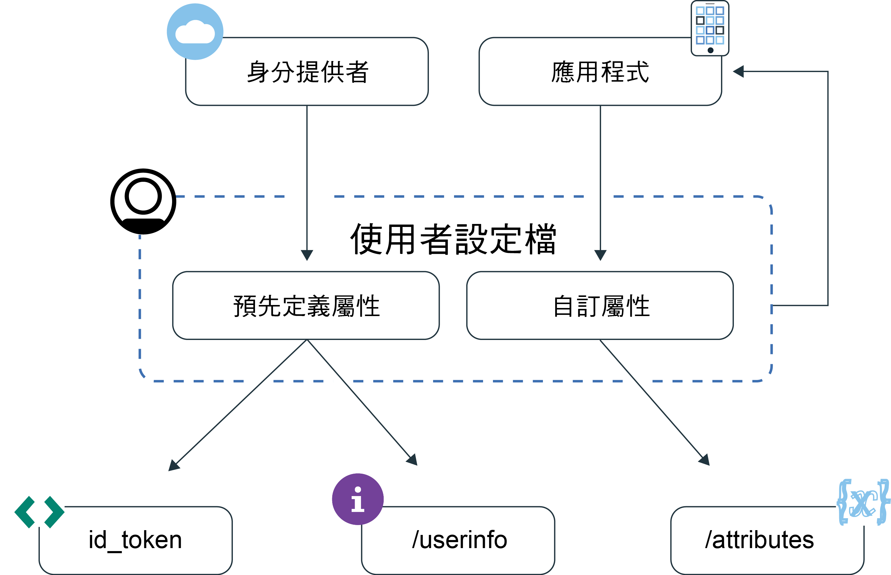

---

copyright:
  years: 2017, 2019
lastupdated: "2019-04-04"

keywords: authentication, authorization, identity, app security, secure, user profiles, personalized apps, attributes, 

subcollection: appid

---

{:new_window: target="_blank"}
{:shortdesc: .shortdesc}
{:screen: .screen}
{:pre: .pre}
{:table: .aria-labeledby="caption"}
{:codeblock: .codeblock}
{:tip: .tip}
{:note: .note}
{:important: .important}
{:deprecated: .deprecated}
{:download: .download}

# 瞭解使用者設定檔
{: #user-profile}

使用 {{site.data.keyword.appid_full}}，您可以藉由存取 {{site.data.keyword.appid_short_notm}} 所儲存使用者的相關資訊來建置個人化應用程式體驗。
{: shortdesc}

## 主要概念
{: #profile-concepts}

**什麼是使用者設定檔？**

使用者設定檔是 {{site.data.keyword.appid_short_notm}} 所儲存的屬性集合。屬性是與您應用程式互動之使用者的資訊片段。您可以取得兩種類型的屬性：`預先定義`及`自訂`。

**什麼是預先定義屬性？**

當您的使用者登入您的應用程式時，身分提供者會傳回預先定義屬性。這些屬性可能包括其使用者名稱、年齡或性別。

**什麼是自訂屬性？**

使用者與應用程式互動時，會學習使用者的自訂屬性。使用者第一次登入您的應用程式之前，您也可以設定自訂屬性。例如，他們所偏好的字型大小，或他們放在購物車中的項目。自訂屬性可以進行編輯。在變更預設值之前，請務必查看透過容許使用者編輯其屬性而可能會有的[安全含意](/docs/services/appid?topic=appid-custom-attributes)。

## 存取使用者屬性
{: #profile-access}

您可以使用不同的方式來存取[預先定義](/docs/services/appid?topic=appid-predefined-attributes)及[自訂](/docs/services/appid?topic=appid-custom-attributes)屬性。在成功使用者鑑別之後，您的應用程式會接收到存取及身分記號。身分記號包含身分提供者所傳回之使用者屬性的正規化子集。若要取得完整的使用者屬性清單，您可以使用 OIDC [`/userinfo` 端點](https://us-south.appid.cloud.ibm.com/swagger-ui/#/Authorization_Server_V4/userInfo)。若要管理自訂屬性，您可以使用 `REST API`。在鑑別處理程序結束時，{{site.data.keyword.appid_short_notm}} 所產生的存取記號會同時保護使用者資訊及自訂屬性端點。

如需身分及存取記號的相關資訊，請參閱[瞭解記號](/docs/services/appid?topic=appid-tokens#tokens)或[驗證記號](/docs/services/appid?topic=appid-token-validation)。

圖. 使用者設定檔資訊流程

若要查看自訂屬性，您可以使用 <a href="https://us-south.appid.cloud.ibm.com/swagger-ui/#/Attributes" target="_blank">REST API </a>。

