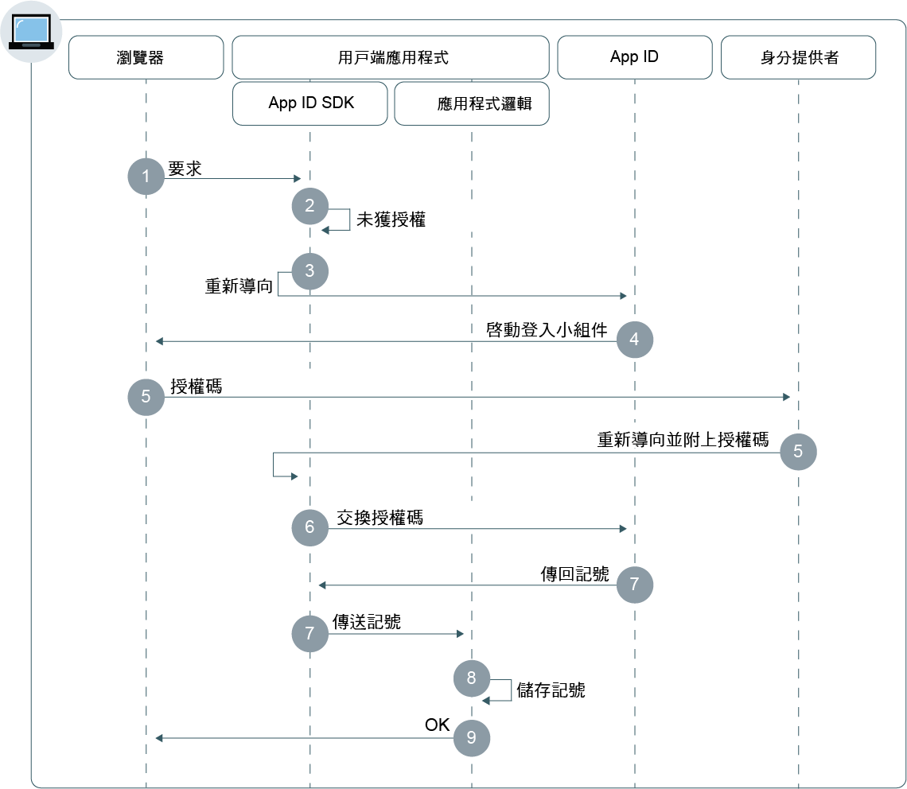

---

copyright:
  years: 2017, 2018
lastupdated: "2018-12-19"

---

{:new_window: target="_blank"}
{:shortdesc: .shortdesc}
{:pre: .pre}
{:tip: .tip}
{:screen: .screen}
{:codeblock: .codeblock}


# Web 應用程式
{: #adding-web}

使用 {{site.data.keyword.appid_full}}，您可以快速建構 Web 應用程式的鑑別層。
{: shortdesc}

## 瞭解流程
{: #understanding}

**此流程何時有用？**

開發 Web 應用程式時，您可以使用 {{site.data.keyword.appid_short}} Web 流程來安全地鑑別使用者。然後，使用者可以在您的 Web 應用程式中存取伺服器端受保護內容。

**何謂流程的技術基準？**

Web 應用程式通常需要使用者進行鑑別，才能存取受保護內容。{{site.data.keyword.appid_short_notm}} 會使用 OIDC 授權碼流程安全地鑑別使用者。使用此流程，當鑑別使用者時，應用程式會接收到授權碼。然後，交換存取、身分及重新整理記號的程式碼。在程式碼中，交換步驟一律透過應用程式與 OIDC 伺服器之間的安全反向頻道傳送記號。這會提供額外的安全層，因為攻擊者無法截取記號。這些記號可以直接傳送至用於使用者鑑別的 Web 伺服器管理應用程式。

**此流程如何運作？**



1. 使用者會透過 {{site.data.keyword.appid_short_notm}} SDK 或 API，將要求傳送至 `/authorization` 端點，來起始授權流程。

2. 如果使用者未獲授權，則會利用重新導向至 {{site.data.keyword.appid_short_notm}} 來啟動鑑別流程。

3. 根據使用者的 `/authorization` 要求參數或身分提供者配置，它會在使用者瀏覽器中啟動登入小組件。

4. 使用者會選擇身分提供者以鑑別及完成登入處理程序。

5. 身分提供者會使用授權碼重新導向至用戶端應用程式。

6. {{site.data.keyword.appid_short_notm}} SDK 會從 {{site.data.keyword.appid_short_notm}} 服務交換存取、身分及選用重新整理記號的授權碼。

7. {{site.data.keyword.appid_short_notm}} SDK 會儲存記號，並重新導向至用戶端應用程式。

8. 使用者會獲授與對應用程式的存取權。

</br>
</br>

## 配置 Node.js SDK
{: #configuring-nodejs}

您可以配置 {{site.data.keyword.appid_short_notm}} 以使用 Node.js Web 應用程式。
{: shortdesc}

**開始之前**

您必須具有下列必備項目：

* {{site.data.keyword.appid_short_notm}} 服務的實例
* 一組服務認證
* NPM 第 4 版或更高版本
* Node 第 6 版或更高版本
* {{site.data.keyword.appid_short_notm}} 服務儀表板中所設定的重新導向 URI


### 安裝 Node.js SDK

1. 透過使用指令行，切換至包含 Node.js 應用程式的目錄。

2. 安裝 {{site.data.keyword.appid_short_notm}} 服務。
  ```bash
  npm install --save ibmcloud-appid
  ```
  {: codeblock}

### 起始設定 Node.js SDK

1. 將下列 `require` 定義新增至 `server.js` 檔案。
    

    ```javascript
    const express = require('express');
    const session = require('express-session')
    const passport = require('passport');
    const WebAppStrategy = require("ibmcloud-appid").WebAppStrategy;
    const CALLBACK_URL = "/ibm/cloud/appid/callback";
    ```
    {: codeblock}

2. 設定 express 應用程式，以使用 express-session 中介軟體。**附註**：針對正式作業環境，您必須配置具有適當階段作業儲存空間的中介軟體。如需相關資訊，請參閱 <a href="https://github.com/expressjs/session" target="_blank">expressjs 文件 </a>。
    

    ```javascript
    const app = express();
    app.use(session({
        secret: "123456",
        resave: true,
        saveUninitialized: true
        }));
    app.use(passport.initialize());
    app.use(passport.session());
    ```
    {: codeblock}

3. 傳遞服務認證來起始設定 SDK。

  ```javascript
    passport.use(new WebAppStrategy({
    tenantId: "{tenant-id}",
    clientId: "{client-id}",
    secret: "{secret}",
    oauthServerUrl: "{oauth-server-url}",
    redirectUri: "{app-url}" + CALLBACK_URL
    }));
    ```
  {: codeblock}

   <table summary="指令元件：Node.js 應用程式">
  <caption>Node.js 應用程式的指令元件</caption>
        <tr>
          <th>元件</th>
          <th>說明</th>
        </tr>
      <tr>
          <td><i>tenantId</i> </br> <i>clientId</i> </br> <i> secret </i> </br> <i> oauth-server-url </i> </br> </td>
          <td>您可以在服務儀表板的**服務認證**標籤中按一下**檢視認證**，以找到這些值。</td>
      </tr>
      <tr>
        <td><i>redirectUri</i></td>
        <td>透過三種方式，可以提供重新導向 URI 值：</br>
            1. 在新的 `WebAppStrategy({redirectUri: "...."})` 中手動提供</br>
            2. 作為名為 `redirectUri` 的環境變數</br>
            3. 如果未提供上述任何選項，則 {{site.data.keyword.appid_short_notm}} SDK 會嘗試擷取 {{site.data.keyword.Bluemix_notm}} 上執行之應用程式的 `application_uri`，並附加預設字尾 `/ibm/cloud/appid/callback`。
        </td>
      </tr>
    </table>

4. 使用序列化及解除序列化來配置通行證。跨 HTTP 要求的已鑑別階段作業持續性需要此配置步驟。 如需相關資訊，請參閱<a href="http://passportjs.org/docs" target="_blank">通行證文件 </a>。

  ```javascript
  passport.serializeUser(function(user, cb) {
    cb(null, user);
    });

  passport.deserializeUser(function(obj, cb) {
    cb(null, obj);
    });
  ```
  {: codeblock}

5. 將下列程式碼新增至 `server.js` 檔案，以發出服務重新導向。

   ```javascript
   app.get(CALLBACK_URL, passport.authenticate(WebAppStrategy.STRATEGY_NAME));
   ```
   {: codeblock}

6. 登錄受保護的端點。

   ```javascript
   app.get(‘/protected’, passport.authenticate(WebAppStrategy.STRATEGY_NAME)), function(req, res) res.json(req.user); });
   ```
   {: codeblock}

如需相關資訊，請參閱 <a href="https://github.com/ibm-cloud-security/appid-serversdk-nodejs" target="_blank">{{site.data.keyword.appid_short_notm}} Node.js GitHub 儲存庫 </a>。

</br>
</br>

## 配置 Liberty for Java SDK
{: #configuring-liberty}

您可以配置 {{site.data.keyword.appid_short_notm}} 以使用 Liberty for Java Web 應用程式。
{:shortdesc}

**開始之前**

您必須具有下列必備項目：
* {{site.data.keyword.appid_short_notm}} 服務的實例
* 一組服務認證
* Apache Maven 3.5 或更高版本
* Java 1.8
* Liberty for Java Web 應用程式

### 安裝 Liberty for Java SDK

1. 將 OpenID Connect 特性新增至 `server.xml`。

  ```xml
  <featureManager>
      <feature>ssl-1.0</feature>
      <feature>appSecurity-2.0</feature>
      <feature>openidConnectClient-1.0</feature>
  </featureManager>
  ```
  {: codeblock}

2. 建立 Open ID Connect Client 特性，並定義下列位置保留元。請使用服務認證來填寫位置保留元。

  ```xml
  <openidConnectClient
    clientId='App ID client_ID'
    clientSecret='App ID Secret'
    authorizationEndpointUrl='oauthServerUrl/authorization'
    tokenEndpointUrl='oauthServerUrl/token'
    jwkEndpointUrl='oauthServerUrl/publickeys'
    issuerIdentifier='Changed according to the region'
    tokenEndpointAuthMethod="basic"
    signatureAlgorithm="RS256"
    authFilterid="myAuthFilter"
    trustAliasName="my.bluemix.certificate"
  />
  ```
  {: codeblock}

  <table>
  <caption>表. Liberty for Java 應用程式的 OIDC 元素變數</caption>
    <tr>
      <th> 元件</th>
      <th> 說明</th>
    </tr>
    <tr>
    <td><code> clientID </code> </br> <code> secret </code> </br> <code> oauth-server-url </code> </br></td>
    <td>您可以在服務儀表板的**服務認證**標籤中按一下**檢視認證**，以找到這些值。</td>
    </tr>
    <tr>
      <td><code> authorizationEndpointURL </code></td> <td> 在 oauthServerURL 尾端新增 `/authorization`。</td>
    </tr>
    <tr>
      <td><code> tokenEndpointUrl </code></td> <td>在 oauthServerURL 尾端新增 `/token`。</td>
    </tr>
    <tr>
      <td><code> jwkEndpointUrl </code></td> <td>在 oauthServerURL 尾端新增 `/publickeys`。</td>
    </tr>
    <tr>
      <td><code> issuerIdentifier </code></td> <td>根據您的地區而變更。它可以是下列其中一項： </br><ul><li>issuerIdentifier="appid-oauth.ng.bluemix.net" </br><li> issuerIdentifier="appid-oauth.eu-gb.bluemix.net" </br><li>issuerIdentifier="appid-oauth.au-syd.bluemix.net"</ul></td>
    </tr>
    <tr>
      <td><code> tokenEndpointAuthMethod </code></td> <td>指定為 "basic"。</td>
    </tr>
    <tr>
      <td><code> signatureAlgorithm </code></td> <td>指定為 "RS256"。</td>
    </tr>
    <tr>
      <td><code> authFilterid </code></td> <td>要保護的資源清單。</td>
    </tr>
    <tr>
      <td><code> trustAliasName </code></td> <td>信任儲存庫內的憑證名稱。</td>
    </tr>
  </table>

### 起始設定 Liberty for Java SDK

1. 在 `server.xml` 檔案中，定義授權過濾器以指定受保護的資源。如果未<a href="https://www.ibm.com/support/knowledgecenter/en/SSD28V_8.5.5/com.ibm.websphere.wlp.core.doc/ae/rwlp_auth_filter.html" target="_blank">定義 </a> 過濾器，則服務會保護所有資源。

  ```xml
  <authFilter id="myAuthFilter">
             <requestUrl id="myRequestUrl" urlPattern="/protected" matchType="contains"/>
    </authFilter>
  ```
  {: codeblock}

2. 將特殊主旨類型定義為 `ALL_AUTHENTICATED_USERS`。

  ```xml
  <application type="war" id="ProtectedServlet" context-root="/appidSample"
  location="${server.config.dir}/apps/libertySample-1.0.0.war">
    <application-bnd>
        <security-role name="myrole">
        <special-subject type="ALL_AUTHENTICATED_USERS"/>
        </security-role>
            </application-bnd>
        </application>
  ```
  {: codeblock}

3. 從 <a href="https://github.com/ibm-cloud-security/appid-sample-code-snippets/tree/master/liberty-for-java" target="_blank">GitHub </a> 下載 `libertySample-1.0.0.war` 檔案，並將它放至伺服器的 apps 資料夾。例如，如果您的伺服器命名為 defaultServer，則 WAR 檔案會移至 `target/liberty/wlp/usr/servers/defaultServer/apps/`。

4. 將下列項目新增至 `server.xml` 檔案，以配置 SSL。您也需要建立信任儲存庫。

```xml
  <keyStore id="defaultKeyStore" password="myPassword"/>
  <keyStore id="appidtruststore" password="Liberty" location="${server.config.dir}/mytruststore.jks"/>
  <ssl id="defaultSSLConfig" keyStoreRef="defaultKeyStore" trustStoreRef="appidtruststore"/>
```
{: codeblock}

依預設，SSL 配置需要配置 OpenID Connect 的信任儲存庫。進一步瞭解<a href="https://www.ibm.com/support/knowledgecenter/en/SSEQTP_liberty/com.ibm.websphere.wlp.doc/ae/twlp_config_oidc_rp.html" target="_blank">在 Liberty 中配置 OpenID Connect Client </a>
{: tip}

</br>
</br>

## 配置 Spring Boot for Java SDK
{: #configuring-spring-boot}

您可以配置 {{site.data.keyword.appid_short_notm}} 以使用 Spring Boot 應用程式。
{:shortdesc}

**開始之前**

您必須具有下列必備項目：

* {{site.data.keyword.appid_short_notm}} 服務的實例
* 一組服務認證
* Java + Maven 專案
* Apache Maven 3.5 或更高版本
* Java 1.8
* Spring Boot 2.0 及 Security OAuth 2.0 或更高版本


### 起始設定 Spring Boot 架構

1. 在 Maven `pom.xml` 檔案的 `<project> </project>` 標記之間新增下列內容。

  ```xml
  <parent>
      <groupId>org.springframework.boot</groupId>
      <artifactId>spring-boot-starter-parent</artifactId>
      <version>2.0.2.RELEASE</version>
      <relativePath/>
  </parent>
  ```
  {: codeblock}

2. 將下列相依關係新增至 Maven `pom.xml` 檔案。

  ```xml
  <dependencies>
      <dependency>
          <groupId>org.springframework.boot</groupId>
          <artifactId>spring-boot-starter-web</artifactId>
      </dependency>
      <dependency>
          <groupId>org.springframework.boot</groupId>
          <artifactId>spring-boot-starter-security</artifactId>
      </dependency>
      <dependency>
          <groupId>org.springframework.security.oauth.boot</groupId>
          <artifactId>spring-security-oauth2-autoconfigure</artifactId>
          <version>2.0.0.RELEASE</version>
      </dependency>
  </dependencies>
  ```
  {: codeblock}

3. 在相同檔案中，包括 Maven 外掛程式。

  ```xml
  <plugin>
      <groupId>org.springframework.boot</groupId>
      <artifactId>spring-boot-maven-plugin</artifactId>
  </plugin>
  ```
  {: codeblock}

### 起始設定 OAuth2

1. 將下列註釋新增至 Java 檔案。

  ```java
  @SpringBootApplication
  @EnableOAuth2Sso
  ```
  {: codeblock}

2. 使用 `WebSecurityConfigurerAdapter` 來延伸類別。
3. 置換任何安全配置，並登錄您的受保護端點。

  ```java
    @Override
    protected void configure(HttpSecurity http) throws Exception {
        http.authorizeRequests()
                .antMatchers("/protectedResource").authenticated()
                .and().logout().logoutSuccessUrl("/").permitAll();
    }
  ```
  {: codeblock}


### 新增認證

1. 將 `application.yml` 配置檔新增至 `/springbootsample/src/main/resources/` 目錄。您可以使用服務認證中的資訊來完成配置。

  ```
  security:
  oauth2:
    client:
      clientId: {client ID}
      clientSecret: {client Secret}
      accessTokenUri: {oauthServerUrl}/token
      userAuthorizationUri: {oauthServerUrl}/authorization
    resource:
      userInfoUri: {oauthServerUrl}/userinfo
  ```
  {: codeblock}


如需逐步範例，請查看<a href="https://www.ibm.com/blogs/bluemix/2018/06/creating-spring-boot-applications-app-id/" target="_blank">此部落格</a>！

</br>
</br>

## 搭配使用 {{site.data.keyword.appid_short_notm}} 與其他語言
{: #other}

使用符合 OIDC 標準的用戶端 SDK，您可以搭配使用 {{site.data.keyword.appid_short_notm}} 與其他語言。如需相關資訊，請查看<a href="https://openid.net/developers/certified/">已認證的檔案庫</a>清單。


</br>
</br>

## 後續步驟
{: #next}

使用您應用程式中所安裝的 {{site.data.keyword.appid_short_notm}}，您幾乎已準備好開始鑑別使用者！接下來，請嘗試執行下列其中一個活動：

* 配置[身分提供者](/docs/services/appid/identity-providers.html)
* 自訂及配置[登入小組件](/docs/services/appid/login-widget.html)
* 進一步瞭解 <a href="https://github.com/ibm-cloud-security/appid-serversdk-nodejs" target="_blank">Node.js SDK</a>
