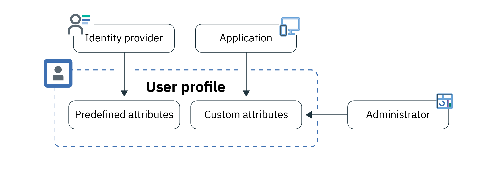
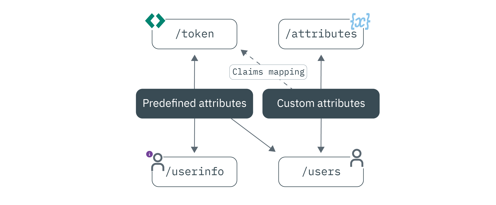

---

copyright:
  years: 2017, 2024
lastupdated: "2024-04-04"

keywords: profile, custom attributes, predefined attributes, attributes, app users, app interaction, personalized experience, access user info, identity provider information, access token, authentication, user sign in, android, java, node, swift, ios, user, preferences

subcollection: appid

---

{:codeblock: .codeblock}
{:screen: .screen}
{:download: .download}
{:external: target="_blank" .external}
{:faq: data-hd-content-type='faq'}
{:gif: data-image-type='gif'}
{:important: .important}
{:note: .note}
{:pre: .pre}
{:tip: .tip}
{:preview: .preview}
{:deprecated: .deprecated}
{:beta: .beta}
{:term: .term}
{:shortdesc: .shortdesc}
{:script: data-hd-video='script'}
{:support: data-reuse='support'}
{:table: .aria-labeledby="caption"}
{:troubleshoot: data-hd-content-type='troubleshoot'}
{:help: data-hd-content-type='help'}
{:tsCauses: .tsCauses}
{:tsResolve: .tsResolve}
{:tsSymptoms: .tsSymptoms}
{:java: .ph data-hd-programlang='java'}
{:javascript: .ph data-hd-programlang='javascript'}
{:swift: .ph data-hd-programlang='swift'}
{:curl: .ph data-hd-programlang='curl'}
{:video: .video}
{:step: data-tutorial-type='step'}
{:tutorial: data-hd-content-type='tutorial'}
{:ui: .ph data-hd-interface='ui'}
{:cli: .ph data-hd-interface='cli'}
{:api: .ph data-hd-interface='api'}
{:terraform: .ph data-hd-interface='terraform'}
{:release-note: data-hd-content-type='release-note'}


# Storing and accessing attributes
{: #profiles}

With {{site.data.keyword.appid_full}}, you can compile information about the individual users of your application into a profile. The information in the profile can be learned about your users by the way that they interact with your app or added by you on their behalf. By storing the information, you can access it to help create personalized experiences of your app for your users.
{: shortdesc}


## Understanding profiles
{: #profile-understand} 

A user profile is all the information that is known about a specific user - compiled into one JSON object and stored by {{site.data.keyword.appid_short_notm}}. There are two types of information, or attributes, that can be obtained and stored in a profile: `predefined` and `custom`. Predefined attributes are specific to the identity of your user and are returned by an identity provider when your user signs in to your app and can include information such as their name or age. Custom attributes are used to store additional information about your users. They can be set by you or learned about the user as they interact with your app. Custom attributes might include an assigned role, a food preference, or a preferred aisle seat on an airplane.

{: caption="Figure 1. User profile information flow" caption-side="bottom"}


You can store up to 100 KB of information for each user.
{: note}

### How do I get the user profile information?
{: #profile-endpoint}

Several different ways exist in which you can access user information, and several different reasons why you would want to. The endpoint that you choose to call can vary depending on your use case.

Not sure which one works best? Join our [Slack channel](https://www.ibm.com/cloud/blog/announcements/get-help-with-ibm-cloud-app-id-related-questions-on-slack){: external} and get advice directly from our development team.
{: tip}

If you need to work with an API, check out the following image and corresponding information to see how the information is pulled.

{: caption="Figure 2. Endpoint options that can be used to access user information" caption-side="bottom"}

`/oauth/v4/<tenantID>/token`
:   After a successful authentication, you receive access and identity tokens that contain the most common user information - a name, picture, or email for example. If you want to add additional information, you can use [custom claims-mapping](/docs/appid?topic=appid-customizing-tokens) to configure App ID to inject the information to the token before it is returned to you.

`/oauth/v4/<tenantID>/userinfo`
:   If you need to see an in-depth view of the user profile information that is returned by an identity provider, you can call the [`/userinfo` endpoint](https://us-south.appid.cloud.ibm.com/swagger-ui/#/Authorization_Server_V4/userInfo). It's recommended to use this endpoint only if the information cannot be mapped to the token as it requires extra network calls.

`/api/v1/attributes`
:   If your application requires reading and updating custom profile attributes for a currently logged in user, then you can use the /attributes endpoint. For example, the user wants to update a food preference.

`/management/v4/<tenantID>/users`
:   If you're building administrative interfaces or processes that might apply to multiple users, you can use the App ID management API. Specifically, you can use the `/users` endpoint.

The easiest ways to work with user information are by using the GUI or an SDK. With those options, all the API calls are done behind the scenes for you.
{: tip}


## Accessing attributes at run time
{: #profile-access-runtime}

After successful user authentication, your app receives access and identity tokens from {{site.data.keyword.appid_short_notm}}. The service automatically injects a subset of attributes into your access and identity tokens. If the information isn't in the token, you can use any of the following endpoints to find the information. 

### Accessing the `/userinfo` endpoint
{: #profile-predefined-access}

To see the information about your users that is provided by your configured identity providers, you can access your predefined attributes.
{: shortdesc}

1. Be sure that you have a valid access token with an `openid` scope. You can verify that your token is valid by using the `/introspect` endpoint.

2. Make a request to the [`/userinfo` endpoint](https://us-south.appid.cloud.ibm.com/swagger-ui/#/Authorization_Server_V4/userInfo){: external}. If new tokens are not explicitly passed to the SDK, {{site.data.keyword.appid_short_notm}} uses the last received tokens to retrieve and validate the response. Passing an identity token is optional, but passed is used to validate the response.

   ```sh
   GET https://<region>.appid.cloud.ibm.com/oauth/v4/<tenantID>/userinfo
   Authorization: 'Bearer <accessToken>'
   ```
   {: codeblock}
   {: curl}

   ```swift
   // iOS Swift example

   AppID.sharedInstance.userProfileManager.getUserInfo(accessToken: String, identityToken: String?) { (error: Error?, userInfo: [String: Any]?) in guard 
      let userInfo = userInfo, err == nil {
         return // an error has occurred
      }
      // retrieved user info successfully
   }
   ```
   {: codeblock}
   {: swift}

   ```java
   AppID appId = AppID.getInstance();

   appId.getUserProfileManager().getUserInfo(accessToken, identityToken, new UserProfileResponseListener() {
      @Override
      public void onSuccess(JSONObject userInfo) {
      // retrieved attribute "name" successfully
      }

      @Override
      public void onFailure(UserInfoException e) {
      // exception occurred
      }
   });
   ```
   {: codeblock}
   {: java}

   ```javascript
   let userProfileManager = UserProfileManager(options: options)

   let accessToken = req.session[WebAppStrategy.AUTH_CONTEXT].accessToken;
   let identityToken = req.session[WebAppStrategy.AUTH_CONTEXT].identityToken;

   // Retrieve user info and validate against the given identity token
   userProfileManager.getUserInfo(accessToken, identityToken).then(function (profile) {
      // retrieved user info successfully
   });

   // Retrieve user info without validation
   userProfileManager.getUserInfo(accessToken).then(function (profile) {
   // retrieved user info successfully
   });
   ```
   {: codeblock}
   {: javascript}

   ```swift
   // Server-side Swift example

   let userProfileManager = UserProfileManager(options: options)
   let accessToken = "<accessToken>"
   let identityToken = "<identityToken>"

   // If identity token is provided (recommended approach), response is validated against the identity token

   userProfileManager.getUserInfo(accessToken: accessToken, identityToken: identityToken) { (err, userInfo) in guard 
      let userInfo = userInfo, err == nil {
      return
      }
   }

   // Retrieve the UserInfo without any validation

   userProfileManager.getUserInfo(accessToken: accessToken) { (err, userInfo) in guard 
      let userInfo = userInfo, err == nil {
      return
      }
   }
   ```
   {: codeblock}
   {: swift}

   Example output:
   ```json
   "sub": "cad9f1d4-e23b-3683-b81b-d1c4c4fd7d4c",
   "name": "John Doe",
   "email": "john.doe@gmail.com",
   "picture": "https://lh3.googleusercontent.com/-XdUIqdbhg/AAAAAAAAI/AAAAAAA/42rbcbv5M/photo.jpg",
   "gender": "male",
   "locale": "en",
   "identities": [
      {
            "provider": "google",
            "id": "104560903311317789798",
            "profile": {
               "id": "104560903311317789798",
               "email": "john.doe@gmail.com",
               "verified_email": true,
               "name": "John Doe",
               "given_name": "John",
               "family_name": "Doe",
               "link": "https://plus.google.com/104560903311317789798",
               "picture": "https://lh3.googleusercontent.com/-XdUIqdbhg/AAAAAAAAI/AAAAAAA/42rbcbv5M/photo.jpg",
               "gender": "male",
               "locale": "en",
               "idpType": "google"
            }
      }
   ]
   ```
   {: screen}

3. Verify that the `sub` claim exactly matches the `sub` claim in the identity token. If these do not match, do not use the returned information. To learn more about token substitution, see the [OIDC specification](https://openid.net/specs/openid-connect-core-1_0.html#TokenSubstitution){: external}.

If changes are made by an external identity provider, you can get the updated information when your users log in again. Your new tokens retrieve the most up-to-date data.
{: tip}


### Accessing the `/attributes` endpoint
{: #profile-attributes-access}

Depending on your configuration, attributes are encrypted and saved as part of a user profile when a user interacts with your application. The interaction might be a user signing in or setting a preference in your app. To access the attributes, pass an access token through an API method.
{: shortdesc}

```sh
curl -X GET 'https://<region>.appid.cloud.ibm.com/api/v1/attributes' 
-H 'Accept: application/json' 
-H 'Authorization: Bearer <accessToken>' 
```
{: codeblock}
{: curl}

```swift
//iOS Swift example

func setAttribute(key: String, value: String, completionHandler: @escaping(Error?, [String:Any]?) -> Void)
func setAttribute(key: String, value: String, accessTokenString: String, completionHandler: @escaping(Error?, [String:Any]?) -> Void)

func getAttribute(key: String, completionHandler: @escaping(Error?, [String:Any]?) -> Void)
func getAttribute(key: String, accessTokenString: String, completionHandler: @escaping(Error?, [String:Any]?) -> Void)

func getAttributes(completionHandler: @escaping(Error?, [String:Any]?) -> Void)
func getAttributes(accessTokenString: String, completionHandler: @escaping(Error?, [String:Any]?) -> Void)

func deleteAttribute(key: String, completionHandler: @escaping(Error?, [String:Any]?) -> Void)
func deleteAttribute(key: String, accessTokenString: String, completionHandler: @escaping(Error?, [String:Any]?) -> Void)
```
{: codeblock}
{: swift}

```java
void setAttribute(@NonNull String name, @NonNull String value, UserAttributeResponseListener listener);
void setAttribute(@NonNull String name, @NonNull String value, @NonNull AccessToken accessToken, UserAttributeResponseListener listener);

void getAttribute(@NonNull String name, UserAttributeResponseListener listener);
void getAttribute(@NonNull String name, @NonNull AccessToken accessToken, UserAttributeResponseListener listener);

void deleteAttribute(@NonNull String name, UserAttributeResponseListener listener);
void deleteAttribute(@NonNull String name, @NonNull AccessToken accessToken, UserAttributeResponseListener listener);

void getAllAttributes(@NonNull UserAttributeResponseListener listener);
void getAllAttributes(@NonNull AccessToken accessToken, @NonNull UserAttributeResponseListener listener);
```
{: codeblock}
{: java}

```javascript
const userProfileManager = require("ibmcloud-appid").UserProfileManager;
userProfileManager.init();
var accessToken = req.session[WebAppStrategy.AUTH_CONTEXT].accessToken;

// get all attributes
userProfileManager.getAllAttributes(accessToken).then(function (attributes) {

        });

// get single attribute
userProfileManager.getAttribute(accessToken, name).then(function (attributes) {

        });

// set attribute value
userProfileManager.setAttribute(accessToken, name, value).then(function (attributes) {

        });

// delete attribute
userProfileManager.deleteAttribute(accessToken, name).then(function () {

        });
```
{: codeblock}
{: javascript}

```swift
//Server-side Swift example

func getAllAttributes(accessToken: String, completionHandler: (Swift.Error?, [String: Any]?) -> Void)
func getAttribute(accessToken: String, attributeName: String, completionHandler: (Swift.Error?, [String: Any]?) -> Void)
func setAttribute(accessToken: String, attributeName: String, attributeValue : "abc", completionHandler: (Swift.Error?, [String: Any]?) -> Void)
func deleteAllAttributes(accessToken: String, completionHandler: (Swift.Error?, [String: Any]?) -> Void)
```
{: codeblock}
{: swift}


## Setting custom attributes
{: #profile-set-custom}

You can add information about your users to their profile such as a role or preference, by setting a custom attribute. To set custom attributes before a user signs in to your application, see [preregistering future users](/docs/appid?topic=appid-preregister).
{: shortdesc}

By default, custom attributes are modifiable and can be updated by using an {{site.data.keyword.appid_short_notm}} access token from a client application. Without taking proper precautions, either the user or the application can update custom attributes immediately following the first user sign-in, if they have an access token. Doing so can potentially lead to unintended consequences. For example, a user might change their role from user to admin, which might expose administrative privileges to malicious users.
{: important}

1. Go to the **User profiles > Settings** tab of the {{site.data.keyword.appid_short_notm}} dashboard.

2. Toggle custom attributes to **Enabled**.
3. Obtain access and identity tokens with the API.

   1. Obtain your tenant ID, client ID, secret, and OAuth Server URL from your credentials.

   2. Encode your client ID and secret by using a base64 encoder.

   3. Use the following code examples to retrieve your tokens. The grant type that you use to obtain your token can differ depending on the type of authorization that you're working with. For a detailed list of options, check out the [swagger documentation](https://us-south.appid.cloud.ibm.com/swagger-ui/#/Authorization%20Server%20-%20Authorization%20Server%20V4/oauth-server.token){: external}.

      ```sh
      curl -X POST 'https://<region>.appid.cloud.ibm.com/oauth/v4/<tenantID>/token' \
      -H 'Authorization: Basic base64Encoded{<clientID>:<clientSecret>}' \
      -H 'Accept: application/json' \
      -F 'grant_type=password' \
      -F 'username=testuser@test.com' \
      -F 'password=testuser'
      ```
      {: codeblock}
      {: curl}

      ```swift
      // iOS Swift example

      class delegate : TokenResponseDelegate {
         public func onAuthorizationSuccess(accessToken: AccessToken?, identityToken: IdentityToken?, refreshToken: RefreshToken?, response:Response?) {
         //User authenticated
         }

         public func onAuthorizationFailure(error: AuthorizationError) {
         //Exception occurred
         }
      }

      AppID.sharedInstance.signinWithResourceOwnerPassword(username: username, password: password, delegate: delegate())
      ```
      {: codeblock}
      {: swift}

      ```java
      AppID.getInstance().signinWithResourceOwnerPassword(getApplicationContext(), username, password, new TokenResponseListener() {
         @Override
         public void onAuthorizationFailure (AuthorizationException exception) {
            //Exception occurred
         }

         @Override
         public void onAuthorizationSuccess (AccessToken accessToken, IdentityToken identityToken, RefreshToken refreshToken) {
            //User authenticated
         }
      });
      ```
      {: codeblock}
      {: java}

      ```javascript
      // Declare the API you want to protect
      app.get("/api/protected",

         passport.authenticate(APIStrategy.STRATEGY_NAME, {
         session: false
         }),
         function(req, res) {
         // Get full appIdAuthorizationContext from request object
         var appIdAuthContext = req.appIdAuthorizationContext;

         appIdAuthContext.accessToken; // Raw access_token
         appIdAuthContext.accessTokenPayload; // Decoded access_token JSON
         appIdAuthContext.identityToken; // Raw identity_token
         appIdAuthContext.identityTokenPayload; // Decoded identity_token JSON
         appIdAuthContext.refreshToken; // Raw refresh_token
         ...
         }
      );
      ```
      {: codeblock}
      {: javascript}

      ```swift
      // Server-side swift example

      let options = [
         "clientId": "<clientID>",
         "secret": "<secret>",
         "tenantId": "<tenantID>",
         "oauthServerUrl": "<oauthServerURL>",
         "redirectUri": "<appURL>" + CALLBACK_URL
      ]
      let webappKituraCredentialsPlugin = WebAppKituraCredentialsPlugin(options: options)
      let kituraCredentials = Credentials()
      kituraCredentials.register(plugin: webappKituraCredentialsPlugin)
      ```
      {: codeblock}
      {: swift}


4. By using the `attributes` endpoint, make a PUT request.

   ```sh
   curl -X PUT "https://<region>.appid.cloud.ibm.com/api/v1/attributes/<attributeName>" \
   -H "Authorization: Bearer <token>" \
   -d "<attributeValue>" 
   ```
   {: codeblock}
   {: curl}

   ```swift
   // iOS Swift example

   AppID.sharedInstance.userProfileManager?.setAttribute("key", "value") { (error, result) in
      guard let result = result, error == nil else {
         return // an error has occurred
      }
   // attributes recieved as a Dictionary
   })
   ```
   {: codeblock}
   {: swift}

   ```java
   appId.getUserProfileManager().setAttribute(name, value, useThisToken, new UserProfileResponseListener() {
      @Override
      public void onSuccess(JSONObject attributes) {
      // attributes received in JSON format on successful response
      }

      @Override
      public void onFailure(UserAttributesException e) {
      // exception occurred
      }
   });
   ```
   {: codeblock}
   {: java}

   ```javascript
   const userProfileManager = require("ibmcloud-appid").UserProfileManager;
   userProfileManager.init();

   var accessToken = req.session[WebAppStrategy.AUTH_CONTEXT].accessToken;

   userProfileManager.setAttribute(accessToken, name, value).then(function (attributes) {
      // attributes returned as dictionary
   });
   ```
   {: codeblock}
   {: javascript}

   ```swift
   // Server-side Swift

   let userProfileManager = UserProfileManager(options: options)
   let accesstoken = "access token"

   userProfileManager.setAttribute(accessToken: accessToken, attributeName: "name", attributeValue : "abc") { (error, response) in
      guard let response = response, error == error else {
      return // an error has occurred
      }
      // attributes received as a Dictionary
   }
   ```
   {: codeblock}
   {: swift}

