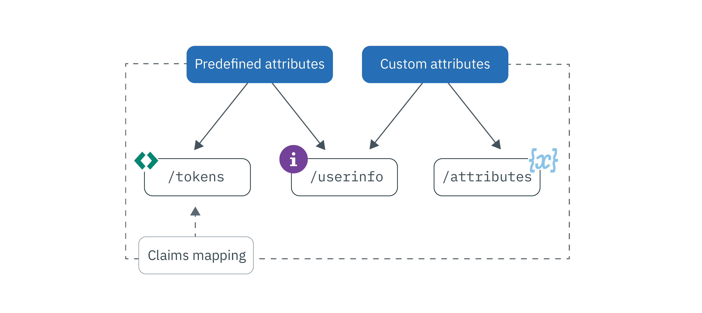

---

copyright:
  years: 2017, 2019
lastupdated: "2019-08-19"

keywords: Authentication, authorization, identity, app security, secure, attributes, user information, storing, accessing

subcollection: appid

---

{:external: target="_blank" .external}
{:shortdesc: .shortdesc}
{:screen: .screen}
{:pre: .pre}
{:table: .aria-labeledby="caption"}
{:codeblock: .codeblock}
{:tip: .tip}
{:note: .note}
{:important: .important}
{:deprecated: .deprecated}
{:download: .download}
{:java: .ph data-hd-programlang='java'}
{:javascript: .ph data-hd-programlang='javascript'}
{:swift: .ph data-hd-programlang='swift'}
{:curl: .ph data-hd-programlang='curl'}


# Storing and accessing profiles
{: #profiles}

A user profile is all of the information that is known about a specific user compiled into one object and stored by {{site.data.keyword.appid_full}}. The information might be predefined, assigned, or learned about your users as they interact with your application. By taking advantage of the profiles feature, you can build personalized app experiences for each user.
{: shortdesc}

Looking for information about your Cloud Directory users? Check out [managing users](/docs/services/appid?topic=appid-cd-users).
{: tip}


There are two types of information that can be obtained and stored by {{site.data.keyword.appid_short_notm}}: predefined attributes and custom attributes. Predefined attributes are specific to the identity of your users and are returned by an identity provider when your user signs in to your app and can include information such as their name or age. Custom attributes are used to store additional information about your users. They can be set by you or learned about the user as they interact with your app. Custom attributes might include an assigned role, a food preference, or a prefered aisle seat on an airplane.


Figure. User profile information flow


You can store 100 KB of information for each user.
{: note}


## Accessing user profiles
{: #profile-access}

There are different ways in which you can access attributes. After successful user authentication, your app receives access and identity tokens from {{site.data.keyword.appid_short_notm}}. Both the user information and the custom attribute endpoints are protected by an access token that is generated by {{site.data.keyword.appid_short_notm}} at the end of the authentication process. The identity token contains a normalized subset of user attributes (information) that is returned by an identity provider. To get the full list of user attributes, you can use the OIDC [`/userinfo` endpoint](https://us-south.appid.cloud.ibm.com/swagger-ui/#/Authorization_Server_V4/userInfo){: external}. 
{: shortdesc}


For more information about identity and access tokens, see [Understanding](/docs/services/appid?topic=appid-tokens#tokens) and [Validating tokens](/docs/services/appid?topic=appid-token-validation).


Review the following image to see the different ways in which you can obtain user information.


Figure. Access user profile options

{{site.data.keyword.appid_short_notm}} injects a subset of attributes into your access and identity tokens automatically. You can take advantage of custom claims mapping and map other predefined and custom claims into your tokens. For more details about the recommended way to access user information, see [customizing tokens](/docs/services/appid?topic=appid-customizing-tokens). 
{: note}


### Accessing the /userinfo endpoint with an SDK
{: #profile-predefined-access}

To see the information about your users that is provided by your configured identity providers, you can access your predefined attributes.
{: shortdesc}

**iOS Swift**
{: ph data-hd-programlang='swift'}

If new tokens are not explicitly passed to the SDK, {{site.data.keyword.appid_short_notm}} uses the last received tokens to retrieve and validate the response. For example, you can execute the following code after a successful authentication and the SDK retrieves additional information about the user.
{: ph data-hd-programlang='swift'}

```
AppID.sharedInstance.userProfileManager.getUserInfo { (error: Error?, userInfo: [String: Any]?) in
	guard let userInfo = userInfo, err == nil {
		return // an error has occurred
	}
	// retrieved user info successfully
}
```
{: codeblock}
{: ph data-hd-programlang='swift'}

Alternatively, you can explicitly pass access and identity tokens. The identity token is optional, but when passed, it is used to validate the response.
{: ph data-hd-programlang='swift'}

```
AppID.sharedInstance.userProfileManager.getUserInfo(accessToken: String, identityToken: String?) { (error: Error?, userInfo: [String: Any]?) in
	guard let userInfo = userInfo, err == nil {
		return // an error has occurred
	}
	// retrieved user info successfully
}
```
{: codeblock}
{: ph data-hd-programlang='swift'}

**Java**
{: ph data-hd-programlang='java'}

If new tokens are not explicitly passed to the SDK, {{site.data.keyword.appid_short_notm}} uses the last received tokens to retrieve and validate the response. For example, you can execute the following code after a successful authentication and the SDK retrieves additional information about the user.
{: ph data-hd-programlang='java'}

```
AppID appId = AppID.getInstance();

appId.getUserProfileManager().getUserInfo(new UserProfileResponseListener() {
	@Override
	public void onSuccess(JSONObject userInfo) {
		// retrieved user info successfully
	}

	@Override
	public void onFailure(UserInfoException e) {
		// exception occurred
	}
});
```
{: codeblock}
{: ph data-hd-programlang='java'}

Alternatively, you can explicitly pass access and identity tokens. The identity token is optional. But when passed, it is used to validate the response.
{: ph data-hd-programlang='java'}

```
AppID appId = AppID.getInstance();

appId.getUserProfileManager().getUserInfo(accessToken, identityToken, new UserProfileResponseListener() {
	@Override
	public void onSuccess(JSONObject userInfo) {
		// retrieved attribute "name" successfully
	}

	@Override
	public void onFailure(UserInfoException e) {
		// exception occurred
	}
});
```
{: codeblock}
{: ph data-hd-programlang='java'}

**Node.js**
{: ph data-hd-programlang='javascript'}

By using a server-side SDK, you can retrieve additional information about your users. You can call the following method by using the stored access and identity tokens, or you can explicitly pass the tokens. The identity token is optional, but when passed, it's used to validate the response.
{: ph data-hd-programlang='javascript'}

```javascript
let userProfileManager = UserProfileManager(options: options)

let accessToken = req.session[WebAppStrategy.AUTH_CONTEXT].accessToken;
let identityToken = req.session[WebAppStrategy.AUTH_CONTEXT].identityToken;


// Retrieve user info and validate against the given identity token
userProfileManager.getUserInfo(accessToken, identityToken).then(function (profile) {
	// retrieved user info successfully
});

// Retrieve user info without validation
userProfileManager.getUserInfo(accessToken).then(function (profile) {
	// retrieved user info successfully
});
```
{: codeblock}
{: ph data-hd-programlang='javascript'}


**Server-side Swift**
{: ph data-hd-programlang='swift'}

By using a server-side SDK, you can retrieve additional information about your users. You can call the following method by using the stored access and identity tokens, or you can explicitly pass the tokens. The identity token is optional, but when passed, it's used to validate the response.
{: ph data-hd-programlang='swift'}


```swift
let userProfileManager = UserProfileManager(options: options)

let accessToken = "<access token>"
let identityToken = "<identity token>"

// If identity token is provided (recommended approach), response is validated against the identity token
userProfileManager.getUserInfo(accessToken: accessToken, identityToken: identityToken) { (err, userInfo) in
	guard let userInfo = userInfo, err == nil {
		return // an error has occurred
	}
	// retrieved user info successfully
}

// Retrieve the UserInfo without any validation
userProfileManager.getUserInfo(accessToken: accessToken) { (err, userInfo) in
	guard let userInfo = userInfo, err == nil {
		return // an error has occurred
	}
	// retrieved user info successfully
}
```
{: codeblock}
{: ph data-hd-programlang='swift'}


### Accessing the /userinfo endpoint with the API
{: #profile-predefined-api}


You can view additional information through the `/userinfo` endpoint.

1. Be sure that you have a valid access token with an `openid` scope. You can verify that your token is valid by using the `/introspect` endpoint.

2. Make a request to the [`/userinfo` endpoint](https://us-south.appid.cloud.ibm.com/swagger-ui/#/Authorization_Server_V4/userInfo).
  ```
  GET [POST] https://{oauth-server-endpoint}/userinfo
  Authorization: 'Bearer {ACCESS_TOKEN}'
  ```
  {: codeblock}

  Example output:
  ```
  "sub": "cad9f1d4-e23b-3683-b81b-d1c4c4fd7d4c",
  "name": "John Doe",
  "email": "john.doe@gmail.com",
  "picture": "https://lh3.googleusercontent.com/-XdUIqdbhg/AAAAAAAAI/AAAAAAA/42rbcbv5M/photo.jpg",
  "gender": "male",
  "locale": "en",
  "identities": [
      {
          "provider": "google",
          "id": "104560903311317789798",
          "profile": {
              "id": "104560903311317789798",
              "email": "john.doe@gmail.com",
              "verified_email": true,
              "name": "John Doe",
              "given_name": "John",
              "family_name": "Doe",
              "link": "https://plus.google.com/104560903311317789798",
              "picture": "https://lh3.googleusercontent.com/-XdUIqdbhg/AAAAAAAAI/AAAAAAA/42rbcbv5M/photo.jpg",
              "gender": "male",
              "locale": "en",
              "idpType": "google"
          }
      }
  ]
  ```
  {: screen}

3. Verify that the `sub` claim exactly matches the `sub` claim in the identity token. If these do not match, do not use the returned information. To learn more about token substitution, see the <a href="https://openid.net/specs/openid-connect-core-1_0.html#TokenSubstitution" target="__blank">OIDC specification </a>.

If changes are made by an external identity provider, you can get the updated information when your users log in again. Your new tokens retrieve the most up-to-date data.
{: tip}


### Accessing the `/attributes` endpoint
{: #profile-attributes-access}

Depending on your configuration, attributes are encrypted and saved as part of a user profile when a user interacts with your application. The interaction could be a user signing in or setting a preference in your app. To access the attributes, pass an access token through an API method.
{: shortdesc}

  **iOS Swift**
  {: ph data-hd-programlang='swift'}

  ```
  func setAttribute(key: String, value: String, completionHandler: @escaping(Error?, [String:Any]?) -> Void)
  func setAttribute(key: String, value: String, accessTokenString: String, completionHandler: @escaping(Error?, [String:Any]?) -> Void)

  func getAttribute(key: String, completionHandler: @escaping(Error?, [String:Any]?) -> Void)
  func getAttribute(key: String, accessTokenString: String, completionHandler: @escaping(Error?, [String:Any]?) -> Void)

  func getAttributes(completionHandler: @escaping(Error?, [String:Any]?) -> Void)
  func getAttributes(accessTokenString: String, completionHandler: @escaping(Error?, [String:Any]?) -> Void)

  func deleteAttribute(key: String, completionHandler: @escaping(Error?, [String:Any]?) -> Void)
  func deleteAttribute(key: String, accessTokenString: String, completionHandler: @escaping(Error?, [String:Any]?) -> Void)
  ```
  {: codeblock}
  {: ph data-hd-programlang='swift'}

  **Server-side swift**
  {: ph data-hd-programlang='swift'}

  ```
  func getAllAttributes(accessToken: String, completionHandler: (Swift.Error?, [String: Any]?) -> Void)
  func getAttribute(accessToken: String, attributeName: String, completionHandler: (Swift.Error?, [String: Any]?) -> Void)
  func setAttribute(accessToken: String, attributeName: String, attributeValue : "abc", completionHandler: (Swift.Error?, [String: Any]?) -> Void)
  func deleteAllAttributes(accessToken: String, completionHandler: (Swift.Error?, [String: Any]?) -> Void)
  ```
  {: codeblock}
  {: ph data-hd-programlang='swift'}

  **Java**
  {: ph data-hd-programlang='java'}

  ```
  void setAttribute(@NonNull String name, @NonNull String value, UserAttributeResponseListener listener);
  void setAttribute(@NonNull String name, @NonNull String value, @NonNull AccessToken accessToken, UserAttributeResponseListener listener);

  void getAttribute(@NonNull String name, UserAttributeResponseListener listener);
  void getAttribute(@NonNull String name, @NonNull AccessToken accessToken, UserAttributeResponseListener listener);

  void deleteAttribute(@NonNull String name, UserAttributeResponseListener listener);
  void deleteAttribute(@NonNull String name, @NonNull AccessToken accessToken, UserAttributeResponseListener listener);

  void getAllAttributes(@NonNull UserAttributeResponseListener listener);
  void getAllAttributes(@NonNull AccessToken accessToken, @NonNull UserAttributeResponseListener listener);
  ```
  {: codeblock}
  {: ph data-hd-programlang='java'}

  **Node.js**
  {: ph data-hd-programlang='javascript'}

  ```
  function getAllAttributes(accessTokenString) {}
  function getAttribute(accessTokenString, key) {}
  function setAttribute(accessTokenString, key, value) {}
  function deleteAttribute(accessTokenString, name) {}
  ```
  {: codeblock}
  {: ph data-hd-programlang='javascript'}


## Setting custom attributes
{: #profile-set-custom}

You can add information about your users to their profile such as a role or preference, by setting a custom attribute.
{: shortdesc}

By default, custom attributes are modifiable and can be updated by using an {{site.data.keyword.appid_short_notm}} access token from a client application. This means that without taking proper precautions either the user or the application can update custom attributes immediately following the first user sign in, provided that they have access to an access token. This can potentially lead to unintended consequences. For example, a user could change their role from user to admin, which might expose administrative privileges to malicious users.
{: important}

1. Navigate to the **Profiles** tab of the {{site.data.keyword.appid_short_notm}} dashboard and toggle custom attributes to **Enabled**.
2. [Obtain an access token](/docs/services/appid?topic=appid-obtain-tokens). All incoming requests to your app have an authorization header, with `access_token`.
3. Make a request to the [the attributes APIs](https://us-south.appid.cloud.ibm.com/swagger-ui/#/Attributes) or add one of the following snippets to your code to use one of the provided SDKs.

  **iOS Swift**
  {: ph data-hd-programlang='swift'}

  ```
	AppID.sharedInstance.userProfileManager?.setAttribute("key", "value") { (error, result) in
		guard let result = result, error == nil else {
	  		return // an error has occurred
		}
		// attributes recieved as a Dictionary
	})
  ```
  {: codeblock}
  {: ph data-hd-programlang='swift'}

  **Java**
  {: ph data-hd-programlang='java'}

  ```
  appId.getUserProfileManager().setAttribute(name, value, useThisToken, new UserProfileResponseListener() {
  	@Override
  	public void onSuccess(JSONObject attributes) {
  		// attributes received in JSON format on successful response
  	}

  	@Override
  	public void onFailure(UserAttributesException e) {
  		// exception occurred
  	}
  });
  ```
  {: codeblock}
  {: ph data-hd-programlang='java'}

  **Node.js**
  {: ph data-hd-programlang='javascript'}

  ```
	const userProfileManager = require("ibmcloud-appid").UserProfileManager;
	userProfileManager.init();

	var accessToken = req.session[WebAppStrategy.AUTH_CONTEXT].accessToken;

	userProfileManager.setAttribute(accessToken, name, value).then(function (attributes) {
		// attributes returned as dictionary
	});
  ```
  {: codeblock}
  {: ph data-hd-programlang='javascript'}

  **Server-side Swift**
  {: ph data-hd-programlang='swift'}

  ```
  let userProfileManager = UserProfileManager(options: options)
  let accesstoken = "access token"

  userProfileManager.setAttribute(accessToken: accessToken, attributeName: "name", attributeValue : "abc") { (error, response) in
    guard let response = response, error == error else {
      return // an error has occurred
    }
    // attributes received as a Dictionary
  }
  ```
  {: codeblock}
  {: ph data-hd-programlang='swift'}


## Next steps
{: #next-custom-attributes}

For more information about working with a specific language SDK, see the following GitHub repositories:

* <a href="https://github.com/ibm-cloud-security/appid-clientsdk-android" target="_blank">Android SDK </a>
* <a href="https://github.com/ibm-cloud-security/appid-clientsdk-swift" target="_blank">iOS Swift SDK </a>
* <a href="https://github.com/ibm-cloud-security/appid-serversdk-nodejs" target="_blank">Node.js SDK </a>
* <a href="https://github.com/ibm-cloud-security/appid-serversdk-swift" target="_blank">Server Swift SDK </a>

