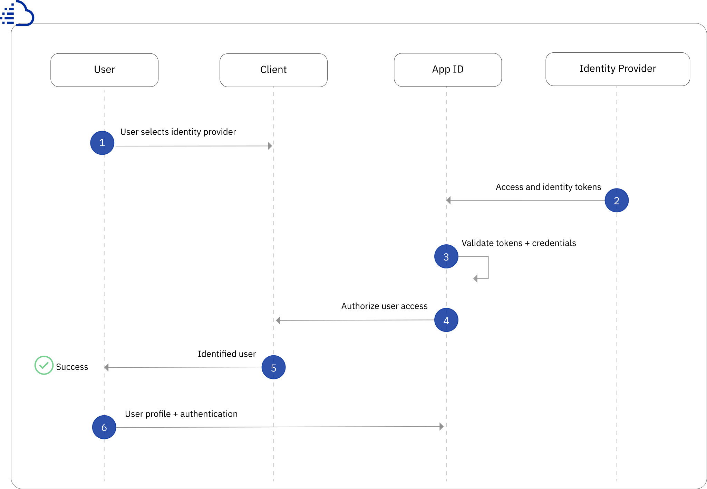
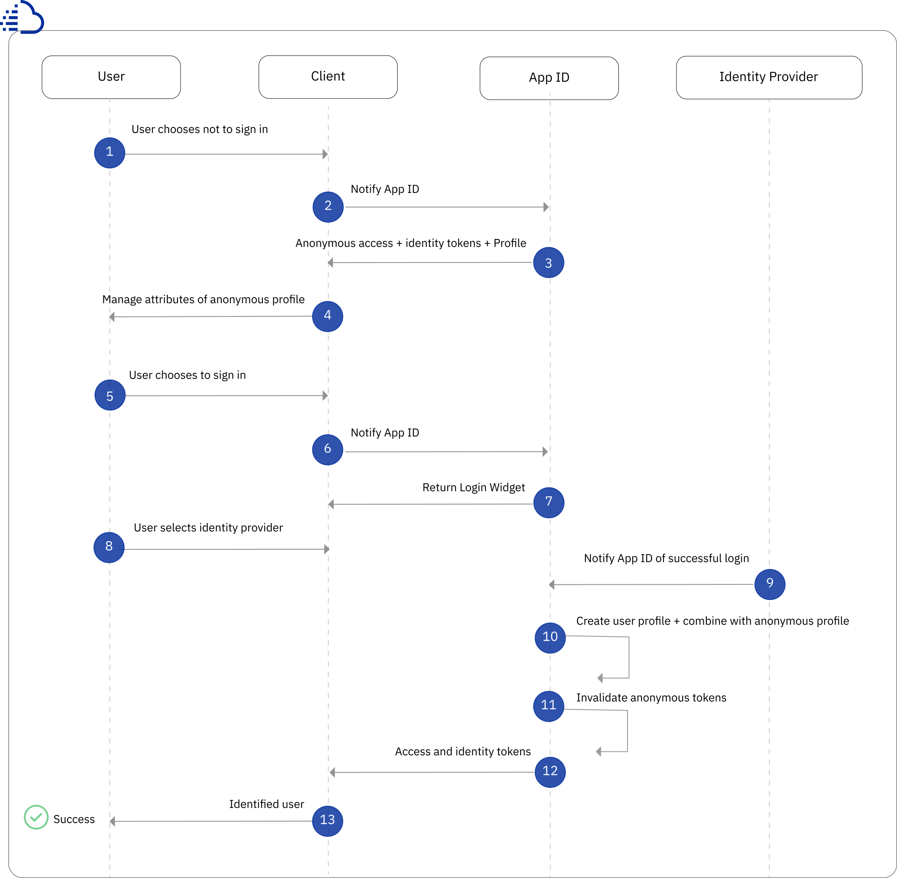

---

copyright:
  years: 2017, 2021
lastupdated: "2021-06-14"

keywords: anonymous authentication, progressive authentication, profile, user profile, authorization, sign in, secure app, identity provider, authorization

subcollection: appid

---

{:codeblock: .codeblock}
{:screen: .screen}
{:download: .download}
{:external: target="_blank" .external}
{:faq: data-hd-content-type='faq'}
{:gif: data-image-type='gif'}
{:important: .important}
{:note: .note}
{:pre: .pre}
{:tip: .tip}
{:preview: .preview}
{:deprecated: .deprecated}
{:beta: .beta}
{:term: .term}
{:shortdesc: .shortdesc}
{:script: data-hd-video='script'}
{:support: data-reuse='support'}
{:table: .aria-labeledby="caption"}
{:troubleshoot: data-hd-content-type='troubleshoot'}
{:help: data-hd-content-type='help'}
{:tsCauses: .tsCauses}
{:tsResolve: .tsResolve}
{:tsSymptoms: .tsSymptoms}
{:java: .ph data-hd-programlang='java'}
{:javascript: .ph data-hd-programlang='javascript'}
{:swift: .ph data-hd-programlang='swift'}
{:curl: .ph data-hd-programlang='curl'}
{:video: .video}
{:step: data-tutorial-type='step'}
{:tutorial: data-hd-content-type='tutorial'}
{:ui: .ph data-hd-interface='ui'}
{:cli: .ph data-hd-interface='cli'}
{:api: .ph data-hd-interface='api'}

# Anonymous authentication
{: #anonymous}

With {{site.data.keyword.appid_full}} , you can allow users to anonymously browse your application under an anonymous user profile. If the user chooses to sign in, you can allow them to still access their anonymous attributes by attaching their anonymous profile to their user identity with {{site.data.keyword.appid_short_notm}}.
{: shortdesc}

## Understanding the authentication flow 

With {{site.data.keyword.appid_short_notm}}, you can provide a seamless experience between protected and open resources in your applications by decoupling the authorization and authentication processes. Some aspects of your application may not require users to authenticate in order to receive access. For example, an online retailer may want to let users browse their inventory and place items in a shopping cart without signing in. 

When a user chooses to sign in, they select the identity provider, which returns access and identity tokens that contain authentication information about the user to {{site.data.keyword.appid_short_notm}}. If the service validates the tokens and the user's credentials to access your app, then the user is authorized to access the app. After the user is authorized, their authentication information is associated with their profile. When a user successfully signs in, they become an identified user. The user profile and its attributes can be accessed again from any client that authenticates with the same identity provider. 

### What does the authentication flow look like? 

In the following image, you can see the direction of communication that defines the authentication flow between the user, your application, {{site.data.keyword.appid_short_notm}}, and the identity provider.

{: caption="Figure 1. Identified user authentication flow" caption-side="bottom"}

1. The user selects the identity provider from the login widget. 
2. The client notifies {{site.data.keyword.appid_short_notm}} that the user wants to sign in through their preferred identity provider.
3. {{site.data.keyword.appid_short_notm}} forwards the login request to the identity provider selected by the user. 
4. The identity provider confirms whether login was successful and returns access and identity tokens to {{site.data.keyword.appid_short_notm}}.
5. {{site.data.keyword.appid_short_notm}}  validates the credentials and tokens returned by the identity provider.
6. If {{site.data.keyword.appid_short_notm}}  validates the tokens and credentials, the user is authorized to access your app and their authentication information is associated with their profile. 
7. When the user successfully signs in, they become an identified user.

## Understanding the progressive authentication flow
{: #progressive}

When a user chooses not to sign in immediately, they are considered an anonymous user. In an example of an online retailer, an anonymous user can have limited interactions with your app such as adding objects to a shopping cart. However, you may require users to sign in to check out the items in the shopping cart. When a user chooses to sign in, you can ensure a positive user experience by letting users access the same objects placed in their shopping carts before they signed in. 

You can use {{site.data.keyword.appid_short_notm}} to create a user profile and issue anonymous access and identity tokens for anonymous users. Using these tokens, you can customize the user's experience of your app by managing the attributes that are stored in the anonymous user profile. When the user signs in, their anonymous profile is linked with their user profile. 

### What does the progressive authentication flow look like? 

In the following image, you can see the direction of communication that defines the progressive authentication flow between the user, your application, {{site.data.keyword.appid_short_notm}}, and the identity provider.

{: caption="Figure 2. Progressive authentication flow of anonymous user" caption-side="bottom"}

1. The user chooses not to sign in .  
2. The client notifies {{site.data.keyword.appid_short_notm}} that the user wants to interact with your app as an anonymous user. 
3. {{site.data.keyword.appid_short_notm}} creates an ad hoc user profile and calls the OAuth login that issues anonymous access identity tokens for the anonymous user. 
4. Using the tokens from  {{site.data.keyword.appid_short_notm}} , you can create, read, update, and delete the attributes that are store in the user profile. 
5. A user may choose to sign in at a later stage in the progressive authentication flow.
6. The client notifies  {{site.data.keyword.appid_short_notm}}  that the user wants to interact with your app as an identified user. 
7. {{site.data.keyword.appid_short_notm}} returns the login widget to your app. 
8. The user selects their preferred identity provider. 
9. The client informs  {{site.data.keyword.appid_short_notm}}  that the user has selected an identity provider.
10. {{site.data.keyword.appid_short_notm}}  authenticate the call with the identity provider. 
11. The identity provider confirms whether the login was successful. 
12. {{site.data.keyword.appid_short_notm}} uses the anonymous access token to find the anonymous profile and attaches the user's identity to it.
13. After {{site.data.keyword.appid_short_notm}} creates the new tokens, the service invalidates the user's anonymous token. 
14. {{site.data.keyword.appid_short_notm}} returns the new access and identity tokens. The new tokens contain the public information that is shared by the identity provider and the attributes of the user's former anonymous profile. 
15. When the user successfully signs in, they become an identified user. 

An identity can be assigned to an anonymous profile only if it is not already assigned to another user.
{: tip}

If the identity is already associated with another {{site.data.keyword.appid_short_notm}} user, the tokens contain information of that user profile and provide access to their attributes. The previously anonymous user's attributes are not accessible through the new token. Until the token expires, the user can still access information through the anonymous access token. While you develop your app, you can choose how to merge the anonymous attributes to the known user.
