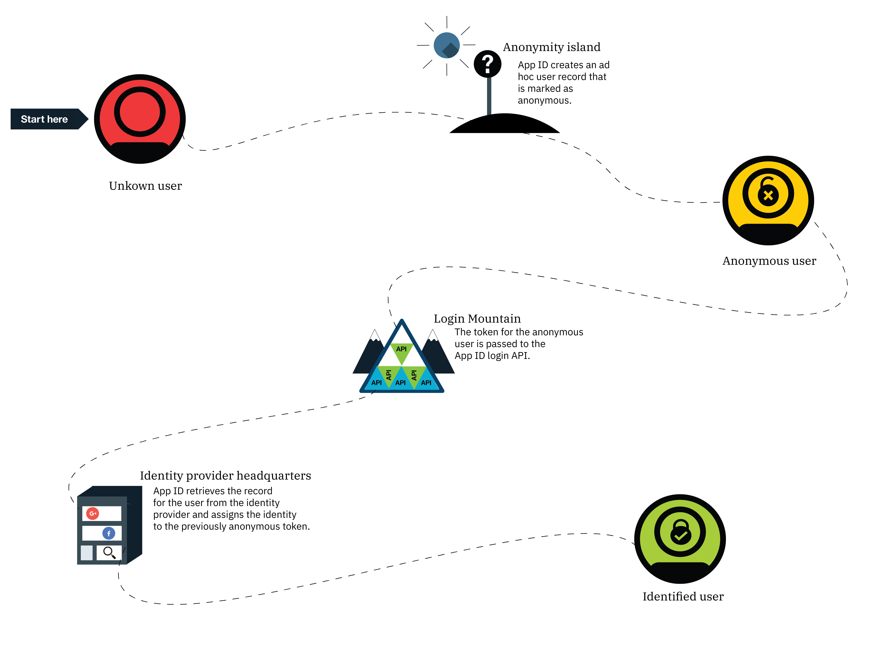

---

copyright:
  years: 2017, 2021
lastupdated: "2021-02-09"

keywords: anonymous authentication, progressive authentication, profile, user profile, authorization, sign in, secure app, identity provider, authorization

subcollection: appid

---

{:codeblock: .codeblock}
{:screen: .screen}
{:download: .download}
{:external: target="_blank" .external}
{:faq: data-hd-content-type='faq'}
{:gif: data-image-type='gif'}
{:important: .important}
{:note: .note}
{:pre: .pre}
{:tip: .tip}
{:preview: .preview}
{:deprecated: .deprecated}
{:beta: .beta}
{:term: .term}
{:shortdesc: .shortdesc}
{:script: data-hd-video='script'}
{:support: data-reuse='support'}
{:table: .aria-labeledby="caption"}
{:troubleshoot: data-hd-content-type='troubleshoot'}
{:help: data-hd-content-type='help'}
{:tsCauses: .tsCauses}
{:tsResolve: .tsResolve}
{:tsSymptoms: .tsSymptoms}
{:java: .ph data-hd-programlang='java'}
{:javascript: .ph data-hd-programlang='javascript'}
{:swift: .ph data-hd-programlang='swift'}
{:curl: .ph data-hd-programlang='curl'}
{:video: .video}
{:step: data-tutorial-type='step'}
{:tutorial: data-hd-content-type='tutorial'}
{:ui: .ph data-hd-interface='ui'}
{:cli: .ph data-hd-interface='cli'}
{:api: .ph data-hd-interface='api'}

# Anonymous authentication
{: #anonymous}

When you develop an application, there might be times when you want to let a user interact with pieces of your app before they're signed in. By decoupling the authentication and authorization processes, {{site.data.keyword.appid_full}} allows you to provide a seamless experience between protected and open resources in your applications.
{: shortdesc}

For example, say you're an online retailer, you might want to let users browse your inventory and place items in a shopping cart. As the retailer, you don't know who the user is, so they're anonymous. A user might remain anonymous if they never choose to sign in. If they do choose to sign in, then the anonymous becomes a known user. If the user is a new known user, a profile is created. If the user has previously visited your app, then their anonymous profile is linked with their user profile.

{: caption="Figure 1. The path to becoming an identified user" caption-side="bottom"}

When a user successfully signs in, they become an identified user. The identity provider returns access and identity tokens that contain information about the user to {{site.data.keyword.appid_short}}. The service takes the provided tokens and determines whether a user has the proper credentials to access an app. If the tokens are validated, then the service authorizes the users access to the app. The authentication information is associated with the user's profile after they are authorized. The profile and its attributes can be accessed again from any client that authenticates with the same identity provider.

## Progressive authentication
{: #progressive}

With {{site.data.keyword.appid_short_notm}}, an anonymous user can choose to become an identified user.

When a user chooses not to sign in immediately, they are considered an anonymous user. For example, a user might immediately start adding items to a shopping cart without signing in. For anonymous users, {{site.data.keyword.appid_short_notm}} creates an ad hoc user profile and calls the OAuth login API that returns anonymous access and identity tokens. By using these tokens, the app can create, read, update, and delete the attributes that are stored in the user profile.

{: caption="Figure 2. The path to becoming an identified user from anonymous" caption-side="bottom"}

When an anonymous user signs in, their access token is passed to the login API. The service authenticates the call with an identity provider. The service uses the access token to find the anonymous profile and attaches the user's identity to it. The new access and identity tokens contain the public information that is shared by the identity provider. After a user is identified, their anonymous token becomes invalid. However, a user is still able to access their attributes because they're accessible with the new token.

An identity can be assigned to an anonymous profile only if it is not already assigned to another user.
{: tip}

If the identity is already associated with another {{site.data.keyword.appid_short_notm}} user, the tokens contain information of that user profile and provide access to their attributes. The previous anonymous user's attributes are not accessible through the new token. Until the token expires, the information can still be accessed through the anonymous access token. While you develop your app, you can choose how to merge the anonymous attributes to the known user.
