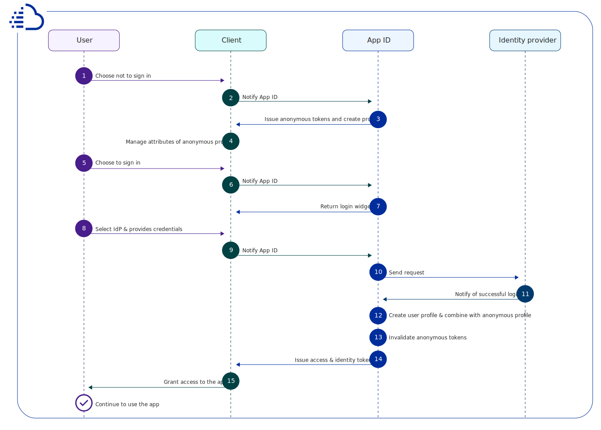

---

copyright:
  years: 2017, 2021
lastupdated: "2021-06-10"

keywords: anonymous authentication, progressive authentication, profile, user profile, authorization, sign in, secure app, identity provider, authorization

subcollection: appid

---

{:codeblock: .codeblock}
{:screen: .screen}
{:download: .download}
{:external: target="_blank" .external}
{:faq: data-hd-content-type='faq'}
{:gif: data-image-type='gif'}
{:important: .important}
{:note: .note}
{:pre: .pre}
{:tip: .tip}
{:preview: .preview}
{:deprecated: .deprecated}
{:beta: .beta}
{:term: .term}
{:shortdesc: .shortdesc}
{:script: data-hd-video='script'}
{:support: data-reuse='support'}
{:table: .aria-labeledby="caption"}
{:troubleshoot: data-hd-content-type='troubleshoot'}
{:help: data-hd-content-type='help'}
{:tsCauses: .tsCauses}
{:tsResolve: .tsResolve}
{:tsSymptoms: .tsSymptoms}
{:java: .ph data-hd-programlang='java'}
{:javascript: .ph data-hd-programlang='javascript'}
{:swift: .ph data-hd-programlang='swift'}
{:curl: .ph data-hd-programlang='curl'}
{:video: .video}
{:step: data-tutorial-type='step'}
{:tutorial: data-hd-content-type='tutorial'}
{:ui: .ph data-hd-interface='ui'}
{:cli: .ph data-hd-interface='cli'}
{:api: .ph data-hd-interface='api'}

# Anonymous authentication
{: #anonymous}

You can let anonymous users interact with pieces of your app before they sign in and you can track their profiles and attributes. When an anonymous user signs in, {{site.data.keyword.appid_full}} attaches the user's anonymous profile to their new user identity.
{: shortdesc}

With {{site.data.keyword.appid_short_notm}}, You can provide a seamless experience between protected and open resources in your applications by decoupling the authorization and authentication processes. For example, say you're an online retailer, you might want to let users browse your inventory and place items in a shopping cart. As the retailer, you don't know who the user is, so they're anonymous. A user remains anonymous until they choose to sign in. When the anonymous user chooses to sign in, they become an identified user and a user profile is created. If the user has previously visited your app, then their anonymous profile is linked with their user profile.

{: caption="Figure 1. The path to becoming an identified user" caption-side="bottom"}

When a user successfully signs in, they become an identified user. The user selects the identity provider, which returns access and identity tokens that contain information about the user to {{site.data.keyword.appid_short_notm}}. If the service validates the tokens and the user's credentials to access your app, then the user is authorized to access the app. After the user is authorized, their authentication information is associated with their profile. The user profile and its attributes can be accessed again from any client that authenticates with the same identity provider.

## Progressive authentication
{: #progressive}

When a user chooses not to sign in immediately, they are considered an anonymous user. For example, an anonymous user might immediately start adding items to a shopping cart without signing in. With {{site.data.keyword.appid_short_notm}}, an anonymous user can choose to become an identified user. First, you must set up your app to allow anonymous interaction. You can use {{site.data.keyword.appid_short_notm}} to create an ad hoc user profile and call the OAuth login API that returns anonymous access and identity tokens for anonymous users. Using these tokens, you can customize the user's experience of your app by creating, reading, updating, and deleting the attributes that are stored in the user profile. 

{: caption="Figure 2. The path to becoming an identified user from anonymous" caption-side="bottom"}

When an anonymous user signs in, their access token is passed to the login API. {{site.data.keyword.appid_short_notm}} authenticates the call with the identity provider selected by the user. The identity provider confirms whether login was successful. {{site.data.keyword.appid_short_notm}} uses the anonymous access token to find the anonymous profile and attaches the user's identity to it. The new access and identity tokens contain the public information that is shared by the identity provider. After {{site.data.keyword.appid_short_notm}} creates the new tokens, a user's anonymous token becomes invalid. However, a user can still access their attributes because they're accessible with the new token. 

An identity can be assigned to an anonymous profile only if it is not already assigned to another user.
{: tip}

If the identity is already associated with another {{site.data.keyword.appid_short_notm}} user, the tokens contain information of that user profile and provide access to their attributes. The previously anonymous user's attributes are not accessible through the new token. Until the token expires, the user can still access information through the anonymous access token. While you develop your app, you can choose how to merge the anonymous attributes to the known user.
