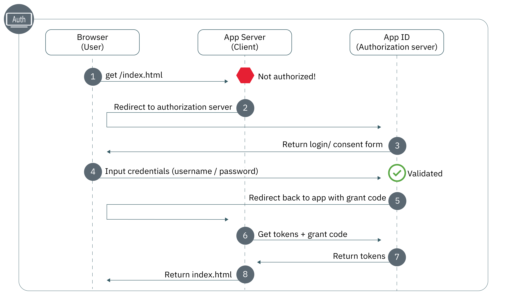

---

copyright:
  years: 2017, 2021
lastupdated: "2021-06-30"

keywords: web apps, nodejs, node, javascript, protected resource, authorization flow, front end, frontend, app security, authentication

subcollection: appid

content-type: tutorial
account-plan: lite
completion-time: 20m

---

{:codeblock: .codeblock}
{:screen: .screen}
{:download: .download}
{:external: target="_blank" .external}
{:faq: data-hd-content-type='faq'}
{:gif: data-image-type='gif'}
{:important: .important}
{:note: .note}
{:pre: .pre}
{:tip: .tip}
{:preview: .preview}
{:deprecated: .deprecated}
{:beta: .beta}
{:term: .term}
{:shortdesc: .shortdesc}
{:script: data-hd-video='script'}
{:support: data-reuse='support'}
{:table: .aria-labeledby="caption"}
{:troubleshoot: data-hd-content-type='troubleshoot'}
{:help: data-hd-content-type='help'}
{:tsCauses: .tsCauses}
{:tsResolve: .tsResolve}
{:tsSymptoms: .tsSymptoms}
{:java: .ph data-hd-programlang='java'}
{:javascript: .ph data-hd-programlang='javascript'}
{:swift: .ph data-hd-programlang='swift'}
{:curl: .ph data-hd-programlang='curl'}
{:video: .video}
{:step: data-tutorial-type='step'}
{:tutorial: data-hd-content-type='tutorial'}
{:ui: .ph data-hd-interface='ui'}
{:cli: .ph data-hd-interface='cli'}
{:api: .ph data-hd-interface='api'}

# Quick start: Node.js web apps
{: #web-node}
{: toc-content-type="tutorial"}
{: toc-completion-time="20m"}

With {{site.data.keyword.appid_short_notm}}, you can easily protect your Node.js front-end web applications. With this guide, you can quickly get a simple authentication flow up and running in less than 20 minutes.
{: shortdesc}

Check out the following diagram to see the Authorization Code OAuth 2.0 workflow.

{: caption="Figure 1. Node.js application flow" caption-side="bottom"}

1. A user attempts to gain access to your protected web application but they are unauthorized.
2. Your application redirects the user to {{site.data.keyword.appid_short_notm}}.
3. {{site.data.keyword.appid_short_notm}} shows a sign in screen that the user can use to authenticate.
4. They input their credentials such as a username and password. App  ID validates the credentials.
5. {{site.data.keyword.appid_short_notm}} redirects the user back to your application with a grant code.
6. By using the grant code, your application makes a request to {{site.data.keyword.appid_short_notm}} to ensure that the user is validated. For more information about obtaining access tokens, see [Obtaining tokens](/docs/appid?topic=appid-obtain-tokens).
7. {{site.data.keyword.appid_short_notm}} returns access and identity tokens for the validated user.
8. The user is then granted access to your application.


## Video tutorial
{: #web-node-video}

Check out the following video to see how you can use {{site.data.keyword.appid_short_notm}} to protect a simple Node.js web application. All of the information that is covered in the video can also be found in written form on this page.

Don't have an app that you can try out the flow with? No problem! {{site.data.keyword.appid_short_notm}} provides a [simple Node.js web sample app](https://github.com/ibm-cloud-security/appid-video-tutorials/tree/master/02a-simple-node-web-app){: external}.

{: video output="iframe" data-script="none" id="youtubeplayer" frameborder="0" webkitallowfullscreen mozallowfullscreen allowfullscreen}
 

## Before you begin
{: #web-node-before}

Before you get started with {{site.data.keyword.appid_short_notm}} in your Node.js web applications you must have the following prerequisites.
{: shortdesc}

* An instance of [the {{site.data.keyword.appid_short_notm}} service](https://cloud.ibm.com/catalog/services/app-id){: external}
* [NPM version 4+](https://docs.npmjs.com/getting-started){: external}
* [Node version 6+](https://nodejs.org/en/download/){: external}

This SDK uses the `log4js` package for logging. By default, the logging level is set to `info`. To create your own logging configuration, add a `log4js.json` file and set the `process.env.LOG4JS_CONFIG` environment variable to your JSON file.
{: note}


## Register your redirect URI
{: #node-web-redirect-uri}
{: step}

A redirect URI is the callback endpoint of your app. During the sign in flow, {{site.data.keyword.appid_short_notm}} validates the URIs before allowing clients to participate in the authorization workflow which helps to prevent phishing attacks and grant code leakage. By registering your URI, you're telling {{site.data.keyword.appid_short_notm}} that the URI is trusted and it's OK to redirect your users.

1. Click **Manage Authentications > Authentication Settings**.

2. In the **Add web redirect URI** field, type the URI. Each URI should begin with `http://` or `https://` and must include the full path, including any query parameters for the redirect to be successful.

3. Click the **+** symbol in the **Add web redirect URIs** box.

4. Repeat steps one through three until all possible URIs are added to your list.


## Obtain your credentials
{: #node-web-credentials}
{: step}

You can obtain your credentials in one of two ways.

  * By navigating to the **Applications** tab of the {{site.data.keyword.appid_short_notm}} dashboard. If you don't already have one, you can click **Add application** to create a new one.

  * By making a POST request to the [`/management/v4/{tenantId}/applications` endpoint](https://us-south.appid.cloud.ibm.com/swagger-ui/#!/Applications/registerApplication).

    Request format:
    ```sh
    curl -X POST \  https://us-south.appid.cloud.ibm.com/management/v4/39a37f57-a227-4bfe-a044-93b6e6060b61/applications/ \
    -H 'Content-Type: application/json' \
    -H 'Authorization: Bearer IAM_TOKEN' \
    -d '{"name": "ApplicationName"}'
    ```
    {: codeblock}

    Example response:
    ```json
    {
      "clientId": "xxxxx-34a4-4c5e-b34d-d12cc811c86d",
      "tenantId": "xxxxx-9b1f-433e-9d46-0a5521f2b1c4",
      "secret": "ZDk5YWZkYmYt*******",
      "name": "app1",
      "oAuthServerUrl": "https://us-south.appid.cloud.ibm.com/oauth/v4/xxxxx-9b1f-433e-9d46-0a5521f2b1c4",
      "profilesUrl": "https://us-south.appid.cloud.ibm.com",
      "discoveryEndpoint": "https://us-south.appid.cloud.ibm.com/oauth/v4/xxxxxx-9b1f-433e-9d46-0a5521f2b1c4/.well-known/openid-configuration"
    }
    ```
    {: screen}


## Initialize the SDK
{: #web-node-install}
{: step}

The easiest way to work with {{site.data.keyword.appid_short_notm}} is to take advantage of the Node.JS SDK.


1. By using the command line, change into the directory that contains your Node.js application.

2. Install the following NPM requirements.

    ```bash
    npm install --save express express-session passport log4js pug
    ```
    {: codeblock}

3. Install the {{site.data.keyword.appid_short_notm}} service.

    ```bash
    npm install --save ibmcloud-appid
    ```
    {: codeblock}

4. Add the following requirements to your `server.js` file.

    ```javascript
    const express = require('express'); 								// https://www.npmjs.com/package/express
    const log4js = require('log4js');                                   // https://www.npmjs.com/package/log4js
    const session = require('express-session');							// https://www.npmjs.com/package/express-session
    const passport = require('passport');								// https://www.npmjs.com/package/passport
    const WebAppStrategy = require('ibmcloud-appid').WebAppStrategy;	// https://www.npmjs.com/package/ibmcloud-appid
    ```
    {: shortdesc}

5. Set up your application to use express-session middleware by using the credentials that you obtained in step 1. You can choose to format your redirect URI in one of two ways. Manually, by using a new `WebAppStrategy({redirectUri: "...."})` or by setting the value as an environment variable as shown in the example code.

    ```javascript
    const app = express();
    const logger = log4js.getLogger("testApp");
    app.use(session({
        secret: '123456',
        resave: true,
        saveUninitialized: true
    }));
    app.use(passport.initialize());
    app.use(passport.session());
    passport.serializeUser((user, cb) => cb(null, user));
    passport.deserializeUser((user, cb) => cb(null, user));
    passport.use(new WebAppStrategy({
        tenantId: "<tenant_ID>",
        clientId: "<client_ID>",
        secret: "<secret>",
        oauthServerUrl: "<OAuth_Server_URL>",
        redirectUri: "<redirect_URI>"
    }));
    ```
    {: codeblock}

    You must configure the middleware with the proper session storage for production environments. For more information see the <a href="https://github.com/expressjs/session" target="_blank"> express.js docs</a>.
    {: note}


## Protect your application
{: #node-web-protect}
{: step}

Now that you have {{site.data.keyword.appid_short_notm}} installed, you're ready to protect your application. You can choose to protect your entire application or only specific resources by defining a web app strategy.


1. Configure the callback endpoint. The callback finishes the authorization process by retrieving access and identity tokens from App ID and redirecting the user to one of the following locations:<ul><li>The original URL of the request that triggered the authentication, as persisted in the HTTP session as `WebAppStrategy.ORIGINAL_URL`.</li><li>Specifying a redirect in the event of a successful authentication.</li><li>The application root (`/`) as shown in the next step.</li></ul>

    ```javascript
    app.get(CALLBACK_URL, passport.authenticate(WebAppStrategy.STRATEGY_NAME));
    ```
    {: codeblock}

2. Set a sign in endpoint that always redirects a browser to the Login Widget. Be sure to add a success redirect option so that you don't end up in an endless authentication loop.

    ```javascript
    app.get('/appid/login', passport.authenticate(WebAppStrategy.STRATEGY_NAME, {
        successRedirect: '/',
        forceLogin: true
    }));
    ```
    {: codeblock}


## Personalize your app
{: #node-web-user-info}
{: step}

You can pull information that is provided by your identity providers to personalize your app experience.
{: shortdesc}

1. Configure your application to obtain user information. `protected` is a place holder variable that you can change to match the endpoint for your application.

    ```javascript
    app.get("/protected_resource", passport.authenticate(WebAppStrategy.STRATEGY_NAME), function(req, res){
        res.json(req.user);
    });
    ```
    {: codeblock}

    For example, in the sample application you can see how to obtain the users name to personalize your application.
    ```javascript
    app.get('/api/user', (req, res) => {
        // console.log(req.session[WebAppStrategy.AUTH_CONTEXT]);
        res.json({
            user: {
                name: req.user.name
            }
        });
    });
    ```
    {: codeblock}


## Test your configuration
{: #node-web-test}
{: step}

To test your authorization configuration, navigate to the URL that your server is listening on as defined in your application. Try signing in, try signing out. Ensure that the configuration is working as you expected. 

When you're ready to move to the next step, you can try enabling [multifactor authentication for Cloud Directory](/docs/appid?topic=appid-cd-mfa) or adding [custom attributes](/docs/appid?topic=appid-profiles) to further personalize your app.


