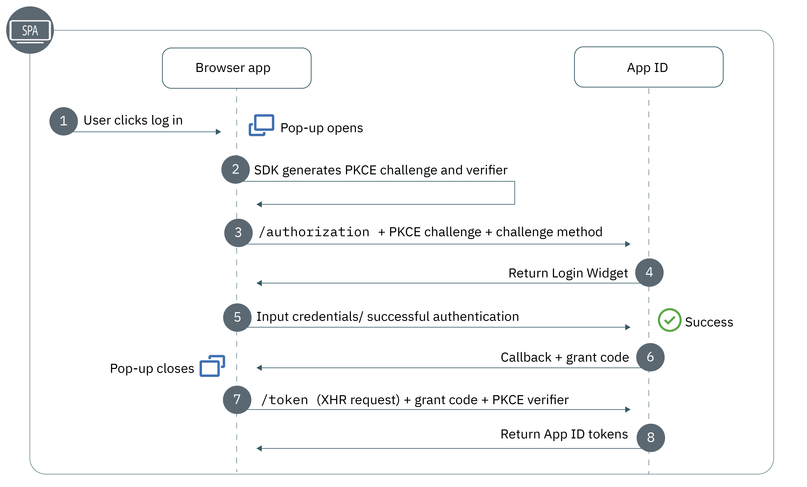

---

copyright:
  years: 2017, 2020
lastupdated: "2020-07-09"

keywords: single page application, SPA, single-page, angular, react, native apps, javascript, js, sdk, authentication, authorization, identity, app security, secure, protocols, oauth, oidc,

subcollection: appid

---

{:codeblock: .codeblock}
{:screen: .screen}
{:download: .download}
{:external: target="_blank" .external}
{:faq: data-hd-content-type='faq'}
{:gif: data-image-type='gif'}
{:important: .important}
{:note: .note}
{:pre: .pre}
{:tip: .tip}
{:preview: .preview}
{:deprecated: .deprecated}
{:shortdesc: .shortdesc}
{:script: data-hd-video='script'}
{:support: data-reuse='support'}
{:table: .aria-labeledby="caption"}
{:troubleshoot: data-hd-content-type='troubleshoot'}
{:help: data-hd-content-type='help'}
{:tsCauses: .tsCauses}
{:tsResolve: .tsResolve}
{:tsSymptoms: .tsSymptoms}
{:java: .ph data-hd-programlang='java'}
{:javascript: .ph data-hd-programlang='javascript'}
{:swift: .ph data-hd-programlang='swift'}
{:curl: .ph data-hd-programlang='curl'}


# Single-page apps
{: #single-page}

With {{site.data.keyword.appid_full}}, you can quickly add authorization and authentication to your single-page applications (SPA). An SPA runs entirely in your browser, doesn't have a backend that you manage, and does not require that the page reload while the application is in use. Some of the common frameworks that are used with SPAs are [Angular](https://angular.io/){: external} and [React](https://reactjs.org/){: external}.
{: shortdesc}

Does your app have a backend that you control? SPA is not the flow for you. Try the [web app flow](/docs/appid?topic=appid-web-apps)!
{: tip}

## Understanding the flow
{: #spa-understanding}

Although it is the current industry standard for SPAs, the OAuth working group no longer recommends the use of the implicit flow due to several security concerns. Based on their advice, {{site.data.keyword.appid_short_notm}} is configured to use the [Authorization Code flow with PKCE](https://tools.ietf.org/html/draft-ietf-oauth-browser-based-apps-04#section-4){: external}.
{: shortdesc}

{: caption="Figure 1. The authorization flow of single-page applications" caption-side="bottom"}


1. A user attempts to log in to your single-page application.
2. The {{site.data.keyword.appid_short_notm}} SDK creates a code verifier for the authorization request, which is the plain text version of the code challenge. Along with the authorization request, the client sends the code challenge and the challenge method that is used to encode the challenge.
3. The authentication flow is started by {{site.data.keyword.appid_short_notm}} in a new window.
4. The user chooses an identity provider to authenticate with and completes the sign-in process.
5. The {{site.data.keyword.appid_short_notm}} SDK on the application receives the grant code
6. The SDK then makes an XHR request to the {{site.data.keyword.appid_short_notm}} token endpoint along with the grant code and the code verifier to obtain access and identity tokens.

Are you using SSO for Cloud Directory? You can use the {{site.data.keyword.appid_short_notm}} client SDK to automatically obtain a new pair of tokens without requiring that the user explicitly sign in. For more information, see [Silent login](/docs/appid?topic=appid-single-page#spa-silent-login).
{: tip}

### Why Authorization Code + PKCE?
{: spa-code-why}

Due to their nature, single-page applications are unable to store secrets securely. The Authorization + PKCE flow, a variation of the OAuth 2.0 Authorization Code flow, uses a one-time code verifier and challenge instead of a secret to address the concern. The verifier and the challenge ensure that the entity that calls the authorization and token endpoints are the same, which means that an attacker would not be able to request tokens from the authorization server without also knowing the code verifier.

Although the Implicit flow is the current industry standard, there are several security flaws that can be found. For example, the Implicit flow uses redirect URIs to obtain tokens, which the Authorization + PKCE flow circumvents by using an XHR request instead. Because of the security flaws, the Implicit flow is no longer recommended or considered safe due to the following reasons:

  * The Implicit flow returns tokens as part of the URL - as a query param or in the hash fragment. By doing so, the tokens can be intercepted and tokens can be accessed. The tokens might be saved in a user's browser history or logs. The history or logs might be stored in a cloud service and sent to multiple devices, which also heightens the risk.

  * The Implicit flow is susceptible to a [redirect URI attack](https://tools.ietf.org/html/rfc6749#section-10.6){: external}, which means that an attacker might replace an approved redirect URI with a destination of their choice. If there is a redirect URI attack, users follow the changed link to authorize their client. After authorization, they are redirected to the attackers URI, which gives the attacker access to the user's legitimate tokens. 

The previous examples are just a few of the important issues. For more information, see [OAuth 2.0 security best current practice](https://tools.ietf.org/html/draft-ietf-oauth-security-topics-13){: external}.
{: note}


## Before you begin 
{: #spa-before}

Before you get started, be sure that you have the following prerequisites. 

  * An instance of the {{site.data.keyword.appid_short_notm}} service.
  * Your [redirect URIs](/docs/appid?topic=appid-managing-idp#add-redirect-uri) set in the {{site.data.keyword.appid_short_notm}} service dashboard.
  * A single-page application. If you don't have one and you want to try out the flow, try downloading the sample application from the overview page of the {{site.data.keyword.appid_short_notm}} dashboard.

## Creating application credentials
{: #create-spa-credentials}

Your credentials are used to connect your application to {{site.data.keyword.appid_short_notm}}. You can choose whether to create the credentials through the service dashboard or by using the API.
{: shortdesc}

There is no client secret that is returned in your SPA credentials. There is no need for a secret in the Authorization + PKCE flow. You are not able to use regular web app credentials in your SPA flow. 
{: note}

### With the GUI
{: #spa-credentials-gui}

To create your credentials, register your app with {{site.data.keyword.appid_short_notm}}.

1. Sign in to the {{site.data.keyword.cloud_notm}} dashboard in the region in which you want to work.

2. Navigate to the **Applications** tab and click **Add application**.

3. Give your application a name.

4. Select **Single-page application** from the **Type** drop-down.

5. Click **Save**.

6. In the table, click **View credentials** to see the information that is needed in the following configuration.


### With the API
{: #spa-credentials-api}

1. Make the following post request to the [/management/v4/{tenantId}/applications](https://us-south.appid.cloud.ibm.com/swagger-ui/#/Management%20API%20-%20Applications/mgmt.registerApplication){: external} endpoint.

  ```sh
  curl -X POST \
  https://us-south.appid.cloud.ibm.com/management/v4/<TENANT_ID>/applications/ \
  -H 'accept: application/json' \
  -H 'Authorization: Bearer <IAM_TOKEN>' \
  -H 'Content-Type: application/json' \
  -d '{"name": "MySampleSPA", "type": "singlepageapp"}'
  ```
  {: codeblock}

  Example response:
  ```json
  {
    "clientId": <CLIENT_ID>,
    "tenantId": <TENANT_ID>,
    "name": "MySampleSPA",
    "oAuthServerUrl": "https://us-south.appid.cloud.ibm.com/oauth/v4/<TENANT_ID>",
    "type": "singlepageapp"
  }
  ```
  {: screen}

## Configuring the JavaScript SDK
{: #configuring-js}

To install the SDK in your application, use the following steps as a guide.

1. By using the command prompt, change in to the directory that contains your application.
2. Install the {{site.data.keyword.appid_short_notm}} service by using NPM or by linking the CDN in your main HTML file.

  * To use NPM, run the following command.

    ```
    npm install ibmcloud-appid-js
    ```
    {: codeblock}
  
  * To add the CDN, add the following link to your main HTML file.
    
    ```
    <script src="https://cdn.appid.cloud.ibm.com/appid-0.3.0.min.js"></script>
    ```
    {: codeblock}

3. Add your client ID and discovery endpoint to your app to initialize the SDK.

  ```
  const appID = new AppID();
  await appID.init({
    clientId: '<SPA_CLIENT_ID>',
    discoveryEndpoint: '<WELL_KNOWN_ENDPOINT>'
  });
  ```
  {: codeblock}

4. In your application code, after your login button configuration, add a call to `signin`. A pop-up window opens where a user is prompted to enter their credentials. After a successful authentication, the screen closes and they are authenticated.

  ```
  const tokens = await appID.signin();
  ```
  {: codeblock}


## Configuring silent login
{: #spa-silent-login}

When [SSO for Cloud Directory](/docs/appid?topic=appid-cd-sso#cd-sso) is enabled, you can automatically obtain new tokens for a user without them having to reauthenticate by using silent login. To enable silent login, use the following steps as a guide.

Refresh tokens are not returned in the SPA flow.
{: tip}

1. In the {{site.data.keyword.appid_short_notm}} dashboard, navigate to **Cloud Directory > Single Sign-on**.

2. Toggle **Enable single sign-on** to **Enabled**.

3. Click **Save**.

4. Add the following code to your application. Be sure to configure your application to show the login button if silent login fails.
  
  ```
  const tokens = await appID.silentSignin();
  if (!tokens) {
    document.getElementById('login').addEventListener('click', async () => {
      const tokens = await appID.signin();
    }
  }
  ```
  {: codeblock}


