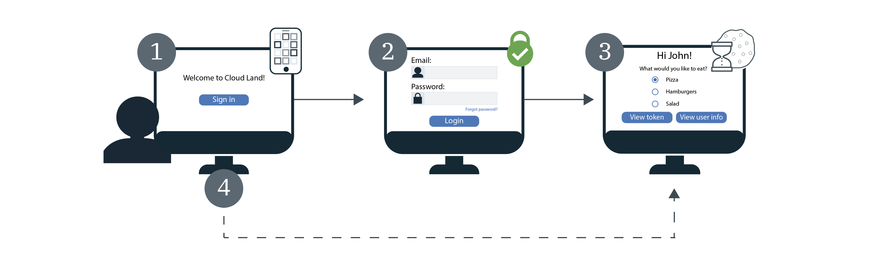

---

copyright:
  years: 2017, 2020
lastupdated: "2020-03-15"

keywords: sso, single sign on, cloud directory, saml, federated, sign in, log in, log out, authentication, app security, user registry, multiple apps

subcollection: appid

---

{:external: target="_blank" .external}
{:shortdesc: .shortdesc}
{:screen: .screen}
{:pre: .pre}
{:table: .aria-labeledby="caption"}
{:codeblock: .codeblock}
{:tip: .tip}
{:note: .note}
{:important: .important}
{:deprecated: .deprecated}
{:download: .download}


# Single sign-on (SSO)
{: #cd-sso}

With Single sign-on (SSO) for Cloud Directory, you can provide a smooth authentication experience between multiple web apps. If SSO is turned on when a user initially signs in, they are not required to reenter their credentials the next time they sign-in. Instead, they are automatically signed in to any of your apps that are protected by the same {{site.data.keyword.appid_short_notm}} instance.
{: shortdesc}

{{site.data.keyword.appid_short_notm}} provides SSO for Cloud Directory users. If you use a social or federated SAML identity provider SSO is managed by that provider and {{site.data.keyword.appid_short_notm}} respects it.
{: note}


## How it works
{: #cd-sso-how-it-works}

Check out the following diagram to see SSO in action.

{: caption="Figure 1. Cloud Directory SSO flow" caption-side="bottom"}

1. A Cloud Directory user signs in to your app for the first time.
2. They are asked to authenticate by providing either a username or email and password.
3. If the credentials are valid, a user is signed in to your app. At the same time, {{site.data.keyword.appid_short_notm}}, creates a session and sets a cookie on the user's browser.
4. If a user attempts to sign in to one of your other applications, {{site.data.keyword.appid_short_notm}} detects the session cookie and automatically signs the user into your app. {{site.data.keyword.appid_short_notm}} session cookies are instance-specific and are signed by the instance's unique private key.

Currently, Cloud Directory SSO is configured to work when Cloud Directory is the only enabled identity provider. If your instance of {{site.data.keyword.appid_short_notm}} is configured to use multiple identity providers, enabling SSO has no effect on the sign-in flow. Users are prompted to enter their Cloud Directory credentials or choose one of the other providers at every sign-in.
{: note}


## Configuring SSO
{: #cd-sso-configure}

You can configure single sign-on by using the {{site.data.keyword.appid_short_notm}} dashboard or by using the APIs.
{: shortdesc}


### With the GUI
{: #cd-sso-configure-gui}


You can configure the SSO through the GUI.

1. Navigate to the **Cloud Directory > Single Sign-on** tab of the {{site.data.keyword.appid_short_notm}} dashboard.

2. Toggle **Enable single sign-on** to **Enabled**.

3. Set the amount of time that a user can be inactive before the SSO session expires. When it expires, they must sign in again. The time is specified in minutes and the maximum allowed time for inactivity is 10,080 minutes (7 days). The default time is 1440 minutes, which is the equivalent of 1 day.

4. Add your redirect URIs to the **Logout redirect URI** box and click the **+** sign. Be sure to register only applications that you trust. By registering the URI, you're authorizing {{site.data.keyword.appid_short_notm}} to include it in the authorization workflow.

5. Click **Save**.


### With the API
{: #cd-sso-configure-api}

By using the SSO Configuration Admin API to define three settings, you can turn on the feature.

An example call:

```json
{
  "isActive": true,
  "inactivityTimeoutSeconds": 86400,
  "logoutRedirectUris": [
    "http://my-first-app.com/after_logout",
    "http://my-second-app.com/after_logout"
  ]
}
```
{: screen}

<table>
  <caption>Table 1. SSO configuration settings</caption>
  <tr>
    <th>Setting</th>
    <th>Definition</th>
  </tr>
  <tr>
    <td><code>isActive</code></td>
    <td>To enable SSO, set this value to <code>true</code>. The default setting is <code>false</code>.</td>
  </tr>
  <tr>
    <td><code>inactivityTimeoutSeconds</code></td>
    <td>The longest length of time that can pass without any user activity before the user is required to reenter their credentials. This value is specified in seconds and can be a maximum of <code>604800 seconds</code> (7 days). The default setting is <code>86400 seconds</code> (1 day).</td>
  </tr>
  <tr>
    <td><code>logoutRedirectUris</code></td>
    <td>A comma-separated list of allowed URIs that {{site.data.keyword.appid_short_notm}} can redirect your users to after they sign out.</td>
  </tr>
</table>


## Configuring logout
{: #cd-sso-log-out}

With {{site.data.keyword.appid_short_notm}}, you can end a user's SSO session for their current browser. If the API endpoint is accessed by the user's browser, their session is terminated and the user is prompted to enter their credentials on their next sign-in attempt in that browser - for any of your apps.
{: shortdesc}


When one of the changes, reset, or renew password flows is started, the sessions across all clients are automatically terminated for the user.
{: note}


### By using the API
{: #cd-sso-log-out-api}

To sign out a user, redirect their browser by using your information to complete the following API call.

```
https://<region>.appid.cloud.ibm.com/oauth/v4/<tenant-id>/cloud_directory/sso/logout?redirect_uri=<redirect_uri>&client_id=<clientId>
```
{: codeblock}

<table>
  <caption>Table 2. SSO sign-out API call variables</caption>
  <tr>
    <th>Variable</th>
    <th>Value</th>
  </tr>
  <tr>
    <td><code>region</code></td>
    <td>The region in which your instance of {{site.data.keyword.appid_short_notm}} is provisioned. Options include: <code>au-syd</code>, <code>eu-de</code>, <code>eu-gb</code>, <code>jp-tok</code>, and <code>us-south</code>.</td>
  </tr>
  <tr>
    <td><code>tenant-id</code></td>
    <td>The unique identifier for your instance of {{site.data.keyword.appid_short_notm}}. You can find this value in the <em>Service Credentials</em> tab of the {{site.data.keyword.appid_short_notm}} dashboard. If you do not have a set of service credentials, you can create one and take the value from there.</td>
  </tr>
  <tr>
    <td><code>redirect_uri</code></td>
    <td>A URI that you specified in your SSO configuration through the {{site.data.keyword.appid_short_notm}} dashboard. For security reasons, if you do not specify a value redirection cannot occur and an error is displayed.</td>
  </tr>
</table>

Even if the SSO session is ended, a user with a valid access token that is stored in their session might not be required to enter their credentials again until their token expires. By default the token expires after 1 hour.
{: note}


### By using the Node.JS server SDK
{: #cd-sso-log-out-nodejs}

You can also use the {{site.data.keyword.appid_short_notm}} Node.js server SDK to automatically handle the redirection for you.

Example:

```javascript
app.get('/logoutSSO', (req, res) => {
  res.clearCookie("refreshToken");
  WebAppStrategy.logoutSSO(req,res, { "redirect_uri": "https://my-app.com/after_logout" });
  });
```
{: screen}


## Ending all sessions for a user
{: cd-sso-ending-all-sessions}

As an administrator, you can end all SSO sessions for any user by using the {{site.data.keyword.appid_short_notm}} admin APIs. The APIs are protected by a Cloud IAM token.

Example API request:

```
POST https://<region>.appid.cloud.ibm.com/management/v4/{tenant-id}/cloud_directory/Users/{user-id}/sso/logout
Headers:
Authorization: Bearer <IAM_token>
```
{: codeblock}

<table>
  <caption>Table 3. Variables that are needed to end all SSO sessions for a user</caption>
  <tr>
    <th>Variable</th>
    <th>Value</th>
  </tr>
  <tr>
    <td><code>region</code></td>
    <td>The region in which your instance of {{site.data.keyword.appid_short_notm}} is provisioned. Options include: <code>us-south</code>, <code>eu-gb</code>, and <code>eu-de</code>.</td>
  </tr>
  <tr>
    <td><code>tenant-id</code></td>
    <td>The unique identifier for your instance of {{site.data.keyword.appid_short_notm}}. You can find this value in the <em>Service Credentials</em> tab of the {{site.data.keyword.appid_short_notm}} dashboard. If you do not have a set of service credentials, you can create one and take the value from there.</td>
  </tr>
  <tr>
    <td><code>user-id</code></td>
    <td>The unique identifier for a Cloud Directory user. You can obtain the ID by using the [Cloud Directory Users APIs](https://us-south.appid.cloud.ibm.com/swagger-ui/#/), or by viewing the user's identity token.</td>
  </tr>
</table>

When you invoke this API, all of the specified user's SSO sessions are invalidated. This means that the next time that the user attempts to sign in to any of your apps, from any device or browser, they are required to reenter their credentials.

