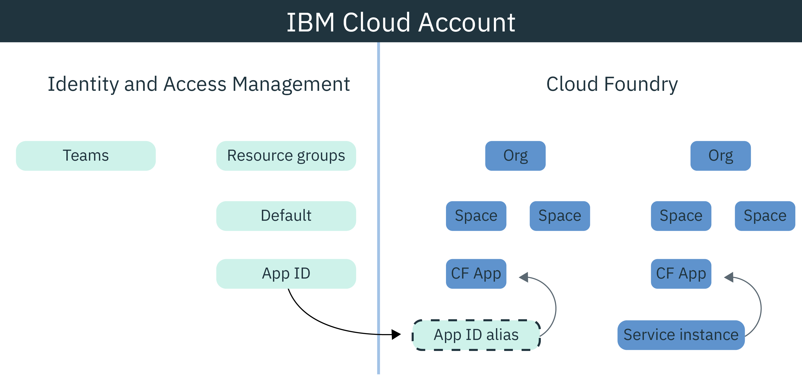

---

copyright:
  years: 2017, 2021
lastupdated: "2021-10-11"

keywords: cloud foundry, iam, java nodejs, identity, access management, user access, service access, permissions, bind service

subcollection: appid

content-type: tutorial
services: cloud-foundry-public
account-plan: lite
completion-time: 10m

---

{:codeblock: .codeblock}
{:screen: .screen}
{:download: .download}
{:external: target="_blank" .external}
{:faq: data-hd-content-type='faq'}
{:gif: data-image-type='gif'}
{:important: .important}
{:note: .note}
{:pre: .pre}
{:tip: .tip}
{:preview: .preview}
{:deprecated: .deprecated}
{:beta: .beta}
{:term: .term}
{:shortdesc: .shortdesc}
{:script: data-hd-video='script'}
{:support: data-reuse='support'}
{:table: .aria-labeledby="caption"}
{:troubleshoot: data-hd-content-type='troubleshoot'}
{:help: data-hd-content-type='help'}
{:tsCauses: .tsCauses}
{:tsResolve: .tsResolve}
{:tsSymptoms: .tsSymptoms}
{:java: .ph data-hd-programlang='java'}
{:javascript: .ph data-hd-programlang='javascript'}
{:swift: .ph data-hd-programlang='swift'}
{:curl: .ph data-hd-programlang='curl'}
{:video: .video}
{:step: data-tutorial-type='step'}
{:tutorial: data-hd-content-type='tutorial'}
{:ui: .ph data-hd-interface='ui'}
{:cli: .ph data-hd-interface='cli'}
{:api: .ph data-hd-interface='api'}

# Configuring Cloud Foundry to use {{site.data.keyword.appid_short_notm}}
{: #cloud-foundry}
{: toc-content-type="tutorial"}
{: toc-services="cloud-foundry-public"}
{: toc-completion-time="10m"}

With {{site.data.keyword.cloud_notm}}, you can protect your apps with two different types of access management, Identity and Access Management (IAM) and Cloud Foundry. By default, all new instances of {{site.data.keyword.appid_short_notm}} use IAM resource groups to manage access. If you are using Cloud Foundry to manage your application, you can bridge the management models by creating a service alias and binding the service to the app.
{: shortdesc}


## Understanding Cloud Foundry
{: #cf-understand}

An alias creates a connection between your IAM-managed service such as {{site.data.keyword.appid_short_notm}} and your Cloud Foundry application. When you bind an application, service credentials are created and automatically passed to the app. Although binding is a required step in the configuration, it has the following benefits:

* Automation: With the service credentials stored in the VCAP_SERVICES environment variable, you no longer need to manually copy them to the app. It's all done behind the scenes on your behalf with the {{site.data.keyword.appid_short_notm}} SDKs.
* Safety: Configuration becomes error-proof because the process is automatic.
* Security: Nothing that is access related is hard-coded into your application as the service credentials exist in the environment variables only.

Is your Cloud Foundry app hosted on another platform? No problem. You can define application credentials in your app to bind it to the service. You can find your application credentials through the {{site.data.keyword.appid_short_notm}} dashboard, or by making a request to the [/applications endpoint](https://us-south.appid.cloud.ibm.com/swagger-ui/#!/Applications/registerApplication).
{: tip}

Check out how the models fit together in the following diagram:

{: caption="Figure 1. Binding a Cloud Foundry app" caption-side="bottom"}

## Before you begin
{: #cf-before}

Before you get started, be sure that you have the following prerequisites:

* An {{site.data.keyword.cloud_notm}} account
* An instance of {{site.data.keyword.appid_short_notm}}
* The [{{site.data.keyword.cloud_notm}} CLI](/docs/cli?topic=cli-getting-started) installed locally

## Deploy the app
{: #cf-deploy-app}
{: step}

The following step includes instructions for deploying a Node.js app or a Java app.

### Deploying a Node.js app
{: #cf-node}

1. Navigate to your instance of {{site.data.keyword.appid_short_notm}}.
2. Click **Download Sample** on the **Overview** tab of the service dashboard.
3. Click **Node.js**. Download and extract the sample app.
4. Verify that you have all of the Node.js prerequisites.
5. Open terminal and change into the sample folder.
6. Log in to the {{site.data.keyword.cloud_notm}} CLI. The CLI prompts you to select an account and region if you do not specify one.

   ```sh
   ibmcloud login -a cloud.ibm.com -r {region}
   ```
   {: codeblock}

7. Target the Cloud Foundry organization and space that you want to work in and follow the prompts to target an org and space.

   ```sh
   ibmcloud target --cf
   ```
   {: codeblock}

8. Create an alias of the {{site.data.keyword.appid_short_notm}} service instance.

   ```sh
   ibmcloud resource service-alias-create {ALIAS_NAME} --instance-name {SERVICE_INSTANCE_NAME}
   ```
   {: codeblock}

9. Add the alias that you created to your services in the `manifest.yml`.
10. Bind the services that are listed in the `manifest.yml` file by deploying the sample app.

   ```sh
   ibmcloud app push
   ```
   {: codeblock}

### Deploying a Java app
{: #java}

1. Navigate to your instance of {{site.data.keyword.appid_short_notm}}.
2. Click **Download Sample** on the **Overview** tab of the service dashboard.
3. Click **Java**. Download and extract the sample app.
4. Verify that you have all of the Java prerequisites.
5. Open terminal and change into the sample folder.
6. Generate your `war` file and upload it.

   ```sh
   mvn clean install
   ```
   {: codeblock}

7. Change into the Liberty folder.
8. Log in to the {{site.data.keyword.cloud_notm}} CLI. The CLI prompts you to select an account and region if you do not specify one.

   ```sh
   ibmcloud login -a cloud.ibm.com -r {region}
   ```
   {: codeblock}

9. Target the Cloud Foundry organization and space that you want to work in and follow the prompts to target an org and space.

   ```sh
   ibmcloud target --cf
   ```
   {: codeblock}

10. Create an alias of the {{site.data.keyword.appid_short_notm}} service instance.

   ```sh
   ibmcloud resource service-alias-create {ALIAS_NAME} --instance-name {SERVICE_INSTANCE_NAME}
   ```
   {: codeblock}

11. Add the alias that you created to your services in the `manifest.yml`.

   Example:
   ```sh
      applications:
   - name: ApplicationName
      memory: 512M
      services:
      - AppID-alias
   ```
   {: screen}

12. Bind the services that are listed in the `manifest.yml` file by deploying the sample app.

   ```sh
   ibmcloud app push
   ```
   {: codeblock}

