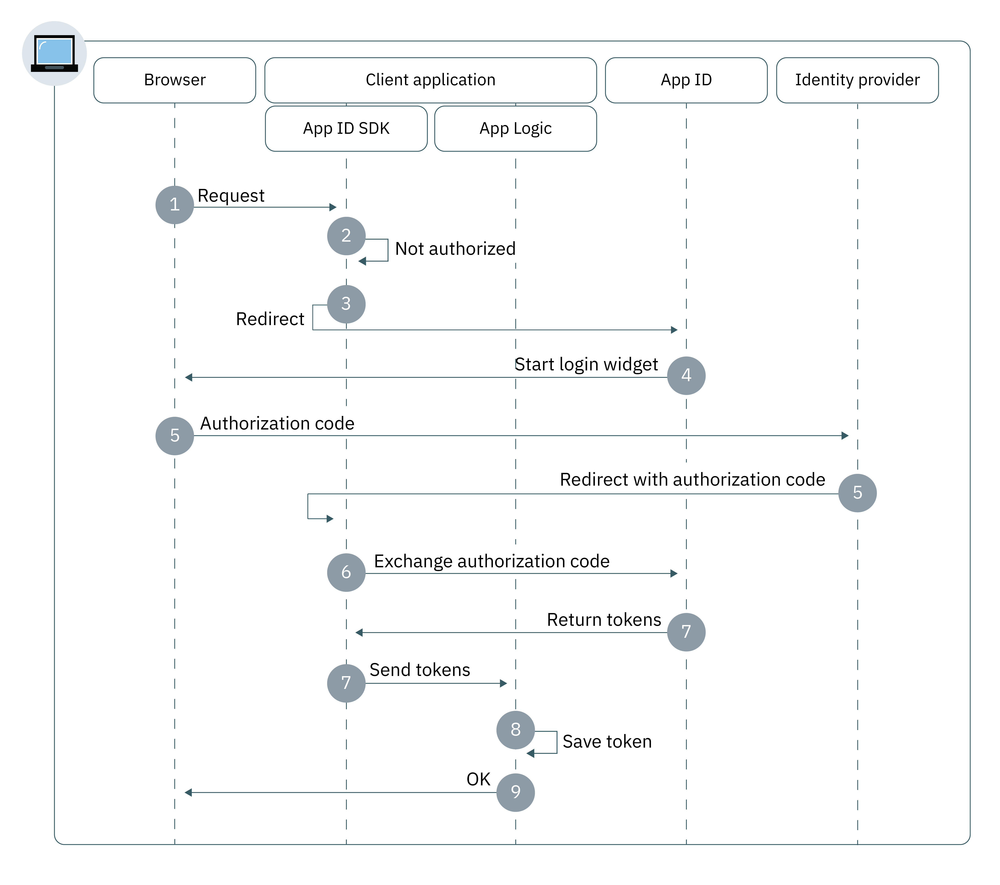

---

copyright:
  years: 2017, 2019
lastupdated: "2019-03-14"

keywords: authentication, authorization, identity, app security, secure, web apps, client, server

subcollection: appid

---

{:new_window: target="_blank"}
{:shortdesc: .shortdesc}
{:screen: .screen}
{:pre: .pre}
{:table: .aria-labeledby="caption"}
{:codeblock: .codeblock}
{:tip: .tip}
{:note: .note}
{:important: .important}
{:deprecated: .deprecated}
{:download: .download}


# Web apps
{: #web-apps}

With {{site.data.keyword.appid_full}}, you can quickly construct an authentication layer for your web applications.
{: shortdesc}

## Understanding the flow
{: #web-understanding}

**When would this flow be useful?**

When you are developing a web application, you can use the {{site.data.keyword.appid_short_notm}} web flow to securely authenticate users. Users are then able to access your server-side protected content in your web apps.

**What is the flow's technical basis?**

Web apps often require users to authenticate in order to access protected content. {{site.data.keyword.appid_short_notm}} uses the OIDC authorization code flow to securely authenticate users. With this flow, when the user is authenticated, the app receives an authorization code. The code is then exchanged for an access, identity, and refresh token. In code, exchange step the tokens are always sent via a secure backchannel between the app and the OIDC server. This provides an extra layer of security as the attacker is not able to intercept the tokens. These tokens can be sent directly to the web server hosting application for user authentication.

**How does this flow work?**



1. A user initiates the authorization flow by sending a request to the `/authorization` endpoint via the {{site.data.keyword.appid_short_notm}} SDK or API.

2. If the user is unauthorized, the authentication flow is started with a redirect to {{site.data.keyword.appid_short_notm}}.

3. Depending on the user's `/authorization` request parameters or identity provider configuration, it launches the Login Widget in the user's browser.

4. The user chooses an identity provider to authenticate with and completes the sign in process.

5. The identity provider redirects to the client app with the authorization code.

6. The {{site.data.keyword.appid_short_notm}} SDK exchanges the authorization code for access, identity, and optional refresh tokens from the {{site.data.keyword.appid_short_notm}} service.

7. The tokens are saved by the {{site.data.keyword.appid_short_notm}} SDK and a redirect to the client application occurs.

8. The user is granted access to the app.


## Configuring the Node.js SDK
{: #web-configuring-nodejs}

You can configure {{site.data.keyword.appid_short_notm}} to work with your Node.js web applications.
{: shortdesc}

**Before you begin**

You must have the following prerequisites:

* An instance of the {{site.data.keyword.appid_short_notm}} service
* A set of service credentials
* NPM version 4 or higher
* Node version 6 or higher
* Your redirect URI set in the {{site.data.keyword.appid_short_notm}} service dashboard


### Installing the Node.js SDK
{: #web-nodejs-install}

1. By using the command line, change to the directory that contains your Node.js app.

2. Install the {{site.data.keyword.appid_short_notm}} service.

  ```bash
  npm install --save ibmcloud-appid
  ```
  {: pre}

### Initializing the Node.js SDK
{: #web-nodejs-initialize}

1. Add the following `require` definitions to your `server.js` file.

  ```javascript
  const express = require('express');
  const session = require('express-session')
  const passport = require('passport');
  const WebAppStrategy = require("ibmcloud-appid").WebAppStrategy;
  const CALLBACK_URL = "/ibm/cloud/appid/callback";
  ```
  {: pre}

2. Set up your express app to use express-session middleware.

  ```javascript
  const app = express();
  app.use(session({
      secret: "123456",
      resave: true,
      saveUninitialized: true
  }));
  app.use(passport.initialize());
  app.use(passport.session());
  ```
  {: pre}

  You must configure the middleware with the proper session storage for production environments. For more information see the <a href="https://github.com/expressjs/session" target="_blank"> express.js docs</a>.
  {: note}

3. Obtain your credentials in one of the following ways.

  * By navigating to the **Applications** tab of the {{site.data.keyword.appid_short_notm}} dashboard. If you don't have an application listed, you can click **Add application** to create a new one.

  * By making a POST request to the [`/management/v4/{tenantId}/applications` endpoint](https://us-south.appid.cloud.ibm.com/swagger-ui/#!/Applications/registerApplication).

    Request format:
    ```
    curl -X POST \  https://us-south.appid.cloud.ibm.com/management/v4/39a37f57-a227-4bfe-a044-93b6e6060b61/applications/ \
    -H 'Content-Type: application/json' \
    -H 'Authorization: Bearer IAM_TOKEN' \
    -d '{"name": "ApplicationName"}'
    ```
    {: pre}

    Example response:
    ```
    {
    "clientId": "111c22c3-38ea-4de8-b5d4-338744d83b0f",
    "tenantId": "39a37f57-a227-4bfe-a044-93b6e6060b61",
    "secret": "ZmE5ZDQ5ODctMmA1ZS00OGRiLWExZDMtZTA1MjkyZTc4MDB4",
    "name": "ApplicationName",
    "oAuthServerUrl": "https://us-south.appid.cloud.ibm.com/oauth/v3/39a37f57-a227-4bfe-a044-93b6e6060b61"
    }
    ```
    {: screen}

4. Optional: Decide how to format your redirect URI. The redirect can be formatted in two different ways.

  * Manually in a new `WebAppStrategy({redirectUri: "...."})`
  * As an environment variable named `redirectUri`

  If neither are provided, the {{site.data.keyword.appid_short_notm}} SDK tries to retrieve the `application_uri` of the app that is running on {{site.data.keyword.cloud_notm}} and append a default suffix `/ibm/cloud/appid/callback`.

5. By using the information obtained in the previous steps, initialize the SDK.

  ```javascript
    passport.use(new WebAppStrategy({
      tenantId: "{tenant-id}",
      clientId: "{client-id}",
      secret: "{secret}",
      oauthServerUrl: "{oauth-server-url}",
      redirectUri: "{app-url}" + CALLBACK_URL
    }));
  ```
  {: pre}

6. Configure passport with serialization and deserialization. This configuration step is required for authenticated session persistence across HTTP requests. For more information, see the <a href="http://passportjs.org/docs" target="_blank">passport docs </a>.

  ```javascript
  passport.serializeUser(function(user, cb) {
    cb(null, user);
    });

  passport.deserializeUser(function(obj, cb) {
    cb(null, obj);
    });
  ```
  {: pre}

5. Add the following code to your `server.js` file to issue the service redirects.

   ```javascript
   app.get(CALLBACK_URL, passport.authenticate(WebAppStrategy.STRATEGY_NAME));
   ```
   {: pre}

6. Register your protected endpoint.

   ```javascript
   app.get(‘/protected’, passport.authenticate(WebAppStrategy.STRATEGY_NAME), function(req, res) {res.json(req.user); });
   ```
   {: pre}

For more information, see the <a href="https://github.com/ibm-cloud-security/appid-serversdk-nodejs" target="_blank">{{site.data.keyword.appid_short_notm}} Node.js GitHub repository </a>.


## Configuring the Liberty for Java SDK
{: #web-configuring-liberty}

You can configure {{site.data.keyword.appid_short_notm}} to work with your Liberty for Java web applications.
{:shortdesc}

**Before you begin**

You must have the following prerequisites:
* An instance of the {{site.data.keyword.appid_short_notm}} service
* A set of service credentials
* Apache Maven 3.5 or higher
* Java 1.8
* A Liberty for Java web application

### Installing the Liberty for Java SDK
{: #web-liberty-install}

1. Add an OpenID Connect feature to your `server.xml`.

  ```xml
  <featureManager>
      <feature>ssl-1.0</feature>
      <feature>appSecurity-2.0</feature>
      <feature>openidConnectClient-1.0</feature>
  </featureManager>
  ```
  {: pre}

2. Obtain your credentials in one of two ways.

  * By navigating to the **Applications** tab of the {{site.data.keyword.appid_short_notm}} dashboard. If you don't already have one, you can click **Add application** to create a new one.

  * By making a POST request to the [`/management/v4/{tenantId}/applications` endpoint](https://us-south.appid.cloud.ibm.com/swagger-ui/#!/Applications/registerApplication).

    Request format:
    ```
    curl -X POST \  https://us-south.appid.cloud.ibm.com/management/v4/39a37f57-a227-4bfe-a044-93b6e6060b61/applications/ \
    -H 'Content-Type: application/json' \
    -H 'Authorization: Bearer IAM_TOKEN' \
    -d '{"name": "ApplicationName"}'
    ```
    {: pre}

    Example response:
    ```
    {
    "clientId": "111c22c3-38ea-4de8-b5d4-338744d83b0f",
    "tenantId": "39a37f57-a227-4bfe-a044-93b6e6060b61",
    "secret": "ZmE5ZDQ5ODctMmA1ZS00OGRiLWExZDMtZTA1MjkyZTc4MDB4",
    "name": "ApplicationName",
    "oAuthServerUrl": "https://us-south.appid.cloud.ibm.com/oauth/v3/39a37f57-a227-4bfe-a044-93b6e6060b61"
    }
    ```
    {: screen}

3. Create an Open ID Connect Client feature and define the following placeholders. Use the service credentials to fill the placeholders.

  ```xml
  <openidConnectClient
    clientId='{{site.data.keyword.appid_short_notm}} client_ID'
    clientSecret='{{site.data.keyword.appid_short_notm}} Secret'
    authorizationEndpointUrl='oauthServerUrl/authorization'
    tokenEndpointUrl='oauthServerUrl/token'
    jwkEndpointUrl='oauthServerUrl/publickeys'
    issuerIdentifier='Changed according to the region'
    tokenEndpointAuthMethod="basic"
    signatureAlgorithm="RS256"
    authFilterid="myAuthFilter"
    trustAliasName="ibm.com"
  />
  ```
  {: pre}

  <table>
  <caption>Table. OIDC element variables for Liberty for Java apps</caption>
    <tr>
      <th> Component </th>
      <th> Description </th>
    </tr>
    <tr>
    <td><code>clientID</code> </br> <code>secret</code> </br> <code>oauth-server-url</code> </br></td>
    <td>Complete step two to obtain your service credentials.</td>
    </tr>
    <tr>
      <td><code>authorizationEndpointURL</code></td>
      <td> Add <code>/authorization</code> to the end of your <code>oauthServerURL</code>.</td>
    </tr>
    <tr>
      <td><code>tokenEndpointUrl</code></td>
      <td>Add <code>/token</code> to the end of your <code>oauthServerURL</code>.</td>
    </tr>
    <tr>
      <td><code>jwkEndpointUrl</code></td>
      <td>Add <code>/publickeys</code> to the end of your <code>oauthServerURL</code>.</td>
    </tr>
    <tr>
      <td><code>issuerIdentifier</code></td>
      <td>The issuer identifier takes the following form: <code>&lt;region>&gt;.cloud.ibm.com</code>. Region options include: <code>au-syd</code>, <code>eu-de</code>, <code>eu-gb</code>, <code>jp-tok</code>, and <code>us-south</code>.</td>
    </tr>
    <tr>
      <td><code>tokenEndpointAuthMethod</code></td>
      <td>Specified as "basic".</td>
    </tr>
    <tr>
      <td><code>signatureAlgorithm</code></td>
      <td>Specified as "RS256".</td>
    </tr>
    <tr>
      <td><code>authFilterid</code></td>
      <td>The list of resources to protect.</td>
    </tr>
    <tr>
      <td><code>trustAliasName</code></td>
      <td>The name of your certificate within your truststore.</td>
    </tr>
  </table>

### Initializing the Liberty for Java SDK
{: #web-liberty-initialize}

1. In your `server.xml` file, define an authorization filter to specify protected resources. If a filter is not <a href="https://www.ibm.com/support/knowledgecenter/en/SSD28V_8.5.5/com.ibm.websphere.wlp.core.doc/ae/rwlp_auth_filter.html" target="_blank">defined </a>, the service protects all resources.

  ```xml
  <authFilter id="myAuthFilter">
      <requestUrl id="myRequestUrl" urlPattern="/protected" matchType="contains"/>
  </authFilter>
  ```
  {: pre}

2. Define your special subject type as `ALL_AUTHENTICATED_USERS`.

  ```xml
  <application type="war" id="ProtectedServlet" context-root="/appidSample" location="${server.config.dir}/apps/libertySample-1.0.0.war">
      <application-bnd>
          <security-role name="myrole">
              <special-subject type="ALL_AUTHENTICATED_USERS"/>
          </security-role>
      </application-bnd>
  </application>
  ```
  {: pre}

3. Download the `libertySample-1.0.0.war` file from <a href="https://github.com/ibm-cloud-security/appid-sample-code-snippets/tree/master/liberty-for-java" target="_blank">GitHub </a> and place it in your server's apps folder. For example, if your server is named `defaultServer`, the war file would go here `target/liberty/wlp/usr/servers/defaultServer/apps/`.

4. Configure SSL by adding the following to your `server.xml` file. You also need to create a truststore.

  ```xml
    <keyStore id="defaultKeyStore" password="myPassword"/>
    <keyStore id="appidtruststore" password="Liberty" location="${server.config.dir}/mytruststore.jks"/>
    <ssl id="defaultSSLConfig" keyStoreRef="defaultKeyStore" trustStoreRef="appidtruststore"/>
  ```
  {: pre}

By default SSL configuration requires the truststore be configured for OpenID Connect. Learn more about <a href="https://www.ibm.com/support/knowledgecenter/en/SSEQTP_liberty/com.ibm.websphere.wlp.doc/ae/twlp_config_oidc_rp.html" target="_blank">configuring an OpenID Connect Client in Liberty </a>
{: tip}


## Configuring Spring Boot for Java SDK
{: #web-configuring-spring-boot}

You can configure {{site.data.keyword.appid_short_notm}} to work with your Spring Boot applications.
{:shortdesc}

**Before you begin**

You must have the following prerequisites:

* An instance of the {{site.data.keyword.appid_short_notm}} service
* A set of service credentials
* A Java + Maven project
* Apache Maven 3.5 or higher
* Java 1.8
* Spring Boot 2.0 and Security OAuth 2.0 or higher


### Initializing the Spring Boot framework
{: #web-spring-boot-initialize}

1. Add the following between the `<project> </project>` tags in your Maven `pom.xml` file.

  ```xml
  <parent>
      <groupId>org.springframework.boot</groupId>
      <artifactId>spring-boot-starter-parent</artifactId>
      <version>2.0.2.RELEASE</version>
      <relativePath/>
  </parent>
  ```
  {: pre}

2. Add the following dependencies to your Maven `pom.xml` file.

  ```xml
  <dependencies>
      <dependency>
          <groupId>org.springframework.boot</groupId>
          <artifactId>spring-boot-starter-web</artifactId>
      </dependency>
      <dependency>
          <groupId>org.springframework.boot</groupId>
          <artifactId>spring-boot-starter-security</artifactId>
      </dependency>
      <dependency>
          <groupId>org.springframework.security.oauth.boot</groupId>
          <artifactId>spring-security-oauth2-autoconfigure</artifactId>
          <version>2.0.0.RELEASE</version>
      </dependency>
  </dependencies>
  ```
  {: pre}

3. In the same file, include the Maven plug-in.

  ```xml
  <plugin>
      <groupId>org.springframework.boot</groupId>
      <artifactId>spring-boot-maven-plugin</artifactId>
  </plugin>
  ```
  {: pre}

### Initializing OAuth2
{: #web-oauth-initialize}

1. Add the following annotations to your Java file.

  ```java
  @SpringBootApplication
  @EnableOAuth2Sso
  ```
  {: pre}

2. Extend the class with `WebSecurityConfigurerAdapter`.
3. Override any security configuration and register your protected endpoint.

  ```java
    @Override
    protected void configure(HttpSecurity http) throws Exception {
        http.authorizeRequests()
                .antMatchers("/protectedResource").authenticated()
                .and().logout().logoutSuccessUrl("/").permitAll();
    }
  ```
  {: pre}


### Adding credentials
{: #web-spring-boot-credentials}

1. Obtain your credentials in one of the following ways.

  * By navigating to the **Applications** tab of the {{site.data.keyword.appid_short_notm}} dashboard. If you don't already have one, you can click **Add application** to create a new one.

  * By making a POST request to the [`/management/v4/{tenantId}/applications` endpoint](https://us-south.appid.cloud.ibm.com/swagger-ui/#!/Applications/registerApplication).

    Request format:
    ```
    curl -X POST \  https://us-south.appid.cloud.ibm.com/management/v4/39a37f57-a227-4bfe-a044-93b6e6060b61/applications/ \
    -H 'Content-Type: application/json' \
    -H 'Authorization: Bearer IAM_TOKEN' \
    -d '{"name": "ApplicationName"}'
    ```
    {: pre}

    Example response:
    ```
    {
    "clientId": "111c22c3-38ea-4de8-b5d4-338744d83b0f",
    "tenantId": "39a37f57-a227-4bfe-a044-93b6e6060b61",
    "secret": "ZmE5ZDQ5ODctMmA1ZS00OGRiLWExZDMtZTA1MjkyZTc4MDB4",
    "name": "ApplicationName",
    "oAuthServerUrl": "https://us-south.appid.cloud.ibm.com/oauth/v3/39a37f57-a227-4bfe-a044-93b6e6060b61"
    }
    ```
    {: screen}

2. Add an `application.yml` configuration file to the `/springbootsample/src/main/resources/` directory. You can complete your configuration with the information from your service credentials.

  ```
  security:
  oauth2:
    client:
      clientId: {client ID}
      clientSecret: {client Secret}
      accessTokenUri: {oauthServerUrl}/token
      userAuthorizationUri: {oauthServerUrl}/authorization
    resource:
      userInfoUri: {oauthServerUrl}/userinfo
  ```
  {: pre}

For a step-by-step example, check out <a href="https://www.ibm.com/blogs/bluemix/2018/06/creating-spring-boot-applications-app-id/" target="_blank">this blog</a>!


## Using {{site.data.keyword.appid_short_notm}} with other languages
{: #web-other-languages}

With an OIDC-compliant client SDK, you can use {{site.data.keyword.appid_short_notm}} with other languages. Check out the list of <a href="https://openid.net/developers/certified/">certified libraries</a> for more information.

## Next steps
{: #web-next}

With {{site.data.keyword.appid_short_notm}} installed in your application, you're almost ready to start authenticating users! Try doing one of the following activities next:

* Configure your [identity providers](/docs/services/appid?topic=appid-social)
* Customize and configure [the Login Widget](/docs/services/appid?topic=appid-login-widget)
* Learn more about the <a href="https://github.com/ibm-cloud-security/appid-serversdk-nodejs" target="_blank">Node.js SDK</a>
