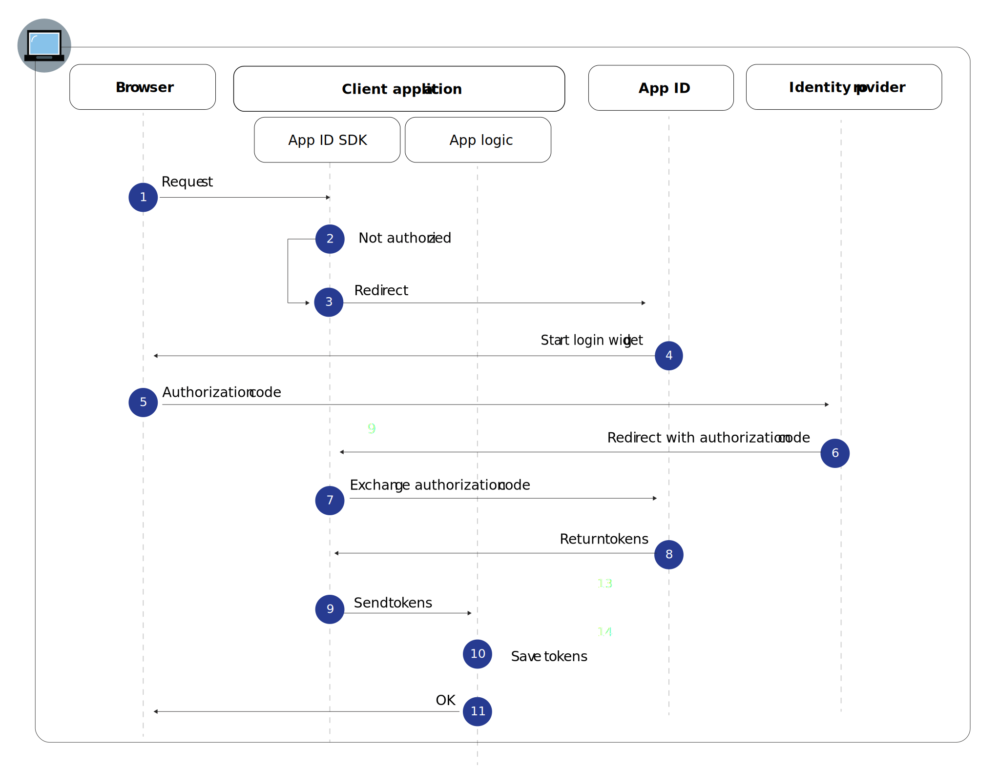

---

copyright:
  years: 2017, 2023
lastupdated: "2023-02-21"

keywords: web apps, authorization code, authentication, nodejs, javascript, app access, application credentials, login, redirect uri, protected endpoint, video

subcollection: appid

---

{:codeblock: .codeblock}
{:screen: .screen}
{:download: .download}
{:external: target="_blank" .external}
{:faq: data-hd-content-type='faq'}
{:gif: data-image-type='gif'}
{:important: .important}
{:note: .note}
{:pre: .pre}
{:tip: .tip}
{:preview: .preview}
{:deprecated: .deprecated}
{:beta: .beta}
{:term: .term}
{:shortdesc: .shortdesc}
{:script: data-hd-video='script'}
{:support: data-reuse='support'}
{:table: .aria-labeledby="caption"}
{:troubleshoot: data-hd-content-type='troubleshoot'}
{:help: data-hd-content-type='help'}
{:tsCauses: .tsCauses}
{:tsResolve: .tsResolve}
{:tsSymptoms: .tsSymptoms}
{:java: .ph data-hd-programlang='java'}
{:javascript: .ph data-hd-programlang='javascript'}
{:swift: .ph data-hd-programlang='swift'}
{:curl: .ph data-hd-programlang='curl'}
{:video: .video}
{:step: data-tutorial-type='step'}
{:tutorial: data-hd-content-type='tutorial'}
{:ui: .ph data-hd-interface='ui'}
{:cli: .ph data-hd-interface='cli'}
{:api: .ph data-hd-interface='api'}
{:release-note: data-hd-content-type='release-note'}


# Web apps
{: #web-apps}

When you are developing a web application, you can use the {{site.data.keyword.appid_full}} web flow to securely authenticate users. Users are then able to access your server-side protected content in your web apps.
{: shortdesc}

## Understanding the flow
{: #understanding-web-flow}


Web apps often require users to authenticate to access protected content. {{site.data.keyword.appid_short_notm}} uses the OIDC authorization code flow to securely authenticate users. With this flow, when the user is authenticated, the app receives an authorization code. The code is then exchanged for an access, identity, and refresh token. In code, exchange step the tokens are always sent by using a secure backchannel between the app and the OIDC server. This process provides an extra layer of security as the attacker is not able to intercept the tokens. These tokens can be sent directly to the web server hosting application for user authentication.


{: caption="Figure 1. {{site.data.keyword.appid_short_notm}} web app request flow" caption-side="bottom"}

1. A user initiates the authorization flow by sending a request to the `/authorization` endpoint via the {{site.data.keyword.appid_short_notm}} SDK or API.

2. If the user is unauthorized, the authentication flow is started with a redirect to {{site.data.keyword.appid_short_notm}}.

3. Depending on the user's `/authorization` request parameters or identity provider configuration, it starts the Login Widget in the user's browser.

4. The user chooses an identity provider to authenticate with and completes the sign-in process.

5. The identity provider redirects to the client app with the authorization code.

6. The {{site.data.keyword.appid_short_notm}} SDK exchanges the authorization code for access, identity, and optional refresh tokens from the {{site.data.keyword.appid_short_notm}} service.

7. The tokens are saved by the {{site.data.keyword.appid_short_notm}} SDK and a redirect to the client application occurs.

8. The user is granted access to the app.


### Initializing OAuth2
{: #web-oauth-initialize}

1. Add the following annotations to your Java file.

   ```java
   @SpringBootApplication
   @EnableOAuth2Sso
   ```
   {: codeblock}

2. Extend the class with `WebSecurityConfigurerAdapter`.
3. Override any security configuration and register your protected endpoint.

   ```java
      @Override
      protected void configure(HttpSecurity http) throws Exception {
         http.authorizeRequests()
                  .antMatchers("/protected_Resource").authenticated()
                  .and().logout().logoutSuccessUrl("/").permitAll();
      }
   ```
   {: codeblock}


### Adding credentials
{: #web-spring-boot-credentials}

1. Obtain your credentials in one of the following ways.

   * By navigating to the **Applications** tab of the {{site.data.keyword.appid_short_notm}} dashboard. If you don't already have one, you can click **Add application** to create a new one.

   * By making a POST request to the [`/management/v4/<tenantID>/applications` endpoint](https://us-south.appid.cloud.ibm.com/swagger-ui/#!/Applications/registerApplication).

      Request format:
      ```sh
      curl -X POST \  https://us-south.appid.cloud.ibm.com/management/v4/39a37f57-a227-4bfe-a044-93b6e6060b61/applications/ \
      -H 'Content-Type: application/json' \
      -H 'Authorization: Bearer <IAMToken>' \
      -d '{"name": "ApplicationName"}'
      ```
      {: codeblock}

      Example response:
      ```json
      {
      "clientId": "111c22c3-38ea-4de8-b5d4-338744d83b0f",
      "tenantId": "39a37f57-a227-4bfe-a044-93b6e6060b61",
      "secret": "ZmE5ZDQ5ODctMmA1ZS00OGRiLWExZDMtZTA1MjkyZTc4MDB4",
      "name": "ApplicationName",
      "oAuthServerUrl": "https://us-south.appid.cloud.ibm.com/oauth/v4/39a37f57-a227-4bfe-a044-93b6e6060b61"
      }
      ```
      {: screen}

2. Add an `application.yml` configuration file to the `/springbootsample/src/main/resources/` directory. You can complete your configuration with the information from your service credentials.

   ```sh
   security:
   oauth2:
      client:
      clientId: <clientID>
      clientSecret: <clientSecret>
      accessTokenUri: <oauthServerURL>/token
      userAuthorizationUri: <oauthServerURL>/authorization
      resource:
      userInfoUri: <oauthServerURL>/userinfo
   ```
   {: codeblock}

For a step-by-step example, check out [this blog](https://www.ibm.com/cloud/blog/creating-spring-boot-applications-app-id){: external!


## Using {{site.data.keyword.appid_short_notm}} with other languages
{: #web-other-languages}

With an OIDC-compliant client SDK, you can use {{site.data.keyword.appid_short_notm}} with other languages. Check out the list of [certified libraries](https://openid.net/developers/certified/){: external} for more information.

## Next steps
{: #web-next}

With {{site.data.keyword.appid_short_notm}} installed in your application, you're almost ready to start authenticating users! Try doing one of the following activities next:

* Configure your [identity providers](/docs/appid?topic=appid-social)}

